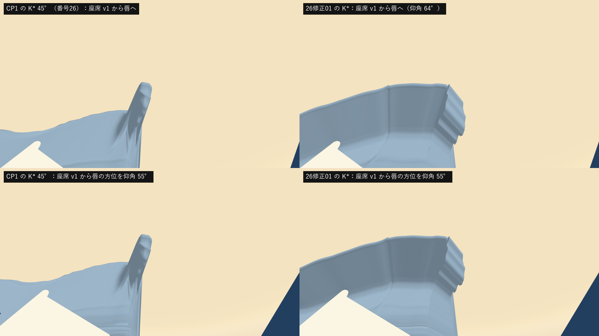
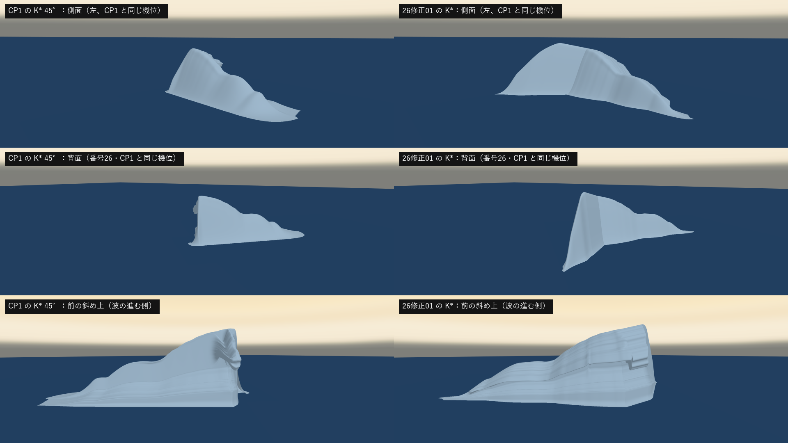
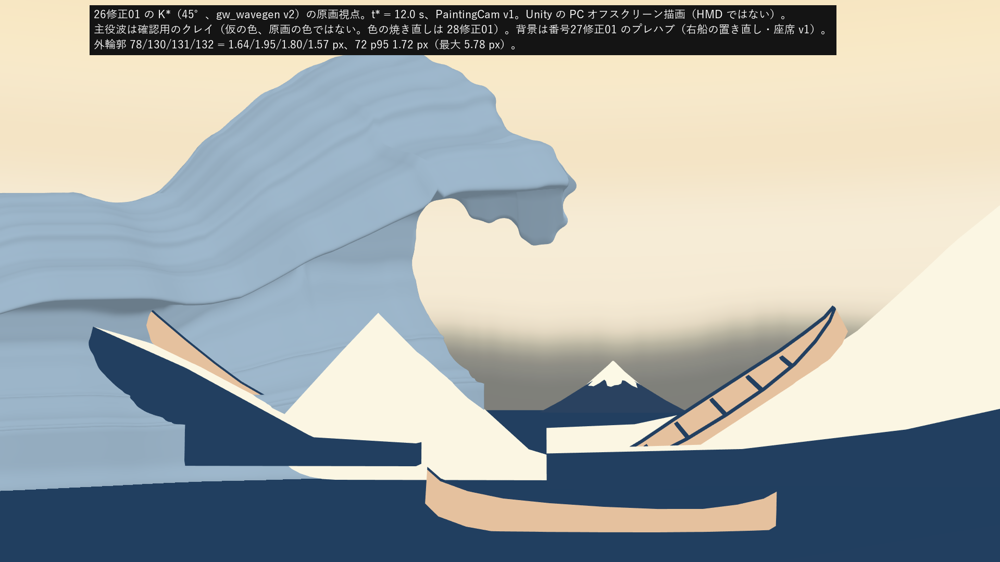
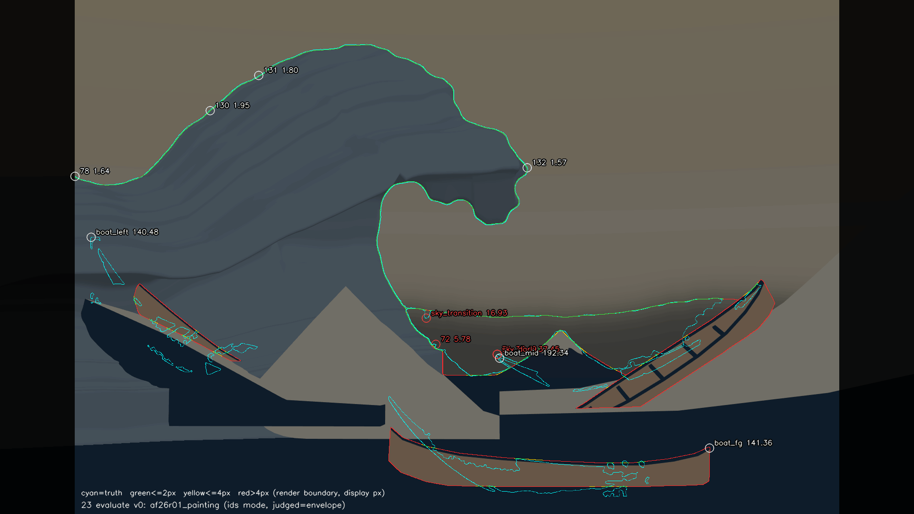
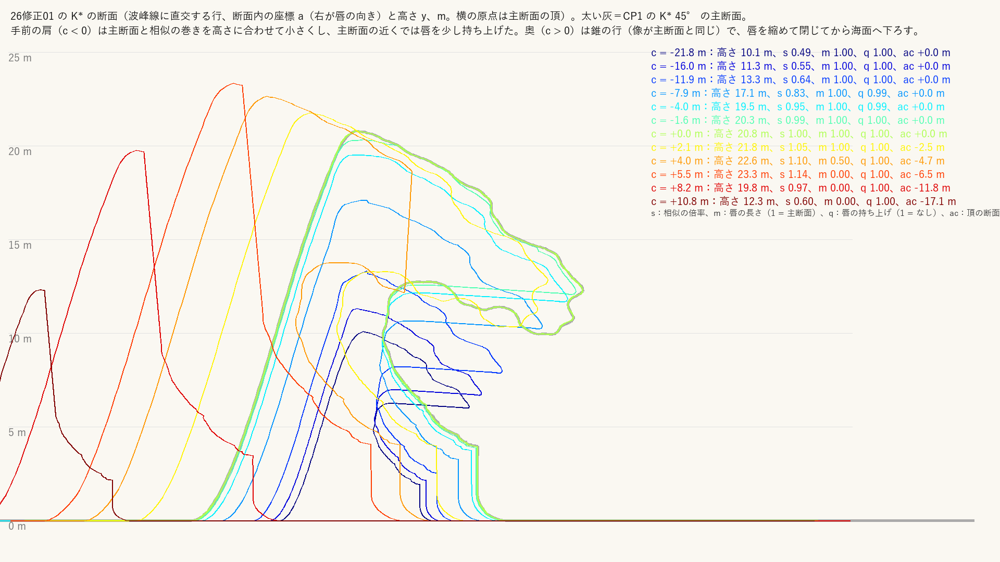
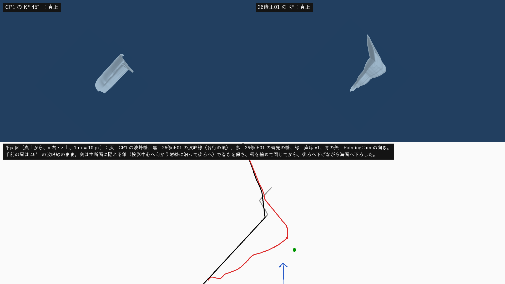

# 26修正01：唇を波峰方向へ延ばし、波峰全体を巻かせる（45°）

日付：2026-09-26／結果：利用者の CP1 回答（立体造形＝26修正01「唇を波峰方向へ延ばし、波峰の全体を巻かせる」、D6＝45°）に従い、主役波の終態 K\* を gw_wavegen v2 で作り直した。手前の肩（原画視点で主断面より手前の断面）は 45° の波峰線のまま、主断面と相似の巻き（唇と管）を高さに合わせて小さくして並べ、奥（主断面の後ろ）は主断面に隠れる「錐」の断面で唇を保ってから閉じた。**唇の張り出しが 0.2H 以上ある断面は波峰線に沿って途切れずに続く（c = −29.5〜+3.9 m、波峰線の弧長 35.5 m）。そのうち主断面の高さ（20.8 m）の半分より高い区間は 27.0 m（1.30H）で、この基準なら参照モデルの目安（約 1.2H）を超える。ただし作業計画 9.3 の基準は「ピークの半分」で、ピークが奥の唇のない壁（23.3 m）にあるため基準を主断面の高さに替えた値である。計画どおりピークの半分で数えると、巻きのある区間は 19.2 m（0.93H）で 1.2H に届かない（巻きを見ずに高さだけで数えると 33.6 m、1.62H）。高さの最大は中央ではなく奥の壁にあり、計画の「高さは中央が最大」も満たさない（限界 3）。** 原画視点では外輪郭 78・130・131・132 が最大 1.57〜1.95 px、72 は p95 1.72 px（最大 5.78 px、記録）で、番号26 と同じ条件の判定をすべて満たした。メッシュの検査（非多様体・面の反転・自己交差・面積 0 の面）と座席 v1 からの 5 万本の射線（開いた背面・切断端・穴）はすべて 0。ただし、**唇は座席の真上には来ない**（水平 5.1 m・仰角 64°、下の「限界」1）。また、主断面で波峰線が折れ（手前 45°・奥 95°）、奥に唇のない高い壁が残る（限界 2・3）。

この「26修正01」は番号26（主役波の終態 K\*）の修正1回目で、利用者の CP1 の裁定による変更である。記録は番号26 の文書（Step_26_ja.md）と証拠を書き換えず、このファイルと `Docs/Evidence/ArtFirst/26R01/` に分けた。

- 時間の上限：2 日（作業計画 §4.2 の 26修正01）。実績は約 2 時間 15 分（2026-09-26 13:10 頃〜15:25 頃、同じ時計）。Unity の実行は 7 回（各 16〜18 秒。毎回 `Unity/Build/unity.lock` を作ってから 1 プロセスだけ動かし、終わったら消した）、Blender は 6 回（各 5〜15 秒）。最後に全体の手順（`run_af26r01.ps1`）を 2 回通し、2 回目の出力を証拠にした。
- レビュー後の記録の修正（形は変えていない）：巻きの長さの基準（ピークの半分と主断面の高さの半分）、68 の行の数え方、奥の行に残る爪の書き方を直した。`af26r01_evidence.py` に巻きの長さの記録を足し、それだけを再実行した（約 13 秒）。変わったのは metrics.json・run.json と評価器の出力（Git 対象外、同じ値で時刻だけ違う）で、図 13 枚と MP4 は同じバイト、K\*・Unity の描画・Blender の出力は前のまま。
- 修正回数：番号26 の修正1回目（CP1 の裁定による立体造形の変更）。提出前に試したこと（下の「提出前に試したこと」）は、提出した画像に対する修正ではないので数えていない。
- 対応するバックログ：68・69・70・71・72・78・130・131・132（G1）。事前検査として 83・115・116（判定は番号41）。108・109 の前提（記録のみ、判定は番号30）。
- 利用者の裁定（CP1、2026-09-26）：立体造形＝26修正01（奥の断面は原画視点のシルエットが 4 px 以内なら完全に巻いてよい）。D6＝45°。D7＝座席は唇の下の右船（27修正01 の座席 v1 を使う）。72 は p95 ≤4 px で判定し、最大は記録。71・76・213 は番号39・40 の後に判定。
- 証拠の種類：Unity 6000.4.3f1 Editor の batchmode による **PC のオフスクリーン描画**（RTX 3080、Direct3D11、Linear）と、その画像を番号23 の評価器（ID モード、包絡版、真値 v0.2、`provisional: false`）で測った値。メッシュの検査・射線・参照モデルとの並べ図は Blender 5.2.2 ヘッドレス。**HMD 実機の結果ではない**（HMD 未所持）。主役波の色は形を読むための仮のクレイで、原画の色ではない（色の焼き直しは 28修正01）。
- 参照モデル（Q5、`G:\research\model\wave_repair_zbrush2.obj`）は、使う前に SHA-256（ab4124f9…3d40）が一致することを確かめ、読むだけで比率・断面・偏差・並べ図の記録に使った。形状はリポジトリにも成果物にも入れていない。一時キャッシュ（SHA-256 6a07d6a5…5042、1,131,888 頂点・1,148,986 面）は Git 対象外の作業フォルダーに置き、終わってから消した。同じフォルダーのほかのファイルは開いていない。

## 見るもの

| 座席 v1 からの比較（左 CP1 の K\* 45°、右 26修正01） | 側面・背面・前の比較（主役波・空・海だけ） |
| --- | --- |
|  |  |
| **原画視点（26修正01、Unity、クレイ）** | **輪郭の偏差図（評価器）** |
|  |  |
| **断面（波峰線に直交する行、m）** | **真上と平面図（波峰線・唇先の線・座席）** |
|  |  |

- [座席 v1 から唇へ（1 枚、数値つき）](../Evidence/ArtFirst/26R01/26R01_seat_lip.png)、[座席 v1 から左右・管の口から](../Evidence/ArtFirst/26R01/26R01_seat_sides.png)
- [回り込みの動画（Unity の 96 枚、24 fps、主役波・空・海だけ）](../Evidence/ArtFirst/26R01/26R01_orbit.mp4)、[その 4 コマ](../Evidence/ArtFirst/26R01/26R01_orbit_frames.png)
- [原画視点の ID の差（CP1 の K\* → 26修正01、同じ場面）](../Evidence/ArtFirst/26R01/26R01_painting_diff.png)
- 参照モデルとの比較（記録のみ）：[座席・側面・背面の並べ図](../Evidence/ArtFirst/26R01/26R01_ref_views.png)／[断面の比較（6 断面、H で正規化）](../Evidence/ArtFirst/26R01/26R01_ref_sections.png)／[原画視点の重ね図](../Evidence/ArtFirst/26R01/26R01_ref_painting.png)
- 数値：[metrics.json](../Evidence/ArtFirst/26R01/metrics.json)（`status` が項目ごとの判定、`items` が値、`evaluator_compare` が評価器の全測定と、同じ場面で K\* だけを CP1 の 45° に替えた値・27修正01 の値）、実行条件と SHA-256：[run.json](../Evidence/ArtFirst/26R01/run.json)

原画視点・座席・側面・背面・前・真上・管の口・回り込みは Unity の実描画（主役波は番号26 のクレイのシェーダーを描画の間だけ複製し、光をカメラの後ろ上から当てた）。背景は番号27修正01 のプレハブ `AF27R01_Context.prefab`（右船の置き直し・右船の水面・座席 v1）。「主役波・空・海だけ」は船・富士・仮置きをその描画の間だけ隠した確認図。並べ図・断面の図・平面図・偏差図は人が見るための図で、測定には使っていない。

## 結果（t\* = 12.0 s、PaintingCam v1、1920×1080、ID モード 3840×2160、包絡版、真値 v0.2）

| 項目 | 基準 | 26修正01 | CP1 の K\* 45°（同じ場面） | 判定 |
| --- | --- | --- | --- | --- |
| 78 左端から斜め上への外形 | 最大 ≤4 px | 1.64（p95 1.43） | 2.77 | 合格 |
| 130 左側の傾き | 最大 ≤4 px | 1.95（p95 1.83） | 1.97 | 合格 |
| 131 上側へのつながり | 最大 ≤4 px | 1.80（p95 1.65） | 1.81 | 合格 |
| 132 船側への曲がり | 最大 ≤4 px | 1.57（p95 1.41） | 1.33 | 合格 |
| 72 内側の輪郭 | p95 ≤4 px（最大は記録） | p95 1.72、最大 5.78（915, 723） | p95 1.56、最大 5.56 | 合格（p95） |
| 71 内側の空域 | 番号39・40 の後に判定 | 37.49（p95 20.37） | 37.49 | 記録のみ |
| 68 上側が座席の船側 | 主断面の唇先が内壁の下端より座席 v1 に水平で近い | 5.12 m ＜ 10.64 m（巻きのある 133 行のすべてで同じ式が成り立つ。判定の違う「唇先が頂より 0.2H 以上前に出る行」141 行で数えると 136 行） | 5.10 ＜ 10.63 m（27修正01） | 合格 |
| 69 右船と波の上下が画面内 | 採点列 157〜1762 | 右船の見える範囲 x 1208.5〜1627.5、両端 (1113.1, 899.6)・(1600.0, 588.0)、頂 y 93.6・海 y 896.5 | 同じ | 合格 |
| 70 波の上下 ＞ 右船の全長 | 表示 px | 802.9 px ＞ 578.1 px（主断面の高さ 20.8 m、右船の全長 11.33 m） | 同じ | 合格 |
| メッシュの検査（Blender） | 非多様体・面の反転・自己交差・面積 0 の面が 0、縁が格子の外周 | すべて 0、縁の辺 1,276（外周と一致）、平らな海の裏向きの面 0 | すべて 0 | 合格 |
| 83・115・116 座席 v1 から 5 万本 | 開いた背面・切断端・穴 0 | 0／0／0 | 0／0／0 | 合格（事前検査。判定は番号41） |
| 唇の厚み | ≥0.3 m | 最小 0.54 m（巻きのある行、唇先から 0.75 m 奥の鉛直、c = −28.6 m） | — | 合格 |
| 両端は海面まで | 最初と最後の行の高さ 0 | 0／0 m。端の傾き（行の高さの変化÷波峰線の弧長）の最大は手前 1.28、奥 2.05 | 奥 6.35（崖） | 合格 |
| 固定位相 | 格子・UV つき | 400×240 = 96,000 頂点・190,722 三角形（Unity で読んだ頂点数も同じ） | 400×200 | 合格 |
| 波峰の巻き（記録） | 作業計画 9.3：高さがピークの半分を超える波峰線の区間 約 1.2H（参照モデル）、高さは中央が最大 | 巻きのある行（0.3H の内壁から唇先までの張り出し ≥0.2H、133 行）が c −29.5〜+3.9 m で連続、弧長 35.5 m（1.71H）。そのうち高さがピーク（23.3 m、奥の唇のない壁）の半分を超える区間は 19.2 m（0.93H、1.2H に届かない）。基準を主断面の高さ 20.8 m の半分（10.4 m）に替えると 27.0 m（1.30H、c −21.0〜+3.9 m）。巻きを見ずに高さだけなら 33.6 m（1.62H）。高さの最大は奥の壁（c = 5.5 m）で、中央ではない | 唇は主断面の前後 1〜2 m（高さだけなら 1.08H） | 記録のみ |
| 76・212・213・74・75・159 | 主役波以外 | 37.45・0.27・16.93・5.76・141.4・192.3（CP1 の K\* と同じ場面で同じ値） | — | 212 合格、ほかは記録のみ |
| 157 左奥の船（報告） | — | 140.5 px（手前の肩の形が変わり、左奥の船の見える部分が変わった） | 126.6 | 記録のみ |

- 評価器の全測定は metrics.json の `evaluator_compare`。同じ場面で K\* だけを CP1 の 45° に替えた ID（`af26r01_painting_ids_cp1k.png`）で測り直すと、78〜72・71 は 27修正01 の値と小数4桁まで一致した（場面の組み方が 27修正01 と同じことの確認）。
- 原画視点の ID 画像で「空かどうか」が CP1 の K\* と違う画素は 1,206 px（表示 px 換算）で、図で見る限り主役波の輪郭に沿った細い帯と、採点列の外の左端（x < 157、手前の肩の高さの違い）にある（[差の図](../Evidence/ArtFirst/26R01/26R01_painting_diff.png)）。左奥の船（157）の見える画素の変化は空の画素ではないので、この数に入らない。
- **72 の最大 5.78 px** は番号26・CP1 と同じ真値の小さな形（内壁の外縁の輪、藍線の半幅より細い）の所で、p95 で判定する裁定どおり合格とした。
- 座席からの 5 万本のうち仰角 60° 以上の 5,942 本で主役波に当たったのは 119 本（CP1 の K\* は 82 本）。唇は仰角 64° までしか来ない（限界 1）。

## 形（45° の読み方と、奥の断面の置き方）

- **手前の肩（c < 0）**：頂は番号26 と同じ 45° の波峰線 e の上（断面内の前後のずれ ac = 0）。各行は主断面 P0 を頂の足（海面）を中心に s 倍した相似形で、唇（張り出し 0.41H の鉤）も管も同じ比で小さくなる。s は唇を縮めた壁で原画の許容領域に収まる最大（二分法）。唇は m = 1（主断面と同じ長さ）で収まるかを、唇の持ち上げ q（唇を頂の高さへ向けて縦に縮める。1 が主断面の形）を 1 から 0.3 まで下げながら調べ、c −9〜−3 m で q 0.90〜0.99 に持ち上げた。手前の行は主断面から 0.12 m の間で爪を除く割合 β を 0 から 1 へ上げ、それより離れた行は、唇の下面の爪の出っ張り（原画の爪の包絡）を上側の凸包まで持ち上げ、唇先の小さな鉤を丸めた（主断面の爪を左へずらした形は内側の空域へ出るため）。画面の左端より外（c < −16.4 m）は高さを下げ、c −28〜−36 m で唇を縮めてから縦に潰して海面へ下ろした。
- **奥（c > 0）**：原画視点では主断面の後ろにある。奥の行を、主断面を PaintingCam の投影中心のまわりに λ = 1 + c/38.57 倍した「錐」の行にした（像が主断面と全く同じなので、完全に巻いたまま主断面に隠れる）。奥の行は爪を除かない（β = 0）ので、主断面の爪の鉤と出っ張りが残る（限界 4）。c 0〜2.5 m は唇も管もそのまま、c 2.5〜5.5 m は錐のまま唇を切り詰めて（上面と下面の残す部分は動かさず、唇先の側だけを切り口の直線に並べる）管を閉じ、その先 c 5.5〜15 m は唇のない壁を後ろへ下げながら小さくして海面へ下ろした。錐の行は奥ほど大きいので、奥の頂は最大 23.3 m（c = 5.5 m、主断面の 20.8 m の 1.12 倍）になる。
- **波峰線の向き**（平面図で画面の水平方向とのなす角）：手前の肩 45.0°（c −12〜−2 m）、主断面の手前側 43.3°（c −1〜0 m）、主断面の奥側 95.6°（c 0〜1 m、錐＝PaintingCam の射線の向き）、奥の尾 108°。**作業計画の定義（主断面の位置での波峰線の接線 e が 45°）は手前側の接線でだけ成り立ち、主断面で波峰線が約 50° 折れる**（奥の断面を主断面に隠すため。限界 2）。
- 参照モデルの比率（記録のみ）：主断面 壁 0.275H・張り出し 0.407H・唇先から 0.75 m 奥の厚さ 1.53 m。c −12〜+4 m の行で壁 0.271〜0.279H（中央値 0.275H）、張り出しの中央値 0.396H（最小 0.179H は奥で唇を切り詰める行）。壁は目標 0.25〜0.3H に入り、張り出しは目標 0.45〜0.55H より小さい（番号26 と同じく、張り出しは原画の唇先と内壁の像で決まる。D6 の既定：原画 4 px を優先）。

## 作り方（gw_wavegen v2、[gw_wavegen_v2.py](../../Tools/GWWaveGen/gw_wavegen_v2.py)、[params_v2_af26r01.json](../../Tools/GWWaveGen/params_v2_af26r01.json)）

番号26 の v1（`gw_wavegen_v1.py`）と番号24 の v0 は変えず、主断面・目標（藍線の半幅だけ内側へ補正した許容領域）・逆畳み込み・投影固定と TPS・検査の関数を読み込んで使う。v1 と違うのは次の所である。

1. **行の族**：240 行（手前 159、奥 80）。奥は区間ごとに本数を決め、唇を切り詰める c 2.5〜5.5 m に 40 行を置いた（隣の行との差を小さくして、行の間の三角形が爪の凹凸を横切らないように）。各行は主断面に唇の変形（持ち上げ q、切り詰め m、手前の行だけ爪を除く β）を加え、頂の足を中心に s 倍し、断面内で頂を ac だけ前後へずらし、海面の近く（y < 0.1H）だけ縦のずれ dy をなじませたもの。前後の平らな海の外端は動かさない。
2. **当てはめの許容**：行の当てはめは 1.0 px（唇は 1.5 px）まで許し、残りは投影固定で目標の射線上へ貼り付けた。唇の当てはめでは頂の近くの 6 列を見ない（頂の高さは s で決める）。
3. **逆畳み込み**：唇の列では主断面の行だけで包絡をとる（手前の行は爪を除いて丸めてあるので、列ごとに主断面と対応しない。全行でとると主断面の唇先の爪が 18 px 内側へ引かれた）。最良 0.62 px。
4. **投影固定と TPS**：手前の行と主断面だけに行い（奥の錐の行は主断面に隠れる）、主断面以外の行の唇・内壁・谷は貼り付けも TPS も動かさない。奥の行は、貼り付けた後の主断面から作り直した。TPS の変位は最大 0.38 m、局所寸法（行の頂の高さ）の 2.5%（上限 8% 以内）。
5. **折り返しと交差**：近くの三角形の交差を、交差のあった行の前後だけを調べ直す速い版で平滑化して解き、断面の中の小さな折り返し（向きが 90° より大きく変わる点、21 か所）を消した。最後の局所の交差 0、断面の自己交差 0、面積 1e−6 m² 未満の三角形 0。

## 28修正01・番号30 へ渡すもの（Git 対象外、`Unity/Build/ArtFirst/26修正01/kstar/`）

| ファイル | 内容 |
| --- | --- |
| `kstar_a45.gwb` | 番号24・26 と同じ GWW0 書式（1 フレーム、t\* のフレーム番号 0）。4,976,696 bytes、SHA-256 e9bc3572…cd26（全桁は run.json） |
| `kstar_a45.obj` | 同じ頂点・UV・三角形の OBJ（Unity のワールド座標のまま、m）。SHA-256 130635e0…12a2 |
| `kstar_a45_meta.json` | 番号26 と同じ形の meta（`profile.index` の j_B・j_top・j_tip・j_corner・j_facebot・j_E、`files.gwb_sha256` など。番号28 の `af28_bake_input.py` がそのまま読める）に、行ごとの s・m・q・κ・ac・dy・Df・β、波峰線の向き、巻きの長さ、座席との関係を加えた |
| `kstar_a45_uv_layout.json` | UV の並び：列ごとの u、列の区間（後ろの平らな海・背面の坂・唇の上面・唇の下面・内壁・谷・前の平らな海）、行ごとの c と v、主断面の行 |
| `kstar_a45_rows.npz` | 行ごとの断面内座標 (a, y) と主断面、当てはめた変形量 |

- 頂点の添字 = 行 × 400 + 列。**UV0 = (σ/σ_total, (c − c_min)/(c_max − c_min))**、UV2 = (σ [m], c [m])。列の意味（u の並び）は番号26 と同じで、行の数だけ 200 → 240（c −60〜+15 m）に変わった。**番号28 の焼き込み（`af28_uvsdf_a45.bin`・`af28_uvwarp_a45.json`）はこの K\* には使えない**ので、28修正01 で焼き直す必要がある。
- 三角形の向きは番号24・26 と同じ（平らな海で +Y が表）。表が空気の側で、唇の下面・内壁・管の中も表から見える。

## 参照モデル（Q5）との比較（記録のみ。合否には数えない）

作業計画 9.4 の解B（`Docs/Evidence/ArtFirst/26/reference/align_B_upright.json`）で参照モデルを世界座標へ置いて比べた。

| | 平均 | p50 | p95 | 最大 |
| --- | --- | --- | --- | --- |
| 参照モデルの面 → 26修正01 の K\* | 3.09 m（0.148H） | 2.26 m（0.109H） | 7.81 m（0.376H） | 9.72 m（0.467H） |
| 同 → CP1 の K\* 45° | 4.30 m（0.207H） | 3.76 m（0.181H） | 9.61 m（0.462H） | 12.55 m（0.603H） |

- 選んだ頂点は番号26 と同じ（参照モデル自身の海面より 0.25H 以上高い頂点から 20 万点。海の塊・船の浮彫・前景の小波をおおむね除くが、爪は除けていない）。
- 断面の比較（波頂から −0.9H〜+0.3H の 6 断面）では、手前の肩（−0.9H・−0.6H・−0.3H）で CP1 の唇のない壁が、26修正01 では主断面と相似の巻きになった。参照モデルの手前の肩は巻きが大きく低い所にあり、26修正01 の肩の巻きは高さに合わせて小さい。奥（+0.15H・+0.3H）は、26修正01 では錐の行（主断面より少し大きい巻き）と唇のない壁で、参照モデルの巻きとは位置も形も違う。
- 座席 v1 から見ると、参照モデルは座席の左前のまとまった塊、26修正01 は左へ長く続く唇の下面と管、CP1 は右端だけの唇の柱である（[並べ図](../Evidence/ArtFirst/26R01/26R01_ref_views.png)）。

## 提出前に試したこと（修正回数には数えない）

1. **唇の縮め方**：v1 の「頂と角を結ぶ直線へ縮める」と「頂を中心に相似に縮める」は、縮める途中の唇の下面が内側の空域の上の丸い所（原画の爪の包絡の凹み）を横切り、原画視点で 7〜43 px はみ出した。唇の上面と下面を元の曲線に沿って残し、先だけを切り口の直線にする切り詰めに替えた（切り詰めた像は元の唇の像の中に入る）。
2. **手前の行の唇**：縦の倍率を 2 つに分ける案（唇の下を持ち上げ、上を縮める）は、断面が袋のような形になり採らなかった。相似＋持ち上げ q＋爪を除く β にした。爪を除かないと、主断面から 0.03 m 離れた行でも唇を 0.15〜0.4 まで縮める必要があり、主断面だけが舌のように出た。
3. **奥の尾**：錐の行を錐より小さくすると唇が内側の空域へ出るので、奥で唇を閉じてから小さくした。最初は唇を閉じる区間で高さも錐から下げていたが、1 行で 3.7 m 下がる段ができたのでやめ、錐のまま閉じてから下げた（端の傾きは奥 2.05）。
4. **行の間の交差**：手前の肩の画面外の端（c −30〜−26 m）と、唇の持ち上げの行（c −9〜−3 m）で、貼り付けと TPS が主断面以外の唇と内壁を動かして行の間の面が重なったので、主断面以外の唇・内壁・谷は動かさないことにした。Blender の検査で角の近くの小さな折り返し（346 組の重なり、開いた背面の射線 2 本）が見つかったので、爪を除いた下面の折り返しと、全行の断面の折り返しを消した。
5. v1 の自己交差の解消を全格子で繰り返すと 1 回 7 秒かかり、生成器の最初の実行が 30 分を超えても終わらなかった（止めた）ので、交差のあった行の近くだけを調べ直す版にした。

## 限界と保留

1. **唇は座席の真上に来ない**：座席 v1（右船、目 (3.95, 1.83, −15.03)）から唇まで水平 5.1 m・仰角 64°。唇の点で座席から水平 5 m 以内のものは 0。座席は原画視点で唇より手前・右にあり、座席の上に唇を出すと原画視点で空に出る。t\* の形では原画の輪郭が優先されるので、108／109「水面が座席の上方へ延びる」は番号30 の形成の途中で満たす必要がある（27修正01 の限界 1 と同じ）。
2. **主断面で波峰線が折れる**：手前は 45°（定義の接線）、奥は約 95°（PaintingCam の射線の向き）。奥の断面を完全に巻いたまま原画視点で隠すには、主断面の像と同じ像になる錐の行しかなく、その並びが射線の向きになるため。背面から見ると主断面の所に縦の折れ目がある。
3. **奥の唇のない高い壁**：錐の行は奥ほど大きくなり、唇を閉じた後の尾（c 5.5〜15 m）は最大 23.3 m の唇のない壁として後ろへ下がる。背面・回り込みの動画では、波の後ろに高い三角の壁（ひれ）が見える。奥で巻いているのは c 0〜約 4 m（波峰線の弧長 6.0 m）だけで、全体の巻き 35.5 m の大半は手前の肩にある。波峰線に沿った高さの最大（23.3 m、c = 5.5 m）はこの壁にあり、作業計画 9.3 の「高さは中央が最大」を満たさない。
4. **爪の扱いが手前と奥で違う**：手前の行（c < 0）は、主断面から 0.12 m より離れると唇の下面の爪の出っ張りを除き、唇先の鉤を丸めた。手前の肩の唇の縁は滑らかで、原画の爪の形はない（爪は番号33）。一方、奥の錐の行（c 0〜約 5.5 m）は爪を除かない（β = 0）ので、主断面の爪の鉤と出っ張りがそのまま残る（c 2.5〜5.5 m では唇先の側から切り詰められる）。座席 v1 から見ると、唇の右端に平行な肋が並ぶ（[座席から唇へ](../Evidence/ArtFirst/26R01/26R01_seat_lip.png)、[座席から左右](../Evidence/ArtFirst/26R01/26R01_seat_sides.png) の右上）。また c ≈ 0 では爪を除く割合 β が 0.12 m の間で 0 から 1 へ変わるので、唇に四角い段（切り欠き）が見える（[3 視点の比較](../Evidence/ArtFirst/26R01/26R01_views_compare.png) の右下の前の斜め上、回り込みの動画の約 45° のコマ）。
5. **72 の最大 5.78 px**：番号26 と同じ真値の小さな形の所。p95 1.72 px で判定は合格。
6. **色は仮**：番号28 の焼き込みは旧い K\*（80,000 頂点）用で、この K\* には使えない。CP1 の合成（`AFCP1Composite`）と 27修正01 のシーンも旧い K\* を読む（ほかの番号のファイルは変えていない）。28修正01 で焼き直す。
7. **頂点数が 20% 増えた**：400×240 = 96,000 頂点（番号26 は 80,000）。番号30 の keypose の容量と番号32 の性能に効く。
8. 左奥の船（157、報告項目）の見える部分が変わった（126.6 → 140.5 px）。手前の肩の形が変わり、肩の後ろに隠れる所が変わったため。
9. HMD・立体視の描画は確かめていない（HMD 未所持）。座席からの見上げの快適さや唇の高さの感じは番号34 で確かめる。
10. 生成は決定的：同じ入力で別のフォルダーへもう一度書き出した .gwb と .obj の SHA-256 が一致した（e9bc3572…cd26、130635e0…12a2）。

## 利用者に決めてほしいこと

1. **主断面での波峰線の折れ（限界 2）と奥の壁（限界 3）**：(a) このまま受け入れる（既定値・利用者未回答）。(b) 奥の錐を短くして（c 0〜2 m）壁を低くする（奥の巻きは短くなる）。(c) 手前側も主断面の近く 2 m ほどを錐の向きへ曲げ、折れを丸める（主断面での波峰線の接線は 45° でなくなるが、唇が座席に近づく見込み：水平 3.9 m・仰角 69°、未検証）。
2. **108／109（唇が座席の上へ）**：番号30 の形成の途中で唇を座席の上へ通してから t\* の形へ戻すか、座席を唇の下へ寄せるか（27修正01 の選択肢 (b)(c)）。既定値（利用者未回答）は番号30 で扱う。

## 再現方法と生成物

リポジトリの根で次を実行する（Python 3.10.6、numpy 2.2.6、OpenCV 4.12.0、Pillow 12.0.0、Unity 6000.4.3f1、Blender 5.2.2 LTS）。全体で約 3 分（生成器が約 2 分、Unity は起動を含めて約 16 秒）。番号26 の K\*（`Unity/Build/ArtFirst/26/kstar/`、比較用）と番号27修正01 の `Unity/Build/ArtFirst/27R01/place/`・`eval/noline/`（比較の基準）が要る。

```
powershell -NoProfile -ExecutionPolicy Bypass -File Tools/GWWaveGen/run_af26r01.ps1 [-TempDir <一時フォルダー>] [-SkipReference] [-KeepTemp]
```

中身は次の段である（出力先のフォルダー名は `Unity/Build/ArtFirst/26修正01/`）。

```
py -3.10 Tools/GWWaveGen/gw_wavegen_v2.py
py -3.10 Tools/GWWaveGen/af26r01_views.py
powershell -NoProfile -ExecutionPolicy Bypass -File Tools/GWWaveGen/run_af26r01_unity.ps1 -Method GreatWave.ArtFirst.EditorTools.AF26R01KStar.BuildAndRender -Log build_render
py -3.10 Tools/GWWaveGen/af26r01_reference.py --align Docs/Evidence/ArtFirst/26/reference/align_B_upright.json --tmp-dir <一時フォルダー>
blender --background --factory-startup --python-exit-code 1 --python Tools/GWWaveGen/af26r01_blender.py -- Unity/Build/ArtFirst/26修正01/kstar Unity/Build/ArtFirst/26/kstar Unity/Build/ArtFirst/26修正01/blender Unity/Build/ArtFirst/26修正01/af26r01_views.json 3.9544 1.8323 -15.0308 -2.1368 5.2525 -7.8754 G:/research/model/wave_repair_zbrush2.obj Docs/Evidence/ArtFirst/26/reference/align_B_upright.json <一時フォルダー>/ref_selected_world.npy
py -3.10 Tools/GWWaveGen/af26r01_evidence.py
```

- `run_af26r01_unity.ps1` は `Unity/Build/unity.lock` を排他的に作ってから Unity を 1 プロセスだけ起動し、終わったら（失敗しても）消す（番号27修正01 と同じ手順）。
- Git に入れるもの：`Tools/GWWaveGen/`（gw_wavegen_v2.py、params_v2_af26r01.json、af26r01_views.py、af26r01_reference.py、af26r01_blender.py、af26r01_evidence.py、run_af26r01.ps1、run_af26r01_unity.ps1）、`Unity/Assets/GreatWave/ArtFirst/Editor/AF26R01KStar.cs`、`Unity/Assets/GreatWave/Scenes/Tests/AF26R01_KStar.unity`（それぞれ .meta も）、証拠 `Docs/Evidence/ArtFirst/26R01/`（図 13 枚、MP4 1 本、metrics.json、run.json、約 7.5 MB）、この文書。
- Git に入れないもの：`Unity/Build/ArtFirst/26修正01/`（既存の `/Unity/Build/` の規則で対象外、約 62 MB）。K\* の .gwb・.obj・meta・UV の並び・rows、Unity の描画 130 枚（回り込み 96 枚を含む）と ID 画像、評価器の出力、Blender の検査と並べ図、参照モデルの比較、回り込みの MP4 の元、ログ。SHA-256 は run.json の `not_committed_sha256`・`orbit_frames_sha256`。
- 記録した SHA-256 と Git のブロブを一致させるため、`.gitattributes` に `/Unity/Assets/GreatWave/Scenes/Tests/AF26R01_KStar.unity* -text` を加える必要がある（進行役。`Tools/GWWaveGen/**`・`Docs/Evidence/ArtFirst/**`・`Unity/Assets/GreatWave/ArtFirst/**` は既存の規則の対象）。
- シーン `AF26R01_KStar.unity` は実行のたびに作り直すので、SHA-256 は実行ごとに変わる（run.json の値は最後の実行のもの）。番号26・27・27修正01・28・CP1 のプレハブ・マテリアル・シェーダー・スクリプト・シーン（17 ファイル）は読むだけで、組み立てと描画の前後で SHA-256 が一致した（`af26r01_build_report.json`・`af26r01_render_report.json` の protectedUnchanged）。
- 旧試作の禁止場所と 732e198 より前の履歴には触れていない。`G:\research\model` は `wave_repair_zbrush2.obj` の 1 ファイルだけを SHA-256 の照合後に読んだ。Houdini は使っていない。番号26・27・27修正01・28・29・32・CP1 のファイルは変えていない（番号26 の `af26_reference.py` は関数を読み込んで使っただけ）。
