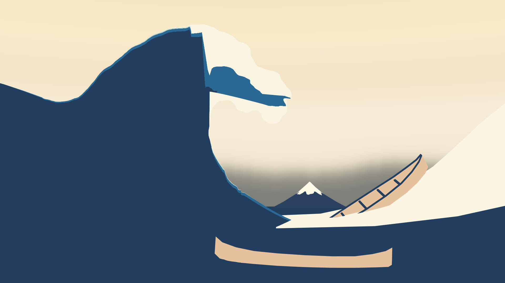
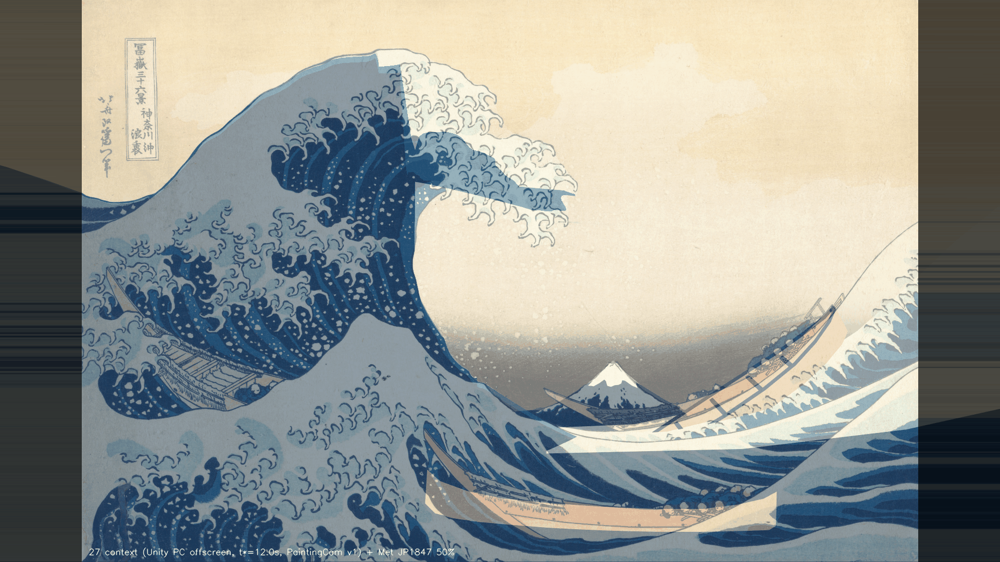
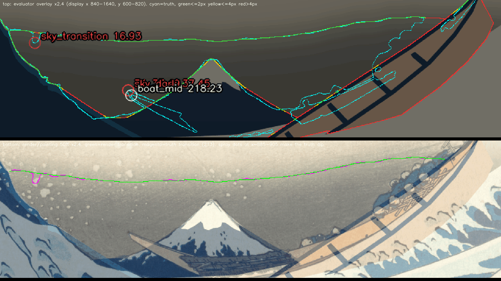
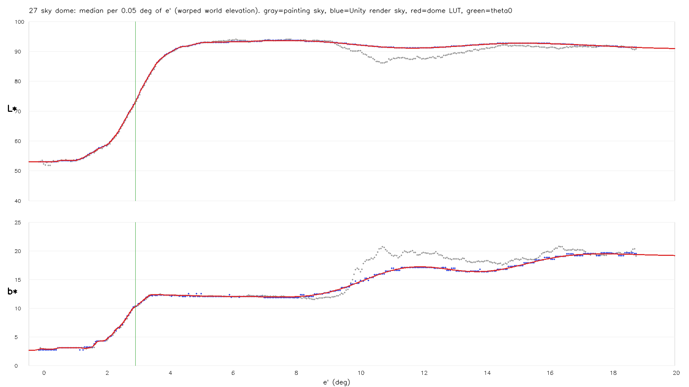
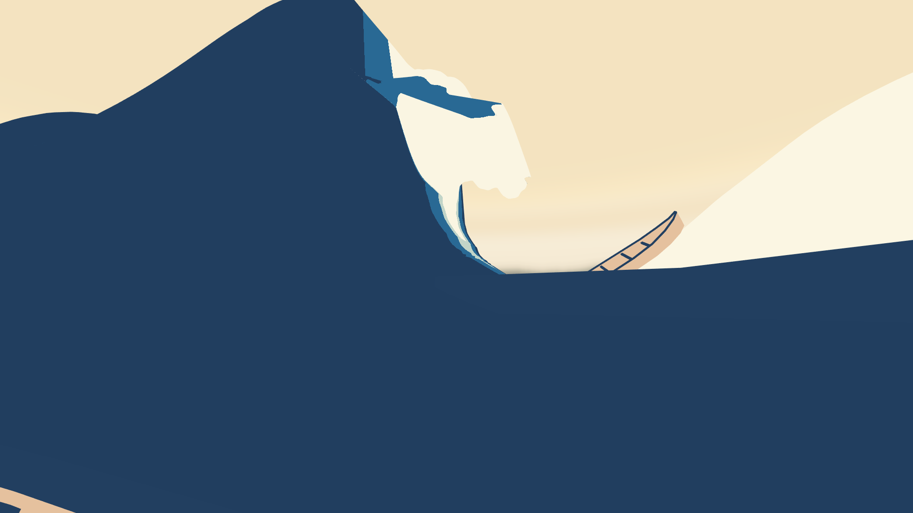
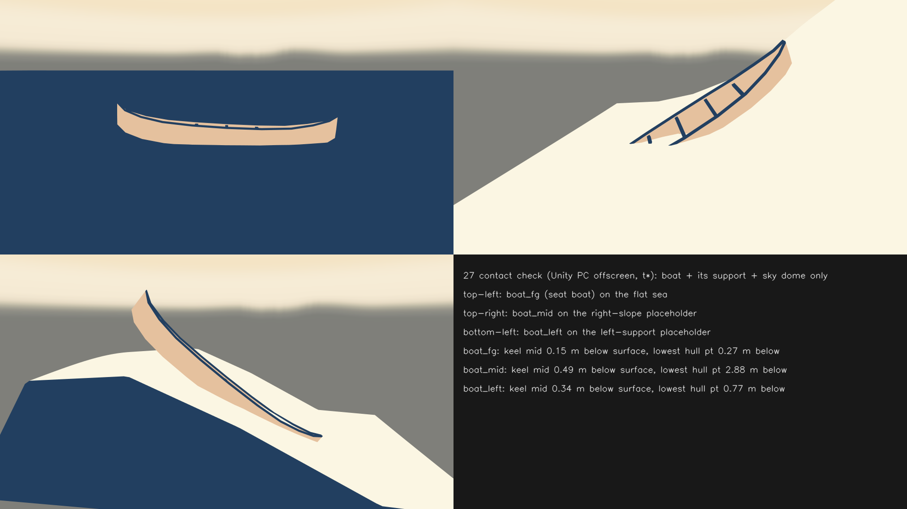
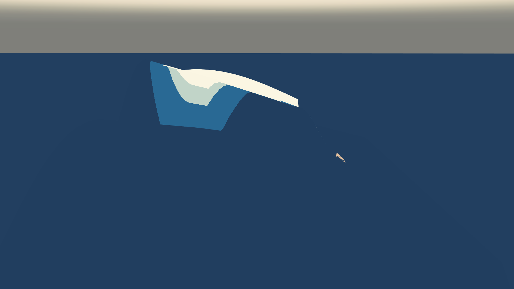
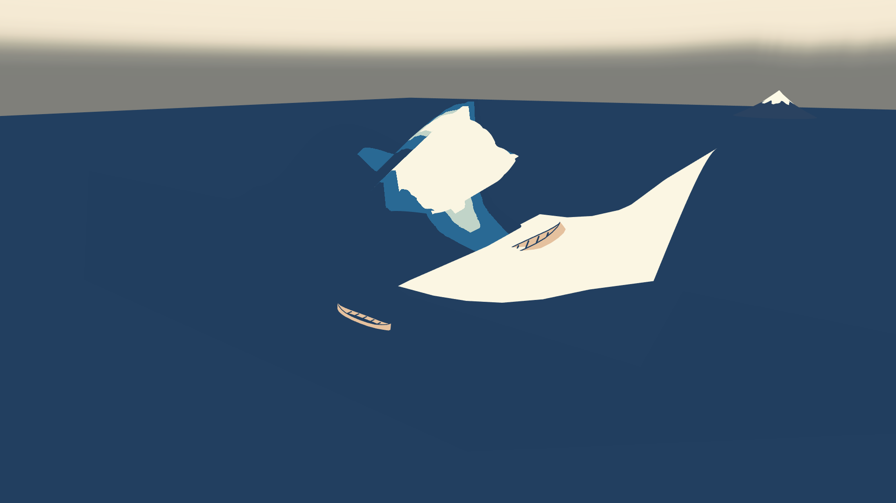

# 27：空のドーム・船・富士を原画視点へ配置する

日付：2026-09-26（初回。修正はまだない）／結果：世界の仰角で色が決まる空のドームを原画の空から当てはめ、3隻の船と富士を原画から各自の深度平面へ逆投影して置き直し、調色板の平塗りにした。前景のうねりと斜面の仮置きも調色板の色にし、3隻とも竜骨の中央を支えの面に接させた（宙に浮かない。ただし船の両端は面から離れたり沈んだりする。下の「船が宙に浮かないこと」）。Unity で原画視点・船上座席・側面・俯瞰・接地確認を描き、番号23 の評価器（ID モード）で測った。**判定：212 合格、94 合格、76 不合格、213 不合格。** 76 の色（ΔE00 0.29）と 213 の段差・船の既定配色は合格したが、輪郭の 4 px が通らない。213 の移行線は、原画の飛沫の白点が暗い空の帯の上端にかかる 1 か所（表示 (895, 668)）だけが 16.93 px で、そこを除くと最大 2.95 px。76 は暗い空の境界の全体を測るため、右船の blockout が原画の三日月形と違う所（37.45 px）と、遠くの波（24.0 px）で外れる。どちらも利用者の判断を求める（下の「利用者に決めてほしいこと」）。

この「27」は2026-09-25の新作業計画での番号で、旧設計書の27とは別である。

- 時間の上限：1日（計画 §4.2 の27）。実際は約1.2時間（2026-09-26 02:55 頃〜04:05 頃）。Unity の実行は5回（dump 1回、組み立てと描画 4回）で、どれも1分以内。
- 修正回数：0（初回の提出）。船の置き方は提出前に4通り試した（下の「提出前に試したこと」）。コミット前の独立レビューの指摘で、76 の p95 の値、接地の表の「竜骨の中線」の列の名前（測っていた点の取り違え。船底の線の高さの列を加えた）、船の当てはめの目的関数の説明を直した。記録と文書だけの直しで、描画・画像・評価の数値は変えていない（run.json の `post_review_edits_ja`）。
- 対応するバックログ：判定 76・212・213・94。報告のみ 74・75・157・159・161・162。
- 証拠の種類：Unity 6000.4.3f1 Editor（batchmode、Direct3D11、Linear、Built-in RP、RTX 3080）の **PC オフスクリーン描画**と、その PNG を numpy/OpenCV と番号23 の評価器で測った結果。HMD 実機の結果ではない。主役波は番号24 の v0（t\* のフレーム）を仮に置いた。評価器は `provisional: false`（較正門の後に真値は変わっていない）。
- 前提：番号23修正02（真値 v0.2、評価器、高解像度原画 `Met_JP1847_DP130155.jpg`）。空のドームの当てはめと評価は、この番号の作業時点で未コミットだった 23修正02 の作業ツリーの状態を使ったので、このコミットは 23修正02 の後に置く。
- 参照モデル（Q5 の OBJ）は使っていない（D20 の既定値：船と前景の小波は 27 で使わない）。

## 見るもの

| 原画視点（t\* = 12.0 s、PaintingCam v1） | 原画 50% 重ね |
| --- | --- |
|  |  |
| **暗い空の帯の拡大（上：評価器の偏差図、下：重ね）** | **空の色の縦の変化（原画・色の表・Unity）** |
|  |  |
| **船上座席（t\*）** | **接地の確認（船と支えと空だけを表示）** |
|  |  |
| **側面（左から）** | **俯瞰（右手前の上から）** |
|  |  |

- [評価器の偏差図](../Evidence/ArtFirst/27/27_contour_overlay.png)（水色が真値、緑 ≤2 px、黄 ≤4 px、赤 >4 px）、[ID 画像](../Evidence/ArtFirst/27/27_painting_ids.png)（3840×2160 の ID 画像を 1920×1080 に間引いた確認用。青が空、赤・緑・黄が左奥・右・手前の船）
- [形成動画（原画視点、30 fps、17.000 s、510 フレーム）](../Evidence/ArtFirst/27/27_formation_painting.mp4)：番号24 v0 の形成に、この番号の空・船・富士・仮置きを重ねたもの。カメラと空が動かないことの確認用。
- 数値：[metrics.json](../Evidence/ArtFirst/27/metrics.json)、実行条件と SHA-256：[run.json](../Evidence/ArtFirst/27/run.json)

重ね図・空の拡大・ID 画像は人が確かめるための図で、容量を抑えるため256色 PNG にした。測定には使っていない。接地の確認図は、その船と支えと空だけを表示して描いた確認用の図で、場面の見え方ではない。

## 作ったもの

### 空のドーム（[af27_sky.py](../../Tools/GWContext/af27_sky.py)、[AF27SkyDome.shader](../../Unity/Assets/GreatWave/ArtFirst/Shaders/AF27SkyDome.shader)、[sky_dome.json](../../Tools/GWContext/sky_dome.json)）

- 色はカメラから見た方向の**世界の仰角 el と方位角 az だけ**で決める。画面座標は使わない。どの視点・両眼でも同じ空になる（無限遠の空と同じ扱い）。半径 800 m の球の内側に描く。
- 原画の暗い空の上端（真値 213 の移行線）は、方位によって仰角 2.64〜3.59° と揺れる。そこで移行の仰角 θt(az) を世界の方位角の関数として持ち、帯の近くでは仰角を e' = el − w(el)·(θt(az) − θ0) と付け替える（θ0 = 2.887°、w は θ0+1.5° まで 1、θ0+4.5° で 0）。θt は真値の移行線の点を方位 0.2° ごとに分け、仰角の最大（上側の縁）を取って σ 0.15° で平滑した。原画の方位（−4.7〜11.2°）の外は 10° かけて θ0 へ戻す。どれも世界に固定した曲線で、画面空間のグラデーションではない。
- 色の表は、原画の空（題箋・落款の塗りを除く）の画素を e' で 0.05° ごとに分けた Lab の中央値。帯は σ 0.06° で平滑して L\* を単調にし、上空は σ 1.2° で平滑して雲の斑を消した。L\* が L_mid（73.14）になる e' を θ0 に合わせた（ずらした量 −0.025°）。
- 上空は、原画と同じく黄みが上へ向かって強くなる（b\* 12 → 19.5、仰角 9〜18°）。原画の淡い雲（仰角 10〜14° の中央）は写していない。
- Unity のシェーダーは点標本の 2 回読みで線形補間し、numpy の式と同じにした。Unity の空と numpy の予測の差は 8bit で最大 1 段（ΔE00 の p99 0.72）。

### 船（[af27_place.py](../../Tools/GWContext/af27_place.py)、[manual_landmarks.json](../../Tools/GWContext/manual_landmarks.json)）

3隻とも M1 の同じ blockout（船首・船尾の先端の間 10.0 m）を使い、形は変えていない。

- 深度平面：各船の M1 Revision01 の基準点の光軸方向の深さを、その船の深度平面（光軸に垂直な平面）とした。右船は番号24 の主断面と同じ 59.11 m、手前の船（座席のある船）は 29.48 m、左奥の船は 50.30 m。
- 原画で船の両端の先端を拡大図から人手で読み（manual_landmarks.json）、その射線と深度平面の交点へ blockout の両端を合わせた。これで位置・軸の向き・縮尺が決まる。
- blockout の舷の反りは原画の三日月形よりずっと小さい。両端だけを合わせると船体が原画より上に出るので、手前の船と左奥の船は、両端の組に画面上の平行移動と回転、軸まわりの傾きを加え、次の目的関数が最小になるよう Nelder–Mead で決めた（長さは両端の読みのまま。af27_place.py の `loss`）：(1 − 真値の船の黄土マスク（閉じて穴を埋めた形）との IoU)＋真値の空と富士の山体を船が覆った面積（船の目標の面積で割る）の罰（重み 1、`CLEAR_WEIGHT`）＋画面上の回転が 10° を、軸まわりの傾きが 25° を超えた分の 2 乗の罰（各重み 0.01）。IoU だけを最大にしたのではない。
- 右船は同じ方法では舷が富士の右の裾と暗い空を覆うため、右端（船尾）を合わせ、右半分の上り坂の舷の点（1300, 780）へ向けて同じ長さだけ伸ばした。船首の側は右の斜面の仮置きの中へ沈み、原画の船首（1044, 746）の所には船がない。軸まわりの傾きは IoU で選び、探索の上限の 25° になった。
- 色：船体・甲板は黄土、縁と梁は藍濃（調色板の 8bit sRGB、無光照の平塗り [AF27Flat.shader](../../Unity/Assets/GreatWave/ArtFirst/Shaders/AF27Flat.shader)）。

| 船 | 深度平面 | 長さ（先端間） | 軸まわりの傾き | 黄土マスクとの IoU | M1 の置き方の IoU |
| --- | --- | --- | --- | --- | --- |
| 手前の船（75、座席） | 29.48 m | 8.45 m | −4.5° | 0.385 | 0.205 |
| 右の船（159） | 59.11 m | 14.61 m | 25.0° | 0.078 | 0.000 |
| 左奥の船（157） | 50.30 m | 9.98 m | −4.1° | 0.202 | 0.034 |

- 船の実寸は 8.45〜14.61 m とそろわない。深度平面を M1 の深さに固定したためで、原画上の大きさの違いがそのまま実寸の違いになった（同じ実寸にするなら手前の船の深さは約 51 m になり、座席が主役波の方へ約 22 m 動く。利用者に決めてほしいこと 3）。

### 富士

- 深度平面は M1 の位置（z 420、光軸方向 477.9 m）に固定し、底を海面（y −0.1）に置いたまま、横位置と幅・高さの縮尺を、真値の富士の稜線までの距離が最小になるよう決めた。x 37 → 26.32 m、縮尺 (2, 2, 2) → (2.427, 2.524, 2.427)（高さ 20.2 m、底の幅 58.2 m）。雪は山肌の色、雪の部分は富士の雪の色の平塗り。

### 海と仮置き

- 参照海面は M1 と同じ寸法で、色は藍濃（番号24 と同じ）。
- 前景のうねり（M1_ForegroundSwell_Static）・その白い稜（M1_ForegroundFoam_Static）・右の斜面・左の支え斜面は、M1 の材質名で調色板の色へ置き換えた：藍 → 藍濃、白泡 → 白、青 → 原画でその面の下に最も多い水の色（4つとも白になった）。旧い主役波の白帯と爪（M1_Foam_FrontRibbon・M1_Foam_Claw_*）は番号24 と同じく置かない。

### 船が宙に浮かないこと（支え）

竜骨の中央（船の根の原点）の真上で、支えの面が喫水（船の中央の深さ 0.96 m の 35% × 縮尺）の高さに来るよう、斜面の仮置きを鉛直に動かした（右の斜面 +1.61 m、左の支え +1.74 m。海面は動かさない）。Unity で支えの面へ射線を当てて確かめた。

| 船 | 支え | 竜骨の中央が面より下 | 船体の最も低い点が面より下 | +z 端（画面の左の端）の船首／船尾材が面より上に出る最大 | 船底の線の面からの高さ（レビューの再計算、上が +） |
| --- | --- | --- | --- | --- | --- |
| 手前の船 | 参照海面 | 0.15 m | 0.27 m | 1.54 m | −0.27〜+0.70 m（両端が海面より上） |
| 右の船 | 右の斜面 | 0.49 m | 2.88 m（沈めた船首の側） | −1.57 m（+z 端の材は面の下） | 船尾の端（−z 端、表示 (1600, 587)）で +2.08 m、船首の側の半分は最も深い所で −2.88 m |
| 左奥の船 | 左の支え | 0.34 m | 0.77 m | 2.96 m | 船首の端（+z 端）で +2.22 m、最も低い所で −1.08 m |

- 第5列は、最初の版で「竜骨の中線で面より上に出る最大」と書いていた値である。Unity の `Contacts()` がメッシュの局所で |x| < 0.05・y < 0.2 として選んでいた点は、実際には船の根の空間 z = +5 の端の船首／船尾材の 36 頂点（根の空間の y 0.74〜1.74）で、船底の中線には頂点がなかった（コミット前の独立レビューで判明）。そこで名前を「+z 端の船首／船尾材が面より上に出る最大」に直した（metrics.json の `boat_contacts.*.plus_z_end_post_top_above_surface_m`。値は同じ）。「右の船は竜骨がすべて面の下」という最初の記述は誤りだった。
- 第6列は、船底の線（船の根の空間の z の切り口ごとに最も低い頂点）の、真下の支えの面からの高さである。独立レビューが dump の頂点・context_layout.json の船の置き方・斜面の仮置きの移動量から numpy で計算した値で、同じ計算を再実行して一致を確かめた（Unity の描画ではない）。

3隻とも竜骨の中央が支えの面に接している（宙に浮いていない）。ただし船の両端は面に沿っていない。右の船は船尾の端が右の斜面より約 2.1 m 上に出ており、船首の側の半分は最も深い所で 2.88 m 沈む。左奥の船は原画どおり急に傾いており、船首の端が支えより約 2.2 m 上に出る。手前の船は両端が海面より最大 0.70 m 上に出る。独立レビューが原画視点と船上座席の視点を拡大して確かめたところ、船の下のすき間は見えない（右の船の船体の下縁は白い斜面に接して見え、左奥の船は原画視点では主役波に隠れる）。船の形と置き方は G18 で直す。

### 座席（座席のある船は手前の船 = M1 foreground boat）

- 座席の目は M1RevisionBuilder と同じく、船の根の局所 (0, 10, −2) から甲板を測って 1.2 m 上に置く。船が傾いても甲板に当たるよう、測る向きだけを世界の真下から船の局所の下向きへ変えた（傾きがなければ同じ）。
- **座席の目は 3.89 m 動いた**：(−0.707, 1.514, −33.407) → (2.955, 1.160, −32.152)。手前の船を原画に合わせて置き直し、縮尺が 1.35 → 0.845 になったためである。numpy と Unity の目の位置の差は 0.05 mm。番号26 の座席からの射線検査などが M1 の目の位置を使う場合は、どちらを使うか合わせる必要がある。

### Unity（[AF27ContextBuilder.cs](../../Unity/Assets/GreatWave/ArtFirst/Editor/AF27ContextBuilder.cs)、[AF27ContextScene.cs](../../Unity/Assets/GreatWave/ArtFirst/Editor/AF27ContextScene.cs)）

- 新シーン `Assets/GreatWave/Scenes/Tests/AF27_Context.unity` を空のシーンから作る。M1 のシーンと FBX、番号24 の資産は読むだけで、作業の前後で SHA-256 が一致した（af27_build_report.json の protectedUnchanged）。
- CP1 の合成で使い回す資産：プレハブ `ArtFirst/Prefabs/AF27_Context.prefab`（空のドーム・海・3隻・富士・仮置き。主役波とカメラは入れない）と `AF27_SkyDome.prefab`、マテリアル `AF27_SkyDome.mat`・`AF27_Flat_*.mat`（5色）、テクスチャ `ArtFirst/Textures/AF27_SkyThetaT.asset`・`AF27_SkyGradient.asset`。シェーダーは SPI の立体視マクロを入れたが、立体視での描画は確かめていない。
- 側面の視点は、番号24 の (53, 22, −2) からだと右の斜面の仮置き（高さ約 19 m）の裏になって何も見えないので、左側 (−90, 30, −14) から描いた。

## 結果（t\* = 12.0 s、PaintingCam v1、1920×1080、ID モード、包絡版、真値 v0.2）

| 項目 | 基準 | 値 | 判定 |
| --- | --- | --- | --- |
| 76 暗い空の範囲 | 境界 ≤4 px | 最大 37.45 px、p95 19.30 px（最大は右船の船首 (1044, 744)） | 不合格 |
| 76 暗い空の色 | ΔE00 ≤5 | 0.29 | 合格 |
| 212 上方の空の色 | ΔE00 ≤5、上方が明るい | 0.27、L\* は上方が水平線際より 38.4 高い | 合格 |
| 213 明暗の移行線 | ≤4 px | 最大 16.93 px（飛沫のくぼみ (895, 668)）、p95 1.86 px。くぼみを除くと最大 2.95 px | 不合格 |
| 213 余分な帯状段差 | この番号の読み：量子化の 1 段を超える段差なし | 描画と量子化前のドームの式の差は最大 0.72 段。色の表の L\* の変化は縦 1 px あたり最大 0.58 | 合格 |
| 213 船と波の既定配色 | ΔE00 ≤5 | 船の画素の中央値 0.13。非空の画素の 99.5% が調色板の色から ΔE00 ≤1 | 合格 |
| 94 カメラ固定 | 全形成区間で一定 | 510 フレームで位置・回転・画角・投影行列・ビュー行列の差 0。右上の空の区画は全フレームで t\* と同じ画素 | 合格 |
| 74・161 富士の稜線（報告） | — | 最大 5.76 px、p95 5.31 px | 記録のみ |
| 162 富士の色（報告） | — | 雪 64.4、山肌 0.15 | 記録のみ |
| 75 手前の船（報告） | — | 最大 141.4 px、p95 85.7 px | 記録のみ |
| 159 右の船（報告） | — | 最大 218.2 px、p95 171.4 px | 記録のみ |
| 157 左奥の船（報告） | — | 番号24 v0 の主役波に全部隠れて描画側の境界なし（inf） | 記録のみ |

**76 の境界の内訳**（真値の点から描画の境界までの距離、表示 px）：

| 境を作る物 | 真値の点 | 最大 | p95 |
| --- | --- | --- | --- |
| 空の中の移行線（213 と同じ） | 1,572 | 16.93（飛沫のくぼみ） | 4.17 |
| 主役波の内側（72） | 358 | 2.63 | 1.52 |
| 富士 | 678 | 5.61 | 5.34 |
| 右船（船首・舷・漕ぎ手） | 762 | 37.45 | 31.73 |
| その他の波（主役波の足もとと右船の船首の間、水平線の波頭） | 790 | 24.01 | 22.37 |

- 評価器の 76 は暗い空の境界の全体を 4 px で測る。空のドームが決めるのは移行線だけで、下の境は主役波・富士・右船・遠くの波が作る。右船は blockout の形が原画と違い（報告項目 159）、遠くの波は平らな参照海面の水平線（y ≈ 790）が原画の波頭（y 760〜790）の代わりになっているので、ここが 4 px を超える。
- 213 の最大の所では、原画の飛沫の白点がいくつか暗い空の帯の上端にかかり、真値の移行線が約 17 px 下へくぼむ（空の拡大の図の下段、左端のマゼンタ）。真値の暗い空は、飛沫の点も空の画素として L\* を平滑するので、白点のそばで帯の上端が下がる。原画の刷りの灰色の帯そのものはそこで下がっていない。numpy で、θt をくぼみの下側に合わせた場合も試したが、最大 8.56 px で 4 px には届かなかった（ドームの成果物には入れていない）。
- 色の値 212・76 は、どちらも番号23 の調色板の領域の中央値との差で、Unity の描画をそのまま測った。
- 主役波の値（評価器の記録）は番号24 v0 と同じ：78 0.76、130 0.51、131 0.67、132 1.05、72 9.54 px。71 は右船の船首の所が変わり 37.49 px（24 の再評価では 43.47 px）。

## 提出前に試したこと（右船の置き方）

船の当てはめは、提出前に次の順で試した（どれも Unity で描いたのは下の 2 と 4 だけで、1 と 3 は numpy の試算）。

1. 6 変数（位置・3 回転・縮尺）を黄土マスクとの IoU だけで決める：IoU は太い所だけを覆うよう船を縮め、船の長さが 4.2〜5.2 m になった。採らなかった。
2. 両端の読み＋画面上の相似変換（縮尺は固定）＋傾きを IoU で決める：Unity で描き評価した。右船の舷が富士の右の裾を覆い、74 が 28.0 px、159 が 62.4 px、76 が 37.45 px だった。
3. 2 に「真値の空と富士の山体を覆った面積」の罰（重み 1）を加える：手前の船と左奥の船にはこの目的関数を採った（今の版。上の「船」の節）。右船は原画の船より下の水の中へ逃げた（IoU 0.094）ので、右船にだけは採らなかった（4 へ）。
4. 右船だけ、船尾と右半分の上り坂の舷に合わせる（現在の版）：74 が 5.76 px に下がり、富士が原画どおり見える。代わりに原画の船首の所に船がなく、159 は 218.2 px に上がった。76 は 37.45 px で変わらない。

## 残る限界と保留

1. **76 は空のドームだけでは通らない**：境界の半分以上を右船と遠くの波が作る。船の形の修正（G18）と前景・右側の波（39・40）が要る。
2. **213 は飛沫のくぼみ 1 か所で通らない**：くぼみは真値の暗い空の取り方（飛沫の白点を空の画素として平滑する）から来ている。番号23 はすでに修正2回の上限に達しているので、真値の取り方を変えるかは利用者が決める。
3. 左奥の船は、仮に置いた番号24 v0 の主役波に全部隠れる。番号26 の K\* で左下の波の形が決まってから、見える範囲（157）を測り直す。
4. 手前の船は、平らな参照海面が船体の下半分を隠すので、原画視点では細い帯に見える（原画では船は波の谷にいて、手前の水が低い）。前景の波（39）で谷を作るまでは直らない。
5. 番号24 v0 の主役波は真値 v0.1 の調色板の 8bit 値で塗られており、藍濃が v0.2 と 1 段違う（33, 62, 95 と 34, 63, 96）。この番号の海面は v0.2 の値なので、俯瞰の図で波の平らな所と海面の境がかすかに見える（ΔE00 約 0.3）。
6. 空のドームは原画の淡い雲を写していない。上空の b\* は原画の中央（雲の所）より少し高い。212 の色の判定には影響しない（ΔE00 0.27）。
7. 右船の軸まわりの傾きは、探索の上限（±25°）の 25° になった。
8. 船の実寸がそろわない（8.45・14.61・9.98 m）。座席の目は 3.89 m 動いた。
9. シェーダーは SPI マクロ付きだが、HMD・Mock での立体視は確かめていない。HMD は未所持。
10. 船は竜骨の中央だけで支えに接し、両端は支えの面に沿っていない（右の船は船尾の端が斜面から約 2.1 m 浮き、船首の側は最大 2.88 m 沈む。左奥の船は船首の端が約 2.2 m 浮く。上の接地の表）。原画視点と船上座席ではすき間は見えない（独立レビューの確認）。船の形と置き方（G18）で直す。

## 利用者に決めてほしいこと

1. **76 の判定の範囲**：(a) 今のまま暗い空の境界の全体で測る（76 は G18 の船の形と 39・40 の波ができるまで不合格のまま）。(b) 76 の輪郭は空の中の移行線だけで判定し、波・富士・船が作る下の境はそれぞれの項目（72・74/161・159・153〜158）へ回す（この読み方なら、飛沫のくぼみを除いて 2.95 px）。(c) 右船だけ今のうちに原画の三日月形の船体を作る（G18 の前倒し、約 0.5 日）。
2. **213 の飛沫のくぼみ**：(a) 飛沫の白点のくぼみ（表示 x 875〜912、y > 652 の移行線の点）を判定から外す規則を加える。(b) 番号23 の真値で、暗い空の L\* の平滑から飛沫の白点を除く（番号23 の修正3回目になるので承認が要る）。(c) ドームにくぼみを入れる（numpy の試算で 8.56 px、4 px に届かず、推奨しない）。
3. **船の大きさと座席**：(a) 今のまま（深度平面は M1 の深さ、船の実寸は 8.45〜14.61 m、座席は 3.89 m 移動）。(b) 3隻を同じ実寸（例：右船の 14.61 m）にそろえ、手前の船を深さ約 51 m へ移す（座席が主役波の方へ約 22 m 動く。D7 の「座席を唇の下の船へ」と関係する）。
4. **右船の置き方**：(a) 船尾と上り坂に合わせる今の版（富士が見える、74 5.76 px、159 218 px）。(b) 船体の重なりを優先する版（富士の右の裾が隠れる、74 28.0 px、159 62.4 px）。

## 再現方法と生成物

リポジトリの根で次を順に実行する（Python 3.10.6、numpy 2.2.6、OpenCV 4.12.0、Pillow 12.0.0、Unity 6000.4.3f1、ffmpeg 2024-12-19）。Unity は `run_af27_unity.ps1` が `Unity/Build/unity.lock` を排他的に作ってから起動し、終わったら消す。

```
powershell -NoProfile -ExecutionPolicy Bypass -File Tools/GWContext/run_af27_unity.ps1 -Method GreatWave.ArtFirst.EditorTools.AF27ContextBuilder.Dump -Log dump
py -3.10 Tools/GWContext/af27_sky.py
py -3.10 Tools/GWContext/af27_place.py
powershell -NoProfile -ExecutionPolicy Bypass -File Tools/GWContext/run_af27_unity.ps1 -Method GreatWave.ArtFirst.EditorTools.AF27ContextScene.BuildAndRender -Log build_render
py -3.10 Tools/GWContext/af27_evidence.py [--ffmpeg <ffmpeg.exe>]
```

- dump は M1 の FBX を保存しない空のシーンへ置き、頂点と三角形を書き出す（約16秒）。af27_sky.py は約9秒、af27_place.py は約2分、組み立てと描画は約40秒（510 フレームの描画を含む）、af27_evidence.py は約30秒。
- 主役波の仮置きは番号24 の `Unity/Build/ArtFirst/24/wave/wave_v0.gwb`（394 MB、SHA-256 は run.json）を読む。無ければ番号24 の生成器で作り直す。
- Git に入れるもの：`Tools/GWContext/`（生成器・当てはめ・読み取りの点・sky_dome.json・context_layout.json）、Unity の AF27 のスクリプト・シェーダー・マテリアル・テクスチャ・プレハブ・シーン、証拠 `Docs/Evidence/ArtFirst/27/`（約 2.3 MB）。
- Git に入れないもの：`Unity/Build/ArtFirst/27/`（既存の `/Unity/Build/` で対象外）。ID 画像（3840×2160）、Unity の生の描画、形成の全フレーム 510 枚、評価器の生出力、dump、報告 JSON。SHA-256 は run.json の `not_committed`。
- 記録した SHA-256 と Git のブロブを一致させるため、進行役がこの番号のコミットで `.gitattributes` に `/Tools/GWContext/** -text` と `/Unity/Assets/GreatWave/Scenes/Tests/AF27_Context.unity* -text` を加えた（core.autocrlf = true でも checkout の bytes が変わらないように）。
- 旧試作の禁止場所、732e198 より前の履歴、参照モデル OBJ には触れていない。Houdini と Blender は使っていない。
