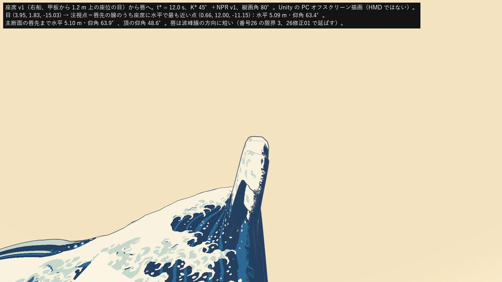
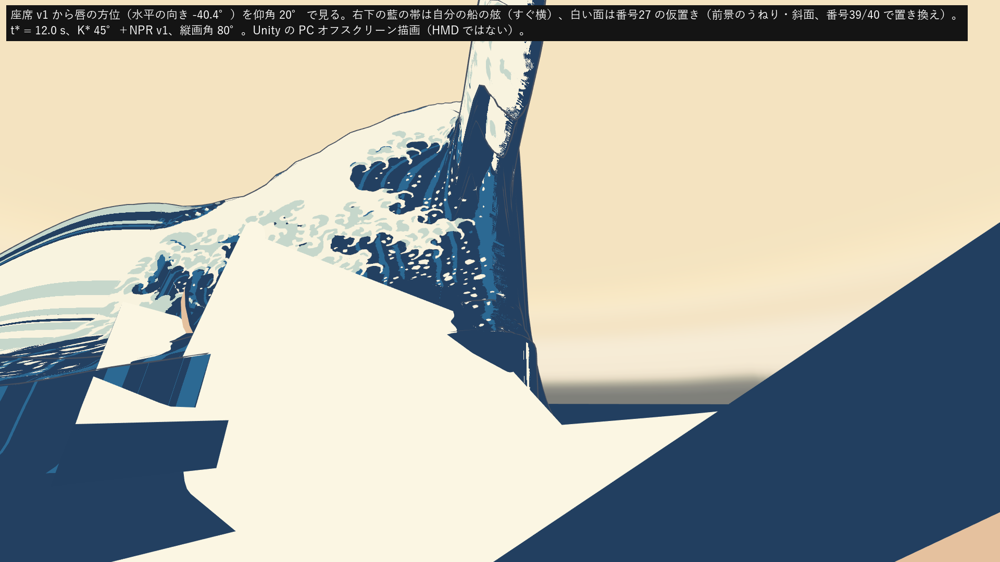
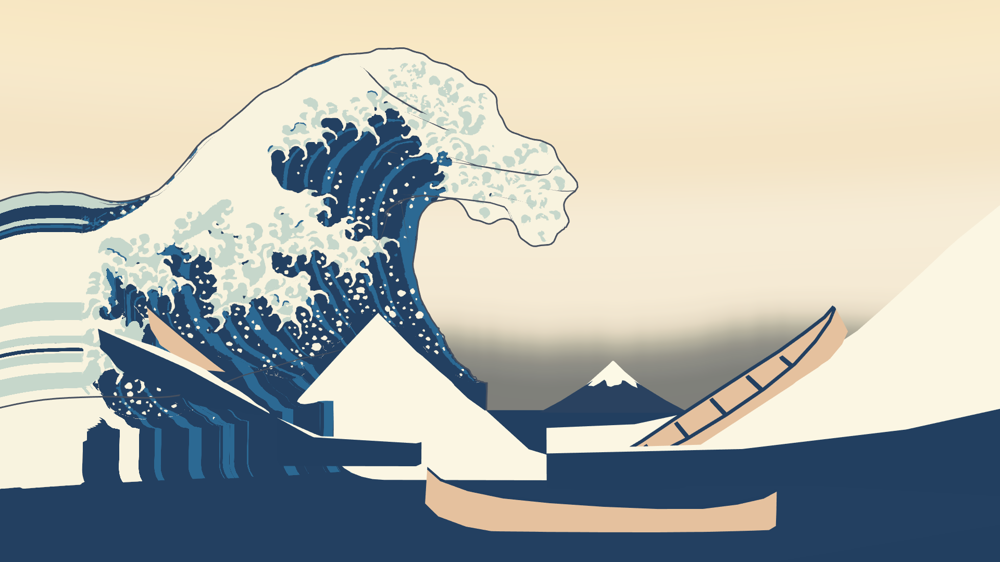
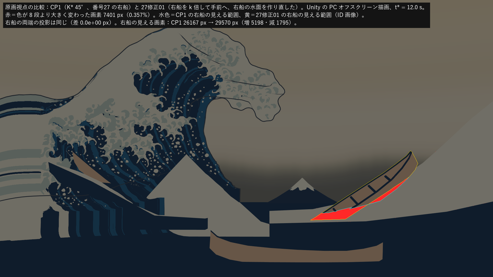
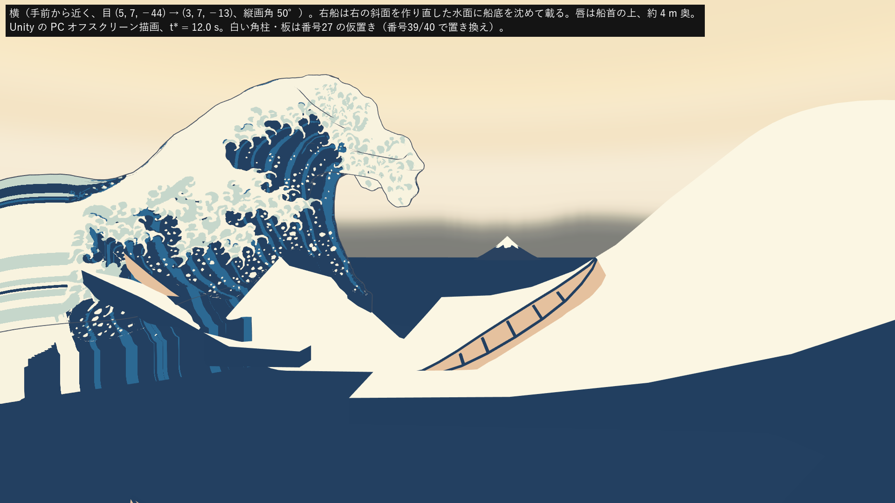
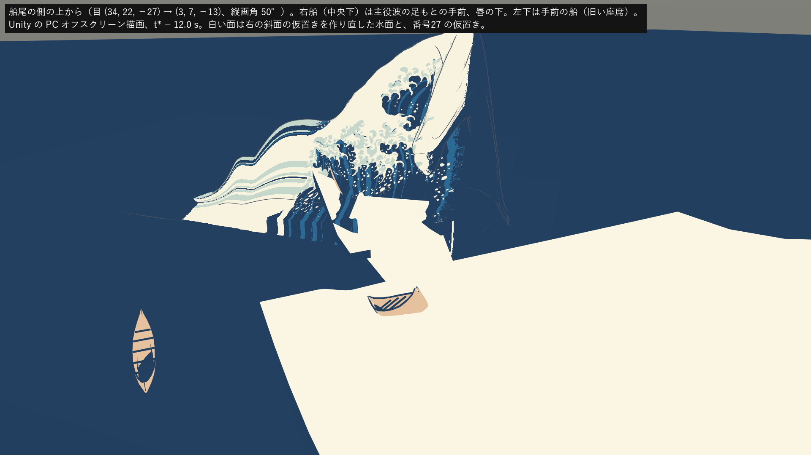
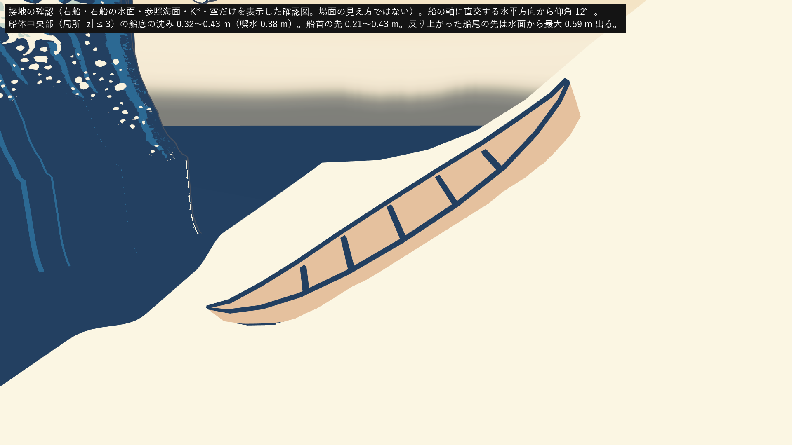
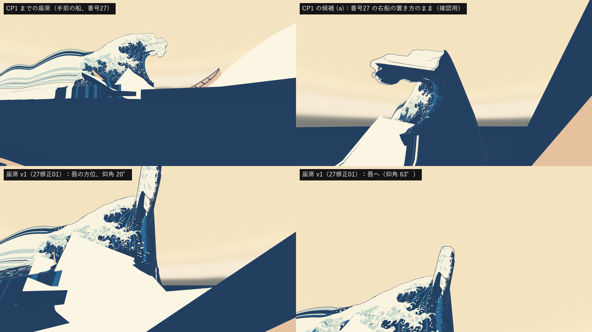

# 27修正01：座席を唇の真下の右船へ移す

日付：2026-09-26／結果：利用者の CP1 回答（D7「唇部正下方的右船（推荐）」＝作業計画第7節の(a)、27修正01）に従い、座席を手前の船から右の船（boat_mid）へ移した。右船は PaintingCam v1 の投影中心を中心に 0.7754 倍して手前へ寄せ（原画視点の像は同じ、両端の投影の差 0 px）、船底が平らな海と、作り直した右船の水面に喫水だけ沈むようにした（宙に浮かない）。座席の定義は `Tools/GWContext/seat_v1.json` に書き、番号26・30 などが読めるようにした。Unity で座席 v1 からの船上静止画（唇へ・唇の方位・船首を見下ろす）、原画視点、横・船尾側・接地の確認図を描き、原画視点を CP1 の描画と比べて番号23 の評価器で測り直した。**原画視点で RGB のいずれかが 8 段より大きく変わった画素は、右船と右の斜面の仮置きの周りの 7,401 px（0.36%）だけで、外輪郭 78・130・131・132・72、空 76・212・213、富士、手前と左奥の船の値は CP1 と小数4桁まで同じ。68・69・70 は合格。** ただし、座席から唇先までは水平 5.1 m・仰角 63° で、唇が頭上を覆ってはいない（下の「限界」1）。

この「27修正01」は番号27（空のドーム・船・富士の配置）の修正1回目で、利用者の D7 の裁定による変更である。記録は番号27 の文書（Step_27_ja.md）を書き換えず、このファイルに分けた。

- 時間の上限：0.5 日（進行役の指示）。実績は約 50 分（2026-09-26 12:25 頃〜13:15 頃、同じ時計）。Unity の実行は 3 回（組み立てと描画、各 11〜13 秒）、Blender は 1 回（約 5 秒）。
- 修正回数：番号27 の修正 1 回目（D7 の裁定による座席の移動）。提出前に試したことは下の「提出前に試したこと」。
- 対応するバックログ：定義第11行（船上機位の特定）、68・69・70（測り直し）、83・115・116（座席からの射線、事前検査）、89・90（接水・船内の水面、記録のみ）、報告項目 74・75・157・159、回帰の確認 78・130・131・132・72・71・76・212・213・94（94 は原画カメラの値の照合だけ）。
- 利用者の裁定（CP1、2026-09-26）：D7 = 座席を唇の真下の右船へ（27修正01）。D6 = 45°。72 は p95 ≤4 px で判定（最大は記録）。71・76・213 は番号39・40 が前景と右側の仮置きを置き換えた後に判定。
- 証拠の種類：Unity 6000.4.3f1 Editor（batchmode、Direct3D11、Linear、RTX 3080）の **PC オフスクリーン描画**と、その画像を番号23 の評価器（ID モード、包絡版、真値 v0.2、`provisional: false`）で測った値。座席からの射線は Blender 5.2.2 ヘッドレス（番号26 のスクリプト）。接水と船内の水面は numpy と Unity の射線。**HMD 実機の結果ではない**（HMD 未所持）。
- 主役波は番号26 の K\* 45°（`kstar_a45.gwb`、コミット a2e6abc）に番号28 の NPR v1・外殻線 v0。番号26修正01 の K\* はまだ使っていない。
- 参照モデル（Q5 の OBJ）は開いていない。

## 見るもの

| 座席 v1 から唇へ（t\*、仰角 63°） | 座席 v1 から唇の方位を仰角 20° で |
| --- | --- |
|  |  |
| **原画視点（27修正01、Unity）** | **原画視点の比較（CP1 との差。赤＝8 段より大きく変わった画素）** |
|  |  |
| **横（手前から近く）** | **船尾の側の上から** |
|  |  |
| **接地の確認（右船と水面だけ）** | **座席の比較（CP1 までの座席・CP1 の候補・座席 v1）** |
|  |  |

- [右船の周りの拡大（左 CP1、右 27修正01）](../Evidence/ArtFirst/27R01/27R01_painting_zoom.png)、[座席 v1 から船首を見下ろす](../Evidence/ArtFirst/27R01/27R01_seat_bow.png)
- 数値：[metrics.json](../Evidence/ArtFirst/27R01/metrics.json)（`status` が項目ごとの判定、`items` が値、`painting_view_check` が原画視点の比較、`evaluator_compare_cp1_a45` が評価器の全測定の CP1 との差）、実行条件と SHA-256：[run.json](../Evidence/ArtFirst/27R01/run.json)
- 座席の定義：[seat_v1.json](../../Tools/GWContext/seat_v1.json)

どの図も Unity の実描画（無照明の調色板の平塗り、外殻線あり）に文字を重ねたもの。差の図・拡大・座席の比較は人が確かめるための図で、測定には使っていない。接地の確認図は右船・右船の水面・参照海面・K\*・空だけを表示した確認図で、場面の見え方ではない。

## 作ったもの

### 右船の置き直し（[af27r01_seat.py](../../Tools/GWContext/af27r01_seat.py)）

- 番号27 の右船（`context_layout.json` の boat_mid、位置 (9.061, 1.901, −1.312)、縮尺 1.461、先端間 14.61 m）を、PaintingCam v1 の投影中心 (0, 3, −62) を中心に **k = 0.7754 倍**した。同じ射線の上を動くだけなので、原画視点の像は変わらない（両端の投影の差 0 px）。回転は番号27 のまま（軸の縦の傾き −32.8°、軸まわり 25°）。
- 結果：位置 (7.026, 2.148, −14.942)、縮尺 1.1328、**先端間 11.33 m**（手前の船 8.45 m・左奥の船 9.98 m に近づいた）。両端の先端の深さ（光軸方向）は 59.11 m → 45.84 m。
- k の決め方：船体の最も低い点（船首の近く）が平らな海（y = 0：番号26 の K\* の水面シートの平らな海。参照海面の上面は −0.07）より喫水だけ下になる値。喫水は番号27 と同じ定義（船体中央の深さ 0.96 m の 35% × 縮尺 = 0.381 m）。番号27 の置き方では船首の側が平らな海より 1.25 m 低く、船首の半分が海と右の斜面の仮置きに沈んでいた（番号27 の限界 10）。

### 右船の水面（右の斜面の仮置きの作り直し）

- 番号27 の `M1_Revision_RightSlope`（revision_slopes.fbx、+1.6126 m 移動済み、上面 97×21 の格子・下面・4 側面の殻）を格子に戻し、船の周り（z ±7 m）に 0.25 m 刻みの行を足して作り直した（97×78、15,824 頂点）。M1 の FBX と番号27 のプレハブは変えていない。
- 船の周りだけ鉛直に動かした（−1.87〜+2.58 m、上面と下面を同じ量）。目標の高さは **竜骨の線＋喫水**。竜骨の線は船体中央部（船の根の局所 |z| ≤ 3）の船底の直線当てはめ（y = 1.956 − 0.646·s、傾き −32.8°）で、目標は 0.05 m 以上（K\* の平らな海と重ならないように）。重みは船体の横 1.685 m までと船体の長さの範囲で 1、その外は横 3 m・前後 2.5 m で 0 へ（smoothstep）。
- **船体の足跡の穴**：高さ場の水面は船の中を横切るので、鉛直線が船体に当たる格子点（145 点）では水面を船底の 5 cm 下へ下げた。穴を開ける前は甲板の頂点 600 のうち 228 が水面より下だった（甲板は船底から 0.25〜0.45 m、喫水は 0.38 m）。
- Unity のメッシュ資産 `ArtFirst/Meshes/AF27R01_RightSlope.asset`（1.49 MB）。材質は番号27 と同じ（上面＝白、下面と側面＝藍濃）。

### 座席 v1（[seat_v1.json](../../Tools/GWContext/seat_v1.json)）

- 測り方は番号27 と同じ：船の根の局所 (0, 10, z) から船の局所の下向きに甲板（Boat_Deck_Planks）を測り、当たった点の **1.2 m 上（座位の目）**。
- z は |z| ≤ 3.0 を 0.5 刻みで調べ、K\* 45° の唇先の線（目より 3 m 以上高い点）に水平距離で最も近い点を選んだ。**z = +3.0**（船首寄り、甲板は ±3.49 まで）。目 **(3.954, 1.832, −15.031)**、甲板 (3.954, 0.632, −15.031)。Unity の甲板の測り直しとの差 0.07 mm。原画視点では目は表示 (1248, 836)、右船の船首寄りの所に当たる。
- 視点の上向きは世界の +Y（水平線を水平に保つ）。船の t\* の傾き（縦 33°・軸まわり 25°）には合わせない（既定値・利用者未回答）。
- 正面（静止画の注視点・HMD の再センタリングの向き）：唇先の線のうち座席に水平で最も近い点 (0.655, 12.000, −11.155)。水平の向き −40.4°、仰角 63.4°、縦画角 80°。番号26修正01 で唇が変わったら、同じ規則で注視点だけ取り直せばよい（座席の位置は変えない）。
- 読み方：Python（番号26・30 など）は `seat.eye_world`・`view.target_world`・`view.vertical_fov_deg`。Unity は `unity` 区画（JsonUtility）か、プレハブ `AF27R01_Context.prefab` の「AF27R01 座席 v1」の Transform（位置＝目、向き＝注視点）。番号26 の `af26_blender_qa.py` には `seat.eye_world` と `view.qa_hemisphere_look_world` を渡す。右船の置き方（`boat`）、竜骨の線と喫水（`water_contact`）、旧い座席（`legacy_seats`）、入力の SHA-256 も同じファイルにある。
- 番号27 の `context_layout.json` の座席（手前の船）と右船の置き方は、番号27 の記録として変えていない。**座席を使う番号は seat_v1.json か AF27R01_Context.prefab へ切り替える必要がある**（CP1 の合成スクリプトなど、既存の番号のファイルは変えていない）。

### Unity（[AF27R01Seat.cs](../../Unity/Assets/GreatWave/ArtFirst/Editor/AF27R01Seat.cs)）

- 新シーン `Assets/GreatWave/Scenes/Tests/AF27R01_Seat.unity`：番号27 のプレハブを置いて完全に展開し、右船の置き方と右船の水面を差し替え、座席 v1 の目印を置いた。主役波は番号26 の K\* 45° に番号28 の NPR v1・外殻線 v0（CP1 と同じ組み方）。
- 新プレハブ `ArtFirst/Prefabs/AF27R01_Context.prefab`：背景一式（空・海・3隻・富士・仮置き）＋右船の置き直し＋右船の水面＋座席 v1 の目印。主役波とカメラは入れない。CP2・番号30 の合成で使う想定。
- 番号26・27・28・CP1 のプレハブ・マテリアル・シェーダー・テクスチャ・スクリプト・シーン、M1 の FBX（計 24 ファイル）は読むだけで、組み立てと描画の前後で SHA-256 が一致した（`af27r01_build_report.json`・`af27r01_render_report.json` の protectedUnchanged）。

## 結果（t\* = 12.0 s、1920×1080）

| 項目 | 基準 | 値 | 判定 |
| --- | --- | --- | --- |
| 定義第11行 船上機位 | 特定する | 座席 v1（右船、目 (3.954, 1.832, −15.031)） | 記録（D7 の裁定で特定） |
| 68 上側が座席の船側 | 唇の先が内壁の下端より座席に近い（水平） | 45°：5.10 m ＜ 10.63 m（30° 2.97 ＜ 8.29、60° 8.17 ＜ 12.15） | 合格 |
| 69 右船と波の上下が画面内 | 採点列 157〜1762 | 右船の見える範囲 x 1208.5〜1627.5（CP1 1251.5〜1627.5）、両端の投影 (1113.1, 899.6)・(1600.0, 588.0)、頂 y 93.7・海 y 896.5 | 合格 |
| 70 波の上下 ＞ 右船の全長 | 表示 px | 802.9 px ＞ 右船の先端間の投影 578.1 px（見える部分 476.7 px、CP1 425.4 px）。世界では波高 20.9 m ＞ 右船 11.33 m | 合格 |
| 78・130・131・132 外輪郭 | ≤4 px | 2.77・1.97・1.81・1.33 px（CP1 と差 0） | 合格 |
| 72 内輪郭 | p95 ≤4 px（最大は記録） | p95 1.56 px、最大 5.56 px（CP1 と差 0） | 合格（p95） |
| 71・76・213 | 番号39・40 の後に判定 | 37.49・37.45・16.93 px（CP1 と差 0）。76 の色 ΔE00 0.29 | 記録のみ |
| 212 上方の空 | ΔE00 ≤5 | 0.27（CP1 と差 0） | 合格 |
| 94 カメラ固定 | 全形成区間で一定 | PaintingCam v1 は CP1 と同じ位置 (0, 3, −62)・回転 (354.2076, 357.8307, 0)・縦画角 26°（af27r01_render_report.json と cp1_render_report.json）。この番号は t\* の静止画だけで、510 フレームの確認は番号27 の結果のまま | 記録のみ |
| 74 富士の稜線（報告） | — | 5.76 px（差 0） | 記録のみ |
| 75・157 手前・左奥の船（報告） | — | 141.4・126.6 px（差 0） | 記録のみ |
| 159 右の船（報告） | — | 192.3 px（CP1 218.2 px） | 記録のみ |
| 83・115・116 座席からの射線（事前検査） | 開いた背面・切断端・穴 0 | 3 解釈とも 0／0／0（5 万本） | 記録のみ（判定は番号41） |
| 89 船底と水面（t\* の静止） | 船底の外側が水面に接する | 船体中央部の沈み 0.32〜0.43 m（喫水 0.38 m）、船首の先 0.21〜0.43 m。水面より上に出るのは反り上がった船尾の先の 2 切り口（最大 0.59 m）だけ。Unity の射線で船の外側の水位 − 竜骨の線 = 0.369〜0.388 m | 記録のみ |
| 90 船内の床と座席 | 水面が横切らない | 甲板・舷・梁の頂点 1,028 のうち水面より下 0（甲板と水面の間は最小 0.17 m）、目は水面から 1.68 m。船首の先の内側は限界 2 | 記録のみ |

### 原画視点が変わっていないかの確認

- CP1 の 45° の描画（`cp1_a45_painting.png`）と比べ、RGB のどれかが 8 段より大きく変わった画素は **7,401 px（0.357%）**。すべて右船と右の斜面の仮置きの周り（表示 x 1049〜1892、y 591〜878）にある。段数を問わなければ 9,418 px で、8 段以下の差 2,017 px の内訳は、表示 x 1050〜1317・y 933〜940 の帯の 1 段だけの差 1,899 px、右の斜面の仮置きの上縁（表示 x 1697〜1912、y 400〜590）の 6 段以下の差 45 px、上の範囲の中の 73 px である。
- ID 画像（3840×2160）で、手前の船・左奥の船の画素は変わらない。空は 8.5 px（表示）だけ違い、場所は右の斜面の仮置きの上縁（表示 x 1690〜1919、y 395〜597）で、殻を作り直したときの三角形の分け方の違いによる。右船の見える画素は 26,167 → 29,570 px（増 5,198・減 1,795）。右船の像そのものは同じで、増えたのは右船の水面を作り直して、船体の下半分（番号27 では右の斜面の仮置きに隠れていた所）が水面の上に出たため、減ったのは船尾の周りで水面が喫水の高さまで上がったためである。
- 評価器の全測定（外輪郭・内輪郭・空域・空・富士・3隻・色区）は、右船（159）を除いて CP1 と小数4桁まで同じだった。

## 提出前に試したこと

1. **k（右船の深さ）**：右船を奥（唇の深さ）へ寄せるほど座席は唇に近づくが、船首が平らな海へ沈む。記録（`af27r01_place.json` の `k_sweep_record_only`、座席の選び方は同じ）：

   | k | 両端の深さ | 座席から唇先（水平・仰角） | 甲板の最も低い点 | 船首の平らな海からの沈み（喫水） |
   | --- | --- | --- | --- | --- |
   | 0.7754（採用） | 45.84 m | 5.09 m・63.4° | +0.18 m | 0.38 m（0.38） |
   | 0.80 | 47.29 m | 4.12 m・68.2° | +0.09 m | 0.49 m（0.39） |
   | 0.82 | 48.47 m | 3.45 m・71.7° | +0.02 m | 0.58 m（0.40） |
   | 0.84 | 49.66 m | 3.10 m・73.6° | −0.06 m（甲板が水の中） | 0.66 m（0.41） |
   | 0.8785（唇先の深さ 51.93 m） | 51.93 m | 3.54 m・71.6° | −0.20 m | 0.83 m（0.43） |

   唇先の線は x ≤ 1.25 m までしか来ないので、座席（x ≈ 4 m）からの水平距離は約 3 m より縮まらない。k を上げると甲板が平らな海より下になり、船の中に海が入る。平らな海は番号26 の K\* の水面シートなので、この番号では下げられない。そこで、K\* に依らない規則（最も低い点で喫水）の 0.7754 を採った。
2. **座席の z**：船首寄りほど唇に近い（z = −3.0 で 9.64 m・34.4°、0 で 7.23 m・49.7°、+3.0 で 5.09 m・63.4°）。調べた範囲の船首側の端 +3.0 を採った。
3. **船体の足跡の穴**：最初は穴を開けずに水面を竜骨の線＋喫水にしたので、甲板の頂点 228 が水面の下になった（高さ場の水面が船の中を横切る）。穴を開けて 0 にした。
4. Unity の接地の確認は、最初は船の根の原点の真下で測ったが、そこは船体の足跡の穴なので、船の横 1.75 m の 6 点で測るように直した（3 回目の実行）。2 回目の実行では、座席から船首を見下ろす視点を加えた。

## 限界と保留

1. **唇はまだ頭上を覆っていない**：座席から唇先まで水平 5.1 m・仰角 63°（CP1 の候補 (a) は 13.5 m・28°、手前の船の座席は 21.6 m・27°）。K\* 45° の唇は波峰線の方向に短く（番号26 の限界 3）、座席からは細い柱のように見える（[唇へ](../Evidence/ArtFirst/27R01/27R01_seat_lip.png)）。また、座席（目の深さ 46.4 m）は主断面の唇先（51.9 m）より約 5 m 手前にある。26修正01 の「奥の断面ほど巻きを強くする」だけでは、唇は座席の上へ来ない。108／109「水面が座席の上方へ延びる」を満たすには、26修正01 か番号30 で、唇を右船の上（手前・右）へ張り出させる必要がある。
2. **船首の先の内側に海が見える**：甲板の前の尖った船首（船の根の局所 z > 3.5）では船底が平らな海（y = 0）より低いので、座席から見下ろすと船の内側に平らな海（藍のレンズ形）と右船の水面の縁（小さな白い三角）が見える（[船首を見下ろす](../Evidence/ArtFirst/27R01/27R01_seat_bow.png)）。不透明な平塗りでは船体が水を押しのけないためで、直すには船の中を水面の描画から除く仕組み（ステンシルなど）が要る。甲板と座席の上は横切らない。
3. **船が大きく傾いたまま**：右船は番号27 の置き方（原画の右半分の上り坂に合わせた）のままで、軸が縦に 33°・軸まわりに 25° 傾く。座席の目は甲板から世界の上向きに 1.2 m で、船の中の人は傾いた甲板に座る形になる。船の三日月形の形（G18）で直す。
4. **右船の水面は仮置き**：右の斜面の仮置き（番号40 で置き換え）を船の周りだけ作り直したもので、船の外で急な傾き（33°）の帯になり、横と前後 2.5〜3 m で元の斜面へ戻る。番号40 の右側の波は、`seat_v1.json` の `water_contact`（竜骨の線＋喫水、船体の足跡の中は船底より下）を満たす必要がある。
5. **番号26 の K\* の置き方との関係**：番号26 は、波頂の錨点を番号24 の主断面（M1 の右船を通る鉛直面、深さ約 59 m）の上に置いて K\* を作った。右船は 45.84 m へ移ったので、この錨点の決め方はもう右船を通らない（K\* は変えていない。番号26修正01 で錨点の深さを変えると、唇と座席の位置関係も変わる）。
6. 原画視点の右船の見え方が変わった（上の確認）。報告項目 159 は 218.2 → 192.3 px。船の形は G18。
7. HMD・立体視の描画は確かめていない（HMD 未所持）。座席のスケール感、再センタリング、傾いた船に座る快適さは番号34 で確かめる。
8. シーンとプレハブは実行のたびに作り直すので、SHA-256 は実行ごとに変わる（run.json の値は最後の実行のもの）。メッシュ資産 `AF27R01_RightSlope.asset` は 1 回目と 3 回目で同じ SHA-256 だった（2 回目は記録していない）。

## 利用者に決めてほしいこと

1. **唇と座席の位置関係**：(a) 今のまま（右船は平らな海に喫水で浮く深さ 45.8 m。唇を座席の上へ張り出させるのは 26修正01／番号30 の仕事にする）。(b) 右船を唇先の深さ（51.9 m）へ寄せ、船の下に 0.5〜0.8 m の谷を作る（K\* の水面シートの前の平らな海を下げる必要があり、番号26修正01 か番号40 の作業になる）。(c) 座席を船の中央（z = 0、唇先まで 7.2 m・49.7°）など別の位置にする。既定値（利用者未回答）は (a)。
2. **座席の上向き**：世界の水平に保つ（既定値・利用者未回答）か、船の傾きに合わせるか。VR での酔いを考えると前者を推す。
3. 限界 2（船首の内側の海）は、船の形（G18）か番号41 の見えない面の作業で直すか。

## 再現方法と生成物

リポジトリの根で次を順に実行する（Python 3.10.6、numpy 2.2.6、OpenCV 4.12.0、Pillow 12.0.0、Unity 6000.4.3f1、Blender 5.2.2 LTS）。番号27 の dump（`Unity/Build/ArtFirst/27/dump/`）、番号26 の K\*（`Unity/Build/ArtFirst/26/kstar/`）、番号28 の焼き込み（`Unity/Build/ArtFirst/28/bake/`）、CP1 の描画と評価（`Unity/Build/ArtFirst/CP1/`、比較の基準）が要る。全体で約 1 分。

```
py -3.10 Tools/GWContext/af27r01_seat.py
powershell -NoProfile -ExecutionPolicy Bypass -File Tools/GWContext/run_af27r01_unity.ps1 -Method GreatWave.ArtFirst.EditorTools.AF27R01Seat.BuildAndRender -Log build_render
blender --background --factory-startup --python-exit-code 1 --python Tools/GWWaveGen/af26_blender_qa.py -- Unity/Build/ArtFirst/26/kstar Unity/Build/ArtFirst/27R01/af27r01_seat_rays_blender.json 3.9544 1.8323 -15.0308 -2.1368 5.2525 -7.8754
py -3.10 Tools/GWContext/af27r01_evidence.py
```

- `run_af27r01_unity.ps1` は `Unity/Build/unity.lock` を排他的に作ってから Unity を 1 プロセスだけ起動し、終わったら（失敗しても）消す（番号27・CP1 と同じ手順）。
- Git に入れるもの：`Tools/GWContext/`（af27r01_seat.py、af27r01_evidence.py、run_af27r01_unity.ps1、seat_v1.json）、`Unity/Assets/GreatWave/ArtFirst/Editor/AF27R01Seat.cs`、`ArtFirst/Meshes/`（AF27R01_RightSlope.asset、フォルダーの .meta を含む）、`ArtFirst/Prefabs/AF27R01_Context.prefab`、`Scenes/Tests/AF27R01_Seat.unity`（それぞれ .meta も）、証拠 `Docs/Evidence/ArtFirst/27R01/`（図 10 枚、metrics.json、run.json、約 2.8 MB）、この文書。
- Git に入れないもの：`Unity/Build/ArtFirst/27R01/`（既存の `/Unity/Build/` の規則で対象外）。Unity の生の描画 9 枚、ID 画像、右船の水面の頂点（.bin）、計算の記録、評価器の出力、射線の結果、組み立てと描画の報告、ログ。SHA-256 は run.json の `not_committed_sha256`。
- 記録した SHA-256 と Git のブロブを一致させるため、`.gitattributes` に `/Unity/Assets/GreatWave/Scenes/Tests/AF27R01_Seat.unity* -text` を加える必要がある（進行役。`Tools/GWContext/**`・`Docs/Evidence/ArtFirst/**`・`Unity/Assets/GreatWave/ArtFirst/**` は既存の規則の対象）。
- 旧試作の禁止場所、`G:\research\model`（参照モデルを含む）、732e198 より前の履歴には触れていない。Houdini は使っていない。番号26・27・28・29・CP1 のファイルは変えていない（番号26 の Blender スクリプトは出力先をこの番号のフォルダーにして実行しただけ）。
