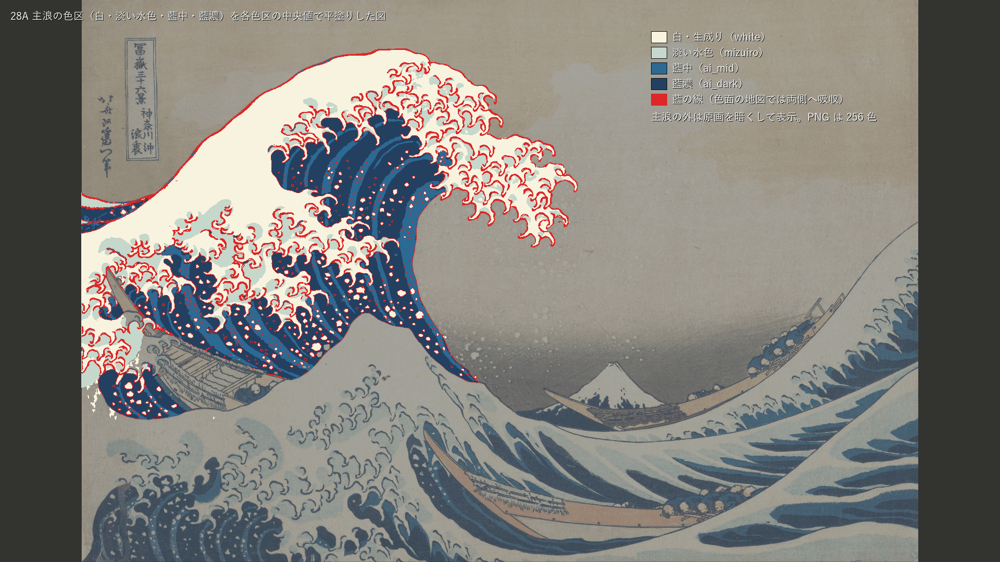
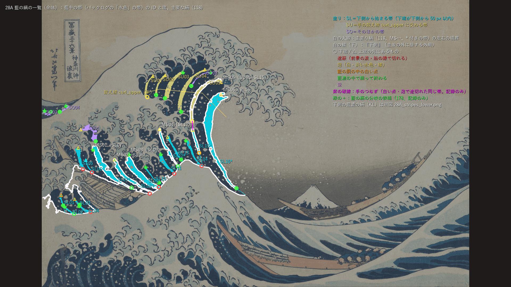
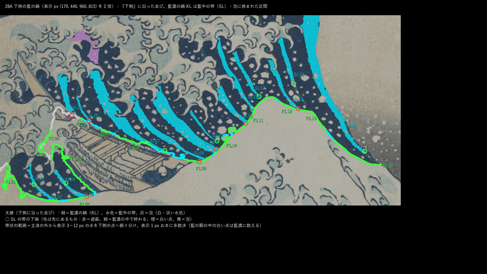
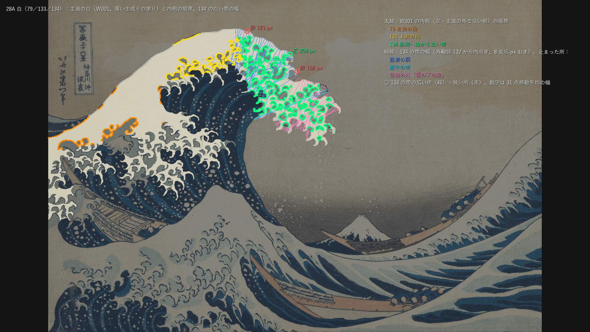
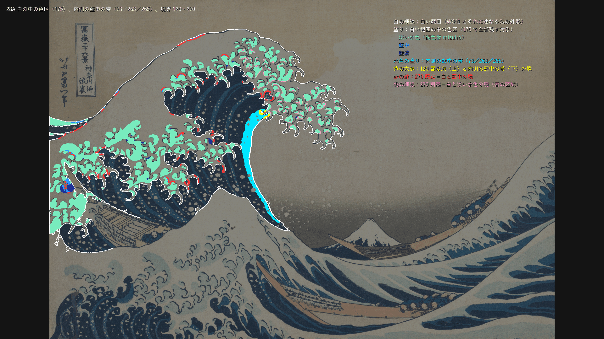
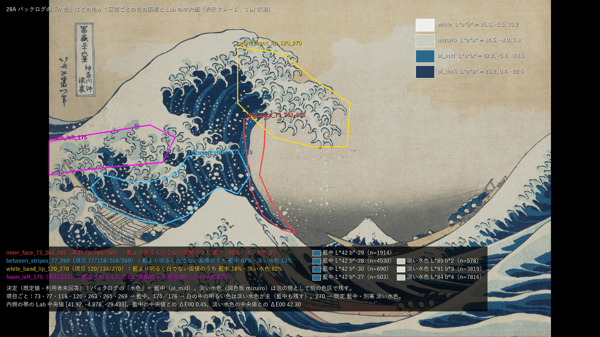
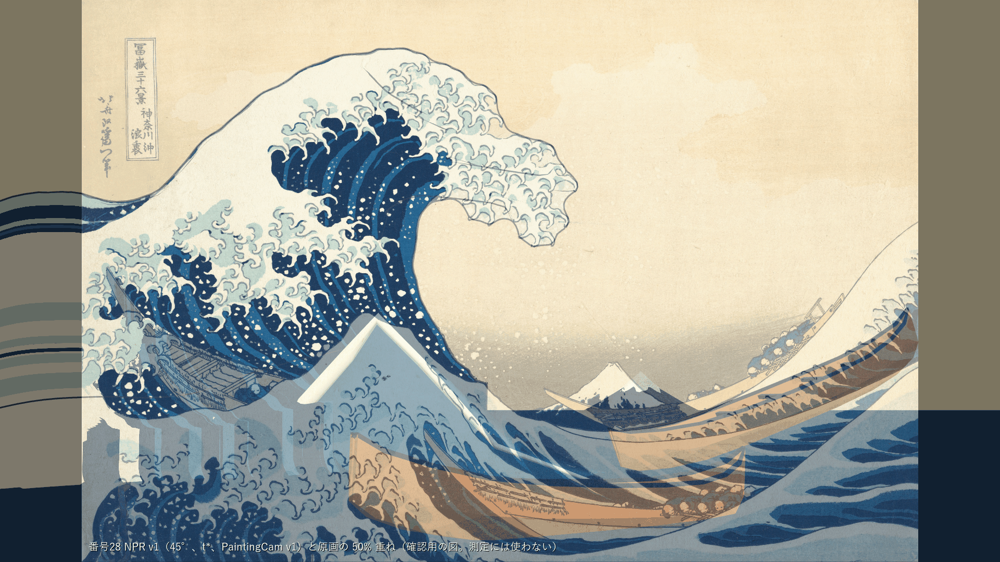
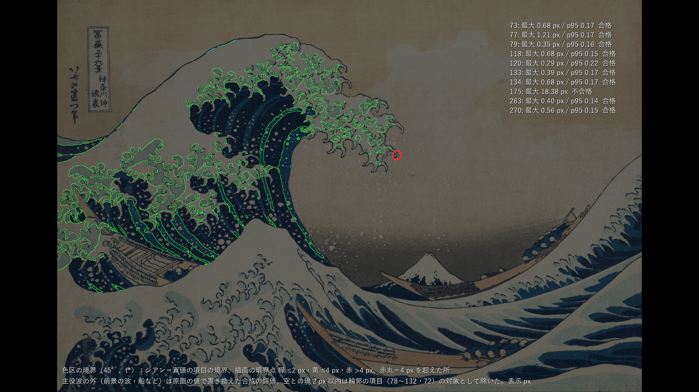
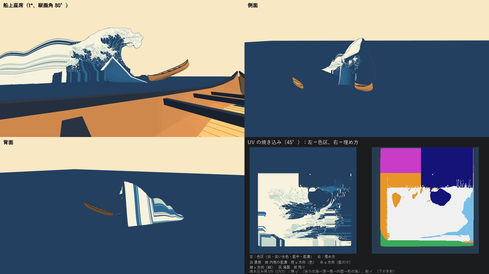

# 28：色面の正解、SDF投影ベイク、NPR shader v1

この「28」は2026-09-25の新作業計画（[計画 4.2](../Design/ArtFirst_Plan_2026-09-25_ja.md)）での番号である。28は第A部（原画から色区の正解を作る）と第B部（GWProjectionBakerによる投影ベイクと shader v1）に分けて進めた。この文書は第A部と第B部の最初の納品の記録である。

**28 全体の結果（2026-09-26）**：t\* = 12.0 s の PaintingCam v1（1920×1080、Unity の PC オフスクリーン描画）で、判定する立体解釈 45°（既定値・利用者未回答）について、色区の境界 73・77・79・118・120・133・134・263・270 はすべて ≤4 px（最大 0.29〜1.21 px）で合格、265（内側の帯の色 ΔE00 0.55）・266／267（領域内の色の標準偏差 <1、照明・灰色の帯 0）・UV テクスチャの空のテクセル 0 も合格した。**175（白の中の藍・水色の色区が全部残る）は不合格**：198 の色区のうち、主役波の輪郭に接する 2 つ（唇先の爪の先の淡い水色 M171、外周 78 の線の縁の藍中 A073）が描画に残らず、M171 の所で境界が 18.4 px 離れた。原因は色ではなく形（番号26 の K\* は爪のない包絡の輪郭で、線幅の半分だけ内側にある）である。142・143（外周の線の位置）は事前検査として記録だけにした。**28 の受入はすべては満たしていない（175）。**

## 第A部：主浪の色区の正解（2026-09-26）

結果：高解像度原画（Met_JP1847_DP130155.jpg、3859×2594）から、主浪の色区を白・淡い水色・藍中・藍濃の4色と藍の線に分け、色区の連結成分ごとに ID 付きの境界の折れ線（表示 px）にした。あわせて、藍の縞の一覧（藍中の帯25本、下側の並び、藍濃の縞、主要な縞、分岐の候補）、白（79／133／134）、白の中の色区（175）、内側の藍中の帯（73／263／265）、境界 120・270 の対象を取り出し、バックログの「水色」がどの色に当たるかを Lab の標本で確かめた（既定は藍中）。**第A部は正解を作る段なので、どの項目も合否を出していない（すべて記録のみ）。** 境界 ≤4 px と ΔE00 ≤5 の判定は、第B部の描画をこの正解に照らして行う。

- 時間の上限：28全体で2.5日、第A部の枠は約1日（進行役の指示）。第A部の出力フォルダーが作られた時刻は 2026-09-26 03:10、最終の実行は 04:18（同じ時計）。コードの書き始めはそれより前で、時刻の記録はない。第A部は、途中で止まっていた前の実装サブエージェントの作業（`colour_truth.py`、`colour_annotations.json`、出力一式、03:35 の時点）を引き継いで仕上げた。
- 修正回数：0（第A部の最初の提出）。
- 対応するバックログ：73、77、79、118、120、133、134、175、263、265、266／267（目標色）、270。178（縞の分岐）は計画の損切りどおり記録のみ。「水色」の対応は 268・269 にもかかわる。
- 証拠の種類：原画の画素に対する numpy・OpenCV の計算と、人が見るための重ね図。Unity、PCビルド、HMD実機の結果は含まない。
- 前提：番号23の真値 v0.2（23修正02。空の2版、主浪の輪郭、調色板、truthlib.py）を入力にした。入力の SHA-256 は、23 の [truth_manifest.json](../../Tools/PaintingTruth/targets/truth_manifest.json) の記録とすべて一致した。この時点で 23修正02 はまだコミットされていないので、28第A部は 23修正02 の後にコミットする必要がある。

### 見るもの

| 色区（各色区の中央値で平塗り） | 藍の縞の一覧（全体） |
| --- | --- |
|  |  |
| **下側の藍の縞（2倍）** | **白（79／133／134）** |
|  |  |
| **白の中の色区（175）・内側の帯・境界 120／270** | **「水色」はどの色か** |
|  |  |

- 拡大図（左が高解像度原画、右が色クラス）：[唇の付け根](../Evidence/ArtFirst/28/28A_closeup_lipbase.png)、[胴の下側](../Evidence/ArtFirst/28/28A_closeup_curl_lower.png)
- 数値：[partA_metrics.json](../Evidence/ArtFirst/28/partA_metrics.json)（バックログ項目→値→記録のみ）、実行条件と入出力の SHA-256：[partA_run.json](../Evidence/ArtFirst/28/partA_run.json)
- 正解：[colour_truth.json](../../Tools/PaintingTruth/colour/colour_truth.json)（定義・色・縞・白・対応の決定）、[colour_polylines.json](../../Tools/PaintingTruth/colour/colour_polylines.json)（境界の折れ線）、[masks/](../../Tools/PaintingTruth/colour/masks/)（色区の被覆率とラベル）
- 生成器：[colour_truth.py](../../Tools/PaintingTruth/colour/colour_truth.py)、手で決めた値：[colour_annotations.json](../../Tools/PaintingTruth/colour/colour_annotations.json)

図はすべて 1920×1080 の 256 色 PNG で、人が確かめるための重ね図である。測定には使っていない。

### 方法

1. **色の分類**（高解像度原画の画素）：Lab を σ 1.2 px で平滑し、番号23の調色板（白、水色、藍中、藍濃、船の黄土、空上）を初期値に、最も近い色（ΔE00）へ分けた。各色の中心を1回だけ推定し直した。どの中心からも ΔE00 10 以上離れた画素は「藍の線」（輪郭の版の線と、その縁の混色）とした。空は番号23の真値（爪入り版）に従う。
2. **片付け**：白・淡い水色に接する細い藍濃は線とした。線に周長の半分以上が接する小さな藍中・藍濃の成分（表示 px² で約30以下）は、線の縁の混色として線に入れた（藍中 9,939 成分、藍濃 1,544 成分。ほとんどは数画素の斑）。混色の細片と小さな成分（表示 px² で約10未満）は隣の色へ吸収した。
3. **主浪への振り分け**：手で決めた多角形（主浪の範囲、左奥船、画面左端の小波）で、色の連結成分ごとに面積の過半がある側へ振り分けた。空の色に近い閉じた小空域（左端の黄ばんだ紙など）は、主浪の中では白として数えた。
4. **ベクター化**：色区（線は両側の色へ吸収した地図）の連結成分ごとに、外周と穴を2倍拡大の輪郭で取り、Douglas–Peucker（0.35 hi px）で間引いた。ID は色の頭文字と面積の順（W001 が最大の白）。白 234、淡い水色 178、藍中 77、藍濃 70、計559成分・836輪。
5. **縞**：藍中の細長い成分（面積 ≥ 1000 hi px²、長さ／平均幅 ≥ 2.5、周りの3割以上が藍濃）を「藍中の帯」とし、Zhang–Suen の骨格の最長経路を中心線にした。主浪の水の外周のうち主浪の外に接する最長の区間を「下側」とし、帯の下端を中心線の向きに延ばして下側に当てた点の弧長で並べた（SL）。下側から表示 3〜12 px の帯状の範囲を下側の点へ振り分け、表示 1 px おきの多数決で「藍中の帯・藍濃・泡」の並びにし、藍中の帯・泡に挟まれた藍濃を「藍濃の縞」（KL）とした。
6. **白**：主浪の最大の白の成分 W001 の内側の境界を、手の区域で 79（左側）・133（上側）・134（船側へ曲がる帯）に分けた。134 の帯の幅は、外輪郭 132（包絡版）から内向きの法線に沿って、藍の胴（面積 ≥ 1500 表示 px² の藍中・藍濃）に当たるか唇の下の空（番号23の包絡版の空）に出るまでの長さとした。
7. **色の中央値**：番号23の規則どおり、表示フレームで3 px 縮めた内側の中央値。

### 手で決めたもの（利用者の抜き取り確認待ち）

[colour_annotations.json](../../Tools/PaintingTruth/colour/colour_annotations.json) v0 の値だけを手で決めた。色の境目の位置そのものは原画から自動で取り、手の値は「どの区域に属するか」の振り分け、並び順の手がかり、証拠の標本の範囲にだけ使った。

| 手の値 | 使い道 |
| --- | --- |
| 主浪の範囲・左奥船・画面左端の小波の多角形 | 色の成分の振り分け（面積の過半） |
| 数え線 curl_upper | 下側に届かない巻きの上側の帯の番号（SU）の順 |
| 同じ帯のつなぎ2組（inner_face、curl_right_2） | 白い点・泡で途切れた帯を1本とみなす（118 の主要な縞）。inner_face は色区の地図の上で既に1成分になった |
| 白の区域（79／133／134） | W001 の内側の境界を項目ごとに分ける |
| 「水色」の証拠の区域4つ | 区域ごとの色の面積と Lab の標本 |

### 結果（すべて記録のみ）

**色の中央値**（表示フレーム、3 px 収縮）と番号23の調色板との差：

| 色 | L\* | a\* | b\* | 8bit sRGB | 番号23との ΔE00 |
| --- | --- | --- | --- | --- | --- |
| 白・生成り（white） | 95.76 | −1.51 | 10.19 | 248, 243, 223 | 0.68 |
| 淡い水色（mizuiro） | 84.54 | −7.96 | 3.79 | 198, 215, 203 | 1.26 |
| 藍中（ai_mid） | 42.18 | −5.36 | −28.56 | 44, 105, 147 | 0.33 |
| 藍濃（ai_dark） | 26.17 | 0.40 | −22.48 | 35, 64, 97 | 0.36 |

**藍の縞（77・118・178）**：

- 藍中の帯は25本。下側から始まる帯（下端が下側から表示 50 px 以内）が SL01〜SL16 の16本で、そのうち10本は下側の帯状の範囲まで届く。巻きの上側の帯が SU01〜SU05、そのほかが SO01〜SO04。
- 下側に沿った藍濃の縞は KL01〜KL14 の14本。両側がどちらも藍中の帯なのは8本（KL02、KL07〜KL13）。残りは泡・並びの端と接する。KL01・KL02・KL11・KL13・KL14 の上には、下側の帯状の範囲まで届かずに終わる帯（SL01、SL03、SL10、SL13、SL15、SL16）がある（その帯の下端より下では、両側の藍濃の縞が1本につながる）。
- 主要な縞（118、下側から始まり、中心線の長さの合計が 150 px 以上）は MS01〜MS06：SL07（229 px）、SL08（205）、SL09（178）、SL12（163）、SU05＋SL15（つなぎ、312）、SL16（内側の帯、418）。左右の境界は `colour_polylines.json` の `stripe_edge`。
- 分岐の候補（178）は23か所（帯の端が藍濃の中で終わる所）。

**白（79・133・134）**：W001 は 153,135 表示 px²で、左側（79）から上側（133）まで1成分。内側の境界は 79 が 94区間・1,057 px、133 が 139区間・1,646 px、134 が 5,220 px。134 の帯の幅は中央値 172 px（123〜208）、31点移動平均の広狭は唇の付け根から「狭 123（803, 101）→ 広 208（943, 176）→ 狭 162（966, 232）」。

**白の中の色区（175）**：白い範囲（W001 とそれに連なる泡の外形の内側、228,395 px²）の中に、淡い水色 166成分（60,700 px²）、藍中 16成分（1,652 px²）、藍濃 16成分（1,292 px²）、藍の線 42,569 px²。175 はこれらを全部残す対象とした。

**内側の帯（73・263・265）と境界（120・270）**：内側の藍中の帯は SL16（A001、唇の下 (830, 355) から前景の小波の近く (888, 708) まで）。3 px 収縮の Lab 中央値は (41.92, −4.88, −29.43) で、藍中の中央値との ΔE00 は 0.45、淡い水色の中央値とは 42.30。下端は下側（前景の小波の縁）から 17.6 px 離れた所で、藍濃の中で終わる。263 の「下方の水面」のうち主浪の外の部分は第A部の範囲外で、下端の先の色は記録だけにした。120（唇の泡と内側の帯の境）は 13区間・39 px。270 は、白と藍中の境（既定）が 119区間・853 px、白と淡い水色の境（唇の区域、別案）が 190区間・2,420 px。

### バックログの「水色」の対応（既定値・利用者未回答）

**既定：藍中（ai_mid）**。要求文が指す場所の色を、区域ごとの面積と Lab 中央値で確かめた。

| 項目 | 要求文の場所 | 藍より明るく白でない面積のうち | 標本の Lab 中央値 | 対応 |
| --- | --- | --- | --- | --- |
| 73・120・263・265 | 唇の下の内側の帯 | 藍中 100%・淡い水色 0% | 藍中 (41.8, −4.7, −29.4) | 藍中 |
| 77・118・268・269 | 胴の下側、藍濃の縞の間 | 藍中 87%・淡い水色 13% | 藍中 (42.3, −5.8, −27.6) | 藍中 |
| 175（176） | 白い範囲の中 | 淡い水色 97%（面積 60,700 と 1,652 px²） | 淡い水色 (83.5, −8.4, 3.9)（左の泡） | 淡い水色が主。藍中も残す（175 は全部残すので、対象は当てはめで変わらない） |
| 270 | 唇（白い帯とその内側） | 淡い水色 82%・藍中 18% | 淡い水色 (90.6, −7.0, 3.2) | 既定は藍中。淡い水色の読み方も残し、両方の境界を出した |
| 266 | — | — | — | 当てはめに依らない（全色区を中央値で平塗り） |

根拠：77・269 の「水色を挟んで並ぶ藍の縞」「縞の間に水色の帯」の場所で、藍濃の縞の間にあるのは藍中の帯である。265 の「藍より明るい水色の色面」は内側の帯で、藍中そのもの（ΔE00 0.45）である。淡い水色（L\* 約85）は泡の中の斑で、縞の間や内側の面を作らない。ただし 175・270 のように白の中や白との境を述べる項目では、明るい色の大部分が淡い水色なので、読み方が分かれる。番号23の調色板は mizuiro の日本語名を「水色」としており、バックログと名前がずれる。名前の付け替え（例：mizuiro →「淡い水色」、ai_mid →「藍中（バックログの水色）」）は進行役の判断に残した。このファイルは調色板を変えない。

### 限界と未解決

- 前景の小波の縁に近い藍の胴の白い点5つ（計約120表示 px²）は、小波の紙の白と線の途切れでつながり、主浪の外に振り分けられた。
- 線の切れ端の処理で、表示 px² で約30以下の藍中・藍濃の小さな塗りのうち、周長の半分以上が線に接するものは線になった。爪の中の小さな藍の塗りの一部は正解に含まれない。
- 134 の帯の幅は定義に左右される。爪の中の小さな藍の斑も帯の縁とみなす版（開発中に試した）では、唇の途中（1026, 268）にもう一つ狭い所が出た。134 は帯の両側の境界の ≤4 px で判定し、広狭の順は記録にとどめるのがよい。
- 下側に届かない帯の並び順は、中心線の延長（最大 80 px）で決めた。前景の小波の頂の近くの SL14・SL15 は、下側の弧長の差が5 px しかなく、順は確かでない。
- 下側の藍濃の縞の本数は、帯状の範囲（3〜12 px）、短い区間の吸収（6 px）、同じ帯に挟まれた区間の扱い（30 px）で変わりうる。値は `colour_truth.json` の `params` に記した。
- 主浪の範囲の外（前景の小波、右の海）は色区の地図に入れていない。263 の「下方の水面」のうち主浪の外の部分との色のつながりは、第A部では記録だけにした。

### 第B部への引き継ぎ

- 色区の地図は `masks/mw_colour_labels_hi.png`（高解像度原画の画素。0＝主浪の外、1＝白、2＝淡い水色、3＝藍中、4＝藍濃、5＝藍の線、9＝空）を正とする。表示フレームの判定には `masks/mw_*_cov.png`（uint16 の被覆率、0.5 で2値化）を使う。境界の SDF は、この地図から作るのがよい（折れ線は同じ地図の輪郭を間引いたもの）。
- 項目ごとの判定対象は `colour_truth.json` の `item_targets`、折れ線は `colour_polylines.json` の `features`（`kind` と `items` で選ぶ）と `regions`（`in_white_range_175`）。座標は表示 px。
- 目標色は `palette_display_median`、265 は `inner_face.lab_median_eroded_3px`。
- 藍の線は色区の地図では両側の色へ吸収してある。外殻線と色の境界線は番号36で扱う。

### 再現方法

リポジトリの根で次を実行する（py -3.10、numpy 2.2.6、OpenCV 4.12.0、Pillow 12.0.0。約107秒）。

```
py -3.10 Tools/PaintingTruth/colour/colour_truth.py --evidence Docs/Evidence/ArtFirst/28 --build Unity/Build/ArtFirst/28/partA
```

キャッシュを使わない実行を2回続けて行い、出力18ファイル（正解の JSON 2つ、マスク7つ、図8つ、metrics）の SHA-256 がすべて一致した。時刻は `partA_run.json` にだけ入れている。中間物 `Unity/Build/ArtFirst/28/partA/stage_a.npz`（62 MB、Git 対象外）の SHA-256 は `c71e918a5da5a6f95874b1ff39e1ef91df69aa33c08cf7a7cecf5ee5e0521c34`。番号23の真値が変わったら、同じコマンドを1回実行して作り直す。

## 第B部：SDF投影ベイク、NPR shader v1、外殻線 v0（2026-09-26）

結果：番号26 の K\*（3 つの立体解釈）を t\* の PaintingCam v1 から GPU で深度テスト付きに投影し、第A部の色区の符号付き距離（4 色区、1 チャンネル 1 色区）を 4096² の UV テクスチャへ焼いた。見えないテクセルは外挿で埋め、空のテクセルは 0。NPR shader v1（無照明の調色板、距離によるアンチエイリアス、SPI の立体視マクロ、ID 表示）と外殻線 v0（中心眼から世界幅で計算する反転シェル）を作り、Unity で原画視点・船上座席・側面・背面を描いた。判定（45°）は 175 以外すべて合格、175 は不合格（上の「28 全体の結果」）。

- 時間の上限：28全体で2.5日（第A部を含む）。第B部の実績は約 1.2 時間（2026-09-26 06:35〜07:45 頃、同じ時計）。第A部と合わせても時間の上限の内。
- 修正回数：0（第B部の最初の納品）。作る途中の試行（下の「作る途中で直したこと」）は、納品した画像に対する修正ではないので数えていない。コミット前の独立レビューの指摘で、外挿の u 方向の退路（藍がない行では白も延びる）の説明と、シェーダーのコンパイルの件数の書き方を直した（文書だけの直し）。
- 対応するバックログ：73、77、79、118、120、133、134、175、263、265、266、267、270（判定）。142・143（事前検査、記録のみ。正式な判定は番号36）。178（縞の分岐）は計画の損切りどおり記録のみ（延期）。
- 証拠の種類：Unity 6000.4.3f1 Editor の batchmode による **PC のオフスクリーン描画**（RTX 3080、Direct3D11、Linear 色空間）と、その画像の numpy・OpenCV の測定。立体視はシェーダーバリアントのコンパイルだけを確かめた。HMD 実機の結果ではない。
- 前提：番号23 の真値 v0.2（23修正02）、番号26 の K\*（`Unity/Build/ArtFirst/26/kstar/`、.gwb の SHA-256 を meta と照合）、第A部の色区の地図（`stage_a.npz`、SHA-256 を第A部の記録と照合）。23修正02・26 とも着手時点で未コミットなので、コミットの順は 23 → 26 → 28 になる。
- 評価器の状態：番号23 の較正門は全項目合格で、門の後に真値は変わっていない（metrics.json の `evaluator.provisional: false`）。色区の評価は番号23 の評価器と同じ境界点の取り方・ラベル付き Hausdorff を、この番号のスクリプトで色区ごとに回した。

### 見るもの

| 原画視点 45°（Unity、t\*、外殻線あり） | 原画 50% 重ね |
| --- | --- |
|  |  |
| **色区の境界の偏差図（45°）** | **船上座席・側面・背面、UV の焼き込み** |
|  |  |

- [3 つの立体解釈（原画視点・船上座席）](../Evidence/ArtFirst/28/28B_interpretations.png)
- [拡大（描画と原画を 2 倍で並べた図：唇の下、下側の縞、白の中の色区、外周の線）](../Evidence/ArtFirst/28/28B_a45_closeups.png)
- 数値：[metrics.json](../Evidence/ArtFirst/28/metrics.json)（バックログ項目→値→合否／記録のみ）、実行条件と SHA-256：[run.json](../Evidence/ArtFirst/28/run.json)

原画視点と船上座席の画像は Unity の実描画で、場面は M1 Revision01 の構図（旧い前景のうねり・3 隻・富士。番号27・39 の範囲）のまま、主役波だけを K\* と NPR v1 に替えた。50% 重ね・偏差図・拡大図・並べ図は人が見るための図（256 色 PNG）で、測定には使っていない。

### 作ったもの

1. **焼き込みの入力**（[af28_bake_input.py](../../Tools/PaintingTruth/colour/af28_bake_input.py)、固定値は [af28_params.json](../../Tools/PaintingTruth/colour/af28_params.json)）：第A部の色区の地図（線を両側の色へ吸収した高解像度の地図）から、色区ごとの符号付き距離（表示 px、±15.9 で切る）を高解像度原画の格子で作る。空と主浪の外は最も近い色区で埋めてから距離をとり、輪郭の外まで値が連続するようにした（4 つのうち正がちょうど 1 つでない画素 0）。有効域（主浪の色区＝有効、主浪から 6 表示 px 以内の空＝有効、遠い空、主浪の外＝原画の遮蔽物）、調色板の 8bit sRGB（第A部の色区の中央値。白 248,243,223／淡い水色 198,215,203／藍中 44,105,147／藍濃 35,64,97）、外殻線の角幅（外周 78・130・131 の線幅の中央値 3.01 表示 px → 1.29 mrad）と線の色（外周の線の芯の Lab 中央値 (33.8, 0.2, −9.9) → 71,80,95）もここで決める。
2. **焼き込み用の UV（UV3）**：UV0 のまま焼くと、唇や角の付近で 1 テクセルが画面上で最大 34 px（u）・12 px（v）に伸び、原画の小さな色区が消えた（下の「作る途中で直したこと」）。そこで UV0 を列ごと・行ごとに単調に引き伸ばした (u′, v′) を UV3 とした。u′ は列だけ、v′ は行だけで決まり、固定位相の格子の添字だけから作れる（形成の keypose でも同じ UV3 を使える）。原画視点で前を向き、画面内で主浪の上にある面の、列（行）の間隔の画面上の長さの最大を要求とし、世界 0.25 m に 1 テクセルを下限にして 4096 を配分した。原画視点で 1 テクセルあたり最大 0.51 px（u′）・0.59 px（v′）になった（45°。30°・60° は 0.50〜0.61）。
3. **GWProjectionBaker**（[AF28ProjectionBaker.cs](../../Unity/Assets/GreatWave/ArtFirst/Editor/AF28ProjectionBaker.cs)、[AF28_Bake.shader](../../Unity/Assets/GreatWave/ArtFirst/Shaders/AF28_Bake.shader)。計画の名前は GWProjectionBaker、ファイルは番号の接頭辞 AF28 を付けた）：
   - 深度：K\* だけを PaintingCam v1 から 3840×2160 へ描き、画素ごとに最も近い面の 1/視点深度を残す（BlendOp Max）。
   - UV：K\* を UV3 の空間へ広げて描き、各テクセルの世界位置を PaintingCam へ投影して、画面内か、深度テストで見えるか（許容 0.05 m + 深度の 0.2%）、原画の有効域、高さと、原画側の符号付き距離（双線形）を読む。
   - 向きの確かめ：深度画像は見える頂点の深度と行の向きで照合し（一致 2,868 点、逆向き 244 点 → 反転なし）、UV の出力は書き込んだ v′ で行の向きを確かめた（読み戻しの行は上下逆だったので直した）。
   - 外挿（CPU、順に）：① 直接（画面内で見えて原画が有効）→ ② 内側の藍濃（K\* 自身に隠れた、唇先端〜内壁の下端の列）→ ③ u 方向（画面内で無効なテクセルに、同じ行で最も近い直接のテクセルの色区を写す。原画の遮蔽物に隠れた見えるテクセルは、同じ行で最も近い藍中・藍濃の直接のテクセルを写して縞を延ばし、泡の白・淡い水色は延ばさない。**ただし同じ行に藍の直接のテクセルがなければ、退路として同じ行で最も近い直接のテクセル（泡の白のこともある）を写す**。af28_params.json の `fill_ja` の 3 と同じ）→ ④ v 方向（画面外のテクセルに、同じ列で最も近い値を写す）→ ⑤ 海面（無効で高さ 0.3 m 未満は藍濃）→ ⑥ 残り。外挿で写すのは色区だけ（最大の色区を +15.9 px、ほかを −15.9 px）。
   - 集計（45°、16,777,216 テクセル）：直接 5,498,524、内側の藍濃 3,406,899、u 方向 1,579,920、u 方向（藍だけ）729,306、v 方向 809,862、海面 3,229,127、残り 1,523,578、**未設定 0、UV で描かれないテクセル 0**。30°・60° も未設定 0。
   - 出力：`Unity/Build/ArtFirst/28/bake/af28_uvsdf_<key>.bin`（RGBA32 の生データ 64 MB、線形。R 白・G 淡い水色・B 藍中・A 藍濃、値 = 127.5 + 8·距離）、UV3 の表 `af28_uvwarp_<key>.json`、カテゴリ `af28_uvcat_<key>.bin`、集計 `af28_bake_<key>.json`。3 案の焼き込みは各約 4 秒。
4. **NPR shader v1**（[AF28_NPR.shader](../../Unity/Assets/GreatWave/ArtFirst/Shaders/AF28_NPR.shader)）：UV3 で色区テクスチャを読み、距離が最大の色区の調色板の色を無照明で出す。境の近くは上位 2 つの色区の距離の差を fwidth で 1 画素幅に混ぜる。Linear 色空間で Color を渡し sRGB の描画先に書くので、平らな所の 8bit 値は調色板と一致した（描画の色区の中央値と調色板の ΔE00 0.15〜0.22 は Lab → 8bit の丸めの分）。大域の `_AF28IdMode = 1` で色区ごとの ID 色（アンチエイリアスなし）を出す（評価用。決めた色以外の画素 0）。SPI のマクロは Sampling19Surface.cginc と同じ形で入れた。2 シェーダー（AF28 NPR v1・AF28 Outline v0）× キーワードの組 5（なし、`INSTANCING_ON`、立体視の 3 組 `STEREO_INSTANCING_ON`（`INSTANCING_ON` と併用）・`UNITY_SINGLE_PASS_STEREO`・`STEREO_MULTIVIEW_ON`）× 頂点・フラグメントの計 20 件が D3D11 でコンパイルできることを確かめた（`af28_spi_compile.json`。コンパイルだけで、立体視での描画は未確認）。
5. **外殻線 v0**（[AF28_Outline.shader](../../Unity/Assets/GreatWave/ArtFirst/Shaders/AF28_Outline.shader)）：水面シートを頂点法線（空気の側）へ押し出した殻の裏向きの面だけを描く。押し出し幅 = clamp(中心眼から頂点までの距離 × 1.29 mrad, 0.05 m, 0.30 m)。中心眼は立体視では左右の眼の中点（`unity_StereoWorldSpaceCameraPos` の平均）、単眼では `_WorldSpaceCameraPos` で、両眼で同じ世界幅になる。原画にない線を消す線マスクはまだない（番号36）。
6. **シーン**（[AF28NprScene.cs](../../Unity/Assets/GreatWave/ArtFirst/Editor/AF28NprScene.cs)、実行時の読み込みは [AF28NprWave.cs](../../Unity/Assets/GreatWave/ArtFirst/Scripts/AF28NprWave.cs)）：M1 Revision01 を別名 `AF28_NPR.unity` で複製し（番号24・26 と同じ手順、元シーンの SHA-256 は前後で一致）、旧い静止波・斜面・白帯・爪を新シーンだけで非表示にして、K\* 3 案に NPR v1 と外殻線の子を付けた。メッシュは番号26 の `AF26KStarMesh` で読み（26 のファイルは変えていない）、UV3 と色区テクスチャは `AF28NprWave` が付ける。参照海面は NPR v1 の藍濃の平塗り（`AF28_SeaFlat.mat`）。
7. **評価**（[af28_evaluate.py](../../Tools/PaintingTruth/colour/af28_evaluate.py)）：
   - 色区 ID（3840×2160、主役波だけ、ほかは隠す、空＝背景）を 2×2 平均して色区ごとの被覆率にし、番号23 の評価器と同じく σ 1 px で平滑した 0.5 の等値線の点を、真値（第A部の地図から同じ式で作った表示フレームの被覆率）と比べた（ラベル付き対称 Hausdorff）。
   - 主役波の外（前景の波・船・右の海。原画で主浪の外の画素）は原画の値で置き換えた（番号27・39 の遮蔽物を原画のものにした合成の評価）。空との境は描画のままにした。
   - 項目の対象：第A部の折れ線（colour_polylines.json）から 1.5 px 以内の真値の境界点。空との境（主役波の輪郭）から 2 px 以内の境界点は、78〜132・72（番号26）の対象として色区の項目から除いた（真値は真値の空、描画は描画の空から）。
   - 77：下側から内側 3〜12 px の帯状の範囲で、藍中の連結成分（下側から始まる帯）の本数と並び順を真値と描画で対応させ、帯の下端の境界を ≤4 px で判定した。134：外輪郭 132 から内向きの白い帯の幅を真値と描画に同じ手順で測り、狭→広→狭の順と位置を比べた。133：描画の白の連結成分が W001 の左側と上側をともに覆うか。263：内側の帯の連結成分が真値の上端と下端から 4 px 以内に届くか。175：色区の多角形の内側（空から 2 px より内側）に描画の同じ色区が 3 px 以上あれば「残る」とし、境界は ≤4 px。
   - 265：内側の帯 A001 を 3 px 縮めた範囲の Lab 中央値（主役波だけの原画視点の描画）と原画の中央値の ΔE00。266／267：原画視点（真値の色区を 3 px 縮めた範囲）と船上座席（描画の色区 ID を 3 px 縮めた範囲）で、各画素と範囲の中央値の ΔE00 の標準偏差、1 ΔE00 を超える画素が 20 px 以上まとまった帯の数、2 視点の中央値の差。「水色」は第A部の既定の藍中（既定値・利用者未回答）、淡い水色は記録。
   - 142・143（記録）：外殻線ありの ID 画像で、真値の外輪郭（線の外縁）から水側への法線上の線の塊の中心・幅と、原画の線の中心（外縁から線幅の半分だけ水側）のずれ。

### 結果（45°、t\* = 12.0 s、PaintingCam v1、1920×1080）

| 項目 | 判定の中身 | 値（最大／p95、表示 px） | 判定 |
| --- | --- | --- | --- |
| 73 内側の水色（藍中）の色区の境界 | 内側の帯 A001 の境界 | 0.68／0.17 | 合格 |
| 77 下側から始まる縞 | 帯の本数と順：真値 18・描画 18、18 対応（藍濃は 18 対 19、描画に 20 px² の小片 1 つ多い、記録）。帯の下端の境界。第A部の数え方（下側から始まる帯 16 本、藍濃の縞 14 本）と違い、帯状の範囲の中の連結成分を数えるので、泡の点で切れた帯の断片も別に数える | 1.21／0.17 | 合格 |
| 79 左側の白 | W001 の左側の内側の境界 | 0.35／0.16 | 合格 |
| 118 主要な縞の両側 | MS01〜06（SL07、SL08、SL09、SL12、SU05＋SL15、SL16）の両側の境界 | 0.68／0.15 | 合格 |
| 120 唇の白と内側の水色 | 唇の泡と内側の帯の境 | 0.29／0.22 | 合格 |
| 133 左から上へ続く白 | 上側の境界。描画の白の 1 成分が W001 の左側の 99.3%・上側の 99.2% を覆う | 0.39／0.17 | 合格 |
| 134 白帯 | 帯の内側の境界。幅の順は真値・描画とも狭 123→広 208→狭 168 px（位置の差 0、幅の差の中央値 0.26 px） | 0.68／0.17 | 合格 |
| 175 白の中の色区が全部残る | 198 のうち 196 が残る。M171（淡い水色 12.7 px²、唇先 (1092, 427)）と A073（藍中 18.2 px²、外周 78 の縁 (213, 388)）が残らない。境界は淡い水色で 18.38 px（M171 の所）、藍中 2.25、藍濃 0.34 | 18.38 | **不合格** |
| 263 内側から下方へ続く水色 | 内側の帯の下部の境界。描画の帯の成分が A001 の 96.9% を覆い、真値の上端・下端から 0.46・0.32 px | 0.40／0.14 | 合格 |
| 270 白と水色の境 | 既定（白と藍中の境）。別案の白と淡い水色の境は 0.62 px（記録） | 0.56／0.15 | 合格 |
| 265 内側の水色の表示色 | 目標 Lab (41.92, −4.88, −29.43)、描画 (42.38, −5.36, −28.71) | ΔE00 0.55 | 合格 |
| 266 水色（藍中）の平塗り | 領域内の ΔE00 の標準偏差 原画視点 0.57・船上 0.52、帯 0・0、2 視点の差 0.00（淡い水色は 0.18・0.05、記録） | — | 合格 |
| 267 白の平塗り | 同 0.24・0.08、帯 0・0、差 0.00 | — | 合格 |
| UV に空のテクセルがない | 3 案とも外挿の後の未設定 0、描かれないテクセル 0（正の色区がないテクセルは 239〜258、最大の色区で色は決まる） | — | 合格 |
| 142 左の外周線（事前検査） | 線がある割合 1.00、線の中心のずれ 最大 4.14・p95 2.64 px、描画の線幅の中央値 3.25 px（原画 2.78・3.34） | — | 記録のみ |
| 143 上から船側の端の外周線（事前検査） | 線がある割合 1.00、中心のずれ 最大 3.02・p95 2.19 px、線幅 3.00 px（原画 2.87・2.29） | — | 記録のみ |
| 178 縞の枝分かれ | 第A部の候補 23 か所。判定は延期（計画の損切り） | — | 記録のみ |

- **175**：残らなかった 2 つはどちらも主役波の輪郭に接する（真値の空までの距離 0 px、空から 2 px より内側の画素は 2 px・7 px しかない）。M171 は唇先の爪の先の小さな淡い水色で、K\* は爪のない包絡の輪郭なので、その場所に面がない。A073 は外周 78 の線の縁が藍中に分類された細片で、K\* の輪郭は原画の線の中心（線幅の半分だけ内側）にあるので、面の外になる（描画では外殻線がそこを覆う）。色の焼き込みでは直せない（形の側：番号26 の輪郭、番号29・33 の爪）。この 2 つを除くと境界の最大は 2.25 px（記録）。全画素に対する割合 ≥0.5 で数えると残るのは 194（残らないのは M170 43.5%、M171 0%、A025 48%、A047 36%。M170・A025・A047 は描画にあり、小さな色区や外周の縁の細片が縁で細るため。A073 はこの数え方では 50% でぎりぎり残る）。
- **構造上の一致**：t\* の原画視点では、見えるテクセルは自分の投影先の原画の値を持つので、境界と色は構造上ほぼ一致する（多くの項目が 1 px 未満なのはこのため）。合格は完成を意味しない。形成の途中と船上の見え方は別に確かめる（作業計画 31 の注意、R11）。
- **30°・60°（記録のみ）**：175 以外の 9 項目の境界の最大は 30° 1.94 px（134）、60° 1.17 px（77）。175 はどちらも 18.4 px（同じ M171）。
- **輪郭の照合**：この番号の色区 ID 画像を番号23 の評価器（ID モード、包絡版）に通すと、45° で 78 2.77、130 1.97、131 1.81、132 1.33、72 5.56 px で、番号26 の値と一致した（形は変えていない）。71 は主役波だけの描画なので空域の下辺が開き、161 px（記録、番号26 とは描き方が違う）。外殻線を入れた ID 画像では外周の外縁が 78 4.06、130 2.17、131 2.21、132 3.30、72 3.96 px（記録）。
- **外殻線の位置**：外殻線は K\* の輪郭（原画の線の中心）から外へ線幅いっぱいに出るので、線の中心は原画より約半線幅（約 1.4 px）外になる。142 の最大 4.14 px はこれに K\* の輪郭の誤差が重なった所。正式な判定と、線の内側の半分を色区テクスチャで描く案は番号36 で決める。
- **焼き込みの再現**：同じ入力で 2 回続けて全体を実行し、焼いたテクセル・UV3 の表・描画（3 案 × 全視点）・原画側の入力・証拠の図と metrics.json の SHA-256 がすべて一致した。
- **形（参考）**：K\* の形は番号26 のままで、この番号では変えていない。

### 船上・側面・背面から見た色（記録。合否に数えない）

- 原画で見えていた面は、どの視点から見ても同じ色区の色になる（無照明で視点に依らない。266／267 の 2 視点の差 0.00）。
- 原画で見えない面は外挿の色になる。船上から見ると、原画の前景の波に隠れていた胴の下部は、藍中の縞が下へ延びた縦の筋になる。泡の白を延ばさないのは同じ行に藍の直接のテクセルがある所だけで、画面の左端の近く（藍の直接のテクセルがない行）では、退路で最も近い直接のテクセルを写すので白も延びる。原画視点の x ≈ 230〜270・y ≈ 800〜930 と船上座席の x ≈ 480〜520・y ≈ 560〜650 には、海面まで届く白い縦の筋と、その横の暗い階段状の塊（残りのテクセル、カテゴリ 6）が出る（コミット前の独立レビューが CPU でカテゴリの図を作って確かめた）。原画の画面の左の外にある手前の肩は、画面の左端の色が行の向きに延びた横の筋になる。背面は頂の色が u 方向へ延びた縦縞になる（[並べ図](../Evidence/ArtFirst/28/28B_a45_views.png)）。見えない面の配色の判定は番号41（209 色の帯切れ 0、縞の幅 0.8〜1.2 倍など）。
- 外殻線は、原画に線のない面の折れ目（手前の肩の頂の重なり、唇の下の縁など）にも出る。原画視点でも唇の上や胴の下に細い線が横切る。線マスクは番号36。
- 描画には、泡・爪・縞の縁の藍の線がない。第A部の色区の地図では線を両側の色へ吸収したためで、色区の境界線と爪の縁の線は番号36 で描く（[拡大図](../Evidence/ArtFirst/28/28B_a45_closeups.png)）。

### 作る途中で直したこと（納品前の試行。修正回数には数えない）

- **UV0 → UV3**：最初は UV0 のまま焼いた。境界の最大は 73 11.8、118 7.9、134 8.2、175 89.8 px で、原因は小さな色区（泡の中の点など）が消えたこと、つまり 1 テクセルが画面上で最大 34 px（u）・12 px（v）に伸びていたこと（UV0 は後ろの平らな海と画面の外の行に多くのテクセルを使う）。UV3 に替えると 73 2.76、118 3.03 px になり（空との境を除く前の値）、134 に残った 8.2 px は輪郭の差だった（次の項）。
- **評価の約束（結果を見てから決めたもの）**：空との境 2 px の除外と、77 の数え方は、最初の評価の結果を見てから決めた。
  - 134 の 8.2 px は、描画の白と空の境（K\* の包絡の輪郭）が、真値の爪の間の空と白の境から離れた所で、色区の境ではなく輪郭の差だった。輪郭は 78〜132・72 で番号26 が判定するので、両方の空から 2 px 以内を色区の項目から除いた。除く前の値は 175 の境界（18.4 px）に同じ種類の差として残っている。
  - 77 は最初、下側に沿って 1 px ごとに多数決した並びを文字列で比べたが、藍中と藍濃が 5 対 5 に拮抗する所で 1 画素の差で種類が入れ替わり、真値と描画の並びが 1 か所違った（帯の境界の差は 1 px 以内）。帯状の範囲の連結成分を弧長の重なりで対応させる方法に替え、多数決の並びは記録に残した。
- **外挿**：最初は u 方向に色をそのまま延ばしたが、原画の前景に隠れた胴の下部で泡の白い点が縦の白い筋になり、原画視点の描画でも目立った。原画の遮蔽物に隠れた見えるテクセルだけ、藍中の縞と藍濃を延ばすように変えた（同じ行に藍の直接のテクセルがなければ、退路で最も近い直接のテクセルを写す。このため画面の左端の近くでは白の筋が残る）。また、外挿で距離の値ごと写すと、船上から見て縞の中に細い白い線が出た（元のテクセルが色区の境の近くのとき、隣のテクセルとの間で距離が飛び、アンチエイリアスで混ざる。266 の船上の標準偏差 3.6、帯 4）。色区だけを写すように変えて 0.52、帯 0 になった。
- **有効域**：原画の遮蔽物（主浪の外）と、K\* が原画の空へはみ出した所を最初は区別しておらず、唇の下の空域に見える K\* の面まで藍で埋め、73・118・120 が 232 px になった。有効域を 4 段（主浪、近い空、遠い空、主浪の外）に分けて直した。

### 限界と保留

1. **175 の不合格**：輪郭に接する 2 つの小さな色区が形の側の理由で残らない（上）。番号26 の輪郭と番号29・33 の爪の結果を待つか、175 を輪郭から 2 px より内側の色区で判定するかは利用者の判断（下）。
2. **見えない面の外挿**：船上・側面・背面から見ると筋になる（上）。計画の「縞は v 方向、色は u 方向、見えない内側にだけ暗い藍」に従い、原画の遮蔽物に隠れた所では泡を延ばさないように変えた。ただし同じ行に藍の直接のテクセルがない所（画面の左端の近く）では退路で白も延び、白い縦の筋と暗い階段状の塊が出る（上）。これは計画の字面（色は u 方向）より 1 つ規則が多く、その退路も含めて見えない面の配色の判定と作り直しは番号41。
3. **原画視点の場面**：前景の波・3 隻・富士は M1 Revision01 の仮置きのまま。前景の波がないので、原画で隠れていた胴の下部（外挿）が原画視点でも見える（左下の x ≈ 230〜270・y ≈ 800〜930 の白い縦の筋を含む）。色区の評価は遮蔽物を原画のものに置き換えた合成で行った（番号27・39 の後に場面全体で測り直す）。
4. **外殻線 v0**：原画にない線（面の折れ目）も出る。線の中心が原画より約半線幅外にある（142 最大 4.14 px）。線マスク、線の内側の半分、線幅の判定は番号36。
5. **UV3**：焼き込み用に UV0 と別の UV を足した。表は K\* の形と原画視点から決めるので、K\* が変わったら表も変わる（再焼き込みで一緒に作り直す）。番号30 の keypose は同じ格子なので、UV3 も格子の添字から同じ表で付けられる。
6. **「水色」の対応**：第A部の既定（藍中）のまま（既定値・利用者未回答）。淡い水色で読んだ値も記録した（270 の別案 0.62 px、266 の淡い水色の標準偏差 0.18・0.05）。
7. **立体視・性能**：立体視のシェーダーバリアント（上の 2 シェーダー × 立体視のキーワードの組 3 × 頂点・フラグメント）はコンパイルだけ確かめた。両眼の描画は番号32（Mock）と番号34（HMD）。色区テクスチャは 1 案 64 MB（計画の目安 ≤256 MiB の内）。HMD は未所持で、VR の項目はすべて未検証。
8. **前提**：この番号は 23修正02（真値 v0.2・較正門）と 26（K\*）に依存する（どちらもこの番号の作業時点で未コミット）。コミットは 23修正02 → 26 → 28 の順に置く。

### 利用者に決めてほしいこと

- **175**：(1) このまま不合格として、番号26 の輪郭（爪なしの包絡、線幅の半分の内側補正）と番号29・33 の爪ができた後に判定し直す、(2) 175 を「輪郭から 2 px より内側の色区」で判定する（輪郭は 78〜132・72 で別に判定する。この読み方なら 45° は合格：境界 2.25 px、残らない色区 0）、(3) 真値から輪郭に接する細片（線の縁の藍中など）を 175 の対象から外す（第A部の真値の修正）。
- 見えない面の外挿の方針（番号41 の前に決めてよい）：今の「色をそのまま延ばす（原画の遮蔽物の所だけ縞を延ばす）」か、見えない面をすべて「藍濃に藍中の縞」にするか。
- 引き続き保留：「水色」の対応（第A部）、D6（立体解釈）、D7（座席の船）。

### 再現方法と生成物

リポジトリの根で次を実行する（Python 3.10.6、numpy 2.2.6、OpenCV 4.12.0、Pillow 12.0.0、Unity 6000.4.3f1）。第A部の中間物（`Unity/Build/ArtFirst/28/partA/stage_a.npz`）と番号26 の K\*（`Unity/Build/ArtFirst/26/kstar/`）が要る。全体で約 1.5 分（Unity は起動を含めて約 25 秒、評価約 54 秒）。

```
powershell -NoProfile -ExecutionPolicy Bypass -File Tools/PaintingTruth/colour/run_af28.ps1
```

中身は次の 3 段である。Unity は `Unity/Build/unity.lock` を作ってから 1 プロセスだけ動かし、終わったら消す（30 分で止める）。

```
py -3.10 Tools/PaintingTruth/colour/af28_bake_input.py
E:/6000.4.3f1/Editor/Unity.exe -batchmode -projectPath G:/Unity/GreatWave_2026_Fresh/Unity -executeMethod GreatWave.ArtFirst.EditorTools.AF28NprScene.BakeBuildAndRender -logFile Unity/Build/ArtFirst/28/unity_af28.log -quit
py -3.10 Tools/PaintingTruth/colour/af28_evaluate.py
```

- Git に入れるもの：第B部のスクリプトと固定値（`Tools/PaintingTruth/colour/af28_*.py`、`af28_params.json`、`run_af28.ps1`）、Unity のスクリプト・シェーダー・マテリアル・新シーン（`AF28ProjectionBaker.cs`、`AF28NprScene.cs`、`AF28NprWave.cs`、`AF28_Bake.shader`、`AF28_NPR.shader`、`AF28_Outline.shader`、`AF28_NPR.mat`、`AF28_Outline.mat`、`AF28_SeaFlat.mat`、`Scenes/Tests/AF28_NPR.unity`）、証拠（`Docs/Evidence/ArtFirst/28/28B_*`、`metrics.json`、`run.json`、約 3 MB）。
- Git に入れないもの：`Unity/Build/ArtFirst/28/`（既存の `/Unity/Build/` の規則で対象外）。色区テクスチャ（各 64 MB）、原画側の入力（80 MB と 10 MB）、UV3 の表、カテゴリ、描画・ID 画像、ログ。SHA-256 は run.json の `not_committed_sha256`（45° の色区テクスチャは b60d7083…b951）。
- 新シーン `AF28_NPR.unity` は実行のたびに M1 Revision01 から作り直す。新シーンの SHA-256 は実行ごとに af28_build_report.json に記録する。checkout でシーンの bytes が変わらないように、進行役がこの番号のコミットで `.gitattributes` に `/Unity/Assets/GreatWave/Scenes/Tests/AF28_NPR.unity* -text` を加えた（core.autocrlf = true のため）。
- 旧試作の禁止場所、`G:\research\model` と 732e198 より前の履歴には触れていない。参照モデル（Q5）はこの番号では使っていない。Houdini は使っていない。
