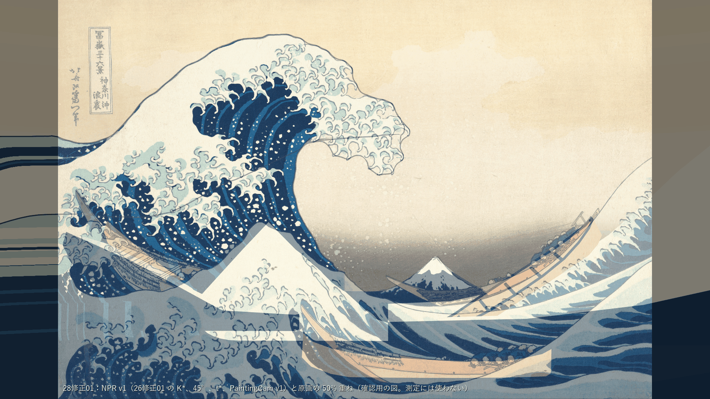
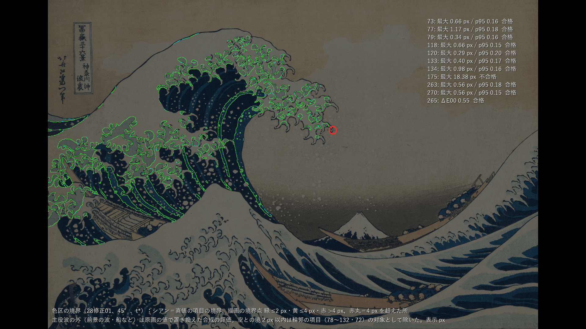
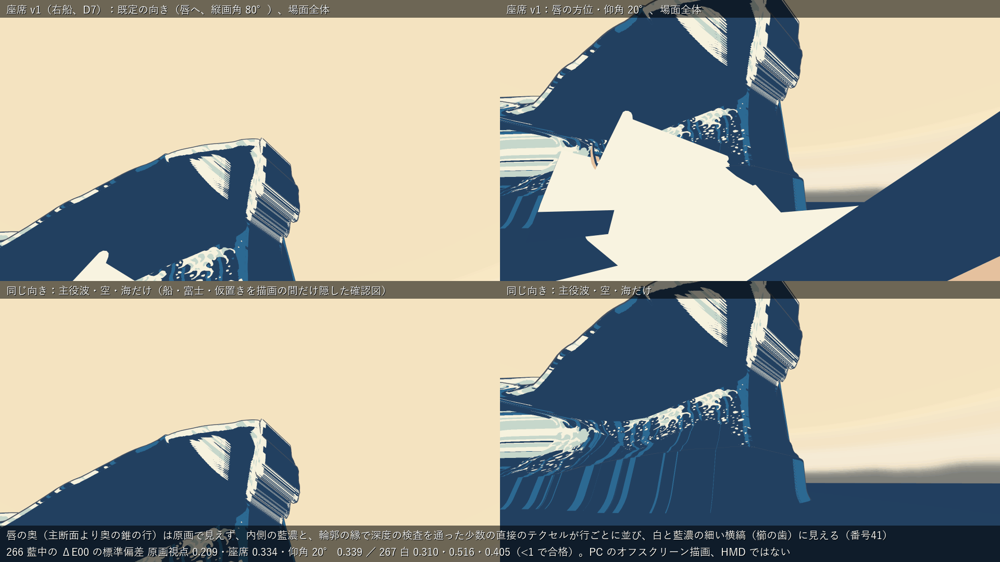
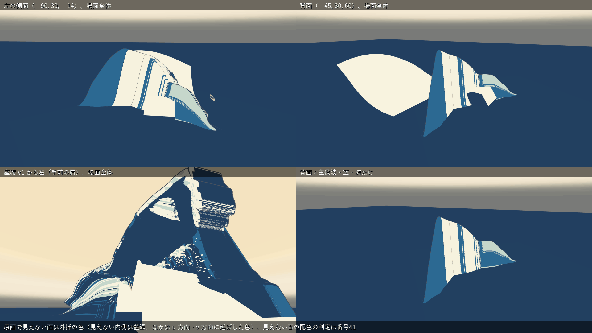
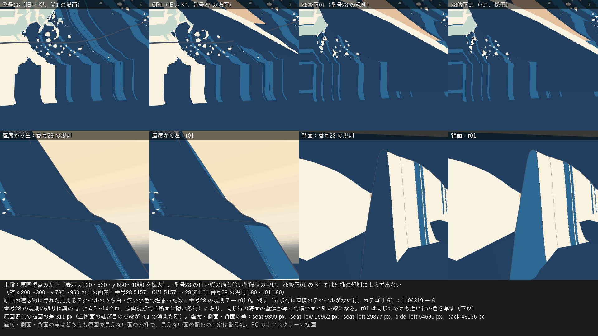

# 28修正01：新しい K\* へ色面を焼き直し、座席確定後に再判定する

日付：2026-09-26／結果：番号28 の投影ベイク（UV の符号付き距離）、NPR shader v1、外殻線 v0 を、26修正01 の K\*（45°、400×240 = 96,000 頂点）へ当て直し、27修正01 の場面（右船の置き直し・座席 v1）で原画視点・座席・側面・背面を描いた。t\* の原画視点で、色区の境界 73・77・79・118・120・133・134・263・270 は最大 0.29〜1.17 px ですべて合格、265（ΔE00 0.55）、266・267（原画視点と座席 v1 の 2 つの向きで、領域内の ΔE00 の標準偏差 0.21〜0.52、帯 0、2 視点の差 0.00）、UV の空のテクセル 0 も合格した。**175 は番号28 と同じ理由（輪郭に接する 2 つの小さな色区 M171・A073 が残らず、境界 18.38 px）で不合格**で、作業計画どおり番号28 の選択肢(1)（規則は変えず、輪郭と爪（29・33）ができた後に判定し直す。既定値・利用者未回答）で扱う。番号28 の限界 2（原画視点の左下の白い縦の筋と暗い階段状の塊）は、26修正01 の K\* では外挿の規則によらず出なくなった。外挿の規則は 3 か所を直した版（r01）を採用した。そのうち「継ぎ目」の規則は、26修正01 の奥の錐の行が作る視線と平行な帯が原画視点の白の中に点線として覗くのを消すためのもので、これがないと 267 が不合格になる。**座席 v1 から唇の奥を見ると、原画で見えない面の外挿が白と藍濃の細い横縞（櫛の歯）に見える**。直そうとした 3 つの試みは、縞が残るか、175（原画視点）・267（座席の仰角 20°）の判定を悪くしたので採らず、番号41 へ回す（下の「限界」1）。同じ既定の向きで、波峰の下の暗い面（手前側の行の唇の下側）にも白と淡い水色の楔形が見え、右の縁が櫛の歯になる。これも番号41 へ回す（「限界」2。3 つの試みでは変わらなかった）。

この「28修正01」は、作業計画（2026-09-25 版、美術優先）の番号28 の修正1回目である。CP1 の利用者の回答（D6＝45°、D7＝右船、立体造形＝26修正01）を受けた焼き直しで、計画 4.2 の「28修正01 新しいK\*へ焼き直す」にあたる。記録は番号28 の文書（Step_28_ja.md）と証拠を書き換えず、このファイルと `Docs/Evidence/ArtFirst/28R01/` に分けた。

本文の番号（28・29・33・36・39・40・41 など）は、この作業計画（美術優先）の番号で、制作設計書 §9 の番号ではない。この番号は、導師の指示で段階9 までを設計書の番号順に進めると決まる（2026-09-26）前に作った。段階9 までの実行計画の案（進行役、未コミット）の対応表では、この成果を設計36（限定色と少数の陰影段階）に数え、設計37・38 の一部にも効くとしている。本文の「番号41 へ回す」などの行き先は、その計画で整理し直す。

- 時間の上限：0.5 日（作業計画 §4.2 の 28修正01）。実績は約 45 分（2026-09-26 15:25 頃〜16:10 頃、同じ時計）。Unity の実行は 7 回（各 21〜23 秒。毎回 `Unity/Build/unity.lock` を排他的に作ってから 1 プロセスだけ動かし、終わったら消した）。最後に全体の手順（`run_af28r01.ps1`）を 2 回通した（15:55 頃と 15:58 頃）。2 回の間で、焼いたテクスチャ（r01・rule28）・カテゴリ・UV3 の表・描画と ID 画像の SHA-256 は一致した（違ったのは時刻を含む報告の JSON 4 つとシーンのファイル）。2 回の間に `af28r01_evaluate.py` の図の文字の下地と文言を直して評価だけをやり直しており、その図 8 枚は 2 回目の全体の実行の図と一致した。metrics.json だけは、焼き込みの報告の所要時間（`secondsTotal`）を写していたので一致しなかった。そこで 15:59 頃に `af28r01_evaluate.py` を直して所要時間を metrics.json へ写さないようにし、評価だけを 2 回やり直して、図 8 枚と metrics.json の SHA-256 が一致した。提出した図と metrics.json はこの評価だけのやり直しで作ったもので、焼き込みと描画は 2 回目の全体の実行のものである。独立レビューが現行の `af28r01_evaluate.py` で評価をやり直し、図 8 枚と metrics.json が bytes まで一致した。
- 修正回数：番号28 の修正1回目（CP1 の裁定による K\* の更新への焼き直し）。提出前に試したこと（下の「作る途中で試したこと」、5 回）は、提出した画像に対する修正ではないので数えていない（番号28 と同じ扱い）。コミット前の独立レビューの指摘 3 点（継ぎ目の規則が内側の藍濃の範囲を変えたこと、座席の既定の向きの白い楔、2 回の実行の書き方）は、この文書の記述だけを直した。Unity と評価はやり直しておらず、証拠と SHA-256 は変わらない。
- 対応するバックログ：73、77、79、118、120、133、134、175、263、265、266、267、270（判定）。142・143（事前検査、記録のみ。正式な判定は番号36）。178（縞の分岐、計画の損切りどおり記録のみ）。
- 利用者の裁定（CP1、2026-09-26）：D6＝45°（30°・60° は作らない）。D7＝座席は唇の下の右船（27修正01 の座席 v1、`Tools/GWContext/seat_v1.json`）。266／267 は「D7 待ち」を外し、座席 v1 で判定した。
- 証拠の種類：Unity 6000.4.3f1 Editor の batchmode による **PC のオフスクリーン描画**（RTX 3080、Direct3D11、Linear 色空間）と、その画像の numpy・OpenCV の測定。**HMD 実機の結果ではない**（VR の項目は未検証）。
- 評価器：番号23 の較正門は全項目合格で、門の後に真値は変わっていない（metrics.json の `evaluator.provisional: false`）。色区の判定は番号28 の評価の関数（`af28_evaluate.py`）をそのまま読み込んで使った。
- 参照モデル（Q5）はこの番号では使っていない。

## 見るもの

| 原画視点（Unity、t\*、外殻線あり、27修正01 の場面） | 原画 50% 重ね |
| --- | --- |
|  |  |
| **色区の境界の偏差図** | **座席 v1（D7）から：既定の向き・唇の方位の仰角 20°** |
|  |  |
| **側面・背面・座席から左** | **画面の左端の近くの外挿（番号28 の限界 2）と、外挿の規則の比較** |
|  |  |

- [UV の焼き込み（r01 と番号28 の規則、色区と埋め方）](../Evidence/ArtFirst/28R01/28R01_uv.png)
- [CP1（番号26 の K\*＋番号28 の焼き込み）との並べ図：原画視点と座席](../Evidence/ArtFirst/28R01/28R01_compare_cp1.png)（CP1 の座席は置き直す前の右船の候補で、向きも違う）
- 数値：[metrics.json](../Evidence/ArtFirst/28R01/metrics.json)（`items` が項目→値→判定、`compare_number28` が番号28 の値との比較、`silhouette_crosscheck_evaluator23` が番号23 の評価器の輪郭の値）、実行条件と SHA-256：[run.json](../Evidence/ArtFirst/28R01/run.json)

原画視点・座席・側面・背面は Unity の実描画。背景は番号27修正01 のプレハブ `AF27R01_Context.prefab`（空のドーム・海・3 隻（右船は置き直し済み）・富士・前景と斜面の仮置き・右船の水面・座席 v1 の目印）をそのまま置いた。「主役波・空・海だけ」は船・富士・仮置き・右船の水面を描画の間だけ隠した確認図で、場面の見え方ではない。重ね図・偏差図・並べ図は人が見るための図（256 色 PNG）で、測定には使っていない。

## 結果（45°、t\* = 12.0 s、PaintingCam v1、1920×1080）

| 項目 | 判定の中身 | 28修正01（最大／p95、表示 px） | 番号28（旧い K\*） | 判定 |
| --- | --- | --- | --- | --- |
| 73 内側の水色（藍中）の色区の境界 | 内側の帯 A001 の境界 | 0.66／0.16 | 0.68 | 合格 |
| 77 下側から始まる縞 | 帯の本数と順（真値 18・描画 18、18 対応、順序同じ。藍濃は 16 対 17、記録）と帯の下端の境界 | 1.17／0.18 | 1.21 | 合格 |
| 79 左側の白 | W001 の左側の内側の境界 | 0.34／0.16 | 0.35 | 合格 |
| 118 主要な縞の両側 | MS01〜06 の両側の境界 | 0.66／0.15 | 0.68 | 合格 |
| 120 唇の白と内側の水色 | 唇の泡と内側の帯の境 | 0.29／0.20 | 0.29 | 合格 |
| 133 左から上へ続く白 | 上側の境界。描画の白の 1 成分が W001 の左側の 99.2%・上側の 99.2% を覆う | 0.40／0.17 | 0.39 | 合格 |
| 134 白帯 | 帯の内側の境界。幅の順は真値 狭 123→広 208→狭 168、描画 狭 124→広 208→狭 167 px（位置の差 0、幅の差の中央値 0.20 px） | 0.98／0.16 | 0.68 | 合格 |
| 175 白の中の色区が全部残る | 198 のうち 196 が残る。残らないのは M171（淡い水色 12.7 px²、唇先 (1092, 427)）と A073（藍中 18.2 px²、外周 78 の縁 (213, 388)）で、番号28 と同じ。境界は淡い水色 18.38（M171 の所）・藍中 2.41・藍濃 0.31。残らない 2 つを除くと 2.41（記録） | 18.38 | 18.38 | **不合格**（選択肢(1)で保留） |
| 263 内側から下方へ続く水色 | 内側の帯の下部の境界。描画の帯の成分が A001 の 95.8% を覆い、真値の上端・下端から 0.46・0.32 px | 0.56／0.18 | 0.40 | 合格 |
| 270 白と水色の境 | 既定（白と藍中の境）。別案の白と淡い水色の境は 0.66 px（記録） | 0.56／0.15 | 0.56 | 合格 |
| 265 内側の水色の表示色 | 目標 Lab (41.92, −4.88, −29.43)、描画 (42.38, −5.36, −28.71) | ΔE00 0.55 | 0.55 | 合格 |
| 266 水色（藍中）の平塗り | 領域内の ΔE00 の標準偏差：原画視点 0.21・座席（既定の向き）0.33・座席（仰角 20°）0.34。1 ΔE00 を超える 20 px 以上の帯 0・0・0。座席と原画視点の中央値の差 0.00・0.00（淡い水色は 0.31・0.11・0.05、記録） | — | 旧い座席で 0.57・0.52 | 合格 |
| 267 白の平塗り | 同 0.31・0.52・0.41、帯 0・0・0、差 0.00・0.00 | — | 旧い座席で 0.24・0.08 | 合格 |
| UV に空のテクセルがない | 外挿の後の未設定 0、UV で描かれないテクセル 0（正の色区がないテクセル 139、最大の色区で色は決まる） | — | 0 | 合格 |
| 142 左の外周線（事前検査） | 線がある割合 1.00、線の中心のずれ 最大 3.52・p95 2.56 px、線幅の中央値 3.25 px（原画 2.78・3.34） | — | 4.14・2.64 | 記録のみ |
| 143 上から船側の端の外周線（事前検査） | 線がある割合 1.00、中心のずれ 最大 2.31・p95 1.93 px、線幅 3.00 px（原画 2.87・2.29） | — | 3.02・2.19 | 記録のみ |
| 178 縞の枝分かれ | 番号28 第A部の候補 23 か所。判定は延期（計画の損切り） | — | — | 記録のみ |

- **座席 v1**：目 (3.9544, 1.8323, −15.0308)、既定の向きの注視点 (0.655, 12.0, −11.155)、縦画角 80°（seat_v1.json）。もう 1 つの向きは同じ JSON の「唇の方位・仰角 20°」の注視点 (−2.1368, 5.2525, −7.8754)。プレハブの座席 v1 の目印と JSON の目の差は 0.07 mm（Unity で測った）。
- **輪郭の照合（記録）**：この番号の色区 ID 画像を番号23 の評価器（ID モード、包絡版）に通すと、78 1.64、130 1.95、131 1.80、132 1.57、72 最大 5.78・p95 1.72 px で、26修正01 の値と小数 4 桁まで一致した（形は 26修正01 のまま）。71 は主役波だけの描画なので空域の下辺が開き 126 px（記録、描き方が違う）。外殻線ありでは外周の外縁が 78 3.60、130 2.14、131 2.32、132 2.21、72 2.91 px（記録）。
- **焼き込み用 UV（UV3）**：26修正01 の K\*（400 列 × 240 行）に、番号28 と同じ式で列ごと・行ごとの引き伸ばしを作り直した。原画視点で 1 テクセルあたり最大 0.60 px（u′）・0.45 px（v′）（番号28 は 0.51・0.59）。
- **無照明の調色板**：描画の色区の中央値と調色板の ΔE00 は 0.15〜0.22（Lab → 8bit の丸めの分）で、原画視点・座席の 2 つの向きで同じ。ID 表示で決めた 6 色以外の画素 0。
- **構造上の一致**：t\* の原画視点では、見えるテクセルは自分の投影先の原画の値を持つので、境界と色は構造上ほぼ一致する。合格は完成を意味しない（番号28 と同じ注意）。
- **番号28 からの変化**：134 の最大が 0.68 → 0.98 px、263 が 0.40 → 0.56 px に増えた（どちらも 4 px の 1/4 以下）。K\* の形（26修正01 で手前の肩の行と主断面の近くの行が変わった）による。

## 外挿の規則（r01）

番号28 の規則（`af28_params.json` の `fill_ja` の 1〜6）に 3 つの変更を加えた版を採用した。直接のテクセル（原画視点で見えて原画が有効な所）・海面の藍濃・画面外の v 方向の規則は変えていない（カテゴリの数も番号28 の規則と同じ）。**内側の藍濃（規則 2）は、規則の文は変えていないが、実際に藍濃になる範囲は狭くなった。** 下の 2′ をすべての列で規則 2 より先に当てるので、同じ列で直接のテクセルから 3 行以内の隠れたテクセルは、見えない内側でも直接のテクセルの値になる。番号28 の規則で内側の藍濃だったテクセル 2,961,844 のうち 49,191（約 1.7%。列 j_tip〜j_facebot の中）が 2′ に替わり、その色区は白 28,534・淡い水色 3,455・藍中 6,016・藍濃 11,186 である。2′ の残りの 76,940 テクセルは、番号28 の規則では u 方向で埋めていた所。つまり r01 は、継ぎ目の帯（3 行）の中では「見えない内側は藍濃」という計画の規則からすでに外れている（数は `af28r01_uvcat_a45.bin` と `af28r01_uvcat_a45_rule28.bin` の比較）。規則の文は [af28r01_params.json](../../Tools/PaintingTruth/colour/af28r01_params.json) の `fill_rule_r01_ja`。その 1 行目の「内側の藍濃…の規則は変えない」は規則の文のことで、2 行目に「内側の藍濃より先」とある。実際の範囲は上のとおりである（この JSON は metrics.json・run.json に写るので、SHA-256 を保つため書き換えていない）。比較のため、同じ K\* を番号28 の規則のまま（rule28）でも焼き、同じ視点で描いた。

1. **2′ 継ぎ目**（カテゴリ 12、126,131 テクセル）：K\* 自身に隠れた画面内のテクセルのうち、同じ列で直接のテクセルから 3 行以内のものに、その直接のテクセルの値（距離の値ごと）を写す。26修正01 の奥の錐の行は PaintingCam の投影中心のまわりに主断面を拡大したもので、原画視点では主断面と同じ射線の上に並ぶ。そのため主断面と次の行の間の帯が視線と平行になり、描画でその帯が 1 画素ずつ覗いて、白の中に藍濃の点線が出た（最初の描画。267 の原画視点で 24 px の帯 1 つ、不合格）。この規則で帯の色を主断面の色にそろえ、点線はほぼ消えた（白の領域で 1 ΔE00 を超える画素 190 → 127。番号28 は 111）。
2. **3′ 原画の遮蔽物の下で同じ行に藍がない所**（カテゴリ 10、504 テクセル）：番号28 は退路で同じ行の最も近い直接のテクセル（泡の白のこともある）を写し、画面の左端の近くで白い縦の筋になった。r01 は同じ列で最も近い行の藍を写す（縞を v 方向に延ばす）。
3. **6′ 残り**（カテゴリ 11、1,103,816 テクセル）：画面内だが同じ行に直接のテクセルがない行。番号28 は同じ行で最も近い値（多くは海面の藍濃）を写した。r01 は先に同じ列で最も近い行の値を写す。

**番号28 の限界 2 の確かめ**：番号28 で白い縦の筋と暗い階段状の塊が出た原画視点の左下（箱 x 200〜300・y 780〜960）の白の画素は、番号28 5,157・CP1 5,157 → 28修正01 180（rule28 も r01 も同じ）。26修正01 の K\* では手前の肩の行の見える所に藍の直接のテクセルがあるので、規則によらず出なくなった。原画の遮蔽物に隠れた見えるテクセルのうち白・淡い水色で埋まった数は rule28 7 → r01 0。番号28 の規則の残り（カテゴリ 6）1,104,319 テクセルは、すべて奥の尾の行（c 4.5〜14.2 m、原画視点で主断面に隠れる行）にあり、海面の藍濃が写って暗い面と細い線になる。r01 ではそこが同じ列で最も近い行の色（藍中・白など）になる（[左端の図](../Evidence/ArtFirst/28R01/28R01_leftedge.png)の下段）。

rule28 と r01 の描画の差は、原画視点 311 px（主断面の継ぎ目の点線が消えた所）、座席の既定の向き 9,899 px、仰角 20° 15,962 px、座席から左 29,877 px、左の側面 54,695 px、背面 46,136 px。原画視点以外の差は、原画で見えない面の外挿の違いである。見えない面の配色の判定は番号41 で行う。

## 作る途中で試したこと（納品前の試行。修正回数には数えない）

1. **継ぎ目の点線（上の 1）**：最初の描画では 3′・6′ だけを入れた。267 が原画視点で帯 1 つ（(662〜680, 465〜473) の 24 px）で不合格になり、原因は主断面の継ぎ目の点線だった。2′ を加えて合格した。
2. **座席から見た唇の奥の横縞（櫛の歯）**：座席 v1 の既定の向きで、唇の奥（主断面より奥の錐の行）に白と藍濃の細い横縞が見える。錐の行は、直接のテクセルがテクセルの行あたり約 80（4,096 のうち。手前の肩の行は 1,000 以上）しかない。その直接のテクセルは、主断面の輪郭の画素の縁で深度の検査を通ったものである。この直接のテクセルと、内側の藍濃・u 方向の色が行ごとに入れ替わって縞になる。次の 3 つを試し、どれも採らなかった。
   - まばらな行（直接が画面内の 1 割未満で、過半が K\* 自身に隠れた行）の u 方向を、同じ列のまばらでない行の値に替えた → 縞は変わらなかった（縞の元は u 方向ではなく、直接のテクセルと内側の藍濃の並びだった）。
   - さらにまばらな行の直接のテクセルを隠れた扱いにした → 縞はほぼ消えたが、原画視点の輪郭の縁に藍濃の点が出て、175 の藍濃の境界が 74.2 px になった（原画視点を優先するので採らない）。
   - 代わりに、まばらな行では内側の藍濃もやめて同じ列の主断面側の色を写した → 縞は消え、奥の唇は白、内壁は藍中の平らな面になった。一方、座席の仰角 20° で 267 の帯が 1 つ出て不合格になった。また、錐の行の見えない内側を藍濃にしないので、計画の規則（見えない内側は藍濃）から外れる範囲が広がる（採用した r01 も、2′ の継ぎ目の帯 3 行の中ではすでに外れている。上の「外挿の規則」）。唇の下側の白い楔（「限界」2）は、この試行を含む 3 つの試行のどれでも変わらなかった（座席の既定の向きの描画で、楔の箱の中の最終の描画との差 0 px）。
   3 つの試行の画像は `Unity/Build/ArtFirst/28修正01/trial3/`〜`trial5/`（Git 対象外、SHA-256 は run.json）に残した。採用した規則のコードには含めていない。

## 限界と保留

1. **座席から見た唇の奥の横縞（櫛の歯）**：上の 2。原画で見えない面の外挿なので番号41（見えない面の配色、209 色の帯切れ 0 など）で扱う。座席の既定の向き（唇へ）でいちばん目立つので、41 の前に方針を決めてもよい（下の「利用者に決めてほしいこと」）。
2. **座席の既定の向きで、唇の下側に白い楔（右の縁が櫛の歯）**：座席 v1 の既定の向きで、波峰の下の暗い面に白と淡い水色の楔形が見え、右の縁が櫛の歯になっている。場所は、元の描画 `af28r01_seat.png`（Git 対象外）で x 約 720〜900・y 約 580〜780、[座席の図](../Evidence/ArtFirst/28R01/28R01_seat.png)の左上の枠で x 約 360〜450・y 約 290〜390。レビューの後に、K\* を座席のカメラで numpy に投影し直し、描画の各画素がどのテクセルから来たかを調べた（描画の色区 ID との一致 99.1%。Unity は動かしていない）。その結果、この箱は手前側の行（行 129〜142。主断面は行 159）の唇の下側（列 205〜256。唇先端 j_tip 200 と角 j_corner 314 の間）だった。白・淡い水色の 14,234 px の内訳は、直接のテクセル（原画視点で見えて、原画の白・淡い水色をそのまま写した所）9,547、同じ行の u 方向 2,442、2′ の継ぎ目の帯 2,245。藍濃の 21,766 px のうち 21,476 は内側の藍濃（規則 2）である。各行で、原画視点の深度の検査を通る列（直接）と隠れる列（内側の藍濃）が並び、その境の列が行ごとにずれるので、右の縁が櫛の歯になる。番号28 の規則では、同じ所が白の中に藍濃の点線状の細い筋が入った形だった。r01 では藍濃から白・淡い水色に変わった画素が 2,305 px（白 1,517・淡い水色 788。描画の比較）あり、投影で調べると変わった所はすべて 2′ のテクセルだった。それでも右の縁の櫛の歯は残った。上の「作る途中で試したこと」2 の 3 つの試行（trial3〜5）は、この箱の中で最終の描画との差が 0 px で、下の「利用者に決めてほしいこと」の (b) でも消えない。原画で見えない面との境の外挿なので、番号41 で扱う。
   なお、266・267 は、色区（原画視点は真値、座席は描画の色区 ID）を 3 px 縮めた範囲の中だけで、色のばらつき（ΔE00）を測る。色区が行ごとや数 px ごとに入れ替わる縞・櫛の歯は、ほかの色区の画素がこの範囲に入らないので、この項目では測れない。細い縞は縮めると範囲から消える。座席の既定の向きの色区 ID 画像で数えると、唇の奥の箱（x 940〜1160・y 540〜940）の白は 18,736 px が縮めた後 6,659 px に、楔の箱の白は 11,112 px が 5,706 px になる。**266・267 の「合格」は、上の 1 の横縞とこの楔の櫛の歯がなくなったことを意味しない。**
3. **外殻線 v0 の原画にない線**：26修正01 の主断面の折れ（波峰線が約 50° 折れる）に沿って、原画視点で画面の左端から唇の付け根まで外殻線が横切る。唇の上にも線が出る（[原画視点](../Evidence/ArtFirst/28R01/28R01_painting.png)）。描画の空から 4 px より内側の線の画素は 3,555 px（番号28 の旧い K\* は 3,957 px、記録）。線マスクは番号36。
4. **175 の不合格**：番号28 と同じ 2 つの色区が、形の側の理由（輪郭に接する爪の先の淡い水色と、外周の線の縁の藍中）で残らない。作業計画の既定どおり番号28 の選択肢(1)（規則は変えず、輪郭と爪（番号29・33）ができた後に判定し直す）で扱う（既定値・利用者未回答）。
5. **奥の尾の色**：r01 では、原画視点で主断面に隠れる奥の尾（c 4.5〜14.2 m、26修正01 の「ひれ」）が、同じ列で最も近い行の色（藍中・白）になる。番号28 の規則では海面と同じ藍濃だった。どちらも外挿で、判定は番号41。
6. **場面の仮置き**：前景の波・右の斜面は番号27・27修正01 の仮置きのまま（番号39・40 で置き換える）。座席の仰角 20° の向きでは、右船の水面と右の斜面の仮置き（白の平塗り）が画面の下半分を覆う。色区の判定は、主役波の外を原画の値に置き換えた合成で行った（番号28 と同じ）。
7. **72 の最大 5.78 px**：番号26・26修正01 と同じ真値の小さな形の所（p95 1.72 px。判定は 26修正01）。
8. **他の番号の場面**：CP1 の合成（`AFCP1Composite`）と 27修正01・26修正01 のシーンは、旧い焼き込みか仮のクレイのままで、この番号では変えていない（Unity の保護ファイル 23 個の SHA-256 が前後で一致）。番号30 の keypose は、この番号の UV3 の表（`af28r01_uvwarp_a45.json`）と焼き込み（`af28r01_uvsdf_a45.bin`）を使える。どちらも格子の添字だけで決まる。
9. **立体視・HMD**：NPR v1・外殻線 v0・焼き込みのシェーダーは番号28 のものを変えずに使った（SHA-256 が番号28 の記録と一致）。立体視のシェーダーバリアントのコンパイルの確認は番号28 の記録のままで、この番号ではやり直していない。両眼の描画と HMD 実機は未検証（VR の項目はすべて未検証）。
10. **シーンのファイル**：`AF28R01_NPR.unity` は実行のたびに空のシーンから作り直すので、実行ごとに SHA-256 が変わる（番号28 と同じ扱い）。最後の実行の SHA-256（04fffd48…c3cc）を run.json に記録した。

## 利用者に決めてほしいこと

- **175**：番号28 と同じ 3 択。既定は (1)（このまま不合格とし、輪郭と爪（29・33）の後に判定し直す。既定値・利用者未回答）。
- **座席から見た唇の奥（原画で見えない面）の色**（番号41 の前に決めてよい）：(a) 今のまま（見えない内側は、継ぎ目の帯 3 行を除いて藍濃。櫛の歯の横縞と唇の下側の白い楔が残る。既定値・利用者未回答）。(b) 奥の錐の行は主断面の色を奥へ延ばす（唇の奥は白の平らな面になり縞は消える。見えない内側を藍濃にする計画の規則から、錐の行でも外れることになる。採用した r01 も、2′ の継ぎ目の帯 3 行の中ではすでに外れている（内側の藍濃だった 49,191 テクセル。「外挿の規則」）。座席の仰角 20° の 267 の判定をやり直す必要がある。唇の下側の白い楔（「限界」2）は (b) でも消えない）。(c) 番号41 で見えない面の配色全体を決めるときにまとめて扱う。

## 再現方法と生成物

リポジトリの根で次を実行する（Python 3.10.6、numpy 2.2.6、OpenCV 4.12.0、Pillow 12.0.0、Unity 6000.4.3f1）。全体で約 1 分（入力 2 秒、Unity は起動を含めて約 22 秒、評価約 30 秒）。前提として、番号28 第A部の中間物（`Unity/Build/ArtFirst/28/partA/stage_a.npz`、SHA-256 を第A部の記録と照合）と、26修正01 の K\*（`Unity/Build/ArtFirst/26修正01/kstar/kstar_a45.gwb`、SHA-256 e9bc3572…cd26 を照合）が要る。比較の図には番号28 と CP1 の描画（`Unity/Build/ArtFirst/28/render/a45/`、`Unity/Build/ArtFirst/CP1/render/a45/`）を読む。

```
powershell -NoProfile -ExecutionPolicy Bypass -File Tools/PaintingTruth/colour/run_af28r01.ps1
```

中身は次の 3 段である。Unity は `Unity/Build/unity.lock` を排他的に作ってから 1 プロセスだけ動かし、終わったら（失敗しても）消す。ロックがあれば 60 秒ごとに待ち、60 分より古いロックは消さずに止めて報告する。1 回 30 分で止める。

```
py -3.10 Tools/PaintingTruth/colour/af28r01_bake_input.py
E:/6000.4.3f1/Editor/Unity.exe -batchmode -projectPath G:/Unity/GreatWave_2026_Fresh/Unity -executeMethod GreatWave.ArtFirst.EditorTools.AF28R01NprScene.BakeBuildAndRender -logFile Unity/Build/ArtFirst/28修正01/unity_af28r01.log -quit
py -3.10 Tools/PaintingTruth/colour/af28r01_evaluate.py
```

- `af28r01_bake_input.py` は番号28 の `af28_bake_input.py` を読み込み、固定値のファイル・K\* の置き場所・出力先だけを差し替えて実行する（番号28 のファイルは変えない）。原画側の入力（`paint_sdf_rgba16f.bin`・`paint_valid_r8.bin`）の SHA-256 は番号28 の記録と一致した。
- `AF28R01ProjectionBaker.cs` は番号28 の `AF28ProjectionBaker.cs` と同じ手順で、`AF28_Bake.shader` を読むだけで使う。違いは入出力の置き場所と外挿の規則（r01 と rule28 を選べる）だけ。`AF28R01NprScene.cs` は 26修正01 と同じく空のシーンに 27修正01 のプレハブを完全に展開し、K\* に番号28 のマテリアル（`AF28_NPR.mat`・`AF28_Outline.mat`）を参照だけで付ける（調色板と線の値が焼き込みの入力と同じことを確かめ、違えば止める）。
- Git に入れるもの：`Tools/PaintingTruth/colour/`（af28r01_bake_input.py、af28r01_evaluate.py、af28r01_params.json、run_af28r01.ps1）、`Unity/Assets/GreatWave/ArtFirst/Editor/AF28R01ProjectionBaker.cs`・`AF28R01NprScene.cs`、`Unity/Assets/GreatWave/Scenes/Tests/AF28R01_NPR.unity`（それぞれ .meta も）、証拠 `Docs/Evidence/ArtFirst/28R01/`（図 8 枚、metrics.json、run.json、約 2.9 MB）、この文書。
- Git に入れないもの：`Unity/Build/ArtFirst/28修正01/`（既存の `/Unity/Build/` の規則で対象外、約 257 MB）。焼いたテクスチャ（r01 と rule28、各 64 MB。r01 の SHA-256 は 305d1777…62bd）、カテゴリ、UV3 の表、原画側の入力（番号28 と同じ bytes）、描画と ID 画像、試行の画像（trial1〜5）、ログ。SHA-256 は run.json の `not_committed_sha256`。
- 記録した SHA-256 と Git のブロブを一致させるため、`.gitattributes` に `/Unity/Assets/GreatWave/Scenes/Tests/AF28R01_NPR.unity* -text` を加える必要がある（進行役）。`Tools/PaintingTruth/**`・`Docs/Evidence/ArtFirst/**`・`Unity/Assets/GreatWave/ArtFirst/**` は既存の規則の対象。
- 旧試作の禁止場所、`G:\research\model`、732e198 より前の履歴には触れていない。Houdini は使っていない。番号28・26修正01・27修正01・CP1 のファイルは読むだけで変えていない。
