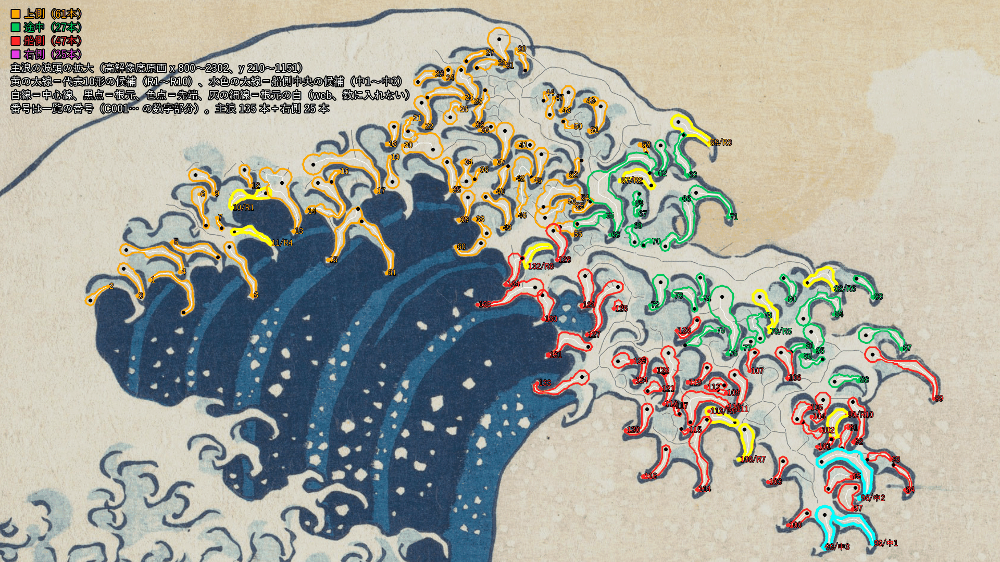

# 29（草稿）：原画から爪の一覧の草稿を作る

日付：2026-09-26／結果：Met原画（高解像度 DP130155）だけから、爪の一覧の草稿（draft1）を作った。主浪の爪は135本（上側61・途中27・船側47）、右側の波の爪は25本で、合わせて160本。一覧だけから描き直した和集合と原画の「爪の白」のIoUは、主浪の範囲で0.877だった。分母の「爪の白」は、主浪の白から波頭の平らな白（半径45 pxの開きで残る厚い白で、主浪の白の34%）を除いたもので、分子は指・幹と、爪の数に入れない根元の白（web）を含む。指と幹だけなら0.695、指だけなら0.454。平らな白を除かない主浪の白の全体と比べると、指・幹・根元の白で0.601、指と幹だけで0.473になる（コミット前の独立レビューが計算した値、記録のみ）。代表10形の候補と船側中央の爪の候補3本を自動で選び、長短の順序も出力した。**これはCP1に渡す草稿で、どのバックログ項目も合否を判定していない。** 列の境目、代表10形、船側中央の爪は、利用者がCP2で確かめる（D8）。完成版は番号29の続きとして10/4までに作る。

この「29」は2026-09-25の新作業計画の番号で、旧設計書の29とは別である。

- 時間の上限：番号29は2日（計画4.2、9/29〜10/4）。この草稿の枠は1日。使った時間は約1.5時間（2026-09-26 02:59〜04:30頃。作業用フォルダーのファイル時刻による。下の途中版 draft0 を含む）。
- 対応するバックログ：95〜98、122〜129、136〜139（計画の29）の前提。右側の波の爪は240〜256の前提として同じ一覧に入れた。144・145・261は記録だけを残す。判定は番号33（主浪の爪の終態）と40（右側の波）で行う。
- 証拠の種類：Met原画の numpy/OpenCV の計算と、その重ね図だけ。Unity、Blender、Houdiniは使っていない。参照モデル（Q5、`wave_repair_zbrush2.obj`）は開いていない（計画 D20：爪はMet原画だけから作る）。

## 見るもの

| 図 | 内容 |
| --- | --- |
| [29_claws_overlay_crest.png](../Evidence/ArtFirst/29/29_claws_overlay_crest.png) | 主浪の波頭全体に番号を付けた図。**CP2で中央の爪を指定し、代表10形を確かめるときはこの図を使う** |
| [29_claws_zoom_boatside.png](../Evidence/ArtFirst/29/29_claws_zoom_boatside.png)・[middle](../Evidence/ArtFirst/29/29_claws_zoom_middle.png)・[upper](../Evidence/ArtFirst/29/29_claws_zoom_upper.png)・[right](../Evidence/ArtFirst/29/29_claws_zoom_right.png) | 列ごとの拡大（船側・途中・上側・右側）。番号の文字を大きくした |
| [29_claws_overlay_display.png](../Evidence/ArtFirst/29/29_claws_overlay_display.png) | 原画視点（1920×1080、番号23の写像）に全部の爪を重ねた図 |
| [29_representative_candidates.png](../Evidence/ArtFirst/29/29_representative_candidates.png) | 代表10形の候補（R1〜R10）と船側中央の候補3本の中心線・関節・節の長さ比・曲がり角 |
| [29_union_iou.png](../Evidence/ArtFirst/29/29_union_iou.png) | 一覧から描き直した和集合と原画の爪の白の一致（白＝指で一致、明るい灰＝幹・根元の白で一致、赤＝描き直しだけ、水色＝原画の爪の白だけ、灰＝波頭の平らな白で IoU の分母から除いた所） |
| [29_skeleton.png](../Evidence/ArtFirst/29/29_skeleton.png) | 白のマスクと自作 Zhang–Suen の骨格（とげの除去の前後） |



図の色は、上側＝橙、途中＝緑、船側＝赤、右側＝紫。白線が中心線、黒点が根元、色点が先端、灰の細線が根元の白（web、爪の数に入れない）。図は人が見るための256色PNGで、測定には使っていない。

## 作り方（[af29_claw_inventory.py](../../Tools/PaintingTruth/claws29/af29_claw_inventory.py)、条件は [af29_params.json](../../Tools/PaintingTruth/claws29/af29_params.json)）

1. **範囲**：主浪の波頭の泡（高解像度 px で x 820〜2600、y 0〜1450 の多角形）と、右側の波の白の縁（右の船の船底の線より下、手前の波の白い帯より上の帯）。どちらも agent が格子付きの拡大図を見て決めた（利用者未確認）。
2. **白のマスク**：空は番号23の真値v0.2と同じ手順で作り直した（保存済みの `sky_claws_cov.png` との差は0）。色は番号23の5色のLloyd中心で分け、白（white）で、船の黄土（`extraction.ochre`）でない画素を使った。右側の範囲だけは白と水色を合わせた。右側の爪は白い斜面から藍の中へ下向きに出る指で、多くが水色で塗られ、白は根元側だけにあるからである（白だけで試すと、斜面の白の縁を爪と誤った）。400 px未満の白の島（飛沫）は除いた。
3. **骨格化**：numpyで自作した Zhang–Suen（[af29_skeleton.py](../../Tools/PaintingTruth/claws29/af29_skeleton.py)）。その後、単純点で近傍数3以上の画素だけを1画素ずつ除き（`thin_final`）、太さ2の塊と偽の分岐を消した。
4. **枝の分割**：とげ（分岐の内接円からの突き出しが max(6 px, 1.5×半幅) 未満の末端の枝）を除き、分岐でなめらかに続く枝をストロークにまとめた（折れ角40°以下の組を貪欲に対にする）。先端（端点）を持つストロークを爪とした。根元は、分岐の内接円の縁、厚い白（波頭の平らな白）に入る点、幅が急に3倍を超える点のうち、先端に近い点にした。長さ14 px未満、範囲の縁で切れた先端は除いた。
5. **根元の白（web）**：どの爪のストロークにも半分以上含まれない枝（先端の見えない白い舌、爪の間をつなぐ白）は、爪の数に入れず、最も近い爪の `base_web` として記録した。
6. **列**：主浪の爪は、先端から番号23の包絡版の外周（131→132→72）への最近点の弧長 s で分けた（s=0は波頂）。s<520 が上側、520〜1150 が途中、1150以上が船側。内壁（s>2150）は使わず、先端の x が1480未満の爪（波頂の左で藍の面の上縁に横へ並ぶ爪）は上側にした。右側の範囲の爪は右側とした。境目の値は agent が拡大図を見て決めた暫定値である。
7. **記録した量**（爪ごと）：番号（C001〜）、列と列の中の番号、根元と先端の座標（高解像度pxと表示px）、長さ、根元幅（弧長8%）・中央幅（50%）・先端付近の幅（85%）、先端の向き、空への距離（外輪郭に出ているか）、藍の面へ垂れるか、遮蔽の順序（仮）、隣の爪との隙間（根元どうし・先端どうし）、輪郭の多角形、中心線と幅、4〜6の関節、節の長さ比、曲がり角、幹と根元の白。
8. **代表10形の候補**：主浪の3列の爪のうち、長さが40%分位以上で、長さが中央幅の2.5倍以上（指の形）の77本を母集団にし、列ごとに本数を割り当て（上側4・途中2・船側4）、k-medoidsで選んだ（乱数なし）。
9. **船側中央の候補**：船側の爪のうち、外輪郭に出ていて、根元→先端が下向き（30〜150°）で、長さが船側の中央値以上の10本を s の順に並べ、中央の順位の爪を第一候補、その前後を第二・第三候補とした。

### agent の目視による修正

6か所の拡大図（上の房の右肩、波頂、唇の下面、右側2か所、左の藍の面）を見て、次の修正を `af29_params.json` の `corrections` に入れた。全数の目視確認はまだしていない。

| 修正 | 対象（高解像度 px） | 理由 |
| --- | --- | --- |
| 除外 | 先端 (2040, 1000) | 唇の下の爪群の掌の中で骨格が途切れた所。先端に当たる鉤も藍の線もない |
| 除外 | 先端 (1769, 457) | 上の房の右肩の鉤と鉤の間の厚い白（根元幅43 px）。指の形がない |
| 除外 | 先端 (1807, 924) | 唇の下面で3本の指をつなぐ掌の白が X 字のストロークになったもの |
| 根元の付け替え | C031、C059、C129 | ストロークが厚い白や隣の爪の白へ続いていたので、鉤の部分だけを爪にした |

## 結果（[metrics.json](../Evidence/ArtFirst/29/metrics.json)、一覧は [claw_inventory_draft.json](../../Tools/PaintingTruth/claws29/claw_inventory_draft.json)）

| 項目 | 完成版の目標 | 草稿の値 | 判定 |
| --- | --- | --- | --- |
| 一覧から描き直した爪の和集合と原画の「爪の白」のIoU | ≥0.85（分母・分子の定義はCP2で確認） | 主浪 0.877（分母は主浪の白 357,782 px から波頭の平らな白 123,167 px を除いた 234,615 px、分子は指・幹・根元の白（web））。指と幹だけ 0.695、指だけ 0.454、輪郭の多角形の和 0.472。平らな白を除かない白の全体に対しては 0.601（指と幹だけ 0.473。独立レビューの値） | 記録のみ |
| 爪の数（backlog 139「約150本」） | 150±15 | 主浪135本（上側61・途中27・船側47）。右側25本、合計160本 | 記録のみ |
| 代表10形の長短の順序を自動で出力 | 出力できる | 長い順に C010, C079, C082, C011, C057, C059, C132, C090, C108, C113（根元幅・中央幅の順も出力） | 記録のみ（CP2で確認） |
| 船側中央の爪の候補 | 利用者がCP2で指定 | C098（B10）、C096（B08）、C099（B11） | 記録のみ |
| 自作 Zhang–Suen の確認 | 合成図形と原画の白で位相が同じ、太さ2の残り0 | 長方形→中央の1本線、穴あき円板・階段・2×2の塊の分岐とも合格。原画の白：主浪 成分11/11・背景22/22、右側 1/1・40/40（とげの除去の後も同じ）、太さ2の残り0 | 合格 |
| 空マスクが番号23の真値v0.2と同じか | 差0 | 0 | 合格 |

- IoUの細目（高解像度px）：主浪の範囲の「爪の白」（白 357,782 px から、半径45 pxの開きで残る平らな白 123,167 px を除いた 234,615 px）に対し、再現率0.938、適合率0.931。平らな白の多角形を足して白の全体と比べると0.916。骨格の全体の内接円の和（骨格で表せる白の上限の目安）は0.947。右側の範囲（白と水色）は0.849（指と幹だけ0.439、指だけ0.379）。2つの範囲の合計は0.872、表示解像度（1920×1080）では0.869。
- **IoUの主の値は、分母から波頭の平らな白を除き、分子に爪の数に入れない根元の白（web、211本。とげの除去の後に残った骨格の枝すべて）を含む。** このため0.877は作り方の上でも高くなりやすい（骨格の内接円の和の上限0.947）。計画の「爪の和集合」を指と幹だけと読むと0.695、平らな白も分母に含めると0.601（指と幹だけ0.473。コミット前の独立レビューが計算した値で、この番号の生成器は出力していない。記録のみ）で、どれも0.85に届かない。完成版でどの定義で判定するか（分子に web を含めるか、分母から平らな白を除くか）は、利用者の確認事項にした。
- 爪の長さ（表示px）：主浪の中央値21.2（5.8〜97.1）。10.5表示px未満（表示の4 pxの約2.5倍）の短い爪が20本あり、白の切れ端が混じっている可能性がある。右側の中央値は17.8（6.0〜53.7）。
- 外輪郭に出ている爪は上側1・途中6・船側14・右側0本で、残りは泡の内側の爪である。藍の面へ垂れる爪は上側7・船側6・右側18本。
- 除いた候補は66本（短い56、範囲の縁7、目視3）。
- 船側中央の第一候補C098は、根元幅7.9 pxが先端付近の幅8.4 pxより狭く、backlog 95「根元が先より広い」に当たらない。第二候補C096（15.9/9.5 px）と第三候補C099（23.0/10.6 px）は当たる。

## 途中版 draft0 からの変更

同じ番号29の先の実行（この草稿の前半、未コミット）で作った draft0 は、爪118本、IoU（指と幹）0.574だった。draft1で次を変えた。

- 「右側」を、唇の右端ではなく、backlog 240〜256の右側の波（右の船の後ろ）の爪にした。計画4.2の29の列（上側/途中/船側/右側）とバックログの B020（上側・途中・船側）と B055（右側の波）の対応による。draft0の5つ目の分類「藍面側」はやめ、藍の面へ垂れる爪は列を変えずに印（`over_indigo`）を付けた。
- 右側の範囲を加え、白と水色を合わせて抽出した。船の黄土を白から除いた。
- 骨格の修正：Zhang–Suen の後に残る太さ2の塊と偽の分岐を `thin_final` で除いた。draft0では、とげの除去で骨格の成分が11から17に増えていた（分岐の画素の斜め脇を線が通り抜ける所で、途中に分岐が付いた枝をとげとして消していた）。途中に別の分岐が付いた枝と、端が2つの分岐に接する枝はとげとして扱わないようにし、1つの分岐で最も長い末端の枝は残すようにした。除去の後も成分と穴の数が白と同じになった。
- 根元の白（web）を一覧に加え、描き直しに含めた。
- 厚い白（body）を、範囲で切る前の白から決めるようにした（範囲の縁で細く切れた白が爪の白に数えられていた）。
- draft0の目視修正のうち、根元の付け替え1件（先端 (2108, 685)）は、骨格の修正でストロークが別の舌へ続かなくなったので外した。

## 確かめたこと

- 同じコマンドを2回続けて実行し、一覧・図9枚・metrics.jsonのSHA-256がすべて一致した（run.jsonは生成時刻を含むので除く）。
- SHA-256を記録したファイル（`Tools/PaintingTruth/claws29/` の4ファイルと `Docs/Evidence/ArtFirst/29/` の10ファイル。run.json 自身は含めない）は、既存の `.gitattributes` の `-text` の対象で、`git hash-object --path` と `--no-filters` の値が一致した。
- 空マスクは番号23の保存済みの被覆率と一致した（差0）。原画のSHA-256は `painting_truth.json` の凍結値と照合した。

## 未実施・保留（CP2で利用者に確かめること）

- 列の境目（s 520・1150、x 1480）と、「右側」を右側の波の爪と読んだこと。
- 150本と比べるのが主浪だけ（135本）か、右側を含む全体（160本）か。
- 代表10形（R1〜R10）と船側中央の爪の指定（D8）。第一候補C098は根元幅の条件に当たらない。
- IoU 0.85 の定義：分子を「指・幹・根元の白」とするか「指と幹」とするか。**分母から波頭の平らな白を除くか**（除くと 0.877・0.695、除かないと 0.601・0.473。後者は独立レビューの値）。
- 遮蔽の順序は仮（根元が画面の下にある爪ほど手前）。原画の線の重なりからは判定していない。
- 輪郭の多角形は指の部分だけで、幹と根元の白を含まない。主浪の幅は白の面だけで測っており、水色の陰の部分を含まない。
- 短い爪（10.5表示px未満の20本など）と泡の内側の爪に、白の切れ端が混じっている可能性がある。全数の目視確認と修正は、番号29の続き（10/4まで）で行う。
- 右側の爪は、指の一部しか取れていないものや、根元の側が広い多角形になったものがある（[右側の拡大](../Evidence/ArtFirst/29/29_claws_zoom_right.png)）。
- **右側の爪の向き**：右側の25本のうち20本（右下17・右3、一覧の `tip_direction_ja`）は、根元から先端への向きが右下または右で、右の船から離れる向きになった。backlog 240「先が船側へ曲がる爪形」とは逆である。原画の水色の爪に付く藍の鉤は左上（船の側）へ曲がっており、「藍の鉤を爪先とする」読み方もありうる。右側の「指」と「爪先」をどう読むかは CP2 で確かめる（コミット前の独立レビューの指摘）。
- 爪ごとの4 pxの判定（122〜128、144、145、261、95〜98、240〜246）は番号33・40で行う。この番号では出していない。

## 再現方法と生成物

リポジトリの根で次を実行する（Python 3.10.6、numpy 2.2.6、OpenCV 4.12.0、Pillow 12.0.0。約45秒）。

```
py -3.10 Tools/PaintingTruth/claws29/af29_claw_inventory.py --evidence Docs/Evidence/ArtFirst/29
```

- 入力：`Docs/References/Met_JP1847_DP130155.jpg`、`Tools/PaintingTruth/` の `painting_truth.json`（v0.2）、`manual_annotations.json`（v0.2）、`truthlib.py`、`targets/palette.json`、`targets/main_wave_outline_envelope.json`、`targets/masks/sky_claws_cov.png`。SHA-256は [run.json](../Evidence/ArtFirst/29/run.json) の `inputs_sha256` にある。これらは番号23修正02の版で、29はその版に依存する。
- 生成器：`Tools/PaintingTruth/claws29/af29_claw_inventory.py`、`af29_skeleton.py`、条件 `af29_params.json`。
- 一覧：`Tools/PaintingTruth/claws29/claw_inventory_draft.json`（約0.8 MB）。爪ごとの記録、代表10形と船側中央の候補の詳細（`representative_and_centre_details`）、除いた候補とその理由、範囲の定義。
- 証拠（約8.3 MB）：`Docs/Evidence/ArtFirst/29/` の図9枚、`metrics.json`、`run.json`。
