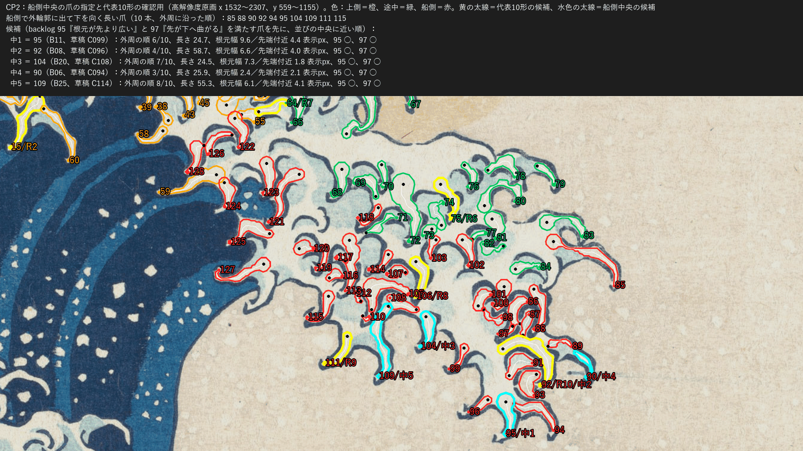

# 29：原画から爪の一覧を仕上げる

日付：2026-09-26／結果：草稿 draft1（c63e7bb）の続きとして、Met原画（高解像度 DP130155）だけから爪の一覧の完成版（final1）を作った。主浪の爪は128本（上側60・途中24・船側44）、右側の波の爪は25本で、合わせて153本。一覧だけから描き直した和集合と原画の白の IoU は、主浪の範囲で **分母A（波頭の平らな白を除く）0.877、分母B（平らな白を含む）0.601** で、0.85 の受入は分母の定義で合否が分かれる（≥0.85 になるのは、分母Aで、かつ分子に根元の白（web、爪に数えない220片）を含めるときだけ。指＋幹だけなら分母Aでも0.685、分母Bで0.467。）。爪の数も、主浪だけ（128本）なら 150±15 の外、右側を含めると（153本）範囲内で、比べる範囲で合否が分かれる。右側の爪は、草稿の読み（尖る淡い指の先＝爪先）では25本中23本が船から離れる向きだったが、「藍の鉤＝爪先」の読み（読みB）では、頭の鉤が見つかった16本中15本が船の側を向いた（読みBの船の向き（15/16）は、読みAの根元と先端を入れ替え、鉤の先を船に最も近い向きの点に取った結果で、読みBを支える独立の根拠ではない。根拠は検査1（先端の周りの藍の線の割合 0.40 対 0.14、藍の面 0.04 対 0.67）と、16/25本の頭に鉤があること。）一覧の右側は読みBを主にした（既定値・利用者未確認）。**どのバックログ項目も合否を判定していない。** IoU の定義、比べる範囲、列の境目、右側の読み、代表10形、船側中央の爪は、利用者が CP2 で確かめる（D8）。

この「29」は2026-09-25の新作業計画の番号で、旧設計書の29とは別である。

- 時間の上限：番号29は2日（計画4.2、9/29〜10/4）。草稿の約1.5時間の後、完成版は約1時間（2026-09-26 12:35頃〜13:35頃、同じ時計）。修正回数：0（完成版の最初の提出）。
- 対応するバックログ：95〜98、122〜129、136〜139（計画の29）の前提。右側の波の爪は240〜256の前提として同じ一覧に入れた。144・145・261・140（遮蔽）は記録だけを残す。判定は番号33（主浪の爪の終態）・35（成長）・40（右側の波）で行う。
- 証拠の種類：Met原画の numpy/OpenCV の計算と、その重ね図だけ。Unity、Blender、Houdiniは使っていない。参照モデル（Q5、`wave_repair_zbrush2.obj`）は開いていない（計画 D20：爪はMet原画だけから作る）。

## 見るもの

| 図 | 内容 |
| --- | --- |
| [29_cp2_nomination.png](../Evidence/ArtFirst/29/29_cp2_nomination.png) | **CP2 で中央の爪を指定するための図**。船側の列を大きくし、番号、船側中央の候補（中1〜中5）、代表10形の候補を示した。上の帯に候補の条件と数値 |
| [29_claws_overlay_crest.png](../Evidence/ArtFirst/29/29_claws_overlay_crest.png) | 主浪の波頭全体に番号を付けた図。**代表10形を確かめるときはこの図と下の一覧図を使う** |
| [29_representative_candidates.png](../Evidence/ArtFirst/29/29_representative_candidates.png) | 代表10形の候補（R1〜R10）と船側中央の候補の中心線・関節（4〜6）・節の長さ比・曲がり角 |
| [29_right_reading.png](../Evidence/ArtFirst/29/29_right_reading.png) | 右側の爪の2つの読み。上＝読みA（尖る淡い指の先＝爪先）、下＝読みB（藍の鉤＝爪先）。緑＝根元→先端が船の側、赤＝離れる側、橙＝頭の藍の鉤 |
| [29_rows_boundaries.png](../Evidence/ArtFirst/29/29_rows_boundaries.png) | 列の境目：外周の s の目盛り、特徴点と境目、x_split、各爪の先端から外周への最近点、境目に近い爪（白い輪） |
| [29_union_iou.png](../Evidence/ArtFirst/29/29_union_iou.png) | 一覧から描き直した和集合と原画の白の一致（分母A・B の値を上に記入） |
| [29_claws_zoom_boatside.png](../Evidence/ArtFirst/29/29_claws_zoom_boatside.png)・[middle](../Evidence/ArtFirst/29/29_claws_zoom_middle.png)・[upper](../Evidence/ArtFirst/29/29_claws_zoom_upper.png)・[right](../Evidence/ArtFirst/29/29_claws_zoom_right.png) | 列ごとの拡大（船側・途中・上側・右側） |
| [29_claws_overlay_display.png](../Evidence/ArtFirst/29/29_claws_overlay_display.png) | 原画視点（1920×1080、番号23の写像）に全部の爪を重ねた図 |
| [29_skeleton.png](../Evidence/ArtFirst/29/29_skeleton.png) | 白のマスクと自作 Zhang–Suen の骨格（とげの除去の前後）。草稿と同じ bytes |



図の色は、上側＝橙、途中＝緑、船側＝赤、右側＝紫。白線が中心線、黒点が根元、色点が先端、灰の細線が根元の白（web、爪の数に入れない）。図は人が見るための256色PNGで、測定には使っていない。番号は完成版の番号で、草稿の番号とは違う（対応は一覧の `draft1_id`）。

## 草稿 draft1 からの変更

| 変更 | 中身 | 結果 |
| --- | --- | --- |
| 全数の目視確認 | 草稿の160本を1本ずつ、原画のままの拡大と中心線の矢印を並べたカードで見た（作業用の図、コミットしない） | 次の2つの修正と、白い斑の規則を足した。ほかの爪は草稿の抽出のまま |
| 白い斑の除外（規則） | 指の輪郭のまわり5 pxの輪で、白以外の画素のうち藍の線が5%以下かつ水色が95%以上の白は、水色の面の中の白い斑（ハイライト）として数えない（`claw.pale_speck`）。骨格は根元の白（web）に残す | 7本を除いた（草稿 C044・C064・C067・C069・C070・C109・C126）。残った153本の輪の藍の線の割合は0.063以上（最小は C026 の0.063、次が C049 の0.074で、境に近い） |
| 先端と根元の入れ替え（目視） | 左の群の白い指（草稿 C001）を、藍の塊の間へ尖って垂れる端が先端になるように、波頂の右の白い帯（草稿 C030）を、藍の渦の線が鉤になって終わる端が先端になるように入れ替えた（`corrections.reverse_tips_ref`） | 完成版 C004・C035 |
| 列の境目 | 外周の接線の特徴点の近くで、爪の先端の並びの最も広い隙間の中央に置くようにした（下の「列」） | s の境目の余裕が 55 px 以上になった。列の変わった爪は2本 |
| 右側の読み | 読みA・読みBの両方を記録し、主を読みBにした（下の「右側の爪の読み」） | 16本が読みB、9本は鉤が見つからず読みA |
| 遮蔽の順序 | 列の前後を backlog 140 に合わせ、列の中は根元の高さ（仮） | 下の「遮蔽の順序」 |
| IoU | 分母A・分母Bの両方を生成器が出すようにした（草稿の分母Bの値は独立レビューの計算だった） | 下の「IoU」 |
| 代表10形・船側中央 | 代表10形の母集団から先細りの比が極端な爪を除き、船側中央の候補は backlog 95・97 を満たす爪を先にした | 下の「代表10形と船側中央の爪」 |
| 一覧のファイル | `claw_inventory_draft.json` を消し、完成版 `claw_inventory.json` にした。草稿の番号・根元・先端だけを `af29_draft1_tips.json` に残した（元のファイルの SHA-256 を記録） | 153本すべてが草稿の爪と対応した（根元と先端の距離の和 ≤12 px） |

## 作り方（[af29_claw_inventory.py](../../Tools/PaintingTruth/claws29/af29_claw_inventory.py)、条件は [af29_params.json](../../Tools/PaintingTruth/claws29/af29_params.json)）

草稿と同じ部分（範囲、白のマスク、自作 Zhang–Suen、とげの除去、枝をストロークにまとめる、根元の決め方、根元の白、記録する量）は変えていない。範囲は主浪の波頭の泡と右側の波の白の縁で、右側だけは白と水色を合わせて抽出する。草稿の記述は c63e7bb の版の Step_29_ja.md にある。完成版で足したのは次のとおり。

1. **白い斑の除外**：上の表のとおり。条件は、全数のカードで「藍の線の縁がなく水色の中にある白の斑」だけが当たることを確かめて決めた。
2. **目視の修正**：`exclude_tips_ref`（草稿の3件）、`trim_root_ref`（草稿の3件）、`reverse_tips_ref`（完成版の2件）。どれも先端の座標で指定し、番号が変わっても同じ爪に当たる。
3. **列**：下の「列」。
4. **右側の爪の読み**：下の「右側の爪の読み」。
5. **遮蔽の順序**：下の「遮蔽の順序」。
6. **記録する量**（爪ごと、[claw_inventory.json](../../Tools/PaintingTruth/claws29/claw_inventory.json)）：番号（C001〜）、列と列の中の番号、草稿の番号、読み、根元と先端の座標（高解像度pxと表示px）、長さ、根元幅（弧長8%）・中央幅（50%）・先端付近の幅（85%）、先端の向きと根元→先端の向き、外周の s と列の境目までの余裕、空までの距離、藍の面へ垂れるか、輪の色の割合、遮蔽の順位・接する爪・その中で後ろになる爪、隣の爪との隙間（根元どうし・先端どうし）、輪郭の多角形、中心線と幅、幹、根元の白、4〜6の関節、節の長さ比、曲がり角。右側は読みAの値と鉤の弧・向きも記す。153本すべてでこれらの欄が埋まっている（列の最後の爪は隣の爪がないので隙間なし）。

### 列

- 列の意味は草稿と同じ（利用者未確認）：上側＝波頂と、その左で藍の面の上縁に横へ並ぶ爪（backlog 122）、途中＝上の房の右肩から唇の右端まで（127）、船側＝唇の右端から唇の下面に沿って左へ（128）。右側は backlog 240〜256 の右側の波の爪で、主浪とは別に数える。
- 決め方：先端から番号23の包絡版の外周（131→132→72、s ≤ 2150）への最近点の弧長 s で決め、先端の x が x_split より左なら上側とする。境目は、外周の接線（弧長 ±75 px の2点を結ぶ向き）が波頂の後で初めて 45° を超える所（s 479、上の房の右肩で外周が下がり始める所）と、初めて 90° を超える所（s 1130、唇の右端で外周が下へ回る所）を特徴点とし、その ±80 px の中で爪の先端の s の並びの最も広い隙間の中央に置いた。x_split は 1480 ± 60 px の中で、唇の下面の左端の爪と左の群の爪の先端の x の最も広い隙間の中央に置いた。

| 境目 | 草稿（目視） | 完成版 | 隙間（両側の爪の値） |
| --- | --- | --- | --- |
| 上側｜途中 | s 520 | s 460（特徴点 479） | s 401〜519 |
| 途中｜船側 | s 1150 | s 1102（特徴点 1130） | s 1047〜1157 |
| x_split | x 1480 | x 1537 | x 1513〜1561 |

- 安定性：s の境目は、どちらを ±40 px 動かしても列の変わる爪は0本。x_split を ±40 px 動かすと1本ずつ変わる。接線の窓を 50・100 px にしても境目は同じで、150 px にすると途中｜船側の特徴点が s 1199 に動き、1本が変わる。境目から 25 px 未満の爪は C059・C128 の2本（どちらも x_split から 24 px。唇の下面の左端と左の群の間の爪）。先端の代わりに根元で決めると12本が変わる（内側の爪は根元が外周から遠いため。記録）。
- 草稿から列が変わった爪は2本：C061（草稿 C059、s 519）は上側から途中へ（草稿の境目 520 から 1 px の所にあった爪）、C059（草稿 C135）は船側から上側へ（x 1513）。
- 内側の爪（外輪郭に出ていない爪）は、外周への最近点で列を決めているので、列の意味は「どの縁の近くにあるか」である。図 [29_rows_boundaries.png](../Evidence/ArtFirst/29/29_rows_boundaries.png) に最近点への線を描いた。

### 右側の爪の読み

- 右側の爪は、白い斜面の縁に並ぶ「頭（淡い面の上に藍の ∩ 形の鉤）＋藍の中へ尖る淡い指」の形をしている。草稿の読み（読みA：尖る淡い指の先＝爪先）では、25本中23本が根元→先端で船（右の船）から離れる向き（先端の向きが右・右下の爪は20本）で、backlog 240「先が船側へ曲がる爪形」と逆になる。
- 検査1（爪先の描き方）：先端のまわり（半径 14 px）の白以外の画素のうち藍の線の割合は、主浪の爪128本で中央値 0.40（0.3 以上が91本）、藍の面は中央値 0.04。右側の読みAの先端では藍の線 0.14（0.3 以上が6本）、藍の面 0.67。主浪の爪先は藍の線で縁取られて鉤で終わるが、右側の読みAの先端は線がなく藍の面に接する。
- 検査2（読みB）：藍の線（番号23 の色分けの mix）を骨格化し、淡い面の中で終わる端を持つ成分を鉤の候補にした（右側 49、そのうち ∩ 形の小さな弧 41）。爪と鉤は、頭の端から鉤の弧までが 50 px 以内の組を距離の順に 1 対 1 で組んだ。鉤が見つかった16本（15本は読みAの根元の側、1本は先端の側に頭がある）について、読みB（根元＝鉤のない端、先端＝鉤の先）では **15本が根元→先端で船の側** を向き、鉤の先の向き（先の 8 px の向き）が船の側なのは12本。（読みBの船の向き（15/16）は、読みAの根元と先端を入れ替え、鉤の先を船に最も近い向きの点に取った結果で、読みBを支える独立の根拠ではない。根拠は検査1（先端の周りの藍の線の割合 0.40 対 0.14、藍の面 0.04 対 0.67）と、16/25本の頭に鉤があること。）船の側を向かない1本は C152（草稿 C159、長さ 36 px の短い白で、読みAですでに船の側を向いていた）。
- 鉤の見つからない9本（C130・C136・C139・C141・C142・C144・C146・C147・C151）は読みAのまま。鉤の候補のうち爪と組まなかったものが33あり、右側には一覧の指より多くの頭がある可能性がある（右側の指の取り方は草稿のままで、指の一部しか取れていない爪がある）。
- 一覧では右側の主の読みを B にした（`right_reading.primary`、既定値・利用者未確認）。読みAの根元・先端・中心線・関節・輪郭は各爪の `right_side_reading.reading_A` に残した。読みBの中心線は、淡い指の中心線を根元から頭の端までたどり、頭の端から鉤の先まで直線でつないだもの、長さはその和（鉤の先が頭から離れている爪では読みAより長い）。輪郭は淡い指の輪郭に頭（鉤の弧と頭の端の円の凸包の中の白・水色）を足したもの。
- 主浪の左の群（藍の面へ垂れる over_indigo の爪、14本）も同じ描き方で、同じ方法で12本の頭に鉤が見つかった。主浪は読みAのまま（藍の中へ尖る端＝爪先）にした。右側と主浪の左の群で読みをそろえるかは CP2 で確かめる。

### 遮蔽の順序

- 主浪は、列の前後を backlog 140「船へ曲がる端の爪が上側の爪より手前」と 180 に合わせて 船側 → 途中 → 上側 とし、同じ列の中では根元が画面の下にある爪ほど手前（仮）とした。右側の波は主浪の後ろに番号を振り、同じ規則（根元が下ほど手前、仮）。接する爪（輪郭が 10 px 以内）の組は107組で、各爪の `touches` と、そのうちこの順で後ろになる `occludes` を記した。
- 原画の線の T 字（手前の爪の輪郭が続き、奥の爪の輪郭がそこで止まる所）から前後を読む方法を、コミットしない試作で試したが、主浪で T 字が21か所、前後の読めた爪の組が5組しか取れず、全体の順序には使えなかった（試作の値で、生成器では再現しない。記録のみ）。列の中の前後は、番号33・36で線の重なりを見て決める。

### 代表10形と船側中央の爪

- 代表10形の候補：主浪の3列の爪のうち、長さが40%分位（47.7 px）以上、長さが中央幅の2.5倍以上、中央幅／根元幅が 0.35〜1.6 の65本を母集団にし、列ごとに本数を割り当て（上側5・途中2・船側3）、k-medoids（乱数なし）で選んだ。先細りの比の条件は完成版で足した（この条件がないと、根元が白の塊に入った爪（中央幅／根元幅 0.27）と、根元がくびれに置かれた爪（3.5）が候補に入った）。
- 船側中央の候補：船側で外輪郭に出て、根元→先端が下向きで、長さが船側の中央値以上の10本を外周に沿って並べ（C085・C088・C090・C092・C094・C095・C104・C109・C111・C115）、backlog 95「根元が先より広い」と 97「先が下へ曲がる」を満たす爪を先に、並びの中央に近い順に5本を候補にした。並びの中央の C094（草稿 C098、草稿の第一候補）は根元幅 7.9 px が先端付近の 8.4 px（高解像度 px）より狭く、95 に当たらないので候補から外れた。

| 候補 | 番号（草稿） | 列の中 | 長さ（表示 px） | 根元幅／中央幅（表示 px） | 先端 | 関節 |
| --- | --- | --- | --- | --- | --- | --- |
| R1 | C028（C028） | 上側 U28 | 27.2 | 6.0／5.9 | 下 | 5 |
| R2 | C015（C015） | 上側 U15 | 44.8 | 8.2／5.8 | 左下 | 5 |
| R3 | C044（C045） | 上側 U44 | 20.6 | 8.6／3.6 | 左下 | 4 |
| R4 | C006（C006） | 上側 U06 | 22.9 | 3.4／3.0 | 上 | 4 |
| R5 | C011（C011） | 上側 U11 | 28.2 | 3.0／3.4 | 右下 | 4 |
| R6 | C075（C079） | 途中 M15 | 29.2 | 7.4／5.8 | 左下 | 4 |
| R7 | C064（C065） | 途中 M04 | 22.5 | 4.9／6.4 | 右 | 4 |
| R8 | C106（C111） | 船側 B22 | 28.3 | 7.0／4.8 | 左下 | 4 |
| R9 | C111（C116） | 船側 B27 | 28.1 | 5.6／4.7 | 左 | 5 |
| R10 | C092（C096） | 船側 B08 | 58.7 | 6.6／7.4 | 左下 | 5 |

- 長短の順（自動出力）：C092, C015, C075, C106, C011, C111, C028, C006, C064, C044。根元幅の順：C044, C015, C075, C106, C092, C028, C111, C064, C006, C011。中央幅の順：C092, C064, C028, C015, C075, C106, C111, C044, C011, C006。

| 船側中央の候補 | 番号（草稿） | 外周の順 | 長さ（表示 px） | 根元幅／先端付近の幅（表示 px） | 95 | 97 |
| --- | --- | --- | --- | --- | --- | --- |
| 中1 | C095（C099） | 6/10 | 24.7 | 9.6／4.4 | ○ | ○ |
| 中2 | C092（C096） | 4/10 | 58.7 | 6.6／4.0 | ○ | ○ |
| 中3 | C104（C108） | 7/10 | 24.5 | 7.3／1.8 | ○ | ○ |
| 中4 | C090（C094） | 3/10 | 25.9 | 2.4／2.1 | ○ | ○ |
| 中5 | C109（C114） | 8/10 | 55.3 | 6.1／4.1 | ○ | ○ |

候補の中心線・4〜6の関節・節の長さ比・曲がり角は、一覧の `representative_and_centre_details` と図 [29_representative_candidates.png](../Evidence/ArtFirst/29/29_representative_candidates.png) にある。

## 結果（[metrics.json](../Evidence/ArtFirst/29/metrics.json)、一覧は [claw_inventory.json](../../Tools/PaintingTruth/claws29/claw_inventory.json)）

| 項目（計画 4.2 の 29 の受入） | 目標 | 値 | 判定 |
| --- | --- | --- | --- |
| 一覧から描き直した爪の和集合と原画の白領域の IoU | ≥0.85 | 主浪：分母A **0.877**、分母B **0.601** | 定義待ち（≥0.85 になるのは、分母Aで、かつ分子に根元の白（web、爪に数えない220片）を含めるときだけ。指＋幹だけなら分母Aでも0.685、分母Bで0.467。） |
| 爪の数（backlog 139「約150本」） | 150±15 | 主浪 **128**（上側60・途中24・船側44）、右側を含めて **153** | 範囲待ち（主浪だけなら範囲外、右側を含めると範囲内） |
| 代表10形の長短の順序を自動で出力できる | 出力できる | 上の順序を一覧に出力 | 出力できる（選定は CP2 で確認） |
| 利用者が CP2 で中央の爪を指定し、代表10形を確かめる | CP2 | 候補5本と図 | 利用者の確認待ち |
| 右側の爪の向き（backlog 240 との対応、記録） | — | 読みA：船の側 2・離れる 23。読みB：鉤あり16本中 船の側15 | 記録のみ（読みは CP2 で確認） |
| 列の境目の安定性（記録） | — | s の境目 ±40 px で変化0本、x_split ±40 px で1本、境目 25 px 未満 2本 | 記録のみ |
| 自作 Zhang–Suen の確認 | 合成図形と原画の白で位相が同じ、太さ2の残り0 | 草稿と同じ（主浪 成分11/11・背景22/22、右側 1/1・40/40、太さ2の残り0） | 合格 |
| 空マスクが番号23の真値v0.2と同じか | 差0 | 0 | 合格 |

### IoU（高解像度 px）

| 範囲 | 分子 | 分母A：平らな白を除く白 | 分母B：平らな白を含む白の全体 |
| --- | --- | --- | --- |
| 主浪（分母A 234,615 px、分母B 357,782 px、平らな白 123,167 px） | 指＋幹＋根元の白 | **0.877**（再現率 0.938、適合率 0.931） | **0.601**（再現率 0.628、適合率 0.932） |
| 〃 | 指＋幹 | 0.685 | 0.467 |
| 〃 | 指だけ | 0.449 | 0.299 |
| 〃 | 輪郭の多角形の和 | 0.466 | 0.306 |
| 右側（白と水色を合わせた面） | 指＋幹＋根元の白 | 0.849 | 0.353 |
| 2つの範囲の合計 | 指＋幹＋根元の白 | 0.872 | 0.527 |
| 表示解像度（1920×1080、2つの範囲） | 指＋幹＋根元の白 | 0.869 | 0.569 |

- 分母Bに対し、分子へ一覧の平らな白の多角形（`crest_body_white_polygons_ref`）も足すと、主浪 0.916（記録）。骨格の全体の内接円の和（骨格で表せる白の上限の目安）は分母Aに対して 0.947。描き直しは読みに依らない形（淡い指・幹・根元の白）で行う。
- 分母Bの値が低いのは、平らな白（主浪の白の34%）を一覧の爪が描かないからで、分母Bで ≥0.85 にするには、平らな白を爪の一部として一覧に入れるか、定義を変える必要がある。草稿の分母Bの値（0.601・0.473）はコミット前の独立レビューの計算だったが、完成版では生成器が出し、0.601・0.467 になった（指＋幹の値は、白い斑7本を根元の白へ移したので下がった）。

### 爪の数

| 読みAの長さの下限 | 主浪 | 右側 | 合計 |
| --- | --- | --- | --- |
| 14 px（一覧） | 128 | 25 | 153 |
| 20 px | 120 | 24 | 144 |
| 25 px | 114 | 21 | 135 |
| 30 px | 110 | 19 | 129 |

- 外輪郭に出ている爪は途中7・船側14本、藍の面へ垂れる爪は上側9・船側5・右側18本。数に入れなかった候補は73本（短い56、範囲の縁で切った白の角7、白い斑7、目視で除外3）、根元の白は220片。
- **backlog 139 の「約150本」がどの集合を指すか**：139（B022-03「爪形｜群の連続生長」）は主浪の爪の群（B017・B020・B022）の項目で、右側の波の爪は B055（240〜256）の別の群である。backlog には、150本に右側を含めるかは書かれていない。主浪だけなら128本で範囲の外（下限135）、右側を含めれば153本で範囲の中になる。

## 確かめたこと

- 同じコマンドを2回実行し、一覧・図12枚・metrics.json の SHA-256 がすべて一致した（run.json は生成時刻を含むので除く）。
- run.json に記録した入力11件・出力14件の SHA-256 がファイルと一致し、`git hash-object --path` と `--no-filters` の値も一致した。これらは既存の `.gitattributes` の `/Tools/PaintingTruth/** -text` と `/Docs/Evidence/ArtFirst/** -text` の対象（`git check-attr` で確認）で、`.gitattributes` は変えていない。
- 空マスクは番号23の保存済みの被覆率と一致した（差0）。原画の SHA-256 は `painting_truth.json` の凍結値と照合した。骨格の図は草稿と同じ bytes だった。
- 草稿の160本のうち153本が完成版の爪と対応し、対応しない7本は白い斑として除いた爪だった（`claw_inventory.json` の `draft1`）。
- 153本すべてで、番号・列・根元・先端・根元幅・中央幅・先端付近の幅・先端の向き・遮蔽の順位・輪郭の多角形・中心線・関節（4〜6点）・節の長さ比・曲がり角の欄が埋まっていることを一覧から確かめた。
- 代表10形と船側中央の候補の14本（C092 は両方に入る）は、一覧図と拡大図で、指の形で先端が鉤か尖りで終わることを目で確かめた（agent の目視、利用者未確認）。
- 列の境目・右側の読み・遮蔽の順序・IoU・数の値は、生成器の出力をそのまま書いた。

## 未実施・保留（CP2で利用者に確かめること）

1. **IoU 0.85 の定義**：分母Aか分母Bか、分子に根元の白（web）を含めるか。≥0.85 になるのは、分母Aで、かつ分子に根元の白（web、爪に数えない220片）を含めるときだけ。指＋幹だけなら分母Aでも0.685、分母Bで0.467。
2. **150本と比べる範囲**：主浪だけ（128本、範囲外）か、右側を含む全体（153本、範囲内）か。長さの下限でも数が変わる（上の表）。
3. **列の境目**（s 460・1102、x 1537）と列の意味（上側に左の群を含めること）。境目に近い C059・C128 の列。
4. **右側の読み**：読みB（藍の鉤＝爪先）を採るか。鉤の見つからない9本の扱い。主浪の左の群（同じ描き方、読みAのまま）をそろえるか。backlog 246「右側に並ぶ白い爪の間から、空が見える」について、右側の爪の間に見えるのは番号23の真値では空でなく白い斜面である（読みの確認とあわせて番号40で扱う）。
5. **船側中央の爪の指定と代表10形の確認**（D8）：図 [29_cp2_nomination.png](../Evidence/ArtFirst/29/29_cp2_nomination.png) の番号で指定してほしい。第一候補は C095。
6. **遮蔽の順序**：列の前後は backlog 140 に合わせたが、列の中は根元の高さによる仮の順序で、原画の線の重なりからは判定していない。

そのほかの限界：

- 主浪の内側の爪の向きは、骨格の規則（端点＝先端）による。全数を目で見て明らかな誤り2本を入れ替えたが、泡の中の短い白の帯（藍の渦の線の内側の白）では、どちらの端を先端とするかは目視でも決めにくいものがある。
- 幅は白の面だけで測っており、水色の陰の部分と藍の線を含まない。右側の読みBの頭から鉤の先までの区間は幅を測っていない。
- 右側の指は草稿の取り方のままで、指の一部しか取れていないものがある。組まなかった鉤の候補が33あり、右側の爪の数は増える可能性がある。
- 爪ごとの 4 px の判定（122〜128、144、145、261、95〜98、240〜246）は番号33・40で行う。この番号では出していない。
- CP1 の証拠（`Docs/Evidence/ArtFirst/CP1/`）は草稿の図と値を引用したままで、この番号では CP1 を回し直していない（CP1 の run.json に記録された番号29の SHA-256 は、完成版のファイルと一致しない）。

## 再現方法と生成物

リポジトリの根で次を実行する（Python 3.10.6、numpy 2.2.6、OpenCV 4.12.0、Pillow 12.0.0。約25秒）。

```
py -3.10 Tools/PaintingTruth/claws29/af29_claw_inventory.py --evidence Docs/Evidence/ArtFirst/29
```

- 入力：`Docs/References/Met_JP1847_DP130155.jpg`、`Tools/PaintingTruth/` の `painting_truth.json`（v0.2）、`manual_annotations.json`（v0.2、右の船の範囲 `boat_mid_roi` を読みBの船の向きに使う）、`truthlib.py`、`targets/palette.json`、`targets/main_wave_outline_envelope.json`、`targets/masks/sky_claws_cov.png`、`claws29/af29_draft1_tips.json`。SHA-256 は [run.json](../Evidence/ArtFirst/29/run.json) の `inputs_sha256` にある。これらは番号23修正02の版で、29はその版に依存する。
- 生成器：`Tools/PaintingTruth/claws29/af29_claw_inventory.py`、`af29_skeleton.py`（草稿から変えていない）、条件 `af29_params.json`。`--out` で一覧の出力先を、`--debug-hooks` で鉤の候補の一覧（確認用）の出力先を変えられる。
- 一覧：`Tools/PaintingTruth/claws29/claw_inventory.json`（約1.0 MB）。爪ごとの記録、列の定義と安定性（`rows_definition`）、右側の読み（`right_side_reading`）、数（`counts`）、代表10形と船側中央の候補、除いた候補とその理由、範囲の定義、草稿との対応（`draft1`）。草稿の `claw_inventory_draft.json` は削除した（c63e7bb に残る）。
- 証拠（約12 MB）：`Docs/Evidence/ArtFirst/29/` の図12枚、`metrics.json`、`run.json`。図は1枚あたり 1.3 MB 以下。
- 旧試作の禁止場所、`G:\research\model`（参照モデルを含む）、732e198 より前の履歴には触れていない。Unity は起動していない（Unity の鍵は使っていない）。
