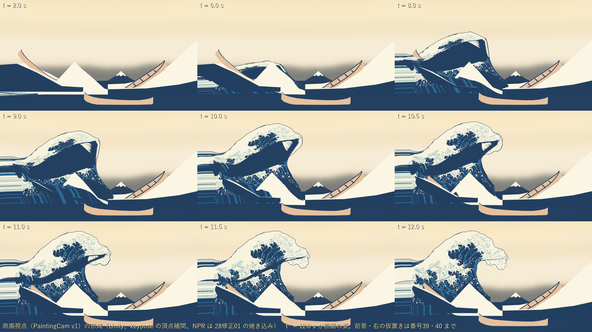
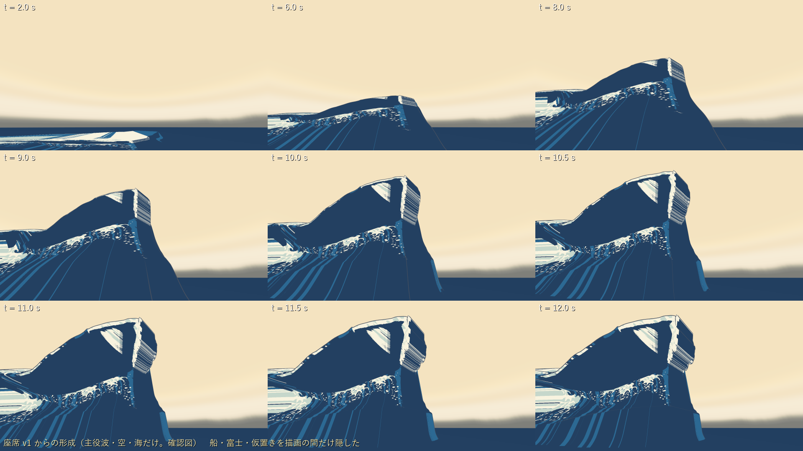
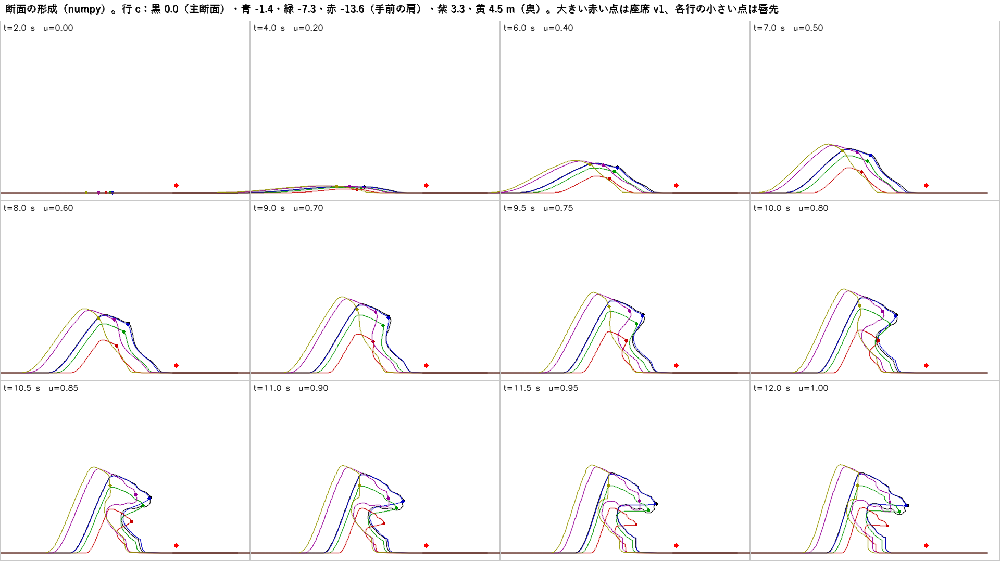
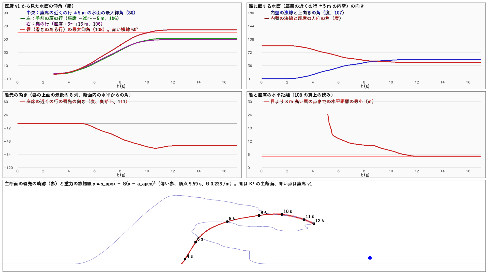
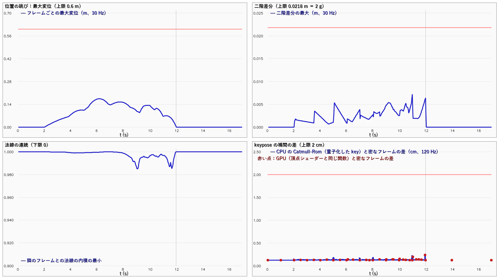
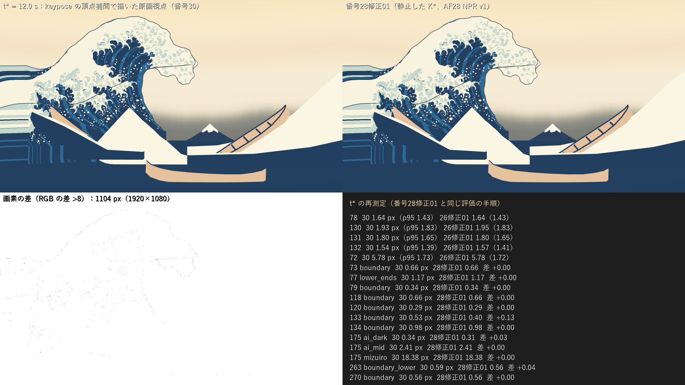

# 30：平らな海から原画の姿への形成の動き（K0→K\*）

日付：2026-09-26／結果：26修正01 の K\*（45°、400×240 = 96,000 頂点）へ、平らな海（K0）から 10 秒で形成する動きを rig の 1 つの JSON で作った。うねりが立ち上がり、前面が立って前へ傾き、唇が投げ出されて重力の放物線の軌跡で落ち、管が開いて、t\* = 12.0 s にちょうど K\* になる。keypose（15 Hz、181 層）を RGBA16 の位置と RG16 の八面体法線のテクスチャにし、頂点シェーダーの Catmull-Rom で補間して（番号24 の CPU のメッシュ更新に代えて）、GWClock の時刻で Unity に描いた。**連続性の検査一式（30 Hz・17 s・511 フレーム、float64 の rig で測る）はすべて合格**（1 フレームの最大変位 0.174 m ＜ 0.6 m、二階差分 0.0071 m、法線の内積の最小 0.985、面の反転 0、断面の自己交差 0、t\* と K\* の差 3.8×10⁻⁶ m、波峰の高さは単調、唇先の速さ 3.9 m/s）。途中の 14 フレームの Blender の検査（非多様体・反転・自己交差・面積 0）と座席からの 5 万本の射線（開いた背面・切断端・穴）もすべて 0。実際に再生される 16 ビットの keypose では、量子化の差（最大 1.21 mm）で K\* の細長い面の一部の向きが逆になり（t\* で 73 面）、t\* と K\* の差は 1.2 mm になる。着色の法線は連続で（隣のフレームとの内積の最小 0.985）、差は 1 px より小さい（下の「限界と保留」12）。シェーダーの補間と numpy の密なフレームの差は全区間で最大 2.5 mm（GPU の 36 時刻で 2.4 mm。基準 2 cm）、t\* で 0.10 px（基準 1 px）。t\* の再測定は 26修正01／28修正01 と最大 0.13 px の差（基準 ±0.5 px）。80・106・107・111・117 は合格。**108 は保留（読みの選択待ち）**。唇は座席の真上には来ない（t\* で水平 5.12 m・仰角 64.0°。水平 5 m 以内・仰角 70° 以上の水面は全区間で 0）。「座席から見た唇の仰角が前方から 60° 以上へ途切れずに上がる」という読み（この番号で置いた読みで、作業計画の既定値ではない）なら満たすが、60° 以上は静止した K\* がすでに満たしており、形成の途中で唇の仰角が K\* を超える時刻はない（全区間の最大 64.03° は t\* = 12.0 s）。読みの選択を利用者に求める（下の「利用者に決めてほしいこと」1）。

この「30」は美術優先の作業計画（[ArtFirst_Plan_2026-09-25_ja.md](../Design/ArtFirst_Plan_2026-09-25_ja.md) 4.2）の番号（美術優先30）で、設計書の番号30とは別である。

- 時間の上限：3.5 日（作業計画 4.1）。実績は約 1 時間（2026-09-26 16:10 頃〜17:10 頃、同じ時計）。Unity の実行は 3 回（42・64・66 秒。毎回 `Unity/Build/unity.lock` を排他的に作ってから 1 プロセスだけ動かし、終わったら消した）、Blender は 2 回（各 約 20 秒）。全体の手順（`run_af30.ps1`、327 秒）を通したのは 16:52 頃に終わった 1 回で、keypose・連続性の検査・Unity の描画と動画・Blender の検査・t\* の再測定はその出力である。その後、`af30_evidence.py` を直して、証拠の段（`af30_evidence.py`）だけを単独で走らせ直した（17:04〜17:05 頃、61 秒）。
- レビュー後の記録の修正（形・描画は変えていない）：コミット前の独立レビューの指摘で、108 の判定を「保留（読みの選択待ち）」に改め、再生される 16 ビットの keypose の面の向きと着色の法線の記録（metrics.json の `played_keypose_faces`）を `af30_evidence.py` に足して、証拠の段だけを 2 回走らせた（最後は 23:17〜23:19 頃、99 秒。Unity・Blender・af30_formation.py は動かしていない）。変わったのは metrics.json・run.json だけで、図 9 枚と MP4 4 本は同じバイト、keypose・Unity の描画・Blender・t\* の再測定の出力（Git 対象外）は前のまま（run.json の `not_committed_sha256` が一致）。いまの図・metrics.json・run.json・1280×720 の MP4 は、この最後の単独の実行の出力である。
- 修正回数：0（最初の提出）。提出前に試したこと（下の「作る途中で直したこと」）と、上のレビュー後の記録の修正は、提出した画像に対する修正ではないので数えていない。
- 対応するバックログ：80・106・107・108・111・117（G2）。計画の受入の「シェーダーの補間と numpy の照合（t\* ≤1 px、全区間 ≤2 cm）」と「t\* の再測定が 26／28 と ±0.5 px 以内」。keypose の容量（≤512 MiB、判定は番号32 の手順）は記録だけ。
- 証拠の種類：numpy の rig と連続性の検査、Blender 5.2.2 ヘッドレスのメッシュ検査、Unity 6000.4.3f1 Editor の batchmode による **PC のオフスクリーン描画**（RTX 3080、Direct3D11、Linear）。**HMD 実機の結果ではない**（HMD 未所持）。立体視は SPI のキーワードでのコンパイルだけを確かめた。
- 既定値（利用者未回答）として決めたもの：二階差分の上限（2 g を 30 Hz へ直した 0.0218 m）、唇先の速さの上限（12 m/s）、裂けの目安（行の間の辺が K\* と K0 の長い方の 6 倍以下）。作業計画には数値がないので、この番号で決めて rig の JSON（`af30_rig.json` の `continuity_limits`）に書いた。108 の読みは決めていない（保留）。仰角の読み（60° 以上）と真上の読み（水平 5 m 以内・仰角 70° 以上）の 2 つを `af30_evidence.py` で測り、読みの説明を metrics.json の 108 の `reading_ja` に書いた。
- 参照モデル（Q5）は使っていない（作業計画 9.6：30 は変更なし）。

## 見るもの

| 原画視点の形成（Unity、t = 2〜12 s） | 座席 v1 からの形成（主役波・空・海だけ） |
| --- | --- |
|  |  |
| **断面の形成（numpy、6 行）** | **座席からの項目（仰角・内壁の向き・唇先の向き・唇先の軌跡と放物線）** |
|  |  |
| **連続性（変位・二階差分・法線・補間の差）** | **t\* の再測定（keypose の描画と 28修正01）** |
|  |  |

- 形成の動画（Unity、0〜17 s、60 fps、1021 コマ）：[原画視点（1920×1080）](../Evidence/ArtFirst/30/af30_formation_painting_60fps.mp4)／[座席 v1（場面全体、1920×1080）](../Evidence/ArtFirst/30/af30_formation_seat_form_60fps.mp4)／[座席 v1（主役波・空・海だけ、1280×720）](../Evidence/ArtFirst/30/af30_formation_seat_form_waveonly_60fps_720p.mp4)／[左の側面（主役波・空・海だけ、1920×1080）](../Evidence/ArtFirst/30/af30_formation_side_left_waveonly_60fps.mp4)
- 静止画の一覧：[座席 v1（場面全体）](../Evidence/ArtFirst/30/af30_seat_formation.png)、[左の側面](../Evidence/ArtFirst/30/af30_side_formation.png)、[背面](../Evidence/ArtFirst/30/af30_back_formation.png)
- 数値：[metrics.json](../Evidence/ArtFirst/30/metrics.json)（`summary_verdicts` が項目ごとの判定、`items` が値）、実行条件と SHA-256：[run.json](../Evidence/ArtFirst/30/run.json)

動画と静止画はすべて Unity の実描画で、主役波は keypose の頂点シェーダー（AF30 NPR Keypose、色は 28修正01 の焼き込み r01）、背景は 27修正01 のプレハブ（右船・座席 v1・前景と右の仮置き）。「主役波・空・海だけ」は船・富士・仮置きを描画の間だけ隠した確認図。座席 v1 の形成の向きは、唇の方位（seat_v1.json の注視点の方位）で仰角 30°・縦画角 80°（−10°〜70° が画面に入る）にした。座席の動画（場面全体）では、手前の白い三角と右の暗い斜面（番号39・40 までの仮置き）が画面の下半分を覆う。断面・座席の項目・連続性の図は numpy の値を人が見るための図で、評価には使っていない。座席のまわりの 1920×1080 の動画（主役波・空・海だけ）は 6.9 MB で 5 MB を超えたので、Git 対象外の `Unity/Build/ArtFirst/30/video/` に置き（SHA-256 は run.json）、証拠には 1280×720 に縮めた版を入れた。

## 結果

| 項目 | 基準 | 値 | 判定 |
| --- | --- | --- | --- |
| 80 船上の正面中央で上昇前から上昇後まで続けて見られる | 形の切替・欠落 0 | 添字は全フレームで同じ（SHA-256 2b6dcb29…）、上の連続性がすべて合格。座席の近くの行（座席 ±5 m）の水面の最大仰角：t 6 s 17.3° → 9 s 52.7° → t\* 64.0°、1 フレームで下がる量 0 | 合格 |
| 106 中央から左右まで同じ一面として上へ移る | 裂け・位置跳び 0 | 一枚の固定位相のシート。行の間の辺の伸びは最大 2.99 倍（目安 6 倍）。左（手前の肩の行）t\* 50.6°・右（奥の行）48.9° まで途切れずに上がる（1 フレームの低下 ≤0.009°） | 合格 |
| 107 船側の水面が上向きから船向きへ連続して変わる | 反転・位置跳び 0 | 座席の近くの行の内壁の平均の法線と上向きの角：0° → 43.9°（8 s）→ 51.6°（t\*）、座席の方向との内積 0.72（t\*）、1 フレームの回転は最大 0.39°。面の反転 0（rig。再生される keypose の細長い面は限界 12） | 合格 |
| 108 前方の水面が座席の上方へ延びる | 読みは未定（利用者の選択待ち）。(1) 仰角の読み（この番号で置いた読みで、作業計画の既定値ではない）：同じ水面（唇）の仰角が前方（2 s で <20°）から 60° 以上へ途切れずに上がる。(2) 真上の読み：座席から水平 5 m 以内・仰角 70° 以上に水面が来る | 唇の最大仰角：8 s 41.2° → 10 s 59.2° → t\* 64.0°（下がらない）。全区間の最大 64.03° は t\* = 12.0 s で、途中で K\* を超える時刻は 0。60° 以上は静止した K\* がすでに満たす。座席に最も近い行の唇先 63.7°。真上の読みの点は全区間で 0（t\* の水平の最小 5.12 m） | **保留**（読みの選択待ち。(1) は満たすが静止した K\* だけで満たす、(2) は満たさない） |
| 111 座席の上へ延びた水面の先が下向きに曲がる | 位置跳び・欠落 0、t\* の形へ到達 | 座席の近くの行の唇先の向き：0° → −40.7°（8 s）→ −63.2°（10 s）→ −66.4°（11 s）→ −61.2°（t\*）。1 フレームの変化 ≤0.58°、唇先の移動 ≤0.127 m/フレーム、t\* と K\* の差 3.8×10⁻⁶ m（rig。再生される keypose では 1.2 mm） | 合格 |
| 117 前方から頭上へ一続きの面（減面なし） | 減面前との輪郭の差 ≤4 px、穴・切断 0 | 減面をしない（全視点・全フレームで同じ 96,000 頂点・同じ添字、差 0 px）。14 フレームで座席からの射線の開いた背面・切断端・穴 0/0/0 | 合格 |
| シェーダーの補間 ↔ numpy | t\* ≤1 px、全区間 ≤2 cm | CPU の Catmull-Rom（量子化した key）と密なフレーム（120 Hz）の差 最大 2.52 mm。GPU（頂点シェーダーと同じ関数）と密なフレーム 最大 2.36 mm（36 時刻）、GPU と CPU の差 1.9×10⁻⁵ m。t\* の画面上の差 0.10 px | 合格 |
| t\* の再測定 | 26修正01／28修正01 と ±0.5 px | 78/130/131/132 = 1.64/1.93/1.80/1.54 px、72 最大 5.78（p95 1.73）。色区の境界は 133 だけ +0.13 px（0.53 px）、263 +0.04、175 藍濃 +0.03、ほかは同じ。判定は 28修正01 と同じ（175 だけ不合格） | 合格 |
| 連続性の検査一式（rig） | 下の表 | すべて合格 | 合格 |
| メッシュ検査（Blender、rig の 14 フレーム） | 非多様体・反転・自己交差・面積 0 が 0、縁が格子の外周 | すべて 0、縁 1,276 | 合格 |
| SPI のコンパイル | keypose の 2 シェーダー | キーワードなし・INSTANCING_ON・STEREO_INSTANCING_ON の 12 段がすべて可、立体視の頂点出力に SV_RenderTargetArrayIndex あり | 合格（コンパイルだけ） |
| keypose の容量 | ≤512 MiB（判定は番号32 の手順） | ファイル 198.9 MiB（位置 132.6・法線 66.3）。Unity の Profiler.GetRuntimeMemorySizeLong は 397.7 MiB | 記録のみ |
| 再生される面（16 ビットの keypose の Catmull-Rom、30 Hz・511 フレーム） | 基準なし | t\* で K\* と向きが逆の面 73（すべて行 238、K\* での高さ 0.67 mm 以下）、t\* と K\* の差 1.20 mm。前のフレームから向きが反転した面 延べ 17,374 面・フレーム。同じ時刻の rig と向きが逆の面 延べ 790,203 面・フレーム（1 フレームの最大 6,950 面、3.83 s。rig での高さ 2.08 mm 以下の細長い面だけ）。着色の法線（RG16）の隣のフレームとの内積の最小 0.985（9.07 s） | 記録のみ（限界 12） |

### 連続性の検査一式（30 Hz、0〜17 s、511 フレーム。float64 の rig で測る。再生される 16 ビットの keypose は上の表の最後の行と限界 12。再生成のたびに af30_formation.py が走らせる）

| 検査 | 上限 | 値 |
| --- | --- | --- |
| 添字のハッシュ | 一定 | 全フレームで同じ。numpy・keypose・Unity のメッシュの SHA-256 が一致 |
| 1 フレームの最大変位 | <0.6 m | 0.174 m（6.17 s、奥の尾の行の後ろの平らな海が足までの間隔の伸縮で動く所） |
| 二階差分の最大 | ≤0.0218 m（2 g） | 0.0071 m（11.0 s、唇先の近く） |
| 隣のフレームとの法線の内積 | >0 | 最小 0.985 |
| 面の反転（面の法線の向きの逆転） | 0 | 0 |
| 断面の自己交差（全 240 行・全フレーム） | 0 | 0 |
| t\* と K\* の頂点の差 | <1×10⁻⁴ m | 3.8×10⁻⁶ m（K\* の .gwb の float32 の丸め） |
| 波峰の高さが単調（行ごとの最高点） | 下がらない | 下がったフレーム 0 |
| 唇先の速さ（唇先の軌跡に最高点がある 140 行） | ≤12 m/s | 3.9 m/s |
| 海面より下の点 | なし | 最小 −7×10⁻¹⁵ m |
| 行の間の辺の伸び | ≤6 倍 | 2.99 倍 |

## 形成の流れ（rig の既定の表、主断面の行）

| 時刻 | 形 |
| --- | --- |
| 0〜2 s | 平らな海（K0）。予備 |
| 2〜6 s | 広いうねり（背面は K\* の 3 倍、前面は 0.45 倍の広さから）が立ち上がる。高さ 0.37H（6 s） |
| 6〜9 s | 前面が立ち、前へ 8° まで傾く（前傾）。唇の列が頂から前へ伸び始める。高さ 0.86H（9 s） |
| 9〜9.6 s | 唇先が前へ上がり、9.59 s に最高点（高さ 15.08 m、断面の座標で K\* の頂の足から前へ 8.1 m）に達する |
| 9.6〜12 s | 唇先は最高点から重力の放物線 y = y_apex − G(a − a_apex)²（G = 0.233 /m）に乗って落ち、K\* の唇先（11.65, 12.21 m）へ届く。唇の下面が返って管が開き、足跡は船の側へ（t\* までに合計 4 m）動く |
| 12〜17 s | 静止（K\*） |

- 唇先の軌跡は放物線の形だが、時刻の進みは rig の緩和に従い、t\* で止まる（原画の姿で止まる）。最高点から t\* までの落下 2.87 m に 2.4 s かけるので、実時間の重力（自由落下なら 0.77 s）より約 3 倍ゆっくり見える（下の「限界」3）。
- 主断面の行の唇先は自分の放物線から最大 0.011 m。補正を波峰線方向に平滑したので、放物線の重みが 1 の行でも最大 0.49 m ずれる行がある（主断面の近くで爪を除く行が 0.12 m の間に急に変わる所）。

## 作ったもの

### rig（[af30_rig.json](../../Tools/GWWaveGen/af30_rig.json)）と生成器（[af30_formation.py](../../Tools/GWWaveGen/af30_formation.py)）

K\* の各行（波峰線に垂直な鉛直の断面）を、断面の面の中だけで動かす。すべての表は形成の進み u = (t − 2)/10 の関数で、端の傾き 0 の単調な 3 次補間でつなぎ、t\* で K\* の値になる。

1. **H(φ)**：頂の高さ。背面の坂は縦に H 倍、前面は前の足がちょうど海面に届く倍率で縦に伸縮する（閉合）。単調なので波峰の高さも単調。
2. **L(φ)**：足跡の横の広がり。背面の坂は頂を中心に Lb 倍（3 → 1）、前面は Lf 倍（0.45 → 1）。正の倍率の affine 写像なので、断面の向きと単純さを保つ。
3. **κ(φ)** と **δ(w)**：前面（唇の上面・唇先・唇の下面・角・内壁・谷）は回転角補間 θ_j = s_j·θ\*_j、s_j = κ((u − δ_j)/(1 − δ_j))。δ = 0.3·w で、w は主断面の弧長で決める列の座標（頂 0 → 唇先 1 → 角 0.3 → 内壁で 0）。唇先ほど遅れて巻く（唇部の位相遅れ）。
4. **唇の伸び** g(u)（0.2 → 1）：唇部の線分の長さを短くしておき、投げ出される区間で K\* の長さへ伸ばす（番号24 の v0 で、巻きがほどけた途中で弧長が余って波が一度高くなった問題への対策）。
5. **細部** D(u)：前面の向きを弧長 1.5 m のガウスで平滑した向きから K\* の向きへ移す（うねりの前面を滑らかにし、唇の下面の鉤・爪の凹凸は投げ出される区間で出す）。
6. **前傾**：a += tan(前傾)·y（0 → 8°（u 0.7）→ 0）。
7. **足跡の平行移動**：頂・背面・前面を進行方向（船の側、右手前）へ t\* までに 4 m 動かす（t\* でずれ 0）。残りの約 6 割は唇が投げ出される区間で動く。前後の平らな海は外端を動かさず、足までの間隔を伸縮する。
8. **唇先の重力の放物線**：行ごとに唇先の自然な軌跡の最高点から t\* までを鉛直の軸の放物線へ乗せる縦の補正を、唇の列（頂 0 → 唇先 1 → 角 0）へ配る。補正量は波峰線方向に σ 0.6 m で平滑する。唇先の軌跡に最高点がある 140 行のうち、張り出し（0.3H の内壁から唇先まで）が 0.1H 以上の 131 行に効かせる（0.1〜0.2H で重みを 0→1）。

- **keypose**：15 Hz（0〜12 s、181 層）。Catmull-Rom（非一様の節点。端は片側の差）で補間した位置と 120 Hz の密なフレームの差が 4 mm を超える区間に中点の key を足す規則を入れたが、15 Hz のままで最大 1.9 mm だったので **足した key は 0**（唇部と t\* 付近を密にする必要がなかった）。位置は全 key の外接箱で正規化した RGBA16（量子化の差 最大 1.21 mm）、法線は RG16 の八面体符号化（最大 0.004°）。層のテクスチャは 400×240（列 × 行）で、頂点の添字 = 行 × 400 + 列。
- 同じ入力で 3 回作り、位置の keypose の SHA-256（3d652c89…d066）と原画視点の動画の SHA-256（68f80d39…4594）が毎回一致した（決定的）。ただし SHA-256 がファイルに残っているのは最後の生成（af30_keypose.json・af30_render_report.json）だけで、前の 2 回との一致は作業中の照合による。

### Unity

| ファイル | 内容 |
| --- | --- |
| [GWClock.cs](../../Unity/Assets/GreatWave/ArtFirst/Scripts/GWClock.cs) | 体験の時刻を一か所で持つ時計（計画の GWClock）。再生中は Time.deltaTime で進めて 17 s で折り返す。Editor の採取は SetSeconds で時刻を直接決める |
| [AF30KeyposeWave.cs](../../Unity/Assets/GreatWave/ArtFirst/Scripts/AF30KeyposeWave.cs) | keypose を 2 つの Texture2DArray（RGBA64・RG32、点サンプル）にして大域の値で渡し、GWClock の時刻から補間の 4 層と重み（af30_formation.py の cr_weights と同じ式）を CPU で決める。メッシュは K\* の .gwb（AF26KStarMesh）のまま変えず、外接箱だけを全 key の外接箱にする。番号24 の CPU のメッシュ更新（AF24WavePlayer）は使わない（変えてもいない） |
| [AF30KeyposeCore.cginc](../../Unity/Assets/GreatWave/ArtFirst/Shaders/AF30KeyposeCore.cginc)・[AF30Keypose.cginc](../../Unity/Assets/GreatWave/ArtFirst/Shaders/AF30Keypose.cginc) | 頂点の位置と法線を keypose から Load で読み、4 層を重みで足す（SV_VertexID で texel を決める）。頂点シェーダー用の部品は Sampling19Surface.cginc をひな形に、同じ形の SPI のマクロを使う |
| [AF30_NPR_Keypose.shader](../../Unity/Assets/GreatWave/ArtFirst/Shaders/AF30_NPR_Keypose.shader)・[AF30_Outline_Keypose.shader](../../Unity/Assets/GreatWave/ArtFirst/Shaders/AF30_Outline_Keypose.shader) | 番号28 の NPR v1・外殻線 v0 と同じ色と線の式に keypose の頂点補間を加えたもの。色は 28修正01 の焼き込み（UV3）を読むので、色区は動く水面に貼り付いたまま動く（UV が変わらない）。ID 表示（_AF28IdMode）も同じ |
| [AF30KeyposeCapture.compute](../../Unity/Assets/GreatWave/ArtFirst/Shaders/AF30KeyposeCapture.compute) | 検査用。頂点シェーダーと同じ関数で全頂点の位置を計算して読み戻す |
| [AF30Formation.cs](../../Unity/Assets/GreatWave/ArtFirst/Editor/AF30Formation.cs) | 場面の組み立て（27修正01 のプレハブ＋GWClock＋keypose の主役波＋カメラ 6 台）、t\* の採取（28修正01 と同じ名前・設定）、静止画、動画（ffmpeg へ生の RGB を流す）、GPU の読み戻し、SPI のコンパイル、保護したファイルの SHA-256 |
| `AF30_NPR_Keypose.mat`・`AF30_Outline_Keypose.mat`・`AF30_Formation.unity` | マテリアルは番号28 のマテリアルの値を写して作る（番号28 のマテリアルは変えない）。シーンは実行のたびに作り直す（SHA-256 は実行ごとに変わりうる。最後の値は run.json） |

### 検査と証拠

- [af30_blender.py](../../Tools/GWWaveGen/af30_blender.py)：途中の 14 フレーム（0・2・4・6・7・8・9・9.5・10・10.5・11・11.5・11.75・12 s）のメッシュの検査と、座席 v1 からの 5 万本の射線（26修正01 と同じ数え方）。仰角 60° 以上の射線で主役波に当たる本数は 10 s まで 0、10.5 s 18、11 s 68、11.5 s 102、t\* 119（26修正01 と同じ）。
- [af30_tstar_eval.py](../../Tools/GWWaveGen/af30_tstar_eval.py)：28修正01 の評価（af28r01_evaluate.py）を、params の出力先だけを変えて keypose の t\* の画像に走らせる。28修正01 の焼き込みと描かなかった比較用の画像はハードリンクで並べるだけ。
- [af30_evidence.py](../../Tools/GWWaveGen/af30_evidence.py)：照合・座席の項目・図・動画・metrics.json・run.json。

## 作る途中で直したこと（提出前。修正回数に数えない）

1. **番号24 の転角補間のまま**（弧長一定、前の足を固定）だと、巻きがほどけた唇が上へ伸びて波が一度高く立ち上がる（24 の限界 2）。頂を錨にして、前面は閉合の縦の倍率、横は Lf で抑え、唇部は長さを伸ばす形（g）にした。
2. **前面の凹凸**：最初の試作では K\* の唇の下面の鉤・爪が、うねりの前面に段として出た。細部 D(u)（平滑した向き → K\* の向き）を入れた。
3. **時刻の進み**：最初は smootherstep の 1 本の進みで、9.5 s でほぼ K\* になり最後の 2 秒がほとんど動かなかった。表を u の関数で持ち、端の傾き 0 の単調な 3 次補間にした。
4. **行の間の辺の伸び**：唇先の放物線の補正を行ごとにかけると、主断面（c = 0）と隣の行（c = −0.03 m、爪を除く途中の行）で補正が 0.13 m 食い違い、行の間の辺が K\* の 6.1 倍に伸びた（裂けの目安を超えた）。補正を波峰線方向に σ 0.6 m で平滑して 2.99 倍にした。
5. **座席の左右の仰角**：最初は方位の帯（±15°）で測ったが、高い点が帯の境を横切る瞬間に最大値が 18° → 47° と跳んだ（面の跳びではない）。行の組（座席 ±5 m、手前の肩、奥）で測るようにした。

## 限界と保留

1. **唇は座席の真上に来ない（108 は保留）**：唇先は t\* で座席 v1 から水平 5.12 m・仰角 64.0° で、形成の全区間で座席から水平 5 m 以内・仰角 70° 以上に水面は来ない。唇先は前へ単調に進み、t\* が最も前（26修正01 の限界 1：座席は原画視点で唇より手前・右にあり、t\* の形では原画の輪郭が優先される）。26修正01 と 27修正01 は、t\* の形が 108 を満たさないとして、唇を座席の上方へ送ることをこの番号へ回したが、この番号の形成でも唇の仰角は K\* の 64.03° を超えない（最大は t\* = 12.0 s）。仰角 60° の読みはこの番号で置いたもので、静止した K\* だけで満たすので、形成の動きがあるかどうかを判定しない。t\* の後は静止（番号23 の時間軸）なので、座席の真上を覆うには選択肢（下の「利用者に決めてほしいこと」1）のどれかが要る。
2. **形成の途中の配色（番号31・41）**：色は t\* に焼いた UV の色区で、動く水面に貼り付いて動く（UV が変わらない）。そのため t\* で隠れている面が途中で見える。(a) 唇が巻き切る前（9〜11.5 s）は、唇の下面（t\* では下を向いて隠れ、焼き込みで藍濃に塗った面）が原画視点で前を向き、白い波頭の中に暗い藍の帯として見える。(b) 0〜4 s は平らな海の上に K\* の白・水色・藍の色区が押し縮められた縞で見える（原画視点の左下、座席の左下）。(c) 座席から唇の奥に 28修正01 の限界 1 の白と藍濃の櫛の歯が見える。白が 0 から現れる時間場 T_white と縞の追従は番号31、見えない面の配色は番号41 で扱う。
3. **唇の落下は実時間の重力より遅い**：軌跡は放物線の形だが、時刻の進みは緩和して t\* で止まる（原画の姿で止まる）。最高点から t\* まで 2.87 m の落下に 2.4 s かかり、自由落下（0.77 s）の約 3 倍ゆっくり見える（1 フレームの速さは最大 3.9 m/s）。実時間の重力に近づけると、唇は t\* の直前に速く落ちて t\* で急に止まる。どちらにするかは見え方の判断（「利用者に決めてほしいこと」2）。
4. **放物線からのずれ**：主断面の行は 0.011 m だが、補正を波峰線方向に平滑したため、重み 1 の行の一部で最大 0.49 m ずれる。
5. **仮置きが座席の画面を覆う**：座席の動画（場面全体）では、手前の白い三角と右の暗い斜面（番号39・40 までの仮置き）が画面の下半分を覆い、形成の途中では波の前面が仮置きの手前へ出入りする。確認用に「主役波・空・海だけ」の動画と静止画を出した。
6. **外殻線 v0 の内側の線**：28修正01 の限界 2 と同じ。t\* で 3,558 px（28修正01 は 3,555 px）。形成の途中では唇の下面の縁などに線が出る（線マスクは番号36）。
7. **二階差分の小さな段**：表を 3 次補間でつないでいる（傾きは連続、二階微分は節点で不連続）ので、二階差分に小さな段（最大 0.0071 m、上限の 1/3）がある。2 s（動き始め）と 12 s（止まる所）でも段がある。
8. **ほかの場面は静止した K\* のまま**：CP1 の合成（AFCP1Composite）、26修正01・27修正01・28修正01 のシーンは K\* の静止のまま（ほかの番号のファイルは変えていない）。keypose の再生は AF30_Formation.unity だけで、体験の場面への統合は番号38・43。
9. **性能は測っていない**：keypose の頂点シェーダー（1 頂点あたり 8 回の Load）を含む 81/112 の測定は番号32 の手順で行う必要がある。keypose の容量は記録だけ（ファイル 198.9 MiB、Unity の報告 397.7 MiB）。
10. **立体視**：SPI のキーワードでのコンパイルだけ。Mock Runtime の両眼の描画と HMD 実機は確かめていない（HMD 未所持）。
11. 72 の最大 5.78 px（p95 1.73 px）と 175 の不合格（18.38 px）は 26修正01・28修正01 と同じ。71 は 28修正01 と同じ 126.25 px（差 0）で、26修正01 の 37.49 px とは 88.75 px 違う。28修正01 の Step に書かれているとおり、主役波だけの描画で空域の下辺が開くための描き方の違いで、±0.5 px の比較からは外した（記録のみ）。
12. **再生される keypose の細長い面の向き**：連続性の検査一式と Blender の検査は float64 の rig で測った。実際に再生されるのは 16 ビットに量子化した keypose（量子化の差 最大 1.21 mm）の Catmull-Rom で、26修正01 の K\* には高さ 1.5 mm 未満の細長い面が 17,044 ある（行 0〜70 に 16,366、奥の尾の行 230〜238 に 678）。量子化の差がこの高さと同じ桁なので、一部の面の巻きの向きが反転する。t\* で K\* と比べて 73 面（すべて奥の尾の行 238、K\* での高さ 0.67 mm 以下）、30 Hz の再生で前のフレームから反転する面は延べ 17,374 面・フレーム、同じ時刻の rig と比べると延べ 790,203 面・フレーム（1 フレームの最大 6,950 面、3.83 s。多いのは 2〜7 s の行 0〜70 の面。rig での高さ 2.08 mm 以下の面だけ）。着色は頂点の法線（RG16 の八面体）を使い、隣のフレームとの内積の最小は 0.985 で連続している。反転する面の幅（高さ）は 2.1 mm 以下で 1 px より小さく、見えない。再生される t\* と K\* の差は 1.2 mm で、3.8×10⁻⁶ m は rig の値である（metrics.json の `played_keypose_faces`）。

## 利用者に決めてほしいこと

1. **108（唇を座席の真上へ。いまは保留）**：(a) 仰角の読み（座席から見た同じ水面の仰角が 60° 以上へ途切れずに上がる）で合格とする（この番号で置いた読み。静止した K\* だけで満たすので、形成の動きは判定に効かない）。(b) 形成の途中（10〜11.5 s）で唇を座席の上まで張り出させてから t\* の形へ戻す（唇が戻る動きになり、物理的に不自然）。(c) t\* の後の静止をやめ、唇が座席の上へ落ち続ける区間を足す（番号23 で凍結した時間軸「静止 5 s」を変える）。(d) 座席を唇の下へ寄せる（27修正01 の選択肢）。
2. **唇の落ちる速さ**：(a) 今の緩和（原画の姿へゆっくり止まる、既定値・利用者未回答）。(b) 実時間の重力に近い速さで落とし、t\* で止める（rig の lip_extension・kappa・delta の表で唇の区間を 11 s 以降へ詰める）。

## 再現方法と生成物

リポジトリの根で次を実行する（Python 3.10.6、numpy 2.2.6、OpenCV 4.12.0、Pillow 12.0.0、Unity 6000.4.3f1、Blender 5.2.2 LTS、ffmpeg 2024-12-19）。全体で約 5.5 分（327 秒）。26修正01 の K\*（`Unity/Build/ArtFirst/26修正01/kstar/`）と 28修正01 の焼き込み（`Unity/Build/ArtFirst/28修正01/`）が要る。

```
powershell -NoProfile -ExecutionPolicy Bypass -File Tools/GWWaveGen/run_af30.ps1 [-SkipUnity] [-SkipBlender]
```

中身は次の段である（rig の JSON を 1 か所変えてから再生成まで、numpy の段だけなら約 2.5 分）。

```
py -3.10 Tools/GWWaveGen/af30_formation.py --stage all
blender --background --factory-startup --python-exit-code 1 --python Tools/GWWaveGen/af30_blender.py -- Unity/Build/ArtFirst/30/frames Unity/Build/ArtFirst/30/blender/af30_blender_qa.json 3.9544 1.8323 -15.0308 -2.1368 5.2525 -7.8754
powershell -NoProfile -ExecutionPolicy Bypass -File Tools/GWWaveGen/run_af30_unity.ps1 -Method GreatWave.ArtFirst.EditorTools.AF30Formation.BuildAndRender -Log build_render
py -3.10 Tools/GWWaveGen/af30_tstar_eval.py
py -3.10 Tools/GWWaveGen/af30_evidence.py
```

- `run_af30_unity.ps1` は `Unity/Build/unity.lock` を排他的に作ってから Unity を 1 プロセスだけ起動し、終わったら（失敗しても）消す（26修正01・27修正01 と同じ手順）。
- Git に入れるもの：`Tools/GWWaveGen/`（af30_rig.json、af30_formation.py、af30_blender.py、af30_tstar_eval.py、af30_evidence.py、run_af30.ps1、run_af30_unity.ps1）、`Unity/Assets/GreatWave/ArtFirst/`（Scripts の GWClock.cs・AF30KeyposeWave.cs、Shaders の AF30KeyposeCore.cginc・AF30Keypose.cginc・AF30_NPR_Keypose.shader・AF30_Outline_Keypose.shader・AF30KeyposeCapture.compute、Materials の AF30_NPR_Keypose.mat・AF30_Outline_Keypose.mat、Editor の AF30Formation.cs。それぞれ .meta も）、`Unity/Assets/GreatWave/Scenes/Tests/AF30_Formation.unity`（.meta も）、証拠 `Docs/Evidence/ArtFirst/30/`（図 9 枚、MP4 4 本（各 5 MB 以下）、metrics.json、run.json、約 17 MB）、この文書。
- Git に入れないもの：`Unity/Build/ArtFirst/30/`（既存の `/Unity/Build/` の規則で対象外）。keypose（位置 132.6 MB・法線 66.3 MB）、連続性の検査の全フレームの記録、GPU の読み戻し、静止画 98 枚、1920×1080 の動画 4 本、Blender の検査、t\* の再測定（t28/、28修正01 の焼き込みのハードリンクを含む）、ログ。SHA-256 は run.json の `not_committed_sha256`。`video/af30_formation_side_left_60fps.mp4`（16:44 頃の途中の Unity の実行の残り）もここに載るが、証拠とこの文書では使っていない。
- 記録した SHA-256 と Git のブロブを一致させるため、`.gitattributes` に `/Unity/Assets/GreatWave/Scenes/Tests/AF30_Formation.unity* -text` を加える必要がある（進行役。`Tools/GWWaveGen/**`・`Docs/Evidence/ArtFirst/**`・`Unity/Assets/GreatWave/ArtFirst/**` は既存の規則の対象）。
- 番号24・26・26修正01・27修正01・28・28修正01・32・CP1 のプレハブ・マテリアル・シェーダー・スクリプト・シーンと、K\*・焼き込み・seat_v1.json（25 ファイル）は読むだけで、組み立てと描画の前後で SHA-256 が一致した（`af30_build_report.json`・`af30_render_report.json` の protectedUnchanged）。
- 旧試作の禁止場所と 732e198 より前の履歴には触れていない。参照モデル（`G:\research\model`）は開いていない。Houdini は使っていない。
