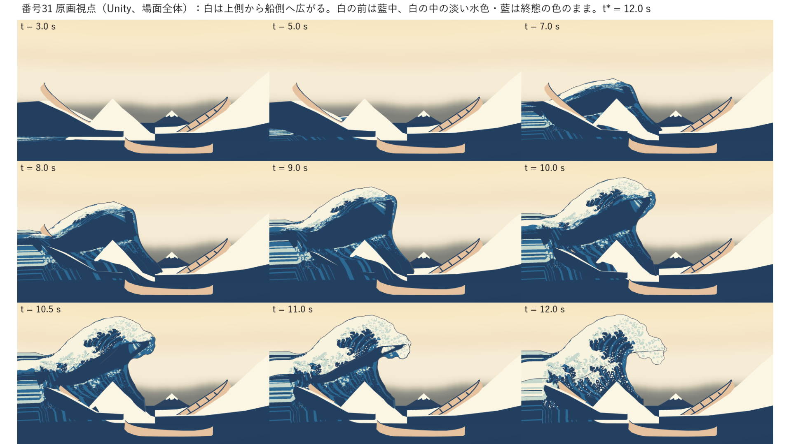
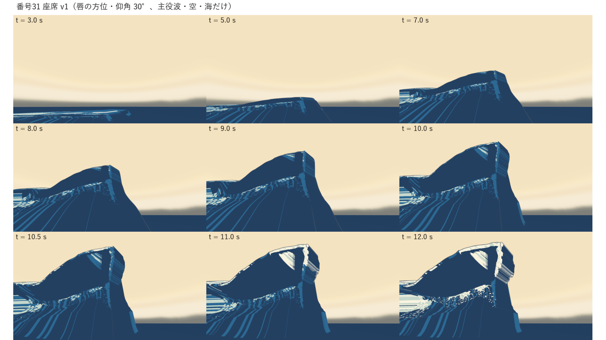
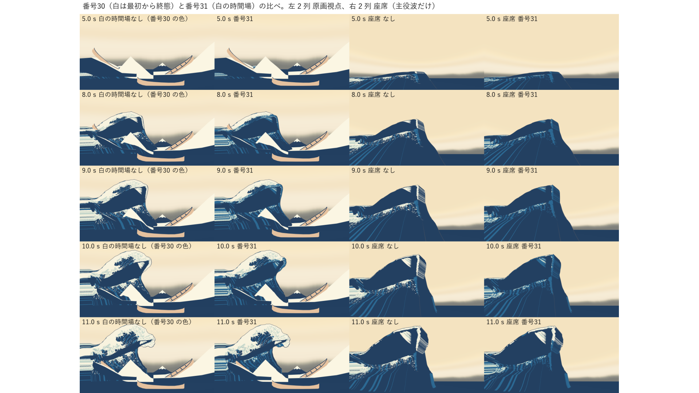
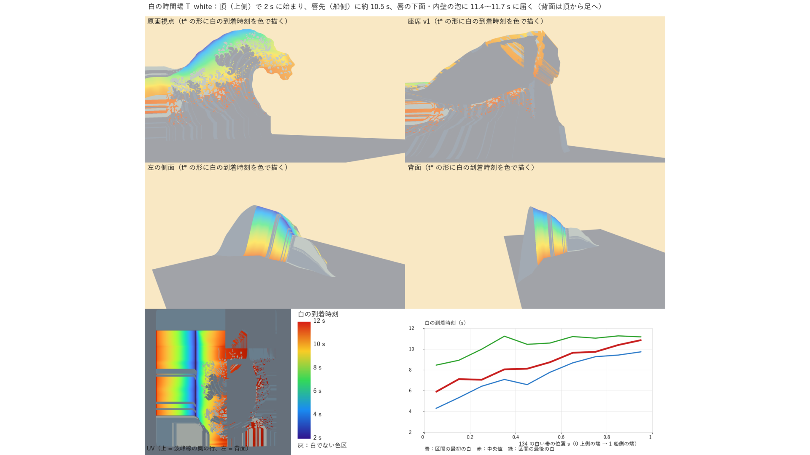
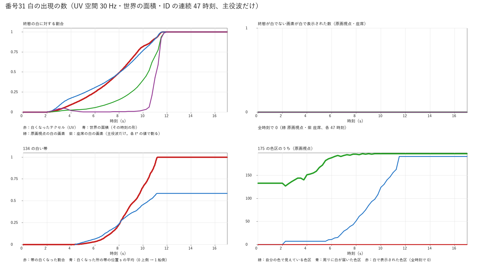
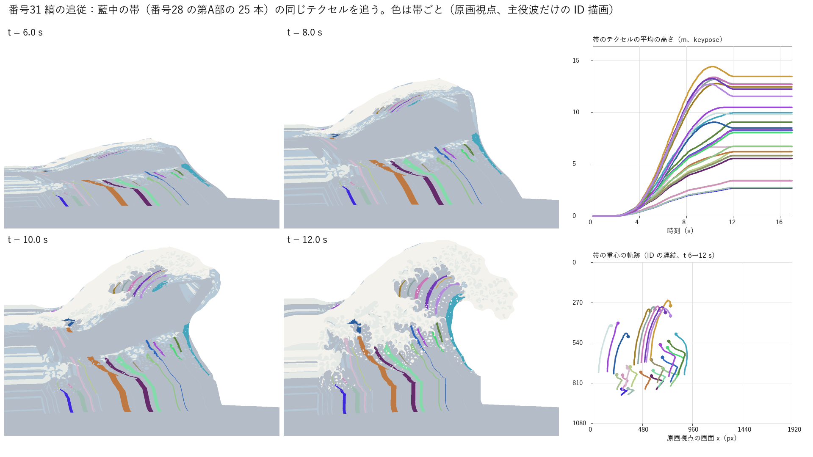

# 31：白の出現と縞の追従を形成の動きに載せる

日付：2026-09-26／結果：番号30 の形成の動き（K0→K\*、keypose）に、白の時間場 T_white を加えた。白は形成の始まり（2.0 s、水面が上がり始める時刻）に頂（上側）で面積 0 から現れ、唇の上面を船側の唇先（約 10.5 s）へ、さらに唇の下面（約 9.8〜11.4 s）・内壁の泡（約 11.3〜11.7 s）へ広がり、t\* の 0.2 s 前（11.8 s）に終態の白の全部に届く。白は終態（28修正01 の焼き込み）で白の所にだけ出し、それより前はその所を「白の前の色」（藍中）で塗る。白でない色区（白の中の淡い水色・藍中・藍濃を含む）は時刻によらず終態の色なので、一時的な白の塗りつぶしは作りから起きない。縞（藍の色区）は UV に貼り付いていて、同じ水面とともに上がる。**102・135・176・177 はすべて合格**（既定の読み。下の表）。t\* の画像は番号30 と画素まで同じで、t\* の再測定の値も番号30 と同じ（175 だけ不合格のまま）。白の時間場を切ると、原画視点と座席（主役波だけ）の動画が番号30 の動画と SHA-256 まで一致する。

この「31」は美術優先の作業計画（[ArtFirst_Plan_2026-09-25_ja.md](../Design/ArtFirst_Plan_2026-09-25_ja.md) 4.2）の番号（美術優先31）で、設計書の番号31 とは別である。AGENTS.md（Q8）の CP2 主線の例外（美術優先の27修正01・26修正01・28修正01・30・31 は走り切る）の最後の 1 件にあたる。

- 時間の上限：1.5 日（作業計画 4.1）。実績は約 1 時間（2026-09-26 17:10 頃〜18:15 頃、同じ時計）。Unity の実行は 6 回（下見 16 秒、組み立てと描画 104・105・104・103・104 秒。毎回 `Unity/Build/unity.lock` を排他的に作ってから 1 プロセスだけ動かし、終わったら消した）。最後に全体の手順（`run_af31.ps1`、205 秒）を通した出力を証拠にした（その後、run.json の決定性の記録の文だけを直して証拠のまとめ（af31_evidence.py）を 2 回やり直した。2 回目はレビューの指摘で、どの動画が比べられたかと 3 回目と 4 回目の間の変更を正しく書き直した。図・数値は同じ）。
- 修正回数：0（最初の提出）。提出前に直したこと（下の「作る途中で直したこと」）は提出した画像に対する修正ではないので数えていない。
- 対応するバックログ：102・135・176・177（G5）。
- 証拠の種類：numpy の UV（テクセル）空間の検査と、Unity 6000.4.3f1 Editor の batchmode による **PC のオフスクリーン描画**（RTX 3080、Direct3D11、Linear）。**HMD 実機の結果ではない**（HMD 未所持）。立体視は SPI のキーワードでのコンパイルだけを確かめた。
- 既定値（利用者未回答）として決めたもの：白の前の色（藍中）、白の出現の時機の表（下の「白の時間場」）、102 の「連続」の目安（30 Hz の 1 フレームで白くなる割合が終態の白の 2% 以下）、135 の「上側から船側へ」の読み、177 の「上がる」の読み。作業計画に数値がないので、この番号で決めて [af31_white.json](../../Tools/GWWaveGen/af31_white.json) と [af31_evidence.py](../../Tools/GWWaveGen/af31_evidence.py) に書いた。
- 参照モデル（Q5）は使っていない（作業計画 9.6：31 は変更なし）。Houdini は使っていない。

## 見るもの

| 原画視点（Unity、場面全体、t = 3〜12 s） | 座席 v1（唇の方位・仰角 30°、主役波・空・海だけ） |
| --- | --- |
|  |  |
| **番号30（白は最初から終態）と番号31 の比べ** | **白の到着時刻（t\* の形に色で描く）と 134 の帯に沿った到着** |
|  |  |
| **白の出現の数（UV・世界の面積・ID の連続）** | **縞の追従（藍中の帯 25 本の同じテクセル）** |
|  |  |

- 形成の動画（Unity、0〜17 s、60 fps、1021 コマ、1920×1080）：[原画視点](../Evidence/ArtFirst/31/af31_formation_painting_60fps.mp4)／[座席 v1（場面全体）](../Evidence/ArtFirst/31/af31_formation_seat_form_60fps.mp4)／[座席 v1（主役波・空・海だけ）](../Evidence/ArtFirst/31/af31_formation_seat_form_waveonly_60fps.mp4)／[左の側面（主役波・空・海だけ）](../Evidence/ArtFirst/31/af31_formation_side_left_waveonly_60fps.mp4)
- 白の広がりの対照動画（2×2、1920×1080）：[左 白の時間場なし（番号30 の色）・右 番号31、上 原画視点・下 座席](../Evidence/ArtFirst/31/af31_compare_30_60fps.mp4)
- 静止画の一覧：[座席 v1（場面全体）](../Evidence/ArtFirst/31/af31_seat_white.png)
- 数値：[metrics.json](../Evidence/ArtFirst/31/metrics.json)（`summary_verdicts` が項目ごとの判定、`items` が値）、実行条件と SHA-256：[run.json](../Evidence/ArtFirst/31/run.json)

動画と静止画はすべて Unity の実描画で、主役波は keypose の頂点シェーダー（番号30）と AF31 NPR White、背景は 27修正01 のプレハブ。「主役波・空・海だけ」は船・富士・仮置きを描画の間だけ隠した確認図。数の図と縞の図は、Unity の ID の描画（主役波だけ、線なし）と numpy の値を人が見るための図。形成の途中の配色は、この動画を利用者が目で確かめる必要がある（作業計画 31 の注意：t\* の ΔE00 は投影の焼き込みで構造上満たされるが、完成を意味しない）。

## 結果

| 項目 | 基準（既定の読み） | 値 | 判定 |
| --- | --- | --- | --- |
| 102 水面が上がり始めると上側に白が現れる | 白は 0 から連続して現れ、終態の白の内側にある | 最初の白 2.012 s（形成の始まり 2.0 s）、2.0 s より前の白 0。3 s までに白くなったテクセルは頂のまわり（ρ −0.04〜0.03）。白くなるテクセルの割合は単調で、30 Hz の 1 フレームの増分の最大 0.72%（目安 2%）、世界の面積の 1 フレームの増分の最大は終態の 1.16%。終態が白でないテクセルが白になる数 0（UV、30 Hz の全フレーム。表示の規則から作りで 0 になることの確かめ）、ID の描画で表示が白で終態が白でない画素 0（原画視点・座席、各 47 時刻）。原画視点の最初の白の画素 2.25 s（ID は 0.25 s おき） | 合格 |
| 135 上側の白が船側へ曲がる水面に沿って広がる | 上側から船側へ連続して広がり、t\* で終態の白に達する。終点 ≤4 px | 134 の白い帯（上側の端 → 船側の端、t\* の原画視点の 43,553 テクセル）を 10 区間に分けた到着時刻の中央値 5.89 → 7.12 → 7.05 → 8.05 → 8.12 → 8.75 → 9.65 → 9.75 → 10.38 → 10.85 s（順位相関 0.988）。最初の 5% の白は帯の位置 s 0.09、最後の 5% は s 0.85。帯の白くなる割合の 1 フレームの増分の最大 1.84%、帯は 11.27 s に全部白。終点：133 0.53 px・134 0.98 px・79 0.34 px | 合格 |
| 176 白が広がる間も白の中の藍・水色が見える | 一時的な白の塗りつぶし 0 | 175 の 198 の色区のうち 197 を t\* の原画視点から UV の連結成分へ対応させた（M171 は t\* で描画に残らない。28修正01 と同じ）。ID の連続（原画視点・座席、各 47 時刻）で、色区の画素が白で表示された件数 0・画素 0。白が周りに届いてから t\* まで毎時刻見えている色区 195/197、t\* で見える 197/197（M167・M178 は 17・11 表示 px² の小さな斑で、一部の時刻に画素が 0。白での表示は 0） | 合格 |
| 177 同じ縞が同じ水面とともに上がる | 同じ縞が同じ水面に沿って上がり、t\* で原画の配置に達する。終点 ≤4 px | 藍中の帯 25 本すべてを UV の成分へ対応。色は UV に貼り付いているので、帯は全時刻で同じテクセル（同じ水面）。帯の画素の表示は全 47 時刻で 100% 藍中（白の時間場で変わらない）。帯の同じテクセルの平均の高さは全 25 本で t = 2 s の 0 m から t\* の 2.7〜13.5 m へ上がる。唇に乗る 8 本は唇が投げ出された後に水面ごと 0.14〜1.17 m 下がる（1/30 s の下がりの最大 0.028 m）。下側の 8 本の並び（原画視点の重心の x の順）は全 47 時刻で t\* と同じ（入れ替わり 0）。終点：77 1.17 px・118 0.66 px | 合格 |
| t\* が番号30 と同じ | 28修正01 と同じ評価 | t\* の原画視点・座席の画像（色・色区 ID・線 ID の 10 枚）が番号30 と画素まで同じ。色区の境界は全項目で番号30 と差 0（133 0.534、263 0.594 は番号30 と同じ値で、28修正01 からの差も番号30 と同じ）、175 は不合格のまま（18.38 px）。輪郭 78/130/131/132 = 1.64/1.93/1.80/1.54 px、72 最大 5.78（p95 1.73） | 合格（番号30 と同じ） |
| 白の時間場を切ると番号30 と同じ | 動画の SHA-256 | 原画視点 68f80d39…4594、座席（主役波だけ）a4d0f48f…ce02 が番号30 の動画と一致 | 合格（確かめ） |
| SPI のコンパイル | AF31 NPR White | キーワードなし・INSTANCING_ON・STEREO_INSTANCING_ON の 6 段がすべて可、立体視の頂点出力に SV_RenderTargetArrayIndex あり | 合格（コンパイルだけ） |

## 白の時間場（[af31_white.json](../../Tools/GWWaveGen/af31_white.json)、既定値・利用者未回答）

- **白の波面の座標 ρ**：K\* の各行（波峰線に垂直な断面）で、弧長を区間ごとに正規化した列の座標。頂（j_top）0 → 唇先（j_tip）1 → 角（j_corner）2 → 内壁の下（j_facebot）3 → 前の足（j_E）4。背面の側は頂 0 → 背面の足（j_B）−1。区間の列は番号30 の rig（af30_rig.json）と同じ。
- **時刻の表**：前（頂 → 船側）[2.0 s, 0]、[3.5, 0.05]、[5.0, 0.15]、[6.5, 0.3]、[8.0, 0.5]、[9.2, 0.72]、[10.0, 0.9]、[10.5, 1.0]、[11.0, 1.4]、[11.35, 2.0]、[11.65, 3.0]、[11.8, 4.0]。後ろ（頂 → 背面の足）[2.0, 0]、[4.0, 0.1]、[6.5, 0.3]、[8.5, 0.55]、[10.5, 0.85]、[11.8, 1.0]。端の傾き 0 の単調な 3 次補間（番号30 と同じ clamped_pchip）でつなぎ、T_white(ρ) はその逆関数。始まりの傾きが 0 なので、白の面積は 0 から滑らかに増える。
- **揺らぎ**：波峰線方向の座標 c の滑らかな関数 n(c)（波長 7.3・3.1・1.7 m の正弦の和）で ρ′ = ρ + A·n(c)·(ρ_max/π)·sin(πρ/ρ_max)（前 A 0.18、後ろ 0.12）。行の中では dρ′/dρ ≥ 1 − A > 0 で単調なので、白は頂から途切れずに広がり、先回りした白の島を作らない。波面は波峰線に沿って少し波打つ。
- **区間ごとの到着**（UV のテクセル、終態の白 4,664,143 のうち）：背面 2,285,311（2.01〜11.31 s）、唇の上面 1,791,054（2.05〜10.75 s）、唇の下面 430,229（9.78〜11.43 s）、内壁 157,528（11.26〜11.67 s）。全部そろうのは 11.687 s。
- **白の前の色**：藍中。番号28 の第A部で、バックログの「水色」の既定の読みを藍中にした（既定値・利用者未回答）ので、102 の「水色から白へ変わる」に当たる。淡い水色にすると、白の中の淡い水色の斑（175 の面積の 97%）が白の前の色と同じになって見分けられないので、既定にしなかった（別案として JSON に残した）。

## 作ったもの

| ファイル | 内容 |
| --- | --- |
| [af31_white.json](../../Tools/GWWaveGen/af31_white.json)・[af31_white.py](../../Tools/GWWaveGen/af31_white.py) | 白の時間場の全パラメータと生成器（numpy）。頂点ごとの T_white（R32 float、列 400 × 行 240、384,000 バイト）と、UV 空間の検査（30 Hz・511 フレーム。白くなったテクセルの割合、番号30 の keypose で求めた世界の面積、白でないテクセルが白になる数） |
| [AF31_NPR_White.shader](../../Unity/Assets/GreatWave/ArtFirst/Shaders/AF31_NPR_White.shader) | 番号30 の AF30 NPR Keypose と同じ位置の補間（AF30Keypose.cginc を読むだけ）と色の式に、T_white を加えたもの。頂点シェーダーが SV_VertexID で T_white を Load し、三角形の中は線形に補間する。終態の色区が白の所だけ、t < T_white のあいだ白の前の色で塗る。白の波面のアンチエイリアスは fwidth(T_white) で約 1 画素。検査の表示（表示の色区 ID・終態の色区 ID・UV3 のテクセル番号・白の到着時刻）を大域の値で切り替える |
| [AF31WhiteField.cs](../../Unity/Assets/GreatWave/ArtFirst/Scripts/AF31WhiteField.cs) | T_white を RFloat のテクスチャにして大域の値で渡し、GWClock の時刻を渡す（SHA-256 を照合してから読む）。番号30 の GWClock・AF30KeyposeWave は変えていない |
| [AF31WhiteFormation.cs](../../Unity/Assets/GreatWave/ArtFirst/Editor/AF31WhiteFormation.cs) | 番号30 の AF30Formation と同じ手順の組み立て・採取（t\* の 28修正01 と同じ名前の画像、静止画、ID の連続 47 時刻 × 2 視点 × 3 種、白の到着時刻の図、動画 6 本、SPI のコンパイル、保護したファイルの SHA-256） |
| `AF31_NPR_White.mat`・`AF31_Outline_Keypose.mat`・`AF31_White.unity` | マテリアルは番号28 のマテリアルの値を写して作る（外殻線は番号30 の AF30 Outline Keypose シェーダーを使う自分のマテリアル）。シーンは実行のたびに作り直す（最後の SHA-256 e898f0cd…547c は run.json） |
| [af31_tstar_eval.py](../../Tools/GWWaveGen/af31_tstar_eval.py) | 番号30 の af30_tstar_eval.py と同じ処理で、28修正01 の評価（af28r01_evaluate.py）を番号31 の t\* の画像に走らせる |
| [af31_evidence.py](../../Tools/GWWaveGen/af31_evidence.py) | 102・135・176・177 の測定、図、比べる動画、metrics.json、run.json |
| [run_af31.ps1](../../Tools/GWWaveGen/run_af31.ps1)・[run_af31_unity.ps1](../../Tools/GWWaveGen/run_af31_unity.ps1) | 全体の手順と、unity.lock を取ってから Unity を 1 プロセスだけ動かす実行（番号30 と同じ手順） |

### 測り方

- **ID の連続**：0・1・1.75 s、2〜12 s の 0.25 s おき、13・15・17 s の 47 時刻に、原画視点と座席 v1 で、主役波だけを線なしで 3 種類描いた（線形の RT、MSAA なし）。表示の色区 ID（白の時間場の後）、終態の色区 ID（白の時間場を見ない）、UV3 のテクセル番号（24 bit で U・V を 12 bit ずつ）。
- **色区の対応（176・177）**：t\* の原画視点で、番号28 の第A部の色区の多角形（1 px 縮めた）の中で表示が同じ色区の画素のテクセルを集め、そのテクセルの 10% 以上が入る UV の連結成分（終態の色区ごと、8 近傍）を、その色区の成分とした。各時刻で、UV の成分がその色区のもので、同じ時刻の終態の ID もその色の画素を、その色区の画素とした（テクセルの中心の色区とフィルターした距離の argmax が境界の 1 画素で食い違う所を除くため）。2 つの色区が同じ成分に当たる所（2 成分）は、成分ごとに数えてから色区へ足した。
- **134 の帯（135）**：番号28 の第A部の 134 の帯（外輪郭の 237 点から内向きの法線に沿って帯の幅まで）の中で、t\* に白で表示された画素のテクセルを帯のテクセルとし、点の順番から帯の位置 s（上側の端 0 → 船側の端 1）を付けた。帯は UV に固定しているので、各時刻の白は T_white ≤ t のテクセルで決まる。
- **177 の高さ**：帯の t\* のテクセルを格子の小数の位置へ直し、番号30 の keypose（GPU と同じ Catmull-Rom）の頂点を GPU と同じ三角形で補間した高さの平均（30 Hz）。

## 作る途中で直したこと（提出前。修正回数に数えない）

1. **176 の数え方**：最初は UV の成分だけで色区の画素を決めたので、色区の境界の 1 画素（テクセルの中心は藍・淡い水色で、描画はフィルターした距離で白）が「白で表示された」と数えられ、原画視点 2,129 件になった。終態の ID でも白の画素なので一時的な白ではない。同じ時刻の終態の ID がその色区の色である画素だけを数えるようにして 0 件になった（ID の描画で「表示が白で終態が白でない画素」は最初から全時刻で 0）。
2. **t\* の色が 4 画素ずれた**：t\* でも輪郭の縁の数画素で fwidth(T_white) が大きくなり、白が 3/255 だけ薄まった。白が全部そろう時刻（11.8 s）以後は白の時間場を見ないようにし、t\* の画像が番号30 と画素まで同じになった。
3. **白の時間場を切った動画が番号30 と一致しない**：白がそろった所の色を lerp(白の前の色, 白, 1) で作っていたので、番号30 の色から 1 ulp ずれる画素があり、原画視点の動画の符号化が変わった（静止画は同じ）。白がそろった所は白そのものを使うようにして、SHA-256 まで一致した。
4. **色区の対応**：2 つの色区が同じ UV の成分に当たると後の色区が前の色区を上書きし、3 つの色区が「見えない」と数えられた。成分ごとに数えてから色区へ足すようにした。

## 限界と保留

1. **番号31 の範囲外の途中の配色は残る**：唇が巻き切る前（9〜11.5 s）に唇の下面（t\* で隠れ、焼き込みで藍濃）が原画視点で前を向いて、白の中の暗い帯に見える。座席から唇の奥に 28修正01 の櫛の歯が見える。どちらも見えない面の配色で、番号41 で扱う。
2. **平らな海・低いうねりの上の縞**：0〜6 s は、白の色区は白の前の色（藍中）になったが、淡い水色・藍中・藍濃の色区は K\* の配色が押し縮められた縞のまま見える（原画視点の左下、座席の左下）。縞は同じ水面に貼り付いて動く（177）。平らな海での見え方と周りの海とのつなぎは番号41 と 260（接合をまたぐ縞）の範囲。
3. **白の中の藍中の色区**：白の前の色を藍中にしたので、175 の藍中の 16 成分は、白が周りに届くまで白の前の色と同じ色で見分けられない（塗りつぶしではなく、白は一度も表示していない）。淡い水色の 166 成分は常に見分けられる。
4. **白の波面の形**：波面は ρ の等値線（波峰線に沿って揺らぐ）で、滑らかな線として進む。泡が咲くような出方（色区ごとの成長）は入れていない。形の細かさは終態の白の色区の境界（爪・斑）から来る。
5. **座席からの白**：座席 v1（唇の方位・仰角 30°）からは、白は 2〜4 s に頂に少し見え、5〜8 s は頂が向こうを向くので見えない。唇先・唇の下面・内壁の泡の白は 10.5〜11.7 s に現れる（形のため。表示の数は metrics.json の id_series）。
6. **原画視点で白がはっきり見えるのは 7〜8 s から**：それより前は波が低く、原画視点の仮置き（番号39・40 まで）の後ろにある。早く見せたいなら時刻の表を変える（「利用者に決めてほしいこと」2）。
7. **177 の「上がる」**：全 25 本が t = 2 s から t\* までに上がる。ただし唇に乗る 8 本は、唇が投げ出された後に水面ごと最大 1.17 m 下がる（縞は水面に付いて動くので、水面の落下と同じ）。単調に上がり続けるわけではない。
8. **性能は測っていない**：頂点ごとの Load が 1 回、画素の分岐が数個増えた。81/112 の測定は番号32 の手順で行う必要がある。
9. **立体視**：SPI のキーワードでのコンパイルだけ。Mock Runtime の両眼の描画と HMD 実機は確かめていない（HMD 未所持）。
10. **ほかの場面は変えていない**：keypose の再生と白の時間場は AF31_White.unity だけ。CP1 の合成・26修正01・27修正01・28修正01・30 のシーンは変えていない。体験の場面への統合は番号38・43。
11. 72 の最大 5.78 px（p95 1.73 px）と 175 の不合格（18.38 px）は 26修正01・28修正01・30 と同じ。外殻線 v0 の内側の線は番号36。

## 利用者に決めてほしいこと

1. **白の前の色**：(a) 藍中（既定値・利用者未回答。バックログの「水色」の既定の読み）。(b) 淡い水色（白の中の淡い水色の斑が白の前には見分けられない）。(c) 藍濃（波の胴と同じ色。白の中の藍濃の斑が見分けられない）。
2. **白の出る時機と速さ**：今は 2.0 s に頂で始まり、唇先に 10.5 s、全部が 11.8 s（既定値・利用者未回答）。原画視点では 7〜8 s から白がはっきり見える。動画を見て、早める・遅らせる・唇の区間だけ速くする、などを決めてほしい（[af31_white.json](../../Tools/GWWaveGen/af31_white.json) の表を変えて `run_af31.ps1` で約 3 分で作り直せる）。

## 再現方法と生成物

リポジトリの根で次を実行する（Python 3.10.6、numpy 2.2.6、OpenCV 4.12.0、Pillow 12.0.0、Unity 6000.4.3f1、ffmpeg 2024-12-19）。全体で約 3.4 分（205 秒）。26修正01 の K\*（`Unity/Build/ArtFirst/26修正01/kstar/`）、28修正01 の焼き込み（`Unity/Build/ArtFirst/28修正01/`）、番号30 の keypose（`Unity/Build/ArtFirst/30/keypose/`、`run_af30.ps1` で作る）が要る。

```
powershell -NoProfile -ExecutionPolicy Bypass -File Tools/GWWaveGen/run_af31.ps1 [-SkipUnity]
```

中身は次の段である。

```
py -3.10 Tools/GWWaveGen/af31_white.py --stage all
powershell -NoProfile -ExecutionPolicy Bypass -File Tools/GWWaveGen/run_af31_unity.ps1 -Method GreatWave.ArtFirst.EditorTools.AF31WhiteFormation.BuildAndRender -Log build_render
py -3.10 Tools/GWWaveGen/af31_tstar_eval.py
py -3.10 Tools/GWWaveGen/af31_evidence.py
```

- 決定性：全体の手順を 4 回通した。1 回目と 2 回目は動画 7 本・T_white・ID の画像 282 枚の SHA-256 がすべて一致した。2 回目と 3 回目の間に上の「作る途中で直したこと」3 を入れ、3 回目で、Unity が出す白の時間場ありの動画 4 本（原画視点・座席 v1 の場面全体・座席 v1 の主役波だけ・左の側面）と白の時間場なしの座席（主役波だけ）の動画 1 本は 1・2 回目と同じ SHA-256、白の時間場なしの原画視点の動画は 1・2 回目から変わって番号30 と同じ SHA-256 になった（これを使う 2×2 の対照動画も変わった）。3 回目と 4 回目の間は検査の数え方だけを変え（af31_white.py の白でないテクセルの確かめを全フレームにした。af31_evidence.py の 176 を成分ごとに数えるようにした＝上の「作る途中で直したこと」4 で、白が届いてから毎時刻見える色区が 192/197 から 195/197 になった）、4 回目の動画 7 本・T_white・ID の画像は 3 回目と同じ SHA-256（run.json の `determinism_ja`・`white_off_vs_af30_video`）。証拠は 4 回目の出力。
- Git に入れるもの：`Tools/GWWaveGen/`（af31_white.json、af31_white.py、af31_tstar_eval.py、af31_evidence.py、run_af31.ps1、run_af31_unity.ps1）、`Unity/Assets/GreatWave/ArtFirst/`（Shaders の AF31_NPR_White.shader、Scripts の AF31WhiteField.cs、Editor の AF31WhiteFormation.cs、Materials の AF31_NPR_White.mat・AF31_Outline_Keypose.mat。それぞれ .meta も）、`Unity/Assets/GreatWave/Scenes/Tests/AF31_White.unity`（.meta も）、証拠 `Docs/Evidence/ArtFirst/31/`（図 7 枚、MP4 5 本（各 5 MB 以下）、metrics.json、run.json、約 20 MB）、この文書。
- Git に入れないもの：`Unity/Build/ArtFirst/31/`（既存の `/Unity/Build/` の規則で対象外）。T_white（white/af31_twhite_r32f.bin、SHA-256 8a18f2e0…a73d）、UV の検査とキャッシュ、ID の画像 282 枚、静止画、白の到着時刻の図、動画 7 本（白の時間場なしの 2 本と比べる動画を含む）、t\* の再測定（t28/、28修正01 の焼き込みのハードリンクを含む）、ログ。SHA-256 は run.json の `not_committed_sha256`。
- 記録した SHA-256 と Git のブロブを一致させるため、`.gitattributes` に `/Unity/Assets/GreatWave/Scenes/Tests/AF31_White.unity* -text` を加える必要がある（進行役。`Tools/GWWaveGen/**`・`Docs/Evidence/ArtFirst/**`・`Unity/Assets/GreatWave/ArtFirst/**` は既存の規則の対象）。
- 番号24・26・26修正01・27修正01・28・28修正01・30・32・CP1 のプレハブ・マテリアル・シェーダー・スクリプト・シーンと、K\*・焼き込み・keypose・seat_v1.json（39 ファイル）は読むだけで、組み立てと描画の前後で SHA-256 が一致した（`af31_build_report.json`・`af31_render_report.json` の protectedUnchanged）。
- 旧試作の禁止場所と 732e198 より前の履歴には触れていない。参照モデル（`G:\research\model`）は開いていない。
