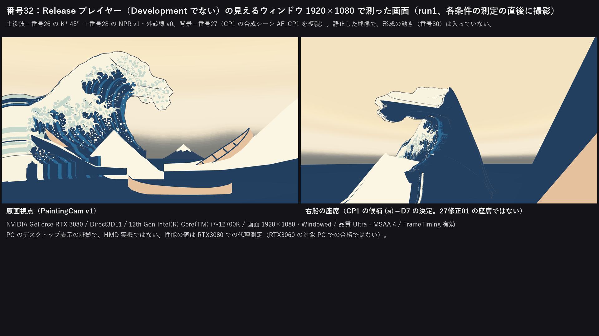
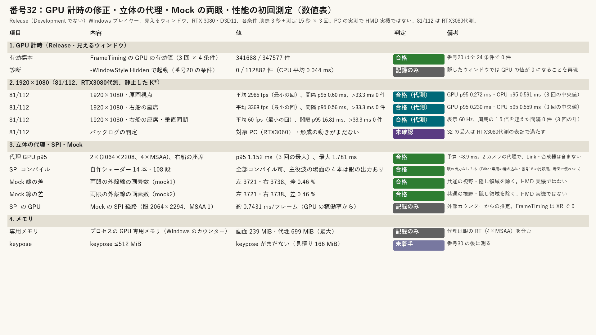
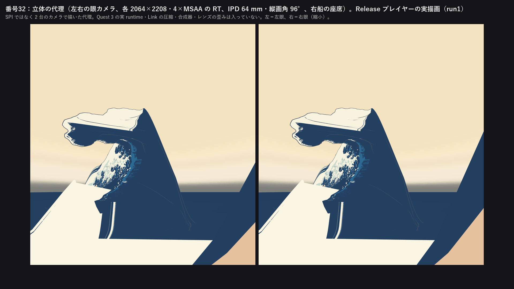
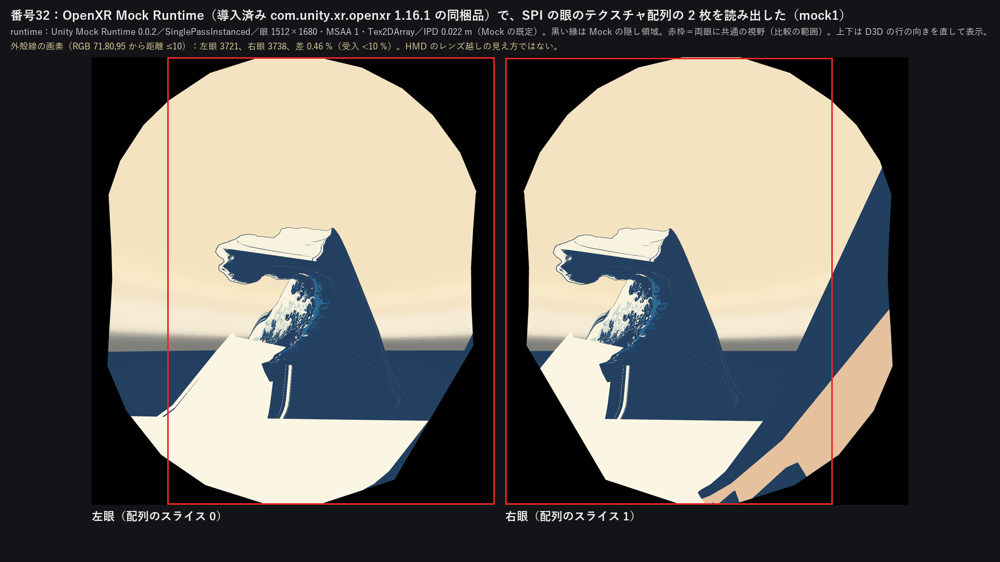

# 32：GPU 計時の修正、立体視の代理と Mock、性能の初回測定

この「32」は2026-09-25の新作業計画（[計画 4.2](../Design/ArtFirst_Plan_2026-09-25_ja.md)）での番号である。

**32 の結果（2026-09-26）**：Release（Development でない）の Windows プレイヤーを見えるウィンドウで動かし、`enableFrameTimingStats` を入れてビルドすると、FrameTimingManager の GPU の値が取れた（3 回 × 4 条件で有効値 341,688 / 347,577 件。番号20 は全 24 条件で 0 件）。同じプレイヤーを `-WindowStyle Hidden` で起動すると有効値は 0 / 112,882 件になり、番号20 の 0 件は隠したウィンドウで再現した。1920×1080 の画面（静止した K\*）は平均 2,986 fps 以上・フレーム間隔の 95% が 0.60 ms 以下、垂直同期ありでも 60 fps・間隔の 95% が 16.81 ms 以下で、**81/112 の条件を RTX3080代測で満たした**（対象 PC の RTX3060 ではなく、形成の動きもまだないので、バックログの判定は未確認のまま）。立体の代理（各眼 2064×2208・4×MSAA）の GPU p95 は最大 1.152 ms で、**予算 8.9 ms 以下**。自作シェーダー 14 本はすべて SPI のキーワードでコンパイルでき、主役波の場面で使う 4 本は眼のスライスへ振り分ける出力を持つ。導入済みの OpenXR パッケージに同梱の **Mock Runtime で SPI の両眼を描けた**。外殻線の画素数の左右差は 0.46%（受入 <10%）。keypose はまだないので、≤512 MiB は未判定。**HMD 実機の結果ではない。**

- 時間の上限：2 日（作業計画 4.1）。実績は約 1 時間（2026-09-26 12:30〜13:20 頃、UTC+8 の同じ時計）。損切り（1 日で有効な GPU 値が取れなければ Profiler → PresentMon）は発動していない。PresentMon は導入していない。
- 修正回数：0（最初の提出）。作る途中の試し（下の「作る途中で直したこと」）は提出した値に対する修正ではないので数えていない。
- 対応するバックログ：81、112（性能。RTX3080代測）。作業計画 32 の受入（GPU の有効標本、代理の GPU p95、Mock の両眼の線、keypose のメモリ）。
- 証拠の種類：Unity 6000.4.3f1 の Release プレイヤーを見えるウィンドウで動かした **PC の実測**（RTX 3080、Direct3D11、i7-12700K）と、OpenXR Mock Runtime で読み出した両眼の眼のテクスチャ。HMD 実機、Link、Quest の runtime の結果ではない。
- 主役波：CP1（370297c）の合成と同じもの。番号26 の K\* 45°（`kstar_a45.gwb`）、番号28 の NPR v1 と外殻線 v0（`af28_uvsdf_a45.bin`、`af28_uvwarp_a45.json`）、番号27 の背景（`AF27_Context.prefab`）。3 つのデータは、CP1 の run.json の SHA-256 と一致することを確かめてから `Unity/Build/ArtFirst/32/data/` へ複製し、そこから読んだ（26修正01・27修正01 の作業中に元のファイルが変わっても測定が変わらないように）。シーン `AF_CP1.unity` の SHA-256 もコミット時と一致した。
- 座席：D7 の決定（右船）に合わせ、CP1 の候補 (a)「CP1 座席候補 右船カメラ」を使った。27修正01 で作り直している座席とは位置が違う可能性がある。
- 計画との違い：計画は「batchmode のロックを避けるため 2 つ目の worktree で行う」とするが、進行役の指示で同じ作業コピーを `Unity/Build/unity.lock` の排他で使った（Unity の実行は 2 回、各 15〜21 秒）。

## 見るもの

| Release プレイヤーの画面（見えるウィンドウ 1920×1080） | 数値表 |
| --- | --- |
|  |  |
| **立体の代理（左右の眼の RT）** | **Mock Runtime の両眼（SPI の眼のテクスチャ配列）** |
|  |  |

- 数値：[metrics.json](../Evidence/ArtFirst/32/metrics.json)（項目→値→判定。条件ごと・回ごとの値、外部カウンター、Mock の両眼の数え方もここ）、実行条件と SHA-256：[run.json](../Evidence/ArtFirst/32/run.json)
- 画面と両眼の画像は Release プレイヤーの実描画を、各条件の測定が終わってから撮ったもの。文字と枠は人が見るために足した（256 色 PNG）。

## 作ったもの

1. **計測器**（[AF32PerfRunner.cs](../../Unity/Assets/GreatWave/ArtFirst/Scripts/AF32PerfRunner.cs)）：プレイヤーの中で動く。`Screen.SetResolution(1920, 1080, Windowed)` のあと、条件ごとに助走 3 秒・測定 15 秒。毎フレーム `FrameTimingManager.CaptureFrameTimings()` を呼び、`GetLatestTimings(8)` の結果をフレームの開始時刻で重複を除いて集める（CPU、メインスレッド、描画スレッド、提示の待ち、GPU、同期間隔、開始時刻）。Release でも使える Profiler の記録器（`Render/GPU Frame Time` とメモリの値）も同時に読む。測定中は画像の保存・読み戻しをしない。
   - 条件：① 1920×1080・原画視点（PaintingCam v1）、② 1920×1080・右船の座席、③ ② と同じで垂直同期あり、④ 立体の代理（右船の座席から左右の眼カメラ、IPD 64 mm、縦画角 96°、各 2064×2208・4×MSAA の RT へ描き、画面へ縮小表示）。①〜③ は画面へ直接描く（品質 Ultra の 4×MSAA）。
   - Mock のとき（`-af32mode mock`）：`XRGeneralSettings` のマネージャーで OpenXR ローダーを初期化し、座席のカメラを両眼（`StereoTargetEyeMask.Both`）にする。眼のテクスチャ配列の 2 枚をカメラの最後のコマンドバッファで複写し、`ScreenCapture` の左・右・両眼も撮る。そのあと眼のテクスチャを 2064 幅に広げて 10 秒の窓を取る（SPI の経路の GPU 時間を外部カウンターから割り出すため）。
2. **ビルド**（[AF32PerfBuild.cs](../../Unity/Assets/GreatWave/ArtFirst/Editor/AF32PerfBuild.cs)）：
   - 自作シェーダーの SPI 検査：`Assets/GreatWave` 以下の 14 本の全パスを、キーワードなし・`INSTANCING_ON`・`STEREO_INSTANCING_ON INSTANCING_ON` で頂点・フラグメントをコンパイルし（108 段）、立体視の頂点シェーダーは前処理後のコードで頂点関数の戻り値の構造体に `SV_RenderTargetArrayIndex`（SPI で眼のスライスへ振り分ける出力）があるかを見た。
   - シーン：`AF_CP1.unity` を `AF32_Perf.unity` へ複製し、K\* 30°・60° を消して 45° だけを残し、計測器を置いた。CP1・番号26〜28 の資産 13 ファイルは読むだけで、前後の SHA-256 が一致した。
   - プレイヤー：`BuildOptions.None`（Development・Profiler 接続なし）の Windows x64。`PlayerSettings.enableFrameTimingStats` はビルドの間だけ true にし、finally で元の false に戻した。
3. **実行の手順**：[af32_run_unity.ps1](../../Tools/Perf32/af32_run_unity.ps1)（ロックを取り、Unity の前後で `ProjectSettings/*.asset`・`Assets/XR` の設定・`Packages/manifest.json` のバイトを比べ、変わっていれば戻す。2 回とも変化 0）、[af32_run_player.ps1](../../Tools/Perf32/af32_run_player.ps1)（プレイヤーを普通のウィンドウで起動し、終わるまで 1 秒ごとに Windows の GPU カウンターと nvidia-smi を読む）、[af32_analyze.py](../../Tools/Perf32/af32_analyze.py)（集計・判定・図）。
4. **Mock Runtime の使い方**：Mock の機能（OpenXR の設定の Mock Runtime）は有効にせず、プロジェクトの設定も変えていない。プレイヤーを起動するスクリプトのプロセスの中だけで、環境変数 `XR_RUNTIME_JSON` を導入済みパッケージ（`com.unity.xr.openxr` 1.16.1）の `Runtime/MockRuntime/unity-mock-runtime.json` に向けた。パッケージの試験用の `MockOpenXREnvironment` が Khronos のローダーで Mock を使うときと同じ経路である。システムの OpenXR の active runtime、レジストリは変えていない。新しいものは何も導入していない。

## 結果

### 1. GPU 計時（作業計画 32 の受入：有効標本 >0）

| 実行 | 条件 | GPU の有効値 | 備考 |
| --- | --- | --- | --- |
| run1〜3（見えるウィンドウ） | 4 条件の合計 | 341,688 / 347,577 件 | 垂直同期なしの画面の条件で 1〜3% が 0（使わない）。代理と垂直同期ありは 100% |
| hidden1（`-WindowStyle Hidden`、診断） | 右船の座席 | **0 / 112,882 件** | ウィンドウのハンドル 0、CPU 平均 0.044 ms・22,575 fps（描画を省いているとみられる） |

- 同じ Release プレイヤーで、見えるウィンドウなら有効、隠すと 0 件になった。番号20 の 0 件は、隠したウィンドウだけで再現する。番号20 のもう一つの違い（Development ビルド）が値を 0 にするかは試していない。
- Profiler の記録器 `Render/GPU Frame Time` も Release で有効で、FrameTiming と同じ値だった（run1 の原画視点で平均 0.2751 ms・p95 0.2673 ms）。Profiler の GPU モジュールへの切り替えは要らなかった。
- 外部の確かめ：Windows の「GPU Engine（3D）の Running Time」の増分から出した GPU の稼働率 × フレーム間隔は、原画視点 0.29 ms、右船の座席 0.25 ms、代理 0.82 ms（3 回の中央値）で、FrameTiming の平均（0.28、0.24、0.81 ms）と合う。

### 2. 1920×1080（81/112、RTX3080代測、静止した K\*）

各条件 15 秒 × 3 回。フレーム間隔は FrameTiming のフレーム開始時刻の差（提示のループの周期）。

| 条件 | 平均 fps（3 回の最小） | 間隔の p95（3 回の最大） | >33.3 ms | GPU p95（中央値） | CPU p95（中央値） |
| --- | --- | --- | --- | --- | --- |
| 原画視点、垂直同期なし | 2,986 | 0.598 ms | 0 | 0.272 ms | 0.591 ms |
| 右船の座席、垂直同期なし | 3,368 | 0.560 ms | 0 | 0.230 ms | 0.559 ms |
| 右船の座席、垂直同期あり（60 Hz） | 60.0 | 16.81 ms | 0 | —（下の注） | 16.80 ms |

- 81/112 の条件（平均 ≥30 fps、95% ≤33.3 ms）は 3 条件とも満たした。**判定は「RTX3080代測」で、作業計画 32 の受入はこの表記で満たす。** バックログの 81/112 そのものは、対象 PC（RTX3060）で測っていないこと、形成の動き（番号30）がまだなく静止した終態を描いただけであることから、**未確認のまま**とする。
- 垂直同期ありで、表示の周期（Unity の報告で 60 Hz、16.67 ms）の 1.5 倍を超えた間隔は 3 回の計 0 件（2,700 件中）。
- 垂直同期ありでは FrameTiming の GPU 時間が提示の待ちを含み、間隔とほぼ同じ（平均 15.6〜16.0 ms）になる。GPU の負荷は垂直同期なしの条件で読む。外部カウンターでは、垂直同期ありの GPU 稼働は 1 フレームあたり 1.46〜1.85 ms で、垂直同期なし（0.25 ms）より大きい。低負荷で GPU のクロックが下がるためと思われるが、確かめていない。

### 3. 立体の代理（作業計画 32 の受入：GPU p95 ≤8.9 ms）

| 回 | GPU 平均 | GPU p95 | GPU 最大 | >8.9 ms | >11.1 ms | 平均 fps |
| --- | --- | --- | --- | --- | --- | --- |
| run1 | 0.804 ms | 1.136 ms | 1.781 ms | 0 | 0 | 1,184 |
| run2 | 0.811 ms | 1.148 ms | 1.566 ms | 0 | 0 | 1,173 |
| run3 | 0.814 ms | 1.152 ms | 1.530 ms | 0 | 0 | 1,171 |

- **p95 は最大 1.152 ms で予算 8.9 ms 以下（合格）。** ただしこれは 2 台のカメラで描いた代理で、SPI そのものではない。Quest 3 の runtime、Link の圧縮（計画の見積り約 1 ms）、合成器、レンズの歪みは入っていない。HMD 実機の 90 Hz の判定は番号34 で行う。
- 主役波は静止した K\* 1 枚（8 万頂点）で、keypose の補間、爪の群、飛沫はまだない。今の値は「今の場面の負荷が予算より十分小さい」ことを示すだけで、完成時の予算を保証しない。

### 4. SPI コンパイルと Mock Runtime の両眼

- **SPI コンパイル**：自作シェーダー 14 本・108 段がすべてコンパイルできた。主役波の場面で使う 4 本（AF27 Flat、AF27 Sky Dome、AF28 NPR v1、AF28 Outline v0）は頂点出力に `SV_RenderTargetArrayIndex` がある。ない 3 本は Editor 専用の焼き込み（AF28 Bake）と番号18 の比較用（Playback18 の Reference・VAT HDR）で、場面とプレイヤーでは使わない（記録）。番号28 の時点では AF28 の 2 本をコンパイルしただけだったので、この検査で範囲を全シェーダーに広げた。
- **Mock Runtime**：runtime「Unity Mock Runtime 0.0.2」（OpenXR API 1.1.53）でセッションが FOCUSED まで進み、`SinglePassInstanced`、眼のテクスチャは 1512×1680・2 枚の配列（Mock の既定の推奨解像度、MSAA 1）。両眼とも主役波・外殻線・空・海・右船が描かれた。
- **両眼の線の画素数**：両眼の射影行列から、左右の眼に共通の視野（正接で横 −1.055〜1.053、縦 −1.410〜1.410）を切り出し、Mock の隠し領域（黒）をどちらかの眼で含む画素を除いて、外殻線の色（RGB 71,80,95 から距離 ≤10）の画素を数えた。mock1・mock2 とも左 3,721・右 3,738、**差 0.46%（受入 <10%、合格）**。2 回の値は同じだった。共通の視野での両眼の平均の色の差は 1.72（8bit）と小さい（Mock の IPD は 22 mm）。
- Mock の既定の眼は左右で非対称の画角（左眼は左へ、右眼は右へ広い）なので、共通の視野に切ってから比べた。切らずに眼の全体で数えると左 3,752・右 3,738（記録）。
- **SPI の経路の GPU 時間（記録のみ）**：Mock で眼のテクスチャを 2064×2294（MSAA 1）に広げた 10 秒の窓では、FrameTiming の GPU の有効値は 0 件だった（XR の経路では取れない）。外部カウンターの稼働率 × フレーム間隔では約 0.74 ms/フレーム（mock1 0.743、mock2 0.746）。Mock が返す `TryGetAppGPUTimeLastFrame` は 0 で、実測ではない。
- Mock の画像は HMD のレンズ越しの見え方ではなく、H3（線・爪先・飛沫の両眼の一致）の代わりにはしない（Step_25 の方針）。

### 5. GPU メモリ

- プロセスの GPU 専用メモリ（Windows の GPU Process Memory の Dedicated Usage、窓の中の最大）：1920×1080 の画面で 239 MiB、立体の代理で 699 MiB（眼の RT 2 枚・4×MSAA を含む）、Mock の SPI 窓で 701 MiB。nvidia-smi の GPU 全体の使用量は起動前より 231〜794 MiB 多かった（ほかのプロセスの分を含むので記録のみ）。
- 主役波の資産：色区テクスチャ 64 MiB（4096²・RGBA32。計画の目安 ≤256 MiB の内）、K\* のメッシュ 8 万頂点。
- **keypose ≤512 MiB は未判定（未着手）**：keypose は番号30 で作るもので、まだない。計画の書式（位置 RGBA64、法線 RG16、15 Hz で 181 層、8 万頂点）なら約 166 MiB という見積りを記録した（実測ではなく、適応的に密にする層は含まない）。番号30 の後に同じ手順で測る。
- Unity の記録器のうち Release で使えたのは `Total Used/Reserved Memory`、`System Used Memory`、`App Committed/Resident Memory` などで、`Gfx Used Memory`・`Texture Memory` は Release では出ない。`Video Memory Bytes` は GPU 全体の容量（約 10 GB）を返すので使わない。

### 判定のまとめ

| 項目 | 値 | 判定 |
| --- | --- | --- |
| GPU の有効標本 >0 | 341,688 件（見えるウィンドウ）、隠したウィンドウでは 0 件 | 合格 |
| 81/112：1920×1080 で平均 ≥30 fps、95% ≤33.3 ms | 最小 60 fps（垂直同期あり）、間隔 p95 最大 16.81 ms | 合格（RTX3080代測）。バックログは未確認 |
| 立体の代理の GPU p95 ≤8.9 ms | 最大 1.152 ms | 合格（2 カメラの代理） |
| 自作シェーダーの SPI コンパイル | 14 本・108 段が可、場面の 4 本は眼の出力あり | 合格 |
| Mock の両眼の線の画素数の差 <10% | 0.46% | 合格（Mock、HMD 実機ではない） |
| keypose ≤512 MiB | keypose がない | 未着手（番号30 の後） |

## 作る途中で直したこと（提出前の試し。修正回数には数えない）

- **SPI の検査の判定**：最初は前処理後のコード全体に `SV_RenderTargetArrayIndex` があるかで見ていたが、`UnityCG.cginc` の使わない構造体（`v2f_img` など）にも同じ語が出るので、立体視のマクロのないシェーダーまで「あり」になった。頂点関数の戻り値の構造体の中だけを見るように直した（build2）。
- **外部カウンターの時刻**：標本の時刻を Get-Counter を呼ぶ前に取っていたので、値は約 1 秒後のものになる（代理の眼の RT を作る前の時刻の標本に、専用メモリの増加が出た）。集計では 1 秒ずらし、窓の両端から 0.5 秒ずつ除いた。
- **記録器**：最初の試し（test1）で `Gfx Used Memory` が Release で出ないと分かったので、Release で使えるメモリの記録器を足してビルドし直した（build2）。test1 と mocktest1 は作る途中の試しで、集計に使っていない。

## 限界と保留

1. **HMD 実機ではない**：すべて PC の実測と Mock の読み出し。Quest 3＋Link の 90 Hz の GPU p95、H1〜H7 は番号34（HMD は未所持、D5 は 9/29）。
2. **対象 PC ではない**：81/112 のデスクトップ基準は RTX3060 の対象 PC で測る必要があり、ここでは RTX3080 の代理測定。
3. **場面がまだ軽い**：静止した K\* 1 枚。形成の動き（番号30）、白の出現（31）、爪（33）、飛沫（37）が入ったら同じ手順で測り直す（番号38 の通し性能）。
4. **代理は SPI ではない**：2 台のカメラで描いた。SPI の経路は Mock で描けることと、外部カウンターでの GPU 時間（約 0.74 ms、MSAA なし）を記録しただけ。
5. **表示の周期**：Unity はウィンドウのあるモニターを 60 Hz と報告した。この PC には 2 台のモニターがあり、WMI のビデオコントローラーは 120 Hz と返す。垂直同期ありの条件は 60 Hz での値である。
6. **座席**：右船の座席は CP1 の候補 (a)。27修正01 の座席が決まったら、その座席で代理を測り直すとよい（数十秒で済む）。
7. 番号20 の Development ビルドが GPU の値に影響するかは試していない（見えるウィンドウの Release で値が取れたので、必要がなくなった）。

## 再現方法と生成物

リポジトリの根で次を実行する（py -3.10、numpy 2.2.6、OpenCV 4.12.0、Pillow 12.0.0、Unity 6000.4.3f1）。Unity の実行は約 20 秒、プレイヤーは 1 回約 80 秒（普通のウィンドウが開く。入力は要らない）、集計は約 20 秒。

```
powershell -NoProfile -ExecutionPolicy Bypass -File Tools/Perf32/af32_run_unity.ps1 -Method GreatWave.ArtFirst.EditorTools.AF32PerfBuild.BuildAll -Log build2
powershell -NoProfile -ExecutionPolicy Bypass -File Tools/Perf32/af32_run_player.ps1 -Tag run1
powershell -NoProfile -ExecutionPolicy Bypass -File Tools/Perf32/af32_run_player.ps1 -Tag run2
powershell -NoProfile -ExecutionPolicy Bypass -File Tools/Perf32/af32_run_player.ps1 -Tag run3
powershell -NoProfile -ExecutionPolicy Bypass -File Tools/Perf32/af32_run_player.ps1 -Tag hidden1 -Hidden -Conds desk1080_seat_right -Warm 3 -Measure 5
powershell -NoProfile -ExecutionPolicy Bypass -File Tools/Perf32/af32_run_player.ps1 -Tag mock1 -Mode mock
powershell -NoProfile -ExecutionPolicy Bypass -File Tools/Perf32/af32_run_player.ps1 -Tag mock2 -Mode mock
py -3.10 Tools/Perf32/af32_analyze.py
```

- 前提：`Unity/Build/ArtFirst/32/data/` に主役波のデータ 3 つ（SHA-256 は run.json。CP1 と同じ）。無ければ `Unity/Build/ArtFirst/26/kstar/kstar_a45.gwb` と `Unity/Build/ArtFirst/28/bake/af28_uvsdf_a45.bin`・`af28_uvwarp_a45.json` を、SHA-256 を照合してから複製する。
- Git に入れるもの：`AF32PerfRunner.cs`、`AF32PerfBuild.cs`、`Scenes/Tests/AF32_Perf.unity`（実行のたびに CP1 から作り直す）、`Tools/Perf32/` の 3 つ、証拠（`Docs/Evidence/ArtFirst/32/` の PNG 4 枚・metrics.json・run.json、約 0.6 MB）、この文書。
- Git に入れないもの：`Unity/Build/ArtFirst/32/`（既存の `/Unity/Build/` の規則で対象外）。プレイヤー（約 100 MB）、生の計時の JSON（1 回約 10 MB）、条件ごとの画面、眼の画像、ログ。SHA-256 は run.json に記録した。
- checkout でバイトが変わらないように、`.gitattributes` に次の 2 行が要る（core.autocrlf = true のため。この番号では `.gitattributes` を変えていない）：`/Tools/Perf32/** -text`、`/Unity/Assets/GreatWave/Scenes/Tests/AF32_Perf.unity* -text`。
- 旧試作の禁止場所、`G:\research\model`、732e198 より前の履歴には触れていない。Houdini は使っていない。ほかの番号のファイルは変えていない（CP1・番号26〜28 の資産は読むだけで、前後の SHA-256 が一致）。
