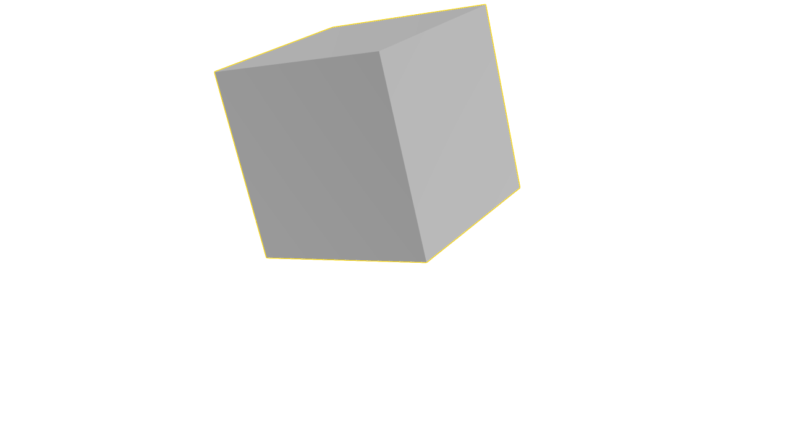

# 16 追記：実行中のHoudiniへのMCP接続を確認

この文書は接続・一時箱実演時点の記録です。その後の2秒キャッシュ・CPIO・Unity検査結果と最終の元シーン状態は [16の最新結果](../../../Docs/Progress/Step_16_ja.md) を参照してください。

2026-09-24、利用者の指示に従い、実行中のSteam版HoudiniへMCPクライアントから接続し、その後、一時的な1m箱をUIに表示して削除・復元した。**接続と実際の一時箱の表示・復元を確認。工程16の短い変形クリップ・ファイル保存・書き出しは未検証。** 以前の「ライセンス期限切れのため一律に接続不可」という扱いは、この実測を反映して訂正する。

| 確認した項目 | 実結果 |
| --- | --- |
| プロキシ | FXHoudini 2.21.0、MCP SDK 1.30.0 |
| 通信 | Codexに登録したコマンドと同じstdioプロキシを、標準MCP SDKクライアントから起動 |
| 初期化 | プロトコル2025-11-25で成功 |
| 生のツール一覧 | 207件を取得。全ツールの動作検証ではない |
| 初回の接続確認で明示的に呼んだツール | `execute_python`。`code=pass`、返す式は版・UI有無・ライセンス分類だけ |
| Houdiniの応答 | `22.0.429`、`ui_available=true`、`licenseCategoryType.Indie` |
| Codex登録 | `houdiniMCP` を有効化。既存の他設定は保持 |
| 互換性の調整 | 現行プラグインにない27コマンドをソースから27ツールへ対応付け、その27件だけを無効化 |
| 再読込後の設定上の候補 | 180ツール。残り全部を実行できると証明したものではない |
| この会話のネイティブツール | 登録後も0件。実行中ターンへの再読込は確認できていない |

**MCPプロトコル経由の応答確認と、この会話でネイティブツールを使える状態は別。** 今回成功したのは、登録コマンドを使った実際のSDKクライアント試験。Codexの設定再読込後にツールが表示されるかは別途確認する。207件を全部対応済み、180件を全部試験済みとは記さない。

初回の接続確認ではHoudini側の既存プラグインを変更せず、ファイルのハッシュ一致を確認した。対象は実行環境の応答だけで、シーンの調査・変更は行っていない。プロキシ起動時の健康確認に含まれる既存HIPのパスは保存・掲載せず、旧試作の内容を参照していない。続く一時箱のUI実演は下記の別試験として記録する。

本機のプロキシ環境は `G:\AI\TaskEnvironments\greatwave_houdini_mcp`。接続は `127.0.0.1:8100`、stdioで `python -m fxhoudinimcp` を使用する。Codex設定は変更前にバックアップした。認証情報や設定ファイル全体をこのリポジトリへコピーしていない。

## 一時箱のUI実演と復元

利用者の追加指示に従い、同じMCP SDK経路で専用の一時コンテナー内に箱を生成し、選択・画面中央への表示を行った。実境界1×1×1mを確認し、8秒表示してから自分が作ったコンテナーだけを削除した。[実際のビューポート画像](MCP_Demo/codex_mcp_cube_demo_5361861c925c.png) は1280×720のHoudini UI出力で、OS画面全体のスクリーンショットや合成図ではない。

最初の試行は列挙値の表記とペイン復元順序の不一致で停止した。一時物を削除し、保持した状態から復旧してから修正した実演を行った。最終的に、一時ノード不在、元の子ノードの同一性・位置・表示旗、選択、ペイン、時刻、更新モード、ビュー・カメラなど**17項目の復元検査がすべて合格**。一時スナップショットも削除した。

**完全に何も変わらなかったとは扱わない。** 元の変更済みフラグはfalseからtrueになり、2回の一時操作によるUndo履歴6件が残った。保存や履歴消去で隠していない。元のHIPの保存・読込・クリア、既存ジオメトリの編集、プラグイン変更は行っていない。

- [実演の要約・復元17項目・残る状態](MCP_Demo/demo_summary.json)
- [成功したMCP操作の記録](MCP_Demo/codex_mcp_cube_demo_5361861c925c.json)
- [初回の失敗](MCP_Demo/codex_mcp_cube_demo_4cf1c04c8c91.json)／[初回からの復旧](MCP_Demo/first_attempt_recovery.json)

箱の表示確認だけでは、2秒の変形キャッシュやFLIP・外部ファイル出力の検証にはならない。

## ライセンスと前の結果の扱い

利用者が「Steamで購入した2年間の利用権は期限切れ・未更新」と述べた事実は残す。一方、現在実行中のHoudiniがIndie分類を返したことも実測として残す。前の通常版20.5の期限切れApprentice記録や21.0のクラッシュで、現在のSteam版が接続不可・未ライセンスと断定しない。今回の3値だけで利用権の契約条件、全機能、FLIPや書き出しの成功を証明したとも扱わない。

工程16は**MCP接続・一時箱の表示と復元を確認、短い変形クリップと出力条件は未検証**へ更新する。17〜20はサンプル未生成のため未実行。利用者の続行指示に従い、次は現在の制作物を参照せず、新規の専用シーンで変形クリップ・保存・再読込から確かめる。この接続・実演のために11〜15のUnityシーン・ビルド・画像・動画は変更していない。

## 証拠

- [MCP初期化・一覧・指定した実行環境応答・設定とハッシュ](16_mcp_connection.json)
- [未対応27コマンドと27ツールの対応・設定フィルター](16_mcp_compatibility_filter.json)

元の検証結果をそのままコピーした。前者のSHA-256は `3bc4082754c8163938bd5bb5ed43c5f728ee308036b9ca2bd34404c009841809`、後者は `462bf79e4b1ac204aa9ddaa425e7316df2fcbf7a39a5f666ce716e5a695e60a5`。通常版の起動試行と初期ライセンス調査は、当時の記録として引き続き保持する。
