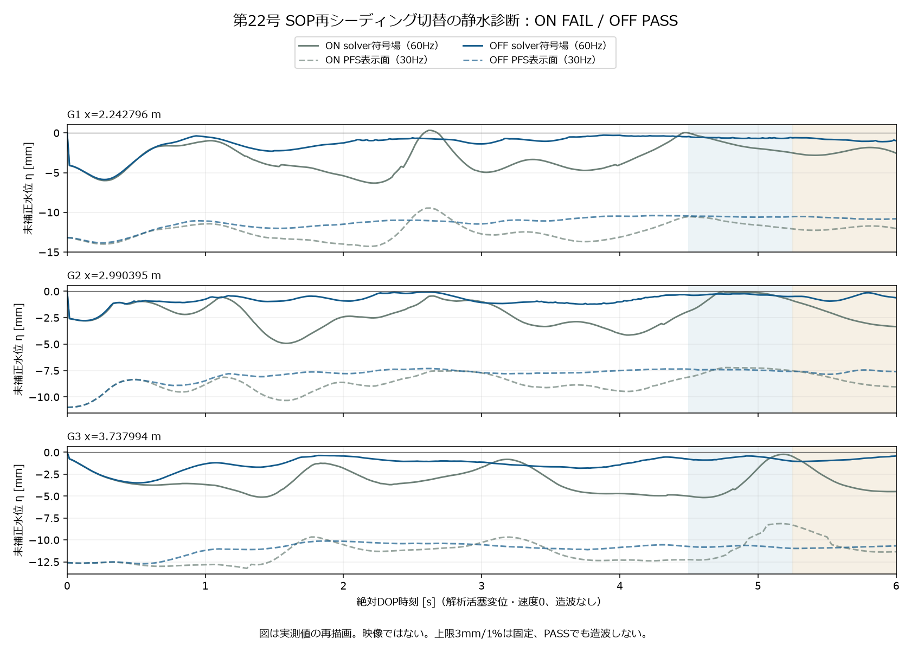
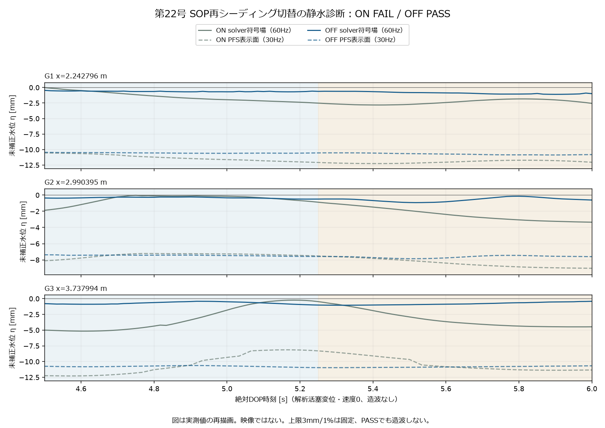

# 22修正03：SOP再シーディング切替の静水診断

実行 4250d4451f、配対基線 db52394211。固定6秒・361標本。**ON FAIL / OFF PASS。PASSでも造波なし。**

条件の物理差はSOP doreseeding 1→0。t0のID別P/v/pscale、surface/pressure格点と全体素は厳密一致。内部DOPのOnly Source Seeding=1、Reseed Particles=1を観測した。内部Reseed ParticlesまでOFFとは記さない。旧ONの該当内部値は未収録。

| 測点 | ON 傾き×.75秒：前/後 [mm] | OFF 傾き×.75秒：前/後 [mm] | OFF 窓間平均差 [mm] | OFF 平均まわりRMS：前/後 [mm] |
| --- | ---: | ---: | ---: | ---: |
| G1 | -2.411434 / +0.926415 | -0.112062 / -0.535404 | -0.246072 | 0.049337 / 0.166098 |
| G2 | +0.666052 / -2.639286 | -0.153844 / +0.356108 | -0.225430 | 0.081282 / 0.235457 |
| G3 | +6.430076 / -4.033295 | +0.078942 / +0.680174 | -0.096195 | 0.177452 / 0.200421 |

窓は(4.5,5.25] / (5.25,6]、各45点。平均差・平均まわりRMS・傾き×窓長は3mm、負の符号場voxel代理量の窓間変化は1%という元条件を変更していない。代理量は水量ではない。

[原時系列CSV](22_on_off_gauges.csv) / [判定・資源・粒子と表示面統計](22_reseeding_comparison.json) / [548実BGEO hash](22_cache_manifest.json)

各図は保存した実測の再描画であり、Houdini/Unityの映像ではない。元水位を基線補正していない。PFS表示面は30Hzの補助観測で、元60Hz判定を置き換えない。

深水検査は6時刻×7128点、半径.08mの粗い支持診断である。各点のphi/最近距離/支持個数を[Original](Original)のgzipに原bytesのまま保存した。medianは上側中央値、p95はnearest-rank。負の符号場と粒子支持があっても全域/連続時刻/近表面の無空洞、質量・圧力・波精度は証明しない。

surfaceはVolumeとして読んだがisSDF metadataはfalseだった。採録された符号場の実値として扱い、認証されたSDF primitiveと呼ばない。共有警報・ONだけ・OFFだけを別記し、coverage_alertは終点の選択に使わない。

公開gzipはmtime=0。[原/圧縮SHA一覧](22_original_manifest.json)で展開bytesを照合できる。全BGEO本体はGドライブのRunsに保持し公開しない。公開再計算は図・CSV・統計の再現であり、BGEOの再cook/全hash再読戻しとは別である。

HIPの保存/読込なし。全体24fpsを保持し、終了時18項目UI復元・所有物削除を確認した。造波・伝播・非砕波・理論精度・HMDは未検証。
