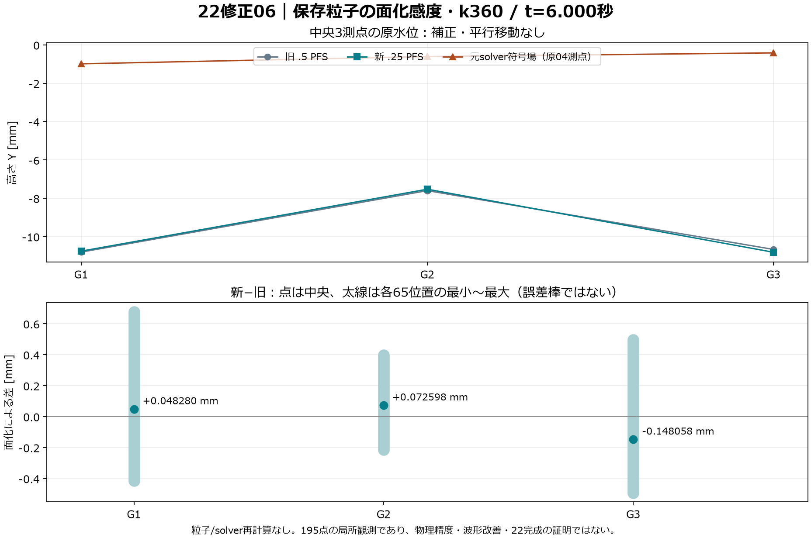
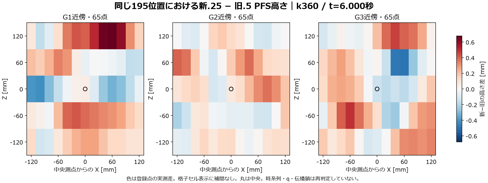

# 22修正06：保存粒子のPFS面化感度・k360の確認点

**旧`.5`の3時刻は形状再現PASS、新`.25`はk360（絶対t6）一面だけ局所診断PASS。22は未完成。** 新しいsolver計算・駆動・detector/q/唯一鎖の判定は行っていない。利用者の確認前に他時刻へ拡張しない。



唯一の物理入力は修正04 Run `22e7801642` の保存済み粒子/solver fieldである。旧試作は参照していない。05の交点診断を踏まえ、PFS `particlefluidsurface::3.0` の明示`voxelsize`を`.5→.25`だけ変える試験を事前登録した。Particle Separation=.04m、指定から期待する面化voxelは.02→.01mだが、solverの粒距/圧力格子を細分化したものではない。

## 失敗を含む実行経緯

全9 Runの[原JSON・execution](Original)を変更せずgzip公開し、[原/圧縮SHA](22_original_manifest.json)と[実行順・Source対応](22_attempt_manifest.json)を付けた。原passed=falseを後の成功で上書きしていない。

| 計画/候補 | 実Run | 原結果と次の処置 |
| --- | --- | --- |
| [初回](../../Candidates/PfsSensitivity06/README_ja.md) | `pfs06_da9e62c8df` | 入力観測前の空メッセージAssertionError。原記録だけで箇所を確定せずHOLD。 |
| [Retry01](../../Candidates/PfsSensitivity06Retry01/README_ja.md) | `pfs06_4e658eee02` | Directは53,811点、Manual中のFile入力は0点。入力段階HOLD、PFS未実行。 |
| [Retry02](../../Candidates/PfsSensitivity06Retry02/README_ja.md) | `file06_261a7a4f72` | `needsToCook(time=...)`未対応でTypeError。Auto窓前に停止。 |
| [Retry03](../../Candidates/PfsSensitivity06Retry03/README_ja.md) | `file06_22b8368396` | Auto File/Nullは53,811点・5 Volume。detail列挙順の各16葉差で元判定HOLD。 |
| [Decision04](../../Candidates/PfsSensitivity06Decision04/README_ja.md) | 新規Runなし | 保存署名を独立判読し、一意属性名によるdetail一覧順だけを正規化すると一致。他key/属性値は厳密一致。原HOLDを保持し、PFS再現とは扱わない。 |
| [Replay05](../../Candidates/PfsSensitivity06Replay05/README_ja.md) | `pfsreplay06_55fa260d7f` | 入力PASS後、HDA sectionの文字列UTF-8化でUnicodeEncodeError。第2Auto窓前、meshなし。 |
| [Retry06](../../Candidates/PfsSensitivity06Retry06/README_ja.md) | `pfsreplay06_af76bc8ec2` | 原binary sectionのSHAへ修正。旧`.5` k360の厳密面再現PASS。 |
| [Replay474](../../Candidates/PfsSensitivity06Replay474/README_ja.md) | `pfsreplay06_ac6451419c` | 旧`.5` k474の厳密面再現PASS。 |
| [Replay496](../../Candidates/PfsSensitivity06Replay496/README_ja.md) | `pfsreplay06_b13cd6bcb8` | 旧`.5` k496の厳密面再現PASS。 |
| [Refine360](../../Candidates/PfsSensitivity06Refine360/README_ja.md) | `pfsrefine06_c208ac35e3` | 新`.25` k360だけを作成、旧新各195断面の局所確認PASS。 |

十候補の計画・実行Source・離線checks・freezeは普通のGitファイルとして原bytesを保存する。[101ファイルの対応表](22_frozen_candidates_manifest.json)を参照。各READMEの「未実行」は凍結時の履歴であり、現在の結果はこのページを入口とする。旧候補の既定動作や環境依存を変更していないため、読解用の記録と、下記の公開数値復算を区別する。

## 旧面を再現してから細分化

旧`.5`のk360/k474/k496について、同じ絶対frame `1+0.4k` / FPS24で、保存pilot→File→Null→PFS3.0→Convert poly→Outを作った。順序付き点P、有向面indices、primitive型/closed、3測点native first-hit、保存再読が全て一致した。点/面数は38,926/38,924、39,078/39,076、38,912/38,910。新たに保存したBGEOのbytes SHAは旧面と異なるので、ファイル全体や未検査属性が同一とは書かない。

Manualではcookが拒否されることを実診断したため、実行はmain threadの短いAuto窓二つへ分けた。窓1はFile/Nullをfreeze、Manualで全入力署名を判定する。PASS後だけPFSを作り、全設定とHDAを比べ、窓2は原04と同じOutだけをforce cook/freezeする。finally Manualを守る。署名が同じでも、面再現を確認するまでは旧`.5`PASSとしていない。

新`.25`では成功k360のDirect/File/Nullの全署名に対し、許す差は一意nameによるdetail一覧の順序だけ。実評価した**166 PFS parmはvoxelsizeだけが相違**し、HDA library/全binary section・Convert評価値は同一だった。旧3点nativeを再び確認し、新面を先にBGEO保存してから照会した。

原JSONの第2窓名`OLD_HALF_PFS`は、byte同一のhelperから継承した履歴ラベルである。今回のscope、要求値・実評価値は`.25`。原ラベルを書き換えず、実際の設定を判断根拠にする。

## t6一時刻の実値

| 測点 | 元solver符号場 mm | 旧`.5` PFS mm | 新`.25` PFS mm | 新−旧 mm |
| --- | ---: | ---: | ---: | ---: |
| G1 | −0.988379 | −10.810441 | −10.762161 | +0.048280 |
| G2 | −0.609264 | −7.603443 | −7.530844 | +0.072598 |
| G3 | −0.417516 | −10.671026 | −10.819083 | −0.148058 |

固定10mmの補正はしない。中央3点のPFS−solver差は残り、G3はこの変更で下側へ動いた。「細かくしたから物理的に正確」とは判定しない。t6は静水判定直後の一時刻であり、PFSの谷候補不採用や伝播鎖への影響は今回計算していない。

3点×X近傍13×Z近傍5＝195位置を旧・新とも同じ05 readerで照会し、順序・重複なし・同じfield値・中央solver誤差0mを確認した。各面の主/感度/面限定queryは上下2交点で、その面の既定first-hitのprimitiveを同じ面の限定queryが裏付けた。主/既定の高さと法線方向、旧新上側法線のY方向も整合した。旧新meshのprimitive IDや法線ベクトル自体の同一は要求していない。新の`center_parity_passed=false`は旧面との高さ差であり、ここでは予告通り診断値。旧の同フラグはtrueでなければ進めない。

全195位置の新−旧は−0.493705〜+0.678122mm、平均+0.089239mm、RMS0.223545mm。これは相関する近傍位置の分布で、独立試行や測定不確かさではない。[原値CSV](22_refine06_profiles.csv)と[中央CSV](22_refine06_centers.csv)を併読する。



主tolerance1µm/前進2µm、感度10µm/20µm、最大64交点は固定。下底交点を第2自由面と呼ばず、全域連通/非砕波/薄い空隙/時刻間状態を認定しない。`surface` VolumeのisSDF metadata=falseを保持し、符号場として測定する。小さいquery刻みやPFSvoxelがsolverの物理解像度を増やすわけではない。

## 出典・資源・復元

新面は159,932点/159,930面、3,494,161bytes、SHA `d2f03dc800f074f183323ad9be0a72a1e8b1d972024b606ac84cf339f06a3371`。保存再読のP/有向面/型/closed/有限を確認。[本機保持10 BGEOのmanifest](22_cache_manifest.json)は旧入力6本と新出力4本を実読SHAで結ぶ。本体はGitへ入れない。

新面化RPC17.634901秒、Auto窓1=.004136秒/窓2=7.250425秒、旧profile2.270634秒/新10.993487秒。新旧195原JSONは3,682,179/3,684,979bytes。28原JSON合計8,252,599bytesを990,124bytesへ無損失gzip化した。入力/原JSON/source/ACKのSHA対応を保ち、MCPの丸められた数値を判定に使っていない。

可用RAM最小34,102,996,992bytes、観測private最大4,223,152,128bytes・起点比+331,362,304bytes。Manual節目と読戻し前後の値で連続ピークではない。process生涯working set peakは7,250,092,032bytes、VRAMではない。旧`.5`とはPID/実行条件が違うので、この1回の数値を方式の性能比較にしない。

実環境は新しいSteam Houdini PID26892、22.0.429/Indie/UI/FPS24。旧3面はPID53912だった。HDAと全設定は実際に照合した。UI18項目と所有ノード削除はPASS、完了不明なし。一方、HIP dirtyは**false→true**となった。HIP保存/読込/clearやundo履歴消去は行っておらず、dirtyまで元通りとは書かない。後続二つの読取専用RPCではframe1/FPS24/Auto/dirty=trueの前後一致を確認した。

無関係なnetworkへの直接DOP呼出しは無いが、Auto窓における外部DOP状態を連続監視しておらず、全無影響とは認定しない。既知失敗は停止して独立審査後に別候補とし、完了不明のretry/killはしていない。

## 公開資料だけの復算

```powershell
python -B Houdini/Wave22/Evidence/Revision06/Source/summarize_revision06.py --input Houdini/Wave22/Evidence/Revision06
python -B Houdini/Wave22/Evidence/Revision06/Source/verify_reproduction.py --input Houdini/Wave22/Evidence/Revision06 --scratch Houdini/Wave22/Local_Reproduction
```

依存は[固定ライブラリ](Source/requirements.lock.txt)、WindowsのMeiryo。使用font SHA/実バージョンを[解析manifest](22_analysis_manifest.json)へ記録する。PNGのbyte同一再現は同じfontとライブラリが前提。[隔離再計算](22_isolated_reproduction.json)はRuns/候補ディレクトリ/BGEOをコピーせず、公開gzipから2図・2CSV・摘要・解析manifestの6出力を照合する。Houdini再実行やBGEO再検証とは区別する。

出典SHAは改行も含む元bytesを対象とする。Wave22全体の既存規則に加え、[Git属性](../../../../.gitattributes)で根README、進捗README、Step22、検証状態表と属性ファイル自身を個別に`-text`指定した。`core.autocrlf=true`でも、この5ファイルの作業時LFをcheckout時にCRLFへ変えない。[一時Git索引での再checkout検査](22_checkout_byte_validation.json)を保存し、実索引へstageせず5ファイルのbytes/SHA一致を確認した。

実図は保存cacheの測定値であり、新しい視口画像・動画を捏造していない。動きは[修正04の既存PFS動画](../../Candidates/WaveStart04/Evidence/Result_22e7801642/Media/22_startup_PFS.mp4)を別資料として参照する。22の非砕波連続伝播・full測点・媒体、23の理論精度、25の収支/反射、主役波・HMDは引き続き未検証。次のframeや142面拡張は今回の公開完了と別に審査する。
