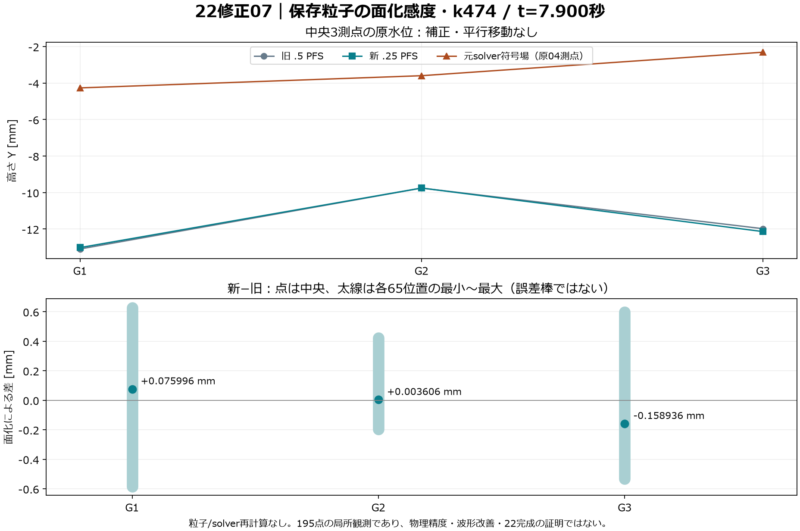
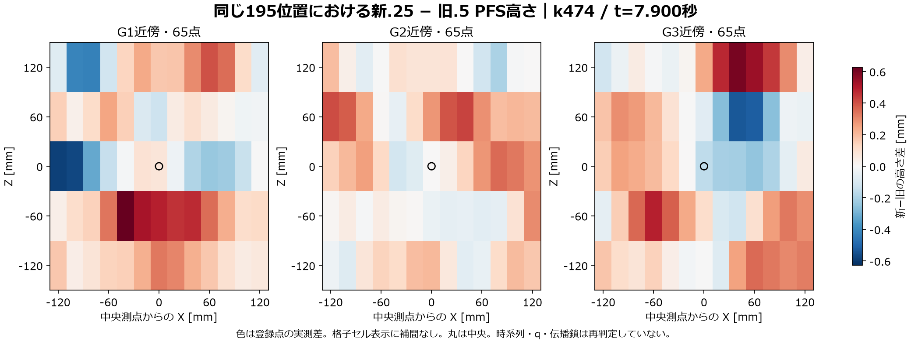

# 22修正07：k474の保存粒子によるPFS単一面感度

**t=7.900秒（k474）の`.25`面化と旧新各195断面の数値診断はPASS。番号22は未完成。** 新しいFLIP計算や駆動、時間波形・q・唯一鎖の再判定は行っていない。



修正06の旧`.5`三面再現とk360細分化を保持し、最新の継続指示と根担当・独立担当の事前審査に基づき、今回はk474一面だけ進めた。[凍結候補](../../Candidates/PfsSensitivity07Refine474/README_ja.md)の「未実行」は実行前の保存版であり、現在の結果は本ページに記録する。k496の新`.25`や142面の拡張を実施したとは扱わない。

## 実行と比較対象

唯一の物理入力は修正04 Run `22e7801642` の`pilot_474.bgeo.sc`。旧試作を使わず、修正06で厳密再現済みのk474旧`.5`と、修正05の同時刻195断面を配対基線とした。新Runは`pfsrefine07_f2bf190159`、Steam Houdini 22.0.429 / Indie / PID26892 / FPS24、絶対frame190.6で一度実行した。

同じ保存粒子をFile→Null→PFS3.0→Convert poly→Outで面化した。短いAuto窓1で入力をfreezeし、Manualで全署名を比べてからAuto窓2でOutをcookした。Direct/File/Nullの全入力署名で許す差は、一意な属性名によるdetail一覧の列挙順だけ。粒子のP/ID/v/pscale、属性値SHA、全field値と格子など他の項目は同一である。

旧成功Runと比較した**実評価166 PFSパラメータの差はvoxelsize `.5→.25`だけ**。HDA libraryと全binary section、Convert評価値は一致した。Particle Separation=.04mに対する指定面化voxelは.02→.01mであり、FLIPの粒距や圧力格子の細分化ではない。[SideFXのVoxel Scaleの説明](https://www.sidefx.com/docs/houdini/nodes/sop/particlefluidsurface)は乗数の意味を示すが、実際の型は本Runの`particlefluidsurface::3.0`と記録した設定で確認した。

原JSONのAuto窓名`OLD_HALF_PFS`は共通helperから継承した固定識別子である。今回のscopeと要求・実評価voxelsizeは`.25`。このラベルを理由に旧`.5`を生成したと読み替えない。

## 中央3測点の未補正値

| 測点 | 原04 solver符号場 mm | 旧`.5` PFS mm | 新`.25` PFS mm | 新−旧 mm |
| --- | ---: | ---: | ---: | ---: |
| G1 | −4.264757 | −13.093209 | −13.017213 | +0.075996 |
| G2 | −3.595844 | −9.756213 | −9.752607 | +0.003606 |
| G3 | −2.307102 | −11.981583 | −12.140518 | −0.158936 |

原04のsolver中央測点値は121標本と25回二分の定義である。一方、05の局所断面定義による中央field水位はG1/G2/G3が−4.264832/−3.595886/−2.306824mmで、互いに置換していない。[中央CSV](22_refine07_centers.csv)に両方を保存した。旧PFSと原04native値は厳密一致し、原04定義のsolver再読誤差も0mだった。固定約10mmの補正はせず、細分化によってsolverとの差が消えたとも判定しない。

旧195断面は、05公開原JSONの事前指定15項目と完全一致した。照合から除いたのは指定された上位メタデータだけであり、保留した構造内の`meaning_ja`まで一律に除去した比較ではない。投影の全項目とSHAは[摘要](22_refine07_summary.json)の`old_profile05_exact_pair`と[凍結契約](../../Candidates/PfsSensitivity07Refine474/Source/refine_contract07.py)に記録する。

旧新の各195位置はG1〜G3×X近傍13×Z近傍5で、順序付き座標・重複なし・field値が一致した。全て局所単一wet→dry交差を持つ。主ray（tolerance1µm/前進2µm）、感度ray（10µm/20µm）、面限定queryは各列上下2交点であり、**下底を第2自由面と呼ばない**。各面のdefault first-hit primitiveをその面の限定queryが裏付け、default/strictの高さ・法線方向と旧新上側のY方向が整合した。旧新のprimitive IDや法線ベクトル自体の一致は要求していない。

新`center_parity_passed=false`は旧面に対する高さ差の診断値で、形状検査の失敗ではない。旧側はtrueである。`surface` VolumeのisSDF metadata=falseを保持して符号場を測り、全域連通・薄い空隙・連続時間・非砕波を認定しない。



全195位置の新−旧は**−0.584275〜+0.628144mm、平均+0.091844mm、RMS0.229214mm**。[195行の原値CSV](22_refine07_profiles.csv)を公開する。各65位置の範囲は誤差棒ではなく、相関する局所位置の分布であり、独立試行や物理精度の推定ではない。単一時刻からPFS谷候補の採否・伝播・唯一鎖・解像度収束を推論しない。

## 原記録・資源・復元

入力は53,838点（Volume保持点5を除く粒子53,833）。旧面39,078点/39,076面に対し、新面は160,642点/160,640面、3,497,363bytes、SHA `42b98293c13b7868fc1c13acd11c8d055d47b88e732081f40ece42b28a1ca3e6`。保存再読でordered P・有向面・型/closed・有限性を確認した。新旧の形状一致を求める試験ではない。

[本機保持BGEOの一覧](22_cache_manifest.json)は原pilot/原mesh/新meshの3本をbytes/SHAで結ぶ。本体はGitへ入れない。5つの新Run原JSON、旧成功結果と05断面原JSON、実行前の文書6本の計13原件を[無損失gzip](22_original_manifest.json)として保持した。原11,369,101bytes、保存1,363,329bytesで、展開前後のSHAを併記する。[実行とSourceの対応](22_run_manifest.json)、[候補14ファイルの固定SHA](22_frozen_candidate_manifest.json)も保存した。

| 観測 | 実値 |
| --- | ---: |
| 面化RPC | 20.837554秒 |
| Auto窓1 / 窓2 | .006477 / 8.096435秒 |
| 旧 / 新195断面の読戻し | 2.959956 / 10.814633秒 |
| 最小可用RAM | 27,957,891,072bytes |
| 観測private最大 / 起点比増分 | 4,208,369,664 / 228,343,808bytes |
| process生涯working-set peak | 8,385,028,096bytes |
| 最小観測G空き | 909,539,086,336bytes |

資源値は登録した節目の観測で連続privateピークやVRAMではない。単面16MiB、cook30秒、RAM8GiB、private増分12GiB、G実行中10GiBなどの固定保護を通過した。90秒はRPC内の協調予算で、単一HOM呼出しの強制中断を保証しない。旧新読戻しは同じquery条件だが、この1回を一般的な性能比較にしない。

UI18項目と所有ノード削除はPASS、完了不明なし。HIP dirtyは**true→true**、undo0→0であり、dirtyを消して復元と見せていない。HIP保存/読込/clearなし。UI復元後の旧新profileは別の只読RPCで、frame/FPS/mode/dirtyの前後一致を確認した。Auto中の無関係DOP状態を連続監視したわけではなく、全外部状態への無影響までは認定しない。

## 公開資料だけの復算と履歴

```powershell
python -X utf8 -B Houdini/Wave22/Evidence/Revision07/Source/verify_reproduction.py --input Houdini/Wave22/Evidence/Revision07 --scratch Houdini/Wave22/Local_Reproduction
```

[依存](Source/requirements.lock.txt)とMeiryo fontを用い、使用バージョン/font SHAは[解析manifest](22_analysis_manifest.json)に記録した。[隔離復算](22_isolated_reproduction.json)はRuns・候補・BGEOをコピーせず、公開gzipと純粋な後処理だけで2図・2CSV・摘要・解析manifestの6出力をbyte同一再現する。既定では証拠を書き換えず、Houdiniも呼ばない。これは原BGEOの再読や物理計算の再現とは別である。

今回の現況更新は、実行前に固定した6文書のSHAと意図的に異なる。[Baseline/Documents](Baseline/Documents)へcommit `352e1ba8fae0057c17dcbc9595d4177094c1b74d` の原bytesを保存した。候補・旧Run・修正06証拠は変更しない。凍結した実行入口は当時の進捗文書も厳密に保護するため、更新後の作業木でその古い実行門を通るとは主張しない。171項目の離線PASSは実行前の記録で、公開復算は上記の独立手順を使う。

[最終出典](22_revision07_provenance.json)は今回の候補・原記録・後処理・文書を結ぶ。既存[Git属性](../../../../.gitattributes)により対象文書とWave22のbytesを改行変換から保護する。新しい視口映像は作っていない。[修正04の実PFS動画](../../Candidates/WaveStart04/Evidence/Result_22e7801642/Media/22_startup_PFS.mp4)は別資料であり、この新面の動画ではない。

番号22の非砕波連続伝播・full測点・実媒体、23の理論精度、25の収支/反射、主役波・HMDは引き続き未完了。この完成点は単一面の数値診断であり、後続の時刻や連続列は別の事前審査対象とする。
