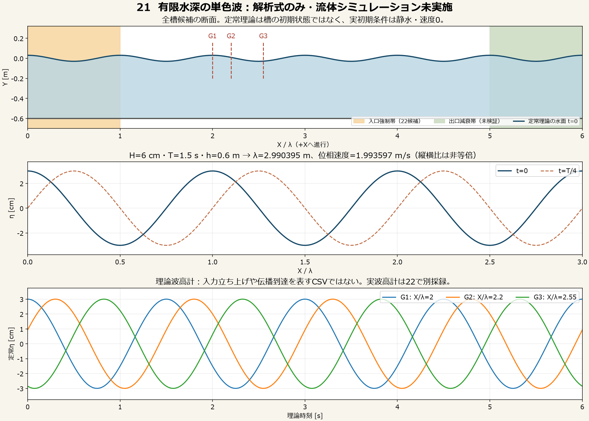

# 21：小振幅・有限水深・単色波の条件

**これは解析式と試験計画であり、Houdiniの実波ではない。** 第21号は単位・重力・静水面・波条件を固定した。第22〜25号のFLIP、波高計、伝播動画、精度・収支・反射は未実施。17/19の2球試料や20の再生負荷を波浪の物理精度の証拠にしない。



## 固定する目標条件

| 項目 | 値・意味 |
| --- | --- |
| ケース | `GreatWave21_Airy_FiniteDepth_01` |
| 単位と軸 | m・s・kg、+Y上、+X進行、Z横断方向 |
| 静水面と底 | Y=0m、水平な底Y=−0.600m |
| 波高H／振幅a | 0.060m／0.030m。Hは峰から谷、a=H/2 |
| 周期T | 1.500s、単一成分、方向分散0 |
| 密度ρ | 1000kg/m³の淡水相当数値基準。江戸湾海水の復元ではない |
| 重力 | (0,−9.81,0)m/s² |
| 対象モデル | 小振幅・一定水深・非砕波の線形重力波 |
| 除外 | 風、定常流、粘性、表面張力、空気圧縮、白波、船、美術変形 |

一定密度はこの線形色散式のλ/cへ影響しない。後の海水圧力・船の浮力は密度を別に決め、一貫して使う。設定の機械可読版は[conditions.json](Source/conditions.json)。実ノード名や適用値は第22号で記録し、JSONを置いただけで適用済みとは扱わない。

## 理論と計算結果

θ=kx−ωt、ω=2π/T とし、有限水深の正根を二分法で解く。

```text
ω² = g k tanh(kh)
λ = 2π/k,  c = ω/k
η = a cosθ
u = aω cosh[k(y+h)] / sinh(kh) cosθ
v = aω sinh[k(y+h)] / sinh(kh) sinθ
w = 0
cg = c/2 {1 + 2kh/sinh(2kh)}
```

uはX、vはYの速度。式の水深方向は−h≤y≤0の線形基準で、砕波・自由表面の大変形を解くものではない。群速度cgは包絡の目安、cは峰の位相速度で区別する。[MIT Marine Hydrodynamics Lecture 20、p5〜8](https://ocw.mit.edu/courses/2-20-marine-hydrodynamics-13-021-spring-2005/5d48a5937971d973fd8ca90c051a83f8_lecture20.pdf)。

| 計算量 | 結果 |
| --- | ---: |
| ω | 4.18879020479 rad/s |
| k | 2.10112207353 rad/m |
| λ | 2.99039517329m |
| 位相速度c | 1.99359678219m/s |
| 群速度cg | 1.40331288197m/s |
| 長波速度√gh | 2.42610799430m/s |
| kh／ka／a/h | 1.260673／0.063034／0.050000 |
| 平均水面でのu/v振幅 | 0.147622630／0.125663706m/s |

khから深水・浅水近似を選ばず、有限水深式を用いた。[全数値](Evidence/21_derived_parameters.json)。9つの[コード検算](Evidence/21_numeric_checks.json)は合格した。色散残差0（倍精度丸め内）、底の法線速度0、平均面の運動学的条件の有限差分誤差6.86×10⁻¹²m/s、非圧縮の有限差分残差4.65×10⁻¹²s⁻¹以下。周期/波長/進行方向、ゲージ位相fit、入射波だけの反射分離も検算した。これは**解析式実装の合格**で、実流体の誤差ではない。

## 第22号の槽と境界候補

本試験候補は長さ6λ=17.942371m、幅0.600m（Z=±0.300）、Y=−0.600〜+0.300m。初期水面は0、初期速度0とし、槽全体を毎時刻解析波へ置き換えない。初期水は一度だけ生成する。次の全6面を実ノードで区別する。

| 位置 | 候補条件と検査 |
| --- | --- |
| X=0側／0〜λ帯 | 入口の造波・流入出。解析surface/velを使う場合は入口だけの強制maskを保存する |
| X=6λ側／5λ〜6λ帯 | 開放と減衰の候補。吸収実装・係数・水量調整を明記し、反射と収支を測る。減衰帯を置くだけで無反射としない |
| Y=−h | 実colliderの不透過底。滑りを許す基準で法線速度/漏れを確認 |
| Z=±0.3 | 実colliderの不透過側面。側面から解析波や粒子を供給しない。横断3位置の差を確認 |
| Y=+0.3 | 空気側の開放。液体が到達・削除されれば計算範囲不足として不成立 |

FLIP Containerの外縁は固体壁ではなく、外側の粒子が削除される。[SideFX FLIP Container](https://www.sidefx.com/docs/houdini/nodes/sop/flipcontainer.html)。以下は**未検証の代替候補**で、21で接続成功とはしない。

- **Boundary Flow候補**：独自surface/velをSolver第4入力へ渡しWaterline OFF、Velocity Drivenを検討する。狭い側面のsource/velocity bandから内側全体が駆動される危険がある。適用mask・実接続・全6面を調べ、ゲージと自由伝播域の強制量が0と確認できなければ不採用。Ocean Spectrumの既定多成分波を単色波の代用にしない。[公式Wave Tank](https://www.sidefx.com/docs/houdini/fluid/sopconfigwave.html)、[FLIP Solver](https://www.sidefx.com/docs/houdini/nodes/sop/flipsolver.html)。
- **移動piston候補**：一度だけの初期水、底/側壁/端壁と駆動pistonをFLIP Collideへ渡す別case。第4入力は使わない。pistonの変位・速度・strokeと実波高を記録する。piston振幅をHと同じ値にして目標波が出たとは言わない。壁方式の出口反射を開放/吸収方式と混同しない。

入口振幅を2T=3秒の半cos窓 `R(t)=(1−cos(πt/3))/2`（前0、後1）で立ち上げる候補。η/u/vへ単にRを乗じる過渡はR'項のため定常線形解とは一致せず、この区間を精度fitへ混ぜない。pistonなら実速度にR'の項を含める。方式選択・駆動量の調整は別case IDと記録を残す。

## 時計・解像度・費用のpilot

まず**短い2λ槽**、幅0.6m、Δp=0.04mで新規所有ノードの9標本（0〜0.133333秒、60Hz）だけを計算する計画。入口0〜0.25λ、減衰候補1.75〜2λ、内点診断0.75λ/1.25λを使い、full用のゲージを縮小槽へ流用しない。時計、実粒子数、P/v有限、初期水保持、境界mask、底/側面衝突、1step時間、private memory/空きメモリを確認してから0.5秒、最大1.5秒へ延長する。波高精度の合格には使わない。

| 計算項目 | pilot候補／後続条件 |
| --- | --- |
| 粒子間隔Δp | 0.04m。Hに対して1.5間隔しかなく、精度を保証しない |
| Container Grid Scale | 2.0候補。期待voxel0.08mと実圧力/速度voxelを別記録 |
| 表面SDF voxel | Δp×0.5=0.02m候補。solverのSDFと表示meshのvoxel/フィルタも区別 |
| 時計 | Time Scale1、実DOP最大刻み1/120秒候補、CFL1。実各step時刻/刻み/substepを記録 |
| 採録 | 60Hzは出力密度。要求時刻と実solver時刻の一致を確認し、補間/複製を実計算としない |
| 速度移送など | APIC候補、narrow band OFF、reseeding ON、seed2101、pressure adaptivity OFF、DOP補間OFF/substep cache ON |

単純な水体積/Δp³ではfull Δp=.04が約100,926、.03が239,232、.02が807,407粒子の規模。pilot .04は約33,642。これは格子・seed・reseedingを無視した概算で、実粒子数/メモリの予言ではない。fullの.02を最初から計算しない。Δp=.02でもHは3間隔にすぎず、第24号の収束を見て使用解像度を判断する。

初期pilotからの費用予測が大きい、使用可能メモリが不足する、時刻や境界が不正なら延長を止める。具体的な費用上限は22の開始時に現在の空きメモリとcook実測から記録する。使用中HIPは保存/読込/clearせず、metadataで現在PID/版/ライセンスを再確認して所有範囲だけを操作、finallyでUIと所有物を復元する。19の時計/UIガードだけを基盤として再利用し、2球の形状・速度や粗い面化条件を波へ継承しない。

## 波高計と採録窓

| ゲージ | X/λ | X [m] | Z [m] |
| --- | ---: | ---: | ---: |
| G1 | 2.00 | 5.980790347 | 0 |
| G2 | 2.20 | 6.578869381 | 0 |
| G3 | 2.55 | 7.625507692 | 0 |

補助的に同じXでZ=±0.15mも測る。ゲージは**実solver surface SDFの縦線上ゼロ交差**から取得する。底から連続した液体の最上面を対象にし、複数交差・孤立飛沫・面欠損は別flag、都合のよい最高点だけを選ばない。理論ηを評価したCSVを実波高計として保存しない。表示meshからも同点を測ってSDFとの差を別列にする。

fullは0〜18秒の採録を候補にし、解析窓は9〜16.5秒（5T）を**候補**とする。3秒の立ち上げ＋G3までの群速度到達目安は8.434秒。一方、吸収帯先頭5λからの長波往復目安は9.183秒、造波がλまで及ぶと7.950秒程度であり、候補窓は無反射区間ではない。圧力場/実境界の影響までこの幾何見積で保証しない。

採用には、実到達後に振幅と平均水位が安定し、自由域の強制mask0、反射診断が成立することを要する。前半/後半のH変化5%以下、平均面変化0.003m以下、反射振幅比0.1以下を事前の診断目標とする。5周期が得られなければ『精度保留』にし、ゲージ/減衰帯/槽長/立ち上げを別caseで改める。短い都合のよい窓への切り詰めや精度基準の後付け緩和をしない。

## 第22〜25号の測定定義と判定

| 番号 | 実測と成果 | 判定・保留条件 |
| --- | --- | --- |
| 22 | 新規実波、3ゲージの時系列、伝播動画、入力/solver/面化条件とhash | ゲージが自由域、時計が実solve、形状が非砕波。未実施の理論精度を合格にしない |
| 23 | 実T・λ・c・Hと相対差、誤差帯、使用窓 | T/λ/cは設計由来の5%目標、Hは今回の10%診断目標。粗pilotの達成を約束しない |
| 24 | Δp=.04/.03/.02候補の空間比較＋固定Δpで最大dt1/120と1/240の時間比較 | 一度に両方を変えない。実CFL刻み/pressure voxel/SDF voxelを記録。H/c/減衰の差が縮むか確認し、非単調なら収束とは言わない |
| 25 | 静水・閉領域V(t)、開領域の境界流量と体積収支、反射成分 | 閉静水18秒V漂流1%以下・水面RMS3mm以下、開領域収支残差/初期V1%以下・反射比0.1以下を暫定診断目標。失敗を隠さず原因を分ける |

これらは本制作の**事前に置く開始目標**であり、海洋精度の普遍規格ではない。閾値改訂は理由・旧値・別caseを保存する。

- **T**：ゲージの平均面を分け、実時系列の山/ゼロ交差間隔と周波数を自由にfitした正弦波で求める。指定1.5秒をそのまま測定値にしない。窓前後・周期ごとのばらつきを併記する。
- **λ**：同時刻の自由域の実SDF断面を採り、複数峰の間隔/空間fitから測る。理論c×Tをλの実測としない。複数の定常位相で再測定する。
- **c**：隣接ゲージの同じ峰を順序で対応付け、実距離/実遅延で測る。理論遅延G1→G2=0.300s、G2→G3=0.525s、端間0.825s。端間はT/2を越えるためwrapped phaseだけの逆方向判定を避け、隣接位相unwrap/峰順序を用いる。
- **Hと減衰**：周期ごとの峰谷差とfit振幅の2倍、G1〜G3の変化、平均面を別記録。面化後だけで増幅していないかSDF/meshを比較する。
- **反射**：各ゲージの実複素振幅を `A+ exp(ikx)+A− exp(−ikx)` へ最小二乗し、`|A−|/|A+|`、残差、条件数を報告。kは実空間測定値を使い、理論kとの差への感度も出す。単色仮定/3ゲージfitが悪ければ反射比を信頼値にしない。今回の理論ゲージ配置の行列条件数は1.766で、実波の無反射を証明していない。
- **体積と収支**：水面SDFの濡れ体積V、固定検査断面の `Q=∫wet v・n dA`（外向き正）を積分し、`V(t)−V(0)+∫ΣQdt−∫S_internal dt` を記録。内部source/sink/reseedingの扱いを明示し、粒子数や閉じていない表示mesh体積だけを水量としない。検査体積と断面を強制/削除帯から分離する。

実CSVの最低列はcase ID、要求秒、実solver秒、dt、ゲージID/X/Z、SDFη、meshη、交差数/有効flag、強制mask、粒子数、SDF/mesh voxel。別表でu/v、境界Q、V、source量、cook時間、メモリ、cache hashを持つ。欠測を補間で成功値に置換しない。

## 理論成果物と再現

- [ゲージ理論CSV](Evidence/21_theory_gauges.csv)：0〜18秒、60Hz、終端込み1081行。定常ηと入口ramp係数を別列にし、実伝播の到達や立ち上がりを表さない。
- [断面CSV](Evidence/21_theory_profile.csv)／[深さ方向の速度CSV](Evidence/21_theory_velocity.csv)
- [計算値](Evidence/21_derived_parameters.json)／[数値検算](Evidence/21_numeric_checks.json)／[出典とSHA](Evidence/21_provenance.json)

本機の描画用Python環境は `G:\AI\TaskEnvironments\greatwave_wave_analysis\`。モデルの重みは使わない。別環境では[依存固定表](Source/requirements.lock.txt)を専用環境へ導入し、日本語フォントを指定する。

```powershell
& 'G:\AI\TaskEnvironments\greatwave_wave_analysis\Scripts\python.exe' 'Houdini/WaveBaseline21/Source/calculate_reference.py'
```

出力先はこの番号のEvidenceだけで、Unity/既存Houdini素材を変更しない。CSV・PNGは解析式出力であり、実Unity静止画や流体動画を代替しない。実伝播媒体は22で新しく採録する。
