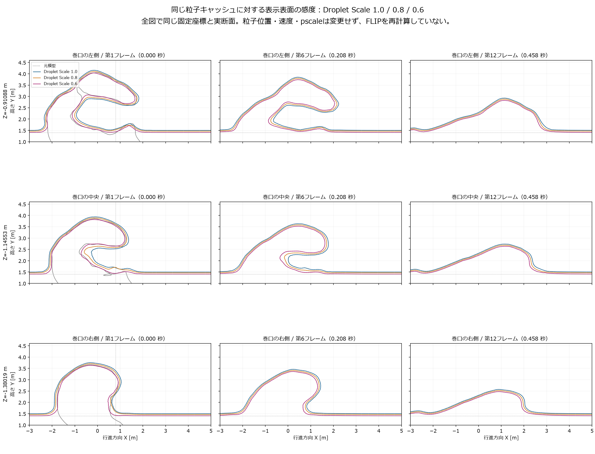

# 表示表面の感度確認

2026-09-24。保存済みの第1・6・12フレームの粒子を使い、`Droplet Scale` だけを1.0、0.8、0.6へ変更した9つのOBJを比較した。FLIPは再計算していない。粒子の位置・速度・`pscale=0.144 m`、その他の表面設定は同じ。

## 初期形状への影響

原模型の巻口左・中央・右に対応する同じ3平面を切断し、前回と同じ `Houdini X=0.804275755 m` で測った。表中は左／中央／右、単位m。空隙は下側水面から唇下面まで、厚さは唇上下の交点の鉛直差であり、法線方向の厚みではない。元模型の下側は平池への接続を仮定し、最低水位をY=1.4 mとする。

| 第1フレーム | 空隙高さ：左／中央／右 | 唇の鉛直厚さ：左／中央／右 |
| --- | --- | --- |
| 元模型 | 1.460／1.225／1.066 | 0.794／0.925／0.712 |
| 1.0 | 1.141／0.846／0.754 | 1.041／1.120／1.004 |
| 0.8 | 1.226／0.878／0.856 | 0.951／1.017／0.861 |
| 0.6 | 1.374／1.202／1.140 | 0.823／0.884／0.603 |

0.6では今回の測線上の空隙が元模型へ近づき、初期の過大な唇厚も減る。ただし右の唇は元模型より0.109 m薄くなり、空隙は0.074 m大きくなる。先に提案した約0.1 mの保真目安を全面的に満たした結果ではない。全体の最高点も1.0のY=4.324 mから0.6の4.232 mへ下がるため、値を小さくするだけで一様に改善するとは判断しない。

## 巻口の維持時間

- 第1・6フレーム（0、0.208秒）は、3設定とも対象の3断面で折返しを残す。
- 第12フレーム（0.458秒）は、**1.0、0.8、0.6のすべてで、対象の3断面に大きなC形は戻らない**。X=−3～5 m、Y=0.5～4.6 mを調べても、鉛直線が表面を3回以上横切る区間はない。実断面図も単峰の輪郭を示す。
- この結果は、今回の範囲の `Droplet Scale` 調整だけでは、現在の粒子運動で消えた巻口を回復できないことを示す。別の峰方向位置や未検査時刻まで開口がないと断定する結果ではない。

## 穴・分離と判断

生成側の記録では9モデルとも頂点接続の成分数1、境界辺0、非多様体辺0、隣接面の向き不整合0、零面積面0だった。したがって、今回の記録に穴や分離の増加は現れていない。ただし自己交差や全表面の幾何誤差は未検査であり、「欠陥なし」と同義ではない。基準1.0は各フレームの保存済み表面と座標差0だった。

**0.6を初期表示の改善候補として残す。現行動画や計算条件はこの確認で置き換えない。** 維持時間の不足は残るため、この設定変更を作品の達成や流体運動の改善とは扱わない。次の運動比較では、この表面感度とは分けて初期速度や形成過程を検討する必要がある。

`Droplet Scale` は粒子から生成表面までの距離を調節し、`pscale` がある場合はそれを基準にする。この性質が、同じ粒子でも表示の厚みを変える理由である。[SideFX公式説明](https://www.sidefx.com/docs/houdini/nodes/sop/particlefluidsurface.html)

測定値・OBJのSHA256・固定平面は[表面感度検証.json](表面感度検証.json)に記録した。生成側の検査記録はローカルの `Houdini/results/reference_release/表面感度/表面感度.json` にある。
