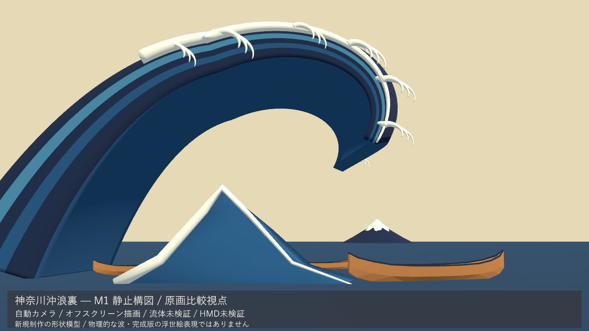

# GreatWave_2026

『神奈川沖浪裏』をHoudini・Blender・UnityでリアルタイムVR作品にする制作記録です。旧試作を参照せず、番号ごとに新規検証してコミットします。

利用者の続行指示により11〜15の静止構図と、16のHoudini→Unityの2秒キャッシュを新規検証しました。**このPC中間成果で確認を待ちます。M0のHMD・物理操作検証、M1の流体受け渡しは未完了です。** 進行役は指示とレビュー、実装担当のGPT-6は制作とコミットを担当します。

## M1の静止構図を見る

- [20秒の自動カメラ動画](Docs/Evidence/M1/M1_Static_Walkthrough.mp4)
- [原画比較](Docs/Evidence/M1/M1_Comparison.png)／[船上](Docs/Evidence/M1/M1_Boat.png)／[側面](Docs/Evidence/M1/M1_Side.png)／[背面](Docs/Evidence/M1/M1_Rear.png)／[候補範囲図](Docs/Evidence/M1/M1_Region.png)
- [結果・起動・操作・再現方法](Docs/Progress/Step_15_ja.md)

波・船・富士・白波は新しく作った3Dの形状模型です。画像はUnity実行ビルドのオフスクリーン描画で、流体シミュレーション、完成版の浮世絵レンダリング、HMD映像ではありません。波と船は静止しています。動画の24fpsは再生用の値で、実時間性能の測定ではありません。

本機の実行ファイル：`G:\Unity\GreatWave_2026_Fresh\Unity\Builds\M1\GreatWaveM1.exe`。移す場合は `M1/` 一式が必要です。1〜5で視点を切替、右ドラッグ・矢印で見回し、Rで戻す、Spaceで停止、Qで終了します。通常のウィンドウと物理キー・マウス操作は利用者確認待ち。 [ビルド](Tools/Build_M1.ps1)／[画像・動画の再取得](Tools/Capture_M1.ps1)。

## 16のHoudini→Unity受け渡しを見る

- [Unityの2秒動画](Docs/Evidence/M1/FixedTopology16/16_Unity_Cache.mp4)／[静止画](Docs/Evidence/M1/FixedTopology16/16_Unity_Middle.png)
- [Houdini実ビューポートの2秒動画](Houdini/FixedTopology16/Evidence/fixed_topology_16_houdini_preview.mp4)
- [結果・数値・起動方法・保留項目](Docs/Progress/Step_16_ja.md)

実行中のSteam Houdini22.0.429へMCPで接続し、新規の変形格子をAlembicへ書き出しました。Unity EditorとWindows実行版で61時刻と60個の補間点を照合しました。解析式の検査用形状で、流体ではありません。通常起動は2秒で停止し、Rで再生、Spaceで停止・再開、Qで終了。本機の実行ファイルは `G:\Unity\GreatWave_2026_Fresh\Unity\Builds\FixedTopology16\GreatWave16.exe`。移す場合はフォルダー全体が必要です。

既存HIPを保存・読み直さず、所有ノードだけのCPIOを保存・再読込しました。UIと所有ノードの復元を確認し、変更済みフラグとUndo履歴は保持しています。.hiplcの再起動・再読込、FLIP、HMD、物理キー操作は未検証。17〜20は未実行です。

## M0の基礎検証記録

- [20秒の確認動画](Docs/Evidence/M0/M0_Desktop_Walkthrough.mp4)
- [着座視点](Docs/Evidence/M0/M0_Seated.png)／[静止船全体](Docs/Evidence/M0/M0_Boat_Exterior.png)／[1m・軸の校正モデル](Docs/Evidence/M0/M0_Calibration.png)
- [結果・操作・再現方法・保留項目](Docs/Progress/Step_10_ja.md)

M0の画像・動画は新規Windows実行版の実シーンを、Unityでオフスクリーン描画した自動カメラ記録です。通常ウィンドウの手動操作やHMDの録画ではありません。平面と箱形の静止船を使った当時の基礎検証を保存しています。

本機の実行ファイルは `G:\Unity\GreatWave_2026_Fresh\Unity\Builds\M0\GreatWaveM0.exe`。右ドラッグ・矢印で見回し、Rで戻る、Spaceで停止・再開、Qで終了します。通常画面での物理キー・マウス操作は利用者の確認待ちです。実行一式はGit対象外で、[ビルド](Tools/Build_M0.ps1)と[証拠の再取得](Tools/Capture_M0.ps1)の手順を保存しています。

## 制作設計

- [制作依頼のプロンプト（原文）](Docs/Design/Original_Request_ja.md)
- [制作設計書：12段階・60ステップ](Docs/Design/GreatWave_VR_Production_Design_ja.md)

設計書には、Houdiniによる波浪の計算とサーフェス化、白波の別計算とモデルアニメーション、Blenderによる船などの制作、Unityでの浮世絵表現・HMD体験・操船を記載しています。各ステップの成果物と確認事項、各段階の合格条件、物理・美術・性能の評価方法をまとめています。

- [制作手順・役割・確認条件](Docs/Workflow/Production_Workflow_ja.md)
- [番号ごとの進捗](Docs/Progress/README.md)

## フォルダー構成

| フォルダー | 用途 |
| --- | --- |
| `Houdini/` | 波浪の流体シミュレーションとサーフェス化 |
| `Blender/` | 船などの静的モデルの制作 |
| `Whitewater/` | 白波の別計算とアニメーション |
| `Unity/` | リアルタイム表示、HMD体験、船の操作の統合 |
| `Docs/` | 設計と各段階の確認記録 |

完成点ごとに実際の結果を保存し、確認後に次の工程へ進みます。HMD実機の必須試験は保留一覧に残しています。
