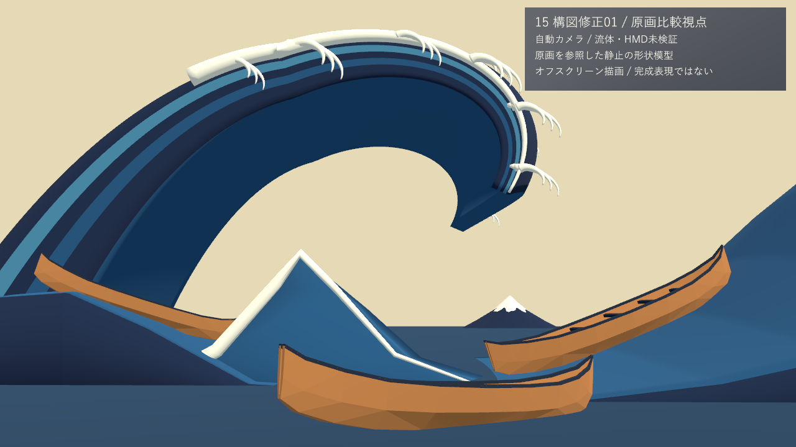

# GreatWave_2026

『神奈川沖浪裏』をHoudini・Blender・UnityでリアルタイムVR作品にする制作記録です。旧試作を参照せず、番号ごとに新規検証してコミットします。

## 現在の状況（2026-09-30 19:43 更新）

**いま：段階9 まで（設計26〜50）を 9/30 に自己評審で条件付きで閉じた（タグ `stage9-selfreviewed`、利用者の確認ではない）。次はブラッシュアップ（仕上げ27 → 28 → … → 50 → 右側の爪、10/1〜10/25、[計画の第5節と第2.6節](Docs/Design/Stage9_Plan_2026-09-26_ja.md)）。最初に示すこと：Q21 で利用者が受け入れないとした中ほどのドームは直っていない（仕上げ28、10/1〜10/4）。形成のフレーム時間（約 39 fps）は HMD の試遊の前に仕上げ43 で直す。**

| 番号 | 内容 | 状態 |
| --- | --- | --- |
| 設計26 | 砕波の原因：2つのうねりが約60°で交差して集中する波（McAllister ほか 2019 の水槽実験）。形成の順は利用者の写真（論文 Fig. 4 a→d） | ✓ コミット済み（73abd44） |
| 設計27 | 物理の根拠のある形成の動き（波が船へ進む、唇は投げ出された水として重力だけで落ちる、白は浪尖から）。崩壊は作らない（Q11） | ✓ コミット済み（c2b6839） |
| 設計28 | 原画へ寄せる美術の誘導と物理の入力を分けて記録。噴流の後の「原画への引き戻し」をなくした | ✓ コミット済み（11275dd） |
| 設計29 | 表示用サーフェス（原版＝設計28の網、軽量版＝120×200） | ✓ コミット済み（fc9ddfe） |
| **設計28修正01** | 利用者の指摘 Q13〜Q23 への対応。**時間枠の損切りで閉じた。採ったのは最良の候補で、使える水準ではない**（進行役の決定、Q24・Q26）。**最後の一コマ**：Houdini の精修の 4 回目 K\*′ R4。Q22 の条件のうち、中ほどのふくらみ（Q21 で利用者が否とした形）と b区域の 3 つの房を満たさず、唇の縁の波打ちと横の厚み（F04）も満たさない。原画視点の輪郭 ≤ 4 px は、72 を σ 24 px の大きな輪郭で読む進行役の決定の下だけの条件付きの合格（σ 12 px では 6.71 px。関門は 2 回緩めた）。**動き**：試行F の F\_final。唇の見え始め（Q13）、押し下げなし（Q15）、小山から C への変化 約 3.3 秒（Q17）、前面が高さとともに立つ（E1）を満たす。頂の尖り（奥の行と手前の尾の行）と見た目の違和感は一部。残りは仕上げ28・段階6・設計29修正01・設計30 へ渡した（[記録](Docs/Progress/Design_28_修正01_ja.md)） | 閉じた（損切り。使える水準ではない） |
| 設計29修正01 | 表示用サーフェス＝新しい動きの網（240 × 400）。Unity の再生側で精度の層を読む（GPU と numpy の差 0.025 mm、自己交差 0、GPU メモリ 222 MiB）。NPR の色面を K\*′ に焼き直した。色の関門は、輪郭の両側 2 px を除く読みで 28修正01 から ±0.5 px 以内（進行役の決定。評価器の定義どおりの読みでは 6 項目が 0.5 px を超え、K\*′ の輪郭の誤差が原因なので仕上げ28 へ） | ✓ コミット済み（このコミット） |
| 設計30 | 周りの海（主役波と同じ交差うねりと搬送波の式、近い帯 44 × 1231・遠い帯 19 × 247）と接続帯（継ぎ目の高さの差 0.0076 mm）。右の高い波（19.0 m）・手前の富士形の小波（5.6 m）・右端の先へ続く谷を参照モデルの配置の数値から二次設計。座席の船は谷の水に載る（目は全 421 コマで水の上、最小 1.07 m）。Unity で 1 つの時計の単発再生（t* で止まる、始まりと終わりの跳び 0）。原画視点の回帰なし。修正 1 回（浮いた泡の仮置きを隠す、継ぎ目の線）。色と線は仮で、設計36・38 へ | ✓ コミット済み（このコミット） |
| 設計31 | 主役波から少量の白波（白の出現 T_white を発生位置と時刻に使い、飛沫 v0 の 186 個を唇の前 0.5〜3 m から逆弾道で出す）。102・176・150・152 は合格、t* の原画視点は設計30 と同じ。飛沫の数（計画 2〜3 千）・151 の色差は仕上げ31 へ | ✓ コミット済み（このコミット） |
| 設計32 | 爪の一覧を計画 §6 の使える水準まで直して 173 本（藍の輪郭線の内側を爪の領域に、根元は口の中央、127 の下などを追加、美術優先29 の ID を保つ）。主浪の 148 本を K\*′ のシートに結び、421 コマの根元・先端の履歴と群（爪の房・白の帯・飛沫）を作った。瞬間移動 0・点滅 0。修正 1 回 | ✓ コミット済み（このコミット） |
| 設計33 | 爪の型 5 種（単爪・主爪＋1支・主爪＋2支・細い指・右側の鉤）で主浪の 148 本（b区域の房と Q16 の浪尖の爪を含む）を生成。骨格 3 段は利用者の 96 本の比率に近い。根元はシートに固定し、根元が白くなる → 伸びる → 最後に曲がる で t* まで伸ばす。根元のずれ 0.0038 mm、途切れ 0、1 本 ≤ 171 頂点。爪で 72・132 の細部込みの輪郭が少し改善（4 px には届かない）。t* で内側の縁が折れ返る爪 48 本などは限界として仕上げ32・33 へ | ✓ コミット済み（このコミット） |
| 設計34 | 白の帯・爪（148 本の結合メッシュ）・飛沫（186 個）の 3 層を一つの時計で Unity 再生し、層ごとに入切。3 層の時刻のずれ 0、船体の後ろの爪・飛沫は隠れる（漏れ 0）、Mock の両眼で爪の左右差 1.04%。爪を色区に入れた読みでは 133・134・267 が不合格になり、t* で爪の淡い水色が焼き込みの模様に重なる。設計36・38 へ | ✓ コミット済み（このコミット） |
| 設計35 | 爪と飛沫の 3 版（V1 一覧どおり・V2 数を半分にした軽量版・V3 大きさと寿命を誇張）の並べ動画。最大密度の区間で 1920 × 1080 の最小 1,850 fps、立体の代理の GPU p95 1.15 ms（RTX 3080 の代理。RTX3060 と PS VR2 の本判定は保留）。既定は V1（進行役の決定） | ✓ コミット済み（このコミット） |
| 設計36 | 主役波の調色板（白・淡い水色・藍中・藍濃・藍の線）を爪・周りの海・飛沫へ当てた。爪は原画の色区で塗り、隠れる面は一覧の影の色。周りの海は仮の 2 色を高さの 4 段と谷の縁の藍中へ。爪を入れた色の読みで 133・134・267 が合格へ戻った。谷の読みの弱さ・新しい色の境の 1 コマの跳びは限界として 37・38・仕上げへ | ✓ コミット済み（このコミット） |
| 設計37 | 主役波の縞と周りの海の段が面に付いて動くことを、形成の全区間と座席の頭の揺れ（左右 ±0.1 m）で確かめた。177 を引き継ぎ、模様の画面への貼り付き 0（70 組）。新しい線は足していない。細い線のちらつきは設計38・仕上げへ | ✓ コミット済み（このコミット） |
| 設計38 | 主役波・手前の海・爪に、面と同じ動きを読む輪郭線を付け、継ぎ目の上にも描き、近くで太りすぎない線幅に改めた。古い位置に残る線 0（192）、近くの線幅は合格。線の一瞬の点滅・跳び（191）は大きく減ったが 0 にならず、座席の低い視点の両眼の左右差 17.3%（船体の視差）も残る。修正 1 回の後なので限界として仕上げ30・38 へ（Q26） | ✓ コミット済み（このコミット） |
| 設計39 | 紙の地・摺りのむら（面と物体に固定、画面の座標は使わない）・小飛沫（503 粒）を一つずつ入切。既定は全部切で評価器の値は設計38 と同じ。頭の揺れで質感が泳がない。追加 GPU 時間は全部入で約 2.3 ms（p95 3.91 ms、予算 8.9 ms の中）。紙と摺りは弱すぎてほとんど見えない（仕上げへ） | ✓ コミット済み（このコミット） |
| 設計40 | 段階7 までを入れた原画視点の評価器の全項目の表と、座席・側面・背面の並べ図（CP1・設計30・設計40）、参照モデルの配置との比較図（数値だけ、記録のみ）。直前の番号に対する回帰なし。CP1／26修正01 に対する後退は段階5・6 と同じ値で記録（仕上げ28）。HMD の H4・H5 は保留 | ✓ コミット済み（このコミット） |
| 設計41 | 押送船を資料の寸法（1813 年の 11.67 m・幅 2.49 m・深さ 0.91 m・櫓 7 丁。二次資料）と絵からの推定で Blender に作り（船体・船縁・敷板・船梁・櫓、衝突形状、浮力用の閉じた船体）、3 隻の仮船を置き換えた。軸・尺度・左右の検査は合格、原画視点の主役波は変わらない。座席の目は敷板の 1.2 m 上。船の報告項目 75 は CP1 より悪くなった（仕上げ40・41） | ✓ コミット済み（このコミット） |
| 設計42 | 座席の船（推定の質量 2,083 kg、乗員 10 人を含む。資料の値はない）を船底の浮力点 10 で浮かべた。重さ 20,437 N と浮力の和が一致（ρgV との比 1.0012）、Unity の喫水 0.249 m は厳密な釣り合いと 0.06 mm 差。押す・傾けるなど 5 つの出来事で釣り合いへ戻る動画。静水で 0.59° 傾くことなどは設計43〜45・仕上げへ | ✓ コミット済み（このコミット） |
| 設計43 | 3 隻が主役波・手前・遠くのシートの下側の面を同じ時計で読み、小波に揺れる。砕波でない所で船用水面と表示面の差は最大 0.04 mm（基準 5 cm）、時刻のずれ 0 コマ、座席の目は全コマで水の上。遠くの海の弱めを海の式に書き足した。自由に浮かべると砕波域で船が転覆する（中の船 55°・左奥 157°）ので、設計44 の固定の軌道への引き継ぎと設計47 で扱う | ✓ コミット済み（このコミット） |
| 設計44 | キーボード・ゲームパッドで座席の船を前進・減速・旋回・停止（入力の遅れ 0.4 s、最高 2.33 m/s）。範囲の縁では船首を回さずに押し戻す。形成の前に固定の軌道へ引き継ぎ、向きと速さの跳び 0、t* で原画の位置から 3 mm。形成の間に船が 67° 傾き上下 11.5 m/s² になることは設計45（乗客の揺れ）・47 へ | ✓ コミット済み（このコミット） |
| 設計45 | 乗客の揺れを 4 段（水平維持＝既定・弱い上下動・旋回・傾斜）で切り替え（キー 1〜4、十字キー）、座席リセット付き。HMD のカメラの姿勢は一度も書き換えない（56,205 回で変化 0）。形成の間も目は船の枠で ±0.10 m に収まる（修正 1 回）。H5・H7 と PS VR2 の約 1 時間の試遊は保留（PC の動画と Mock の両眼で代えた） | ✓ コミット済み（このコミット） |
| 設計46 | GWClock を体験の時刻の唯一の持ち主にし、停止・再開・初期化・Seek を持たせた。水面・船用水面データ・白と藍・爪と線・飛沫・出来事の 6 段を同じ時刻で順に進める。停止・再開・初期化・途中からの再生の後、同じ時刻で形のハッシュが一致（不一致 0）。白・藍・爪・飛沫は t = 12.000 s ちょうどで終態（181）。物理の船・操船・乗客を体験の場面へ入れることは設計47 へ | ✓ コミット済み（このコミット） |
| 設計47 | 絵コンテと出来事の表で、導入の操船（0〜34 s）→ 固定の軌道への引き継ぎ → 接近 → 形成（45〜57 s）→ t* で 2 s 保持 → 余韻（視点を座席から原画の視点へカットなしで移す）、全長 73 s を一本にした。物理の座席の船・操船・乗客を体験の場面に入れ Play モードで回した（段階8 の F8-3 を閉じた）。黒コマ・カット 0、終わりに乗っていた船が原画の船の位置に重なる。止まった船・頭を外した時の扱いも決めた。仮置きの物体が座席の視点を 40% 覆うことなどは仕上げへ | ✓ コミット済み（このコミット） |
| 設計48 | 座席の船の船首の泡と航跡を調色板の白の平たいメッシュで描き、速さと旋回に反応させた（旋回の外側が広い、泡の幅と速さの相関 0.989、止まると消える）。主役波の上には出さない（重なり 0）。座席から前を向くとほとんど見えない（仕上げ48） | ✓ コミット済み（このコミット） |
| 設計49 | numpy で合成した 4 つの音（形成で強まる地鳴り、t* の打音、風、船のきしみ。ダウンロードなし）を共通時計の出来事で鳴らす 3D の音にした。音と見た目のずれは 1 フレーム未満、左右の向きは頭の向きに合う。崩壊の音は Q11 で作らない。人の耳では聞いていない（仕上げ49） | ✓ コミット済み（このコミット） |
| 設計50 | Windows の Release のプレイヤー（PC と --vr で同じ exe）に、日本語の入口の画面、停止（P／Esc）と揺れ軽減（C）の切替、終わりの画面を付けた。自動の試しで入口 → 体験 73 s → 停止 3 回 → 終わりの画面 → 終了まで、開発者の操作なし・誤り 0 で 4 回通った。停止は次のフレームで効く。形成の区間は約 39 fps（CPU 律速、仕上げ43）。初めての人の試遊と PS VR2 は保留 | ✓ コミット済み（このコミット） |

**利用者に決めてほしいこと・待っていること**

- **なし。** Q24（2026-09-28）により、段階9 まで Claude が自分で評審して進めます。選択が要るときは推奨の案を選び、理由を[制作手順](Docs/Workflow/Production_Workflow_ja.md)と各番号の記録に残します。完成点は自己評審で閉じ、タグは `stage5-selfreviewed` のように利用者確認と分けます。
- 利用者の手が要るもの（PS VR2 の接続、実機での試験）は「保留」と記録し、PC と Mock で代わりに確かめます（[設計02修正01](Docs/Progress/Design_02_修正01_ja.md)）。

**次の予定（Q26：段階9 を今週末までに。番号の順は変えず一つずつ閉じる）**：9/29 設計28修正01 → 9/30 設計29修正01・設計30・**段階5確認**・設計31 → 10/1 設計32〜35・**段階6確認** → 10/2 設計36〜40・**段階7確認**・設計41 → 10/3 設計42〜45・**段階8確認**・設計46・47 → **10/4 設計48〜50・段階9確認** → 仕上げ（10/5〜10/25、「驚くほど」の作り込みは仕上げ28）→ **最終期限 10/29**。各番号は最小の受入だけを満たし、修正は1回まで（[制作手順のQ26](Docs/Workflow/Production_Workflow_ja.md#q26段階9を今週末までに届かせるよう作業を速める指示2026-09-29)）。

**完成点**

| 完成点 | 状態 |
| --- | --- |
| CP0（23〜25：原画の基準と評価器、大波 v0） | ✓ 2026-09-26 利用者確認（タグ `cp0`＝a94df11） |
| CP1（原画視点の静止した大波） | ✓ 2026-09-26 利用者確認（タグ `cp1`＝f2f921f） |
| 段階5確認（主役の砕ける波：形成の動き） | ✓ 2026-09-29 自己評審で条件付きで閉じた（Q24、タグ `stage5-selfreviewed`。[記録](Docs/Progress/Stage5_SelfReview_ja.md)） |
| 段階6確認（別計算の白波モデル（設計31〜35）） | ✓ 2026-09-30 自己評審で条件付きで閉じた（Q24、タグ `stage6-selfreviewed`。[記録](Docs/Progress/Stage6_SelfReview_ja.md)） |
| 段階7確認（浮世絵の色と線（設計36〜40）） | ✓ 2026-09-30 自己評審で条件付きで閉じた（Q24、タグ `stage7-selfreviewed`。[記録](Docs/Progress/Stage7_SelfReview_ja.md)） |
| 段階8確認（船を浮かべ、操作する（設計41〜45）） | ✓ 2026-09-30 自己評審で条件付きで閉じた（Q24、タグ `stage8-selfreviewed`。[記録](Docs/Progress/Stage8_SelfReview_ja.md)） |
| 段階9確認（体験を一本につなぐ（設計46〜50）） | ✓ 2026-09-30 自己評審で条件付きで閉じた（Q24、タグ `stage9-selfreviewed`。[記録](Docs/Progress/Stage9_SelfReview_ja.md)） |

**最新の見るもの**

- 設計28修正01：最後の一コマ K\*′ R4 の[原画視点の関門の図](Docs/Evidence/Design/28R01F/kstarR4_fig_gate_large_form.png)／動き E と F\_final の[粘土の 5 視点の動画](Docs/Evidence/Design/28R01F/clay_5views_E_vs_F_final.mp4)／[Unity の静止画の一覧](Docs/Evidence/Design/28R01F/unity_sheet_E_vs_F_final.png)（色面は古い焼き込み）
- 大波の動きの比較（設計27 → 28）：[原画視点](Docs/Evidence/Design/28/ds28_compare3_painting.mp4)／[座席から波の方向](Docs/Evidence/Design/28/ds28_compare3_seat_toward_wave.mp4)／[各段階の静止画](Docs/Evidence/Design/28/fig_ds28_stages_compare.png)／[写真 a〜d との対照](Docs/Evidence/Design/28/fig_ds28_p15_fig4.png)
- 表示用サーフェスの密度の比較：[原画視点](Docs/Evidence/Design/29/fig_ds29_density_painting.png)
- 番号ごとの記録：[設計書の順の進捗表](Docs/Progress/README.md)
- 段階9 までの計画：[計画書](Docs/Design/Stage9_Plan_2026-09-26_ja.md)

実装は Claude（進行役＋サブエージェント）。利用者の指示の原文は[制作手順](Docs/Workflow/Production_Workflow_ja.md)の Q1〜Q26 にあります。このページは番号や制作指示をコミットするたびに更新し、main も同じコミットへ進めます。

### 以前の状態の要約（2026-09-25）

- **美術優先で主役の大波を制作中です。** 利用者の指示により、原画の大波の外輪郭・白・藍の色面・爪と、形成から原画の姿までの動きを最優先にしました。物理は、動きがもっともらしく見えれば足りる扱いです。
- **22（物理水槽）は損切りで中止しました。** 未完成で、合否は判定していません。旧23〜25の物理検証は取り消しました。[中止の理由・保持する結果・費用](Docs/Progress/Step_22_ja.md#22中止損切り2026-09-25)
- **実装担当はClaudeです。** 進行役はClaudeの主会話、実装はClaudeのサブエージェントが担います。GPT-6（Codex）は2026-09-25に利用者の指示で停止しました。01〜22修正07はGPT-6の実装です。
- 完成点では利用者の確認を待ちます。HMDは未所持のため、VR項目は未検証として扱います。
- [制作手順・担当・確認条件](Docs/Workflow/Production_Workflow_ja.md)／[番号ごとの進捗](Docs/Progress/README.md)

## これまでの記録

以下は過去の番号の記録で、新しいものから並べています。当時は進行役が指示とレビュー、実装担当のGPT-6が制作とコミットを担当しました。

## 22の実水槽・中間結果を見る（2026-09-25に中止）

**22は2026-09-25に損切りで中止しました（未完成・合否判定なし）。以下は中止前の記録です。**

最新の22修正07は、独立審査後に保存粒子のk474（t7.9）一面だけをPFS `.25` へ細分化しました。旧新各195断面が整合し、中央の高さ差は+0.0760/+0.0036/−0.1589mm。**単一時刻の表示面感度であり、波形・物理精度・番号22完成は未判定です。** 新しい流体計算やdetectorの再判定は行っていません。

- [修正07・中央3測点の原値](Houdini/Wave22/Evidence/Revision07/22_refine07_centers.png)／[195位置の実差](Houdini/Wave22/Evidence/Revision07/22_refine07_spatial_difference.png)／[原JSON・再現・限界](Houdini/Wave22/Evidence/Revision07/README_ja.md)

修正06の旧`.5`三面再現とt6一面の`.25`診断は、当時の証拠をそのまま保持しています。

- [修正06・中央の原水位と面化差](Houdini/Wave22/Evidence/Revision06/22_refine06_centers.png)／[195位置の実差](Houdini/Wave22/Evidence/Revision06/22_refine06_spatial_difference.png)／[失敗履歴・原JSON・再現・限界](Houdini/Wave22/Evidence/Revision06/README_ja.md)

修正05は、同じ04の既存BGEOを30時刻・5850断面で読み、G3 PFS候補の元の左prominence不足を確認しました。減幅の単一原因は未確定、元のPFS唯一鎖なしを保持します。

- [原水位と差](Houdini/Wave22/Candidates/PfsDiagnosis05/Evidence/Result_22e7801642/22_profile05_centers.png)／[実cacheの局所断面](Houdini/Wave22/Candidates/PfsDiagnosis05/Evidence/Result_22e7801642/22_profile05_sections.png)／[G3候補の採否](Houdini/Wave22/Candidates/PfsDiagnosis05/Evidence/Result_22e7801642/22_profile05_G3_prominence.png)／[05の数値・原JSON・再現](Houdini/Wave22/Candidates/PfsDiagnosis05/Evidence/Result_22e7801642/README_ja.md)

修正04は新所有DOPで静水判定を再PASSし、同じDOPのままt6〜9.25の実活塞始動を観測しました。solver場の有序谷候補1鎖とPFS唯一鎖なしを分け、非砕波・理論精度は未認定です。

- [実Houdini PFS動画・97枚/30fps](Houdini/Wave22/Candidates/WaveStart04/Evidence/Result_22e7801642/Media/22_startup_PFS.mp4)／[固定8秒静止画](Houdini/Wave22/Candidates/WaveStart04/Evidence/Result_22e7801642/Media/22_Perspective_480.png)／[原水位の実測図](Houdini/Wave22/Candidates/WaveStart04/Evidence/Result_22e7801642/22_startup_full_series.png)／[数値・出典・限界](Houdini/Wave22/Candidates/WaveStart04/Evidence/Result_22e7801642/README_ja.md)

- [ON/OFFの実時系列図](Houdini/Wave22/Candidates/Reseeding03/Evidence/OFF_Result_4250d4451f/22_reseeding_full_series.png)／[固定窓の図](Houdini/Wave22/Candidates/Reseeding03/Evidence/OFF_Result_4250d4451f/22_reseeding_late_windows.png)／[数値・原JSON・再現](Houdini/Wave22/Candidates/Reseeding03/Evidence/OFF_Result_4250d4451f/README_ja.md)

- [修正02・L6と旧槽の実SDF/PFS比較](Houdini/Wave22/Evidence/Length6_Result_db52394211/22_length6_full_series.png)／[固定窓](Houdini/Wave22/Evidence/Length6_Result_db52394211/22_length6_late_windows.png)／[比較CSV](Houdini/Wave22/Evidence/Length6_Result_db52394211/22_length6_gauges.csv)

以前のt3、旧槽t6、reseeding ONのL6 t6は静水判定FAILで、履歴を保持しています。修正03のOFF静水対照は未駆動で終了し、修正04では新規計算・再判定の後だけ始動しました。小さい変位の視口動画だけで大波や物理精度を認定しません。

- [未補正の水位と表示面の比較](Houdini/Wave22/Evidence/Preroll_0652da0179/22_preroll_sdf_mesh.png)／[実Houdini静止画・3秒](Houdini/Wave22/Evidence/Still_0652da0179/22_Perspective_180.png)
- [22の不合格理由・独立レビュー・残る条件](Docs/Progress/Step_22_ja.md)／[181時刻CSV](Houdini/Wave22/Evidence/Preroll_0652da0179/22_preroll_gauges.csv)／[再現方法](Houdini/Wave22/README_ja.md)

- [22修正01・旧槽t6の未補正SDF/PFS図](Houdini/Wave22/Evidence/Checkpoint6_Result_3e5ff87a29/22_static_full_series.png)／[判定窓の拡大](Houdini/Wave22/Evidence/Checkpoint6_Result_3e5ff87a29/22_static_late_windows.png)／[361時刻CSV](Houdini/Wave22/Evidence/Checkpoint6_Result_3e5ff87a29/22_checkpoint6_gauges.csv)

## 21の小振幅波の基準を見る

- [固定条件と22〜25の測定計画](Docs/Progress/Step_21_ja.md)
- [解析式のみの波形図](Houdini/WaveBaseline21/Evidence/21_analytic_reference.png)／[境界・波高計・再現方法](Houdini/WaveBaseline21/README_ja.md)

波高6cm・周期1.5秒・水深60cmの単色波を基準に、理論波長2.990395mと位相速度1.993597m/sを計算しました。これは解析式の条件固定で、実FLIPやUnityの波映像ではありません。22は小さな境界/時計pilotから進め、実測した水面・伝播・反射を理論と照合します。（2026-09-25追記：22は中止し、この照合は行いません。22〜25の測定契約は凍結・参照のみです。）

## 20のPC測定と暫定判断を見る

20の時点では、同じ24Hz小試料のPCロード・メモリ・CPU費用を測り、Built-in＋Alembicを制作の形状基準として暫定継続しました。VATは候補を保持。GPU時間・HMD・主役波が未検証のため、最終VR形式は未採用です。

- [Alembicの近景・2秒動画](Docs/Evidence/M1/Decision20/20_abc_2s.mp4)／[Fluid VATの同視点動画](Docs/Evidence/M1/Decision20/20_vat_2s.mp4)
- [Alembic 1秒](Docs/Evidence/M1/Decision20/20_abc_024.png)／[VAT 1秒](Docs/Evidence/M1/Decision20/20_vat_024.png)
- [3回ずつの実測表・採用条件・再現方法](Docs/Progress/Step_20_ja.md)／[01〜22の検証状態と残る条件](Docs/Progress/Verification_Status_ja.md)

20専用Windows版の6つの新プロセスで、同じ入力を広景/固定近景・単眼/人工2視点で測りました。新プロセス初回scene読込の中央値はABC 19.67ms、VAT 153.11ms。VATはCPU更新が軽い一方、初回メモリ増分が大きく、GPU時間は追加の通常カメラ診断でも取得できませんでした。映像は計測外の近景カメラによる実描画で、性能値やHMD映像ではありません。

測定用一式は `G:\Unity\GreatWave_2026_Fresh\Unity\Builds\Decision20\`。[ビルド](Tools/Build_Decision20.ps1)／[測定・媒体の再取得](Tools/Run_Decision20.ps1)。次の小振幅波の物理基準など独立した制作へ進み、HMDが必要な判定は保留一覧に残します。

## 19の時間標本・深度・影を見る

- [30/60Hzの近景比較・2秒動画](Docs/Evidence/M1/Sampling19/19_Sampling_2s.mp4)
- [近景0.75秒](Docs/Evidence/M1/Sampling19/19_Sampling_045.png)／[固定カメラ対照](Docs/Evidence/M1/Sampling19/19_fixed_083.png)／[2秒終端](Docs/Evidence/M1/Sampling19/19_Sampling_120.png)
- [18のABC/VAT実深度](Docs/Evidence/M1/Sampling19/19_depth_000_L.png)／[床への落影](Docs/Evidence/M1/Sampling19/19_shadow_024_L.png)／[VAT表面への受影対照](Docs/Evidence/M1/Sampling19/19_receive_000_L.png)
- [数値・限界・再現方法](Docs/Progress/Step_19_ja.md)／[Houdini元計算](Houdini/Sampling19/README_ja.md)

新しい60Hzの実121時刻から偶数61時刻を30Hzへ抽出し、同じ動きを比較しました。深度・影は18の正式24Hz VAT/ABCへ新shaderを適用した別試験です。小さな2球の技術試料であり、北斎の巻き波・波頭や白波の尖端・HMDの滑らかさを検証したとは扱いません。記録60fpsは性能値ではありません。

本機の実行一式は `G:\Unity\GreatWave_2026_Fresh\Unity\Builds\Sampling19\`。`GreatWave19.exe`を起動し、1で30Hz、2で60Hz、Space停止・再開、R先頭、Q終了。配布はフォルダー全体が必要です。物理キー操作は利用者確認待ち。

## 18の2方式比較を見る

- [Alembic／Fluid VATの左右比較・2秒動画](Docs/Evidence/M1/Playback18/18_Comparison_2s.mp4)
- [初期2球](Docs/Evidence/M1/Playback18/18_Comparison_000.png)／[結合](Docs/Evidence/M1/Playback18/18_Comparison_003.png)／[分離](Docs/Evidence/M1/Playback18/18_Comparison_024.png)／[2秒末端](Docs/Evidence/M1/Playback18/18_Comparison_048.png)
- [数値・性能・容量・再現方法・制限](Docs/Progress/Step_18_ja.md)／[Houdini出力と専用デコーダーの出典](Houdini/PlaybackComparison18/README_ja.md)

実Windowsビルドの同じ視点によるオフスクリーン描画です。元の三角化面との位置差は両方式0m、法線角差はVATで最大約0.028°でした。これは小さな技術試料の転送検査で、北斎の砕波・物理精度・HMDの合格ではありません。18当時は方式を採用せず、20で独立ロード・メモリを追加してPC制作経路を暫定判断しました。GPU時間と最終VR採用は引き続き保留です。

本機の実行一式は `G:\Unity\GreatWave_2026_Fresh\Unity\Builds\Playback18\`。`GreatWave18.exe`を起動し、1でAlembic、2でVAT、Spaceで停止・再開、Rで先頭、Qで終了。配布にはフォルダー全体が必要です。

## 17の小さな流体試料を見る

- [Houdini実ビューポートの2秒動画](Houdini/VariableTopology17/Evidence/17_FLIP_Surface_2s.mp4)
- [粒子と表面の同時刻比較・全数値・限界](Docs/Progress/Step_17_ja.md)
- [生成元・キャッシュ・再現方法](Houdini/VariableTopology17/README_ja.md)

2球からの結合と、その後の分離を実FLIPの粒子ID・連結成分で確認しました。0〜2秒の49時刻はすべて異なる表面トポロジーです。後半は領域外への流出があり、面化体積も大きく増えるため、質量保存・海洋物理精度の合格ではありません。利用者の続行指示を受け、同じ試料を上記18の形式比較へ渡しました。

## M1の静止構図を見る

- [修正01：20秒の自動カメラ動画](Docs/Evidence/M1/Revision01/M1_Revision01_Walkthrough.mp4)
- [原画比較](Docs/Evidence/M1/Revision01/M1_Comparison.png)／[船上](Docs/Evidence/M1/Revision01/M1_Boat.png)／[側面](Docs/Evidence/M1/Revision01/M1_Side.png)／[背面](Docs/Evidence/M1/Revision01/M1_Rear.png)／[候補範囲図](Docs/Evidence/M1/Revision01/M1_Region.png)
- [修正前後・結果・再現方法](Docs/Progress/Step_15_Revision01_ja.md)／[修正前の15を保存した記録](Docs/Progress/Step_15_ja.md)

波・船・富士・白波は新しく作った3Dの形状模型です。画像はUnity実行ビルドのオフスクリーン描画で、流体シミュレーション、完成版の浮世絵レンダリング、HMD映像ではありません。波と船は静止しています。動画の24fpsは再生用の値で、実時間性能の測定ではありません。

本機の実行ファイル：`G:\Unity\GreatWave_2026_Fresh\Unity\Builds\M1_Revision01\GreatWaveM1Revision01.exe`。移す場合は `M1_Revision01/` 一式が必要です。1〜5で視点を切替、右ドラッグ・矢印で見回し、Rで戻す、Spaceで停止、Qで終了します。通常のウィンドウと物理キー・マウス操作は利用者確認待ち。 [ビルド](Tools/Build_M1_Revision01.ps1)／[画像・動画の再取得](Tools/Capture_M1_Revision01.ps1)。

## 16のHoudini→Unity受け渡しを見る

- [Unityの2秒動画](Docs/Evidence/M1/FixedTopology16/16_Unity_Cache.mp4)／[静止画](Docs/Evidence/M1/FixedTopology16/16_Unity_Middle.png)
- [Houdini実ビューポートの2秒動画](Houdini/FixedTopology16/Evidence/fixed_topology_16_houdini_preview.mp4)
- [結果・数値・起動方法・保留項目](Docs/Progress/Step_16_ja.md)

実行中のSteam Houdini22.0.429へMCPで接続し、新規の変形格子をAlembicへ書き出しました。Unity EditorとWindows実行版で61時刻と60個の補間点を照合しました。解析式の検査用形状で、流体ではありません。通常起動は2秒で停止し、Rで再生、Spaceで停止・再開、Qで終了。本機の実行ファイルは `G:\Unity\GreatWave_2026_Fresh\Unity\Builds\FixedTopology16\GreatWave16.exe`。移す場合はフォルダー全体が必要です。

既存HIPを保存・読み直さず、所有ノードだけのCPIOを保存・再読込しました。UIと所有ノードの復元を確認し、変更済みフラグとUndo履歴は保持しています。.hiplcの再起動・再読込、HMD、物理キー操作は未検証。17〜20の実流体・転送・時間密度・PC暫定判断は上記の独立記録へ進み、HMDと最終VR採用は保留しています。

## M0の基礎検証記録

- [20秒の確認動画](Docs/Evidence/M0/M0_Desktop_Walkthrough.mp4)
- [着座視点](Docs/Evidence/M0/M0_Seated.png)／[静止船全体](Docs/Evidence/M0/M0_Boat_Exterior.png)／[1m・軸の校正モデル](Docs/Evidence/M0/M0_Calibration.png)
- [結果・操作・再現方法・保留項目](Docs/Progress/Step_10_ja.md)

M0の画像・動画は新規Windows実行版の実シーンを、Unityでオフスクリーン描画した自動カメラ記録です。通常ウィンドウの手動操作やHMDの録画ではありません。平面と箱形の静止船を使った当時の基礎検証を保存しています。

本機の実行ファイルは `G:\Unity\GreatWave_2026_Fresh\Unity\Builds\M0\GreatWaveM0.exe`。右ドラッグ・矢印で見回し、Rで戻る、Spaceで停止・再開、Qで終了します。通常画面での物理キー・マウス操作は利用者の確認待ちです。実行一式はGit対象外で、[ビルド](Tools/Build_M0.ps1)と[証拠の再取得](Tools/Capture_M0.ps1)の手順を保存しています。

## 制作設計

- [制作依頼のプロンプト（原文）](Docs/Design/Original_Request_ja.md)
- [制作設計書：12段階・60ステップ](Docs/Design/GreatWave_VR_Production_Design_ja.md)

設計書には、Houdiniによる波浪の計算とサーフェス化、白波の別計算とモデルアニメーション、Blenderによる船などの制作、Unityでの浮世絵表現・HMD体験・操船を記載しています。各ステップの成果物と確認事項、各段階の合格条件、物理・美術・性能の評価方法をまとめています。

- [制作手順・役割・確認条件](Docs/Workflow/Production_Workflow_ja.md)
- [番号ごとの進捗](Docs/Progress/README.md)

## フォルダー構成

| フォルダー | 用途 |
| --- | --- |
| `Houdini/` | 波浪の流体シミュレーションとサーフェス化 |
| `Blender/` | 船などの静的モデルの制作 |
| `Whitewater/` | 白波の別計算とアニメーション |
| `Unity/` | リアルタイム表示、HMD体験、船の操作の統合 |
| `Docs/` | 設計と各段階の確認記録 |

完成点ごとに実際の結果を保存し、利用者の確認後に次の完成点へ進みます。完成点の間の番号は、進行役のレビュー後に進めます。HMD実機の必須試験は保留一覧に残しています。
